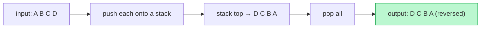

# Memorize: Reversal

## In a Hurry?

- **One-Line Idea**: Push a sequence onto a stack and pop it back — the pop order is the input reversed, because the stack's Last In, First Out contract does the reversal for free.
- **Complexities**: `O(N)` time, `O(N)` space, where `N` is the number of items (the stack holds a full copy of the input between the load pass and the unload pass).
- **When to Use**: The problem asks for a sequence — string, array, list, words — in the opposite order, especially when the source is read through one end only or the reversal unit is coarser than a single index.

---

## One-Line Mnemonic

**"Push it all in, pop it all out — the stack reverses for free."**

The phrase encodes the whole pattern: one load pass that pushes every item, one unload pass that pops every item, and the realisation that you never write a reversal step — the LIFO contract is the reversal.

---

## Real-World Analogy

Picture a tall, narrow can of tennis balls. You drop them in one at a time — first ball, second, third — and the first ball sits at the bottom, the last sits at the mouth. When you tip the can to take them back out, the order is forced: the last ball you put in is the first to come out, and the first ball you dropped emerges last. You did not sort or rearrange anything; the shape of the can guarantees that retrieval order is the reverse of insertion order. A stack is that can, and reversal is nothing more than filling it and emptying it.

---

## Visual Summary



<p align="center"><strong>A stack reverses any sequence for free: push every element, then pop them all. The last in comes out first, so the output is the input backwards — O(n) time and space.</strong></p>

---

## Pattern Recognition Triggers

The pattern fits when **all four** answers are "yes" — the same diagnostic that gates each problem in the section.

- The problem asks for a sequence — string, array, list, or words — to be returned in **reversed order**.
- The input is **read through one end only**, or its natural reversal unit is **coarser than a single index** (whole words, whole sub-arrays).
- **Two linear passes** suffice — a load pass that pushes every item and an unload pass that pops every item — with **no comparison** between items.
- `O(N)` **auxiliary space** is acceptable, since the stack holds a full copy of the input.

Common surface signals: "return the reversed string," "reverse the array using a stack," "invert this stack," "reverse the order of words," or reversal appearing as one sub-step inside a larger expression-handling or undo-handling algorithm.

---

## Don't Confuse With

The reversal pattern and the **monotonic stack** (previous / next closest occurrence) both push onto a stack — but they read it for opposite reasons.

| | **Reversal (this pattern)** | **Monotonic Stack** |
|---|---|---|
| **Problem shape** | "Give this sequence back in the opposite order" — the order of the output is the answer | "For each element, find the nearest greater/smaller neighbour" — the surviving stack contents are the answer |
| **Push rule** | Push **every** item unconditionally, then pop **every** item | Push conditionally; **pop while** the top violates a monotonic comparison before pushing the current item |
| **What you read** | The **pop order** — it equals the reversed input | The **stack top at each step** — it answers the per-element query |
| **Complexity** | `O(N)` time, `O(N)` space | `O(N)` time, `O(N)` space (each item pushed and popped at most once) |
| **When this goes wrong** | Your output comes out reversed but you are also discarding or comparing items mid-pop — you have grafted comparison logic onto a pure reverser; reversal never inspects values. | You routed everything through and read the *pop order* expecting an answer — the monotonic stack's answer is the value left on top *during* the scan, not the order things eventually pop. |

The monotonic stack is the next pattern in this chapter — it pops *selectively* on a comparison; reversal pops *everything* in order. Push-all-then-pop-all means reversal; pop-until-condition-then-push means monotonic stack.

---

## Template Code

```python
# Reversal pattern — generic two-pass stack reverser.
# The one knob is the destination: a fresh container for a copy,
# or the input itself for an in-place reverse.
from typing import List


def reverse_with_stack(seq: List) -> List:
    stack: List = []          # 1. the temporary holding area

    for item in seq:          # 2. LOAD pass — push every item
        stack.append(item)    #    last item ends on top

    result: List = []
    while stack:              # 3. UNLOAD pass — pop every item
        result.append(stack.pop())   # pops arrive in reversed order

    return result             # 4. result is seq reversed


# In-place array variant: the destination is the input itself.
def reverse_in_place(arr: List) -> None:
    stack: List = []
    for item in arr:          # LOAD — push all
        stack.append(item)

    counter = 0
    while stack:              # UNLOAD — overwrite indices 0..n-1
        arr[counter] = stack.pop()
        counter += 1
```

The only knob is the **destination**. For a fresh reversed copy the unload pass appends to a new container; for an in-place array reverse it overwrites the input's indices `0..n-1` with the pops. The unit being reversed is whatever you push — characters reverse a string, integers reverse an array, whole words reverse word order. The two-pass body never changes.

---

## Common Mistakes

- **Grafting comparison logic onto a pure reverser**:
  - *What*: adding an `if` inside the unload loop that skips or compares items, trying to do reversal and filtering in one pass.
  - *Why*: reversal is defined by *unconditional* push-all then pop-all; the moment a comparison decides whether to pop, you are writing a different pattern (monotonic stack) and the output order stops being a clean reverse.
  - *Fix*: keep the two passes pure — load every item, unload every item. Do any filtering or comparison in a separate pass before or after.
- **Pushing the wrong unit**:
  - *What*: pushing characters when the problem wants word order reversed, producing `"gnirts a si sihT"` instead of `"string a is This"`.
  - *Why*: the stack reverses whatever you push; if the unit is a character, the letters reverse, not the words.
  - *Fix*: decide the reversal unit first. Tokenise into words and push *words* when word order is the target; push characters only when letters should reverse.
- **Forgetting the trailing separator on a join**:
  - *What*: building the result as `popped + " "` each iteration leaves one extra space (or delimiter) at the end of the string.
  - *Why*: appending a separator *after* every item adds `N` separators for `N` items, but a joined sequence needs only `N − 1`.
  - *Fix*: strip the trailing separator before returning (`rstrip`, or trim the final character), or build with an explicit join that inserts separators *between* items only.
- **Calling the input reversed while the auxiliary stack still costs `O(N)`**:
  - *What*: describing the in-place array variant as `O(1)` space because it returns no new array.
  - *Why*: "in place" here means no second *result* array — the stack itself still holds all `N` items, so auxiliary space is `O(N)`.
  - *Fix*: state the space as `O(N)`. If `O(1)` space is genuinely required for a plain array, use two-pointer swaps (`arr[i]` ↔ `arr[n-1-i]`) instead of a stack.
- **Reading a stack ADT by index**:
  - *What*: writing `s[0]`, `s[i]` to read the input when the source is a real stack that exposes only `push`, `pop`, and `peek`.
  - *Why*: a genuine stack has no random access; index-based code compiles only because a list happens to back it, and it breaks on an actual stack interface.
  - *Fix*: read with `pop`/`peek` only. The pop-only read is the whole reason the pattern exists — it ports to any index-free source.

---

## Minimum Viable Example

Reverse the string `"cat"` using a stack:

```
Load:   push 'c','a','t'  →  stack (bottom→top): c a t   (top is 't')
Unload: pop 't','a','c'   →  result = "tac"
Return "tac".
```

Three characters, three pushes, three pops — the complete pattern, with the pop order delivering the reverse for free.

---

## Quick Recall

**Q: Why does a stack reverse a sequence without any explicit reversal step?**
A: Its Last In, First Out contract forces pop order to be the reverse of push order.

**Q: What are the two passes of the pattern?**
A: A load pass that pushes every item, then an unload pass that pops every item into the destination.

**Q: What is the time and space complexity?**
A: `O(N)` time (each item pushed once and popped once) and `O(N)` space (the stack holds a full copy).

**Q: What determines whether you reverse letters or words?**
A: The unit you push — push characters to reverse letters, push whole words to reverse word order.

**Q: What does "in place" mean for the array variant, and what does it cost?**
A: It means no second *result* array — the input is overwritten — but the stack still costs `O(N)` auxiliary space.

**Q: How do you tell the reversal pattern apart from a monotonic stack?**
A: Reversal pushes everything and pops everything in order; a monotonic stack pops *selectively* on a comparison and reads the surviving top.

**Q: What is the most common bug when reversing word order by joining pops?**
A: A trailing separator — appending a space after every word leaves one extra at the end, so trim it before returning.
