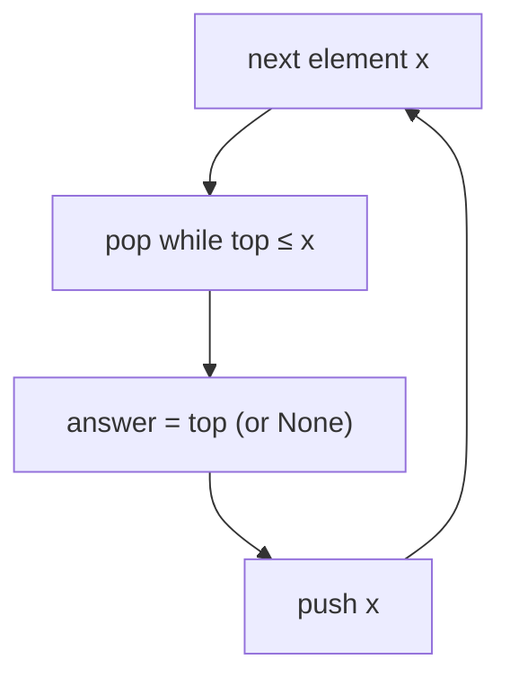

# Pattern: Previous Closest Occurrence

## Why It Exists

A recurring question: "for each element, what's the nearest element to its **left** that is larger?" (the *previous greater element*). It powers stock-span calculations, histogram problems, "how long until a warmer day," and more.

Brute force scans left from each position until it finds a bigger value — `O(n²)` in the worst case. The insight that collapses it: when you place an element and it has a larger element somewhere to its left, any **smaller** elements sitting between them are now useless — nothing further right will ever pick them as a "nearest greater," because this newer, larger element blocks them. So maintain only the still-useful candidates on a stack kept **monotonic** (here, strictly decreasing). Each new element pops everything it dominates; whatever survives on top is its previous-greater. Since every element is pushed once and popped at most once, the whole scan is `O(n)`.

## See It Work

For each element of `[2, 5, 3, 7, 1]`, find the nearest larger value to its left (`None` if there isn't one). Run it, then **Visualise** the stack stay decreasing.

> ▶ Run it, then click **Visualise** — each element pops the smaller values off the stack; the top that remains is its previous-greater.

```python run viz=array viz-root=stack viz-kind=stack
arr = [2, 5, 3, 7, 1]
stack = []                              # holds candidates, kept strictly decreasing
result = []
for x in arr:
    while stack and stack[-1] <= x:     # pop everything this element dominates
        stack.pop()
    result.append(stack[-1] if stack else None)   # nearest taller to the left
    stack.append(x)
print(result)                           # [None, None, 5, None, 7]
```

## How It Works

Scan left to right, keeping a stack of values that is always strictly decreasing from bottom to top. For each element `x`:

1. **Pop** while the top is `≤ x`. Those popped values are smaller than `x` and sit to its left, so they can never be the "previous greater" for `x` *or for anything after it* — `x` shadows them.
2. **Read** the answer: whatever is now on top is the nearest value to the left greater than `x` (or `None` if the stack emptied).
3. **Push** `x`, so it becomes a candidate for elements further right.



<p align="center"><strong>for each element, pop the values it dominates, record the surviving top as the previous-greater, then push it; the stack stays monotonically decreasing.</strong></p>

Why is this `O(n)` despite the inner `while`? Because each element is **pushed exactly once and popped at most once** — across the whole run the pops total at most `n`. The inner loop isn't nested cost; it's amortized `O(1)` per element. **`O(n)` time, `O(n)` space.** Swap the comparison (`pop while top ≥ x`) and the same machinery finds the previous *smaller* element with an increasing stack.

### Key Takeaway

A monotonic stack answers "nearest greater/smaller to the left" in one `O(n)` pass: pop everything the current element dominates, read the surviving top as the answer, then push. The amortized `O(1)`-per-element bound comes from each value being pushed and popped at most once.

## Trace It

Previous-greater over `[2, 5, 3, 7, 1]`:

| `x` | pops (`≤ x`) | stack after | answer |
|---|---|---|---|
| `2` | — | `[2]` | `None` |
| `5` | `2` | `[5]` | `None` |
| `3` | — | `[5, 3]` | `5` |
| `7` | `3, 5` | `[7]` | `None` |
| `1` | — | `[7, 1]` | `7` |

Before you read on: when `7` arrived it popped both `3` and `5`. Could either of those ever be the "previous greater" for the `1` that comes next — and why does popping them early not lose information?

No. `1` needs the nearest *larger* value to its left, and `7` (which now sits on the stack, closer to `1` than `3` or `5` were) is larger than both of them — so `7` shadows them completely. Any element after `7` that's smaller than `7` will find `7` first; any element larger than `7` would have popped `7` too. `3` and `5` can never again be the nearest-greater for anything, so discarding them loses nothing. That "once shadowed, gone forever" property is exactly what keeps the stack small and the pops bounded by `n`.

## Your Turn

The reusable previous-greater (flip the comparison for previous-smaller):

```python run viz=array viz-kind=stack
def previous_greater(arr):
    stack, result = [], []
    for x in arr:
        while stack and stack[-1] <= x:      # >= x  →  previous-smaller instead
            stack.pop()
        result.append(stack[-1] if stack else None)
        stack.append(x)
    return result

print(previous_greater([2, 5, 3, 7, 1]))     # [None, None, 5, None, 7]
print(previous_greater([4, 3, 2, 1]))        # [None, 4, 3, 2]
```

```java run viz=array viz-kind=stack
import java.util.*;

public class Main {
  static Integer[] previousGreater(int[] arr) {
    Deque<Integer> stack = new ArrayDeque<>();
    Integer[] result = new Integer[arr.length];
    for (int i = 0; i < arr.length; i++) {
      int x = arr[i];
      while (!stack.isEmpty() && stack.peek() <= x) stack.pop();   // >= x → previous-smaller
      result[i] = stack.isEmpty() ? null : stack.peek();
      stack.push(x);
    }
    return result;
  }

  public static void main(String[] args) {
    System.out.println(Arrays.toString(previousGreater(new int[]{2, 5, 3, 7, 1})));   // [null, null, 5, null, 7]
  }
}
```

Drill the family in **Practice** — [Preceding Superior Element](/cortex/data-structures-and-algorithms/linear-structures/stack/pattern-previous-closest-occurrence/problems/preceding-superior-element), [Preceding Inferior Element](/cortex/data-structures-and-algorithms/linear-structures/stack/pattern-previous-closest-occurrence/problems/preceding-inferior-element), [Preceding Superior Element II](/cortex/data-structures-and-algorithms/linear-structures/stack/pattern-previous-closest-occurrence/problems/preceding-superior-element-ii), and [Preceding Inferior Element II](/cortex/data-structures-and-algorithms/linear-structures/stack/pattern-previous-closest-occurrence/problems/preceding-inferior-element-ii).

## Reflect & Connect

The monotonic stack is one of the highest-value stack patterns — recognizing it turns many `O(n²)` scans into `O(n)`:

- **Four cousins from two knobs** — *direction* (previous = scan left→right; next = scan right→left) × *comparison* (greater = decreasing stack; smaller = increasing stack). Same code, swapped operator or swapped scan order.
- **The "shadowing" insight is the core** — an element that's dominated and blocked can be discarded forever; the stack holds only the still-relevant candidates. That's why the amortized cost is `O(1)` per element even with an inner loop.
- **It underlies bigger algorithms** — largest rectangle in a histogram, daily temperatures, stock span, and the `O(n)` "next greater element" all reduce to a monotonic stack. The [next pattern](/cortex/data-structures-and-algorithms/linear-structures/stack/pattern-next-closest-occurrence/pattern) is the right-to-left mirror of this one.

**Prerequisites:** [What Is a Stack?](/cortex/data-structures-and-algorithms/linear-structures/stack/what-is-a-stack).
**What's next:** the same idea scanning the other way — [Next Closest Occurrence](/cortex/data-structures-and-algorithms/linear-structures/stack/pattern-next-closest-occurrence/pattern).

## Recall

> **Mnemonic:** *Decreasing stack, left→right. Pop while top ≤ x, the surviving top is the previous-greater, then push x. Push-once/pop-once ⇒ O(n).*

| | |
|---|---|
| Stack invariant | strictly decreasing (for previous-greater) |
| Per element | pop while `top ≤ x` → read top as answer → push `x` |
| Previous-smaller | flip to `pop while top ≥ x` (increasing stack) |
| Why `O(n)` | each element pushed once, popped ≤ once → amortized `O(1)` |
| Cost | `O(n)` time, `O(n)` space |

<details>
<summary><strong>Q:</strong> Why is the inner `while` loop not `O(n²)`?</summary>

**A:** Each element is pushed once and popped at most once, so total pops ≤ `n` — amortized `O(1)` per element.

</details>
<details>
<summary><strong>Q:</strong> Why is it safe to discard popped elements?</summary>

**A:** A popped element is smaller than the current one and to its left, so it's shadowed — it can never be the nearest-greater for anything further right.

</details>
<details>
<summary><strong>Q:</strong> How do you switch from previous-greater to previous-smaller?</summary>

**A:** Flip the pop test from `top ≤ x` to `top ≥ x`, turning the decreasing stack into an increasing one.

</details>
<details>
<summary><strong>Q:</strong> How do you get *next* greater instead of *previous*?</summary>

**A:** Scan right-to-left with the same monotonic stack (the next pattern).

</details>

## Sources & Verify

- **CLRS**, *Introduction to Algorithms*, 4th ed., §10.1 — stacks; amortized analysis (§17) underlies the `O(n)` argument.
- **Sedgewick & Wayne**, *Algorithms*, 4th ed., §1.3–1.4 — stacks and amortized cost.
- The monotonic-stack "previous/next greater element" technique is standard; both runnable blocks are verified by running (`[None, None, 5, None, 7]` and `[None, 4, 3, 2]`).
