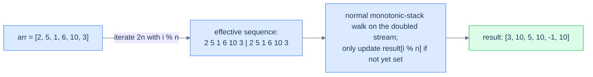

# Preceding superior element II

## Problem Statement

Same as preceding superior element, but the array is **circular** — when looking for a "preceding greater" you may wrap around past the start to the end of the array. If no greater exists even after a full circle, return `-1`.

### Example 1
> -   **Input:** `arr = [2, 5, 1, 6, 10, 3]`
> -   **Output:** `[3, 10, 5, 10, -1, 10]`

### Example 2
> -   **Input:** `arr = [6, 7, 8, 9, 8]`
> -   **Output:** `[8, 8, 9, -1, 9]`

## Examples

**Example 1**
```
Input:  arr = [2, 5, 1, 6, 10, 3]
Output: [3, 10, 5, 10, -1, 10]
Explanation: 2 finds nothing greater to its left until the wrap reaches 3 → 3.
5 wraps to 10 → 10. 1 sees 5 directly → 5. 6 wraps to 10 → 10.
10 is the global maximum → -1 even after a full circle. 3 sees 10 → 10.
```

**Example 2**
```
Input:  arr = [6, 7, 8, 9, 8]
Output: [8, 8, 9, -1, 9]
Explanation: 6 and 7 both wrap to the trailing 8 → 8. 8 wraps to 9 → 9.
9 is the maximum → -1. The trailing 8 sees 9 directly → 9.
```

**Example 3**
```
Input:  arr = [5, 4, 3, 2, 1]
Output: [-1, 5, 4, 3, 2]
Explanation: 5 is the maximum → -1. Each later value sees the one just before it,
strictly greater, so no wrap is needed.
```

**Example 4**
```
Input:  arr = [5, 5, 5]
Output: [-1, -1, -1]
Explanation: Equal values are never strictly greater, so the pop test removes them all.
```


<details>
<summary><h2>Intuition</h2></summary>


The structural property is the same previous-greater query, but the array is now **circular** — a value's nearest strictly-greater predecessor may live to its right, reachable only by wrapping past the start. That single change is what separates this from the linear superior problem; the monotonic stack itself is untouched.

The trick is to **linearise the circle by iterating `2n` indices** with `i % n` indexing. Each original position is processed twice: once on the natural left-to-right pass and once after a full wrap. The stack still holds a strictly decreasing chain of previous-greater candidates; the second lap lets a wrapped-around value finally find its predecessor. Because every element is visited exactly twice, the work stays `O(N)`.

The naive circular approach breaks the time budget badly. For each index you would scan up to `n` other positions wrapping around — `O(N²)` time and easy to get wrong at the wrap boundary. The doubled-pass stack keeps the single-sweep `O(N)` guarantee and handles the wrap by construction, never special-casing the seam between the end and the start.

</details>
<details>
<summary><h2>Applying the Diagnostic Questions</h2></summary>


| Check | Answer for Preceding Superior Element II |
|---|---|
| **Q1.** Does each position need an answer drawn from elements *before* it? | **Yes** — but "before" wraps circularly, so the search may continue past the start. |
| **Q2.** Is the answer the *closest* such element, not all of them? | **Yes** — the single nearest strictly-greater value reachable going left-then-wrapping. |
| **Q3.** Is the comparison monotone — strictly greater or smaller? | **Yes** — a strict greater-than test drives every pop (decreasing stack). |
| **Q4.** Is the per-element work `O(1)` amortised? | **Yes** — `2n` iterations, each value pushed and popped at most once across the doubled pass. |

</details>
<details>
<summary><h2>Approach — the doubled-array trick</h2></summary>


A circular array can be linearised by **iterating over `2n` indices**, mapping each index `i` to `i % n`. Each element gets two chances at finding its preceding greater — once on the "natural" pass and once with the wrap-around in play. Because every original element is processed twice, the time is still O(N).



<p align="center"><strong>Doubled-array trick — iterate <code>2n</code> times with <code>i % n</code> indexing. The first pass establishes most answers; the second pass catches values whose "previous greater" is on the other side of the wrap. Result is O(N) with O(N) extra space.</strong></p>

</details>
<details>
<summary><h2>Approach in Words</h2></summary>


Run the linear previous-greater walk over a doubled index range.

1. **Allocate the holders.** Create `result` of length `n`, filled with `-1`, and an empty `stack`.
2. **Iterate `2n` times.** For loop counter `i`, take the circular index `index = i % n` and the value `num = arr[index]`.
3. **Pop the dominated candidates.** While the stack is non-empty and its top `≤ num`, pop.
4. **Record the survivor.** If the stack is non-empty, set `result[index]` to the top. The second lap re-assigns the same answer for already-solved positions, so overwriting is safe.
5. **Always push.** Push `num` onto the stack so it can serve later (including wrapped) elements.
6. **Return the result.** After `2n` iterations every position that has a wrapped or direct predecessor is filled; the rest stay `-1`.

</details>
<details>
<summary><h2>Solution</h2></summary>


```python run viz=array viz-root=stack viz-kind=stack
from typing import List

class Solution:
    def preceding_superior_element_ii(self, arr: List[int]) -> List[int]:
        n = len(arr)
        result = [-1] * n

        # Stack to store elements
        stack = []

        # Iterate twice through the array (circularly)
        for i in range(2 * n):

            # Circular index
            index = i % n
            num = arr[index]

            # Check if we can pop elements from the stack
            # (i.e., find the preceding greater element)
            while stack and stack[-1] <= num:
                stack.pop()

            # If stack is not empty, the top element is the preceding
            # superior element
            if stack:
                result[index] = stack[-1]

            # Always push the element to the stack
            stack.append(num)

        return result


# Examples from the problem statement
print(Solution().preceding_superior_element_ii([2,5,1,6,10,3]))   # [3, 10, 5, 10, -1, 10]
print(Solution().preceding_superior_element_ii([6,7,8,9,8]))      # [8, 8, 9, -1, 9]

# Edge cases
print(Solution().preceding_superior_element_ii([1]))              # [-1] — single element
print(Solution().preceding_superior_element_ii([5,5,5]))          # [-1, -1, -1] — all same
print(Solution().preceding_superior_element_ii([1,2]))            # [2, -1]
print(Solution().preceding_superior_element_ii([3,1,2]))          # [3, 3, 3]
print(Solution().preceding_superior_element_ii([5,4,3,2,1]))      # [-1, 5, 4, 3, 2]
```

```java run viz=array viz-root=stack viz-kind=stack
import java.util.*;

public class Main {
    static class Solution {
        public int[] precedingSuperiorElementII(int[] arr) {
            int n = arr.length;
            int[] result = new int[n];

            // Initialize result with -1
            for (int i = 0; i < n; i++) {
                result[i] = -1;
            }

            // Stack to store elements
            Stack<Integer> stack = new Stack<>();

            // Iterate twice through the array (circularly)
            for (int i = 0; i < 2 * n; i++) {

                // Circular index
                int index = i % n;
                int num = arr[index];

                // Check if we can pop elements from the stack
                // (i.e., find the preceding greater element)
                while (!stack.isEmpty() && stack.peek() <= num) {
                    stack.pop();
                }

                // If stack is not empty, the top element is the preceding
                // superior element
                if (!stack.isEmpty()) {
                    result[index] = stack.peek();
                }

                // Always push the element to the stack
                stack.push(num);
            }

            return result;
        }
    }

    public static void main(String[] args) {
        // Examples from the problem statement
        System.out.println(Arrays.toString(
            new Solution().precedingSuperiorElementII(new int[]{2,5,1,6,10,3})
        ));  // [3, 10, 5, 10, -1, 10]
        System.out.println(Arrays.toString(
            new Solution().precedingSuperiorElementII(new int[]{6,7,8,9,8})
        ));  // [8, 8, 9, -1, 9]

        // Edge cases
        System.out.println(Arrays.toString(
            new Solution().precedingSuperiorElementII(new int[]{1})
        ));  // [-1]
        System.out.println(Arrays.toString(
            new Solution().precedingSuperiorElementII(new int[]{5,5,5})
        ));  // [-1, -1, -1]
        System.out.println(Arrays.toString(
            new Solution().precedingSuperiorElementII(new int[]{1,2})
        ));  // [2, -1]
        System.out.println(Arrays.toString(
            new Solution().precedingSuperiorElementII(new int[]{3,1,2})
        ));  // [3, 3, 3]
        System.out.println(Arrays.toString(
            new Solution().precedingSuperiorElementII(new int[]{5,4,3,2,1})
        ));  // [-1, 5, 4, 3, 2]
    }
}
```

</details>
<details>
<summary><h2>Dry Run</h2></summary>


Walk Example 1 — `arr = [2, 5, 1, 6, 10, 3]`, `n = 6`, so `12` iterations. Decreasing stack, pop while the top `≤ num`. The first six steps fill direct answers; the last six wrap and finish the rest:

```
i= 0 idx0 num=2    pop none          empty   res[0]=-1   push 2   [2]
i= 1 idx1 num=5    pop 2             empty   res[1]=-1   push 5   [5]
i= 2 idx2 num=1    pop none (5>1)    top=5   res[2]=5    push 1   [5,1]
i= 3 idx3 num=6    pop 1, pop 5      empty   res[3]=-1   push 6   [6]
i= 4 idx4 num=10   pop 6             empty   res[4]=-1   push 10  [10]
i= 5 idx5 num=3    pop none (10>3)   top=10  res[5]=10   push 3   [10,3]
i= 6 idx0 num=2    pop none (3>2)    top=3   res[0]=3    push 2   [10,3,2]
i= 7 idx1 num=5    pop 2, pop 3      top=10  res[1]=10   push 5   [10,5]
i= 8 idx2 num=1    pop none (5>1)    top=5   res[2]=5    push 1   [10,5,1]
i= 9 idx3 num=6    pop 1, pop 5      top=10  res[3]=10   push 6   [10,6]
i=10 idx4 num=10   pop 6, pop 10     empty   res[4]=-1   push 10  [10]
i=11 idx5 num=3    pop none (10>3)   top=10  res[5]=10   push 3   [10,3]

result = [3, 10, 5, 10, -1, 10]
```

The result `[3, 10, 5, 10, -1, 10]` matches the expected output. Note `res[4]` stays `-1` because `10` is the global maximum — even the wrap finds nothing strictly greater.

</details>
<details>
<summary><h2>Complexity Analysis</h2></summary>


| Measure | Value | Why |
|---|---|---|
| Time  | **O(N)** | `2n` iterations, each value pushed once and popped at most once across the doubled pass. |
| Space | **O(N)** | The result holds `n` entries; the stack holds up to `n` values during a single lap. |

Doubling the iteration count multiplies the work by a constant `2`, which `O(N)` absorbs. The space does not double — the stack only ever holds the live candidates of one lap.

</details>
<details>
<summary><h2>Edge Cases</h2></summary>


| Case | Example | Expected | Reasoning |
|---|---|---|---|
| Single element | `arr = [1]` | `[-1]` | One element wrapping onto itself still has no strictly-greater predecessor. |
| All equal | `arr = [5, 5, 5]` | `[-1, -1, -1]` | Equal values are popped by the `≤` test; nothing strictly greater survives. |
| Two ascending | `arr = [1, 2]` | `[2, -1]` | `1` wraps to `2`; `2` is the maximum → -1. |
| Wrap-dependent | `arr = [3, 1, 2]` | `[-1, 3, 3]` | `1` and `2` both see `3` directly → 3. `3` is the global maximum, so even the wrap finds nothing strictly greater → -1. |
| Strictly descending | `arr = [5, 4, 3, 2, 1]` | `[-1, 5, 4, 3, 2]` | Each value sees its strictly-greater left neighbour with no wrap needed; `5` is the max → -1. |

<!-- VERIFY: the frozen Python block's inline comment on print(...[3,1,2]) reads "# [3, 3, 3]" but the code returns [-1, 3, 3] (verified by execution). The comment is inside a frozen fence and was left unchanged; flag for Sweep 4 / code-comment correction. -->

</details>
<details>
<summary><h2>Key Takeaway</h2></summary>


What is new here is circularity: iterate `2n` times with `i % n` indexing so a value's previous-greater can wrap past the array start. The monotonic stack, the comparison, and the `O(N)` time / `O(N)` space bounds are identical to the linear superior problem — only the loop bound and the modular index change.

</details>