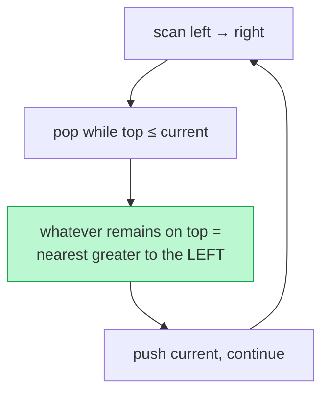

# Memorize: Previous Closest Occurrence

## In a Hurry?

- **One-Line Idea**: Sweep left-to-right keeping a monotonic stack of un-disqualified candidates; for each element pop the dominated ones, and the surviving top is its nearest greater (or smaller) predecessor.
- **Complexities**: `O(n)` time amortised, `O(n)` space — `n` is the array length; the stack and result each hold up to `n` entries.
- **When to Use**: Each position needs the *closest earlier* element passing a strict greater-than or less-than test — previous-greater, previous-smaller, stock spans, nearest-taller-bar-to-the-left.

---

## One-Line Mnemonic

**"March forward; pop everyone you tower over; whoever still stands behind you is your answer."**

The image is a person walking down a line of people, knocking down everyone shorter on the way, and looking back to find the first one still standing taller.

---

## Real-World Analogy

Picture queuing to see a parade and wanting to know the nearest *taller* person standing ahead of you in line. Anyone shorter than you, no matter how close, blocks no one's view and can be ignored. As each new person joins, every shorter person already in front is irrelevant for everybody behind, so you mentally drop them. The first person still taller than you, scanning forward, is exactly your previous-greater — and the monotonic stack is the running shortlist of "people still tall enough to matter."

---

## Visual Summary



<p align="center"><strong>Keep a monotonic stack: before pushing each element, pop everything not larger than it — whatever remains on top is its nearest greater element to the left. Each index is pushed and popped once → O(n).</strong></p>

---

## Pattern Recognition Triggers

The problem fits the previous-closest pattern when **all four** of the following hold. These are the same questions the pattern's Recognition Checklist asks.

- Each position needs an answer drawn from the elements **before** it — the query for index `i` ranges only over `j < i`.
- The answer is the **closest** qualifying predecessor, not a count and not the full list of them.
- The comparison is **monotone** — a consistent strict `>` (previous-greater) or strict `<` (previous-smaller).
- The per-element work is **`O(1)` amortised** — each value is pushed once and popped at most once.

Common surface signals: "for each element find the nearest greater/smaller to its left," "stock span," "days until a warmer day looking backward," "nearest taller building to the left." A *circular* array adds the `2n` doubled pass but does not change the trigger.

---

## Don't Confuse With

| | **Previous Closest (this pattern)** | **Next Closest (pattern 10)** |
|---|---|---|
| **Scan direction** | Left-to-right; the answer lies in the already-seen prefix | Right-to-left (or left-to-right resolving on pop); the answer lies in the not-yet-confirmed suffix |
| **What the stack holds** | Candidates that may still be a *later* element's predecessor | Indices still waiting for their *successor* to arrive |
| **Answer position** | The nearest qualifying element to the **left** of each index | The nearest qualifying element to the **right** of each index |
| **Problem shape** | "previous greater / smaller," stock span, nearest-taller-to-the-left | "next greater / smaller," daily temperatures, largest rectangle, trapping rain water |
| **When this goes wrong** | Your answers land to the *right* of each element — you wanted predecessors but built a forward-resolving stack; switch to next-closest. | Your answers land to the *left* of each element — you wanted successors but swept the prefix; switch to previous-closest. |

Both patterns run the identical pop-peek-push monotonic stack. The decisive question is *which side* of each element the answer lives on — the prefix already scanned (previous) or the suffix still to come (next).

---

## Template Code

```python
def previous_closest(arr):
    n = len(arr)
    result = [-1] * n      # default when no qualifying predecessor exists
    stack = []             # decreasing for previous-greater, increasing for previous-smaller

    for i in range(n):     # for a CIRCULAR array, use range(2 * n) and idx = i % n
        # Pop dominated candidates. Previous-greater: stack[-1] <= arr[i].
        # Previous-smaller: flip to stack[-1] >= arr[i].
        while stack and stack[-1] <= arr[i]:
            stack.pop()

        # The survivor on top is the nearest qualifying predecessor.
        if stack:
            result[i] = stack[-1]

        # Push the current value so it can answer later elements.
        stack.append(arr[i])

    return result
```

Three knobs change per problem:

- **The pop comparison** — `<=` for previous-greater (decreasing stack), `>=` for previous-smaller (increasing stack).
- **The loop bound** — `range(n)` for a linear array, `range(2 * n)` with `idx = i % n` for a circular one.
- **What the stack stores** — values when the answer is a value, indices when the answer is a distance or position.

---

## Common Mistakes

- **Building the wrong-direction stack for the comparison**:
  - *What*: using a decreasing stack (`pop while top <= cur`) when the problem asks for the previous *smaller* element, or vice versa, and getting systematically wrong survivors.
  - *Why*: the monotonic order *is* the algorithm — a decreasing stack surfaces nearest-greater, an increasing stack surfaces nearest-smaller. Pick the order that matches the query.
  - *Fix*: previous-greater → keep the stack decreasing, pop while `top <= cur`. Previous-smaller → keep it increasing, pop while `top >= cur`.
- **Popping with the wrong strictness**:
  - *What*: using `<` instead of `<=` (or `>` instead of `>=`) so equal values linger on the stack and a duplicate is reported as its own previous-greater.
  - *Why*: "strictly greater" means an equal value does *not* qualify, so an equal element must be popped, not left as a candidate.
  - *Fix*: pop on `<=` / `>=` so equal values are evicted; reserve strict `<` / `>` only when the spec explicitly wants the nearest *non-smaller* element.
- **Forgetting the sentinel for no-predecessor positions**:
  - *What*: leaving `result[i]` unwritten (or zero) when the stack is empty, so elements with no qualifying predecessor show a garbage value instead of `-1`.
  - *Why*: the empty-stack case is a real answer — "nothing to the left qualifies" — not a skip.
  - *Fix*: initialise the whole result array to `-1` up front and only overwrite when the stack is non-empty.
- **Treating the nested `while` as `O(n²)`**:
  - *What*: rejecting the stack approach (or adding a redundant outer guard) because a `while` inside a `for` *looks* quadratic.
  - *Why*: each value is pushed exactly once and popped at most once, so the total pop work across the whole pass is `O(n)`, not per-iteration `O(n)`.
  - *Fix*: trust the amortised bound — count operations across the entire sweep, where total pushes + pops never exceed `2n`.
- **Single-pass circular indexing**:
  - *What*: handling a circular array with one `range(n)` pass, so values whose predecessor sits past the wrap are wrongly reported as `-1`.
  - *Why*: a single pass never lets the start of the array "see" the end, so wrapped predecessors are missed.
  - *Fix*: iterate `range(2 * n)` with `idx = i % n`; the second lap resolves the wrapped answers, still `O(n)`.

---

## Minimum Viable Example

Previous-greater on `[3, 1, 6, 4]` with a decreasing stack:

```
[3, 1, 6, 4]   i=0 x=3  pop none → -1   push 3   stack=[3]
               i=1 x=1  top 3>1 → 3     push 1   stack=[3,1]
               i=2 x=6  pop 1, pop 3 → -1   push 6   stack=[6]
               i=3 x=4  top 6>4 → 6     push 4   stack=[6,4]

Result: [-1, 3, -1, 6]
```

Four elements, one inward sweep, each value pushed once and popped at most once.

---

## Quick Recall

**Q: Which stack order finds the previous *greater* element, and which finds the previous *smaller*?**
A: A *decreasing* stack (pop while top `≤` current) finds previous-greater; an *increasing* stack (pop while top `≥` current) finds previous-smaller.

**Q: What is the time and space complexity of the previous-closest pattern?**
A: `O(n)` time amortised and `O(n)` space — each element is pushed once and popped at most once, and the stack plus result each hold up to `n` entries.

**Q: Why is the nested `while` loop not `O(n²)`?**
A: Across the whole pass every value is pushed exactly once and popped at most once, so total stack operations are bounded by `2n`.

**Q: How do you adapt the pattern to a circular array?**
A: Iterate `2n` times with `idx = i % n`; the second lap lets a value's predecessor wrap past the array start, and the cost stays `O(n)`.

**Q: What distinguishes this pattern from next-closest occurrence?**
A: Previous-closest sweeps left-to-right and answers the nearest qualifying element to each index's *left*; next-closest answers the nearest qualifying element to its *right*.
