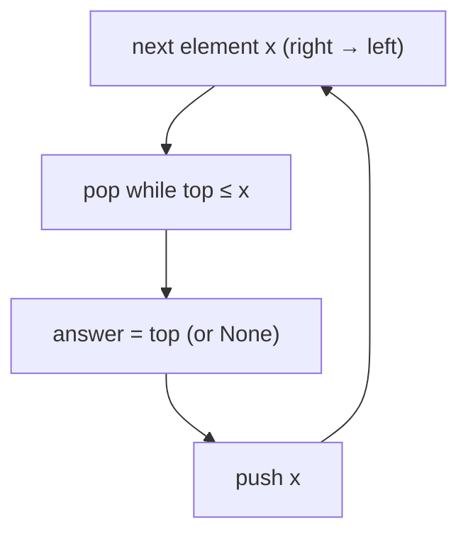

# Pattern: Next Closest Occurrence

## Why It Exists

The companion question to the previous pattern: "for each element, what's the nearest element to its **right** that is larger?" (the *next greater element*). It answers "how many days until a warmer one," "the next higher price," and is the engine inside *largest rectangle in a histogram* and *trapping rain water*.

It's the same monotonic-stack idea — only the **direction flips**. Where previous-occurrence scanned left-to-right so the stack held elements to the *left*, here you scan **right-to-left**, so everything already on the stack lies to the *right* of the current element. Pop the ones it shadows, and the survivor on top is its next-greater. One pass, `O(n)`, just mirrored.

## See It Work

For each element of `[2, 5, 3, 7, 1]`, find the nearest larger value to its **right** (`None` if none). Run it, then **Visualise** the right-to-left sweep.

> ▶ Run it, then click **Visualise** — scanning from the right, each element pops the smaller values; the surviving top is its next-greater.

```python run viz=array viz-root=stack viz-kind=stack
import ast

arr = ast.literal_eval(input())
stack = []                                  # holds elements already seen — all to the RIGHT
result = [None] * len(arr)
for i in range(len(arr) - 1, -1, -1):       # scan right to left
    x = arr[i]
    while stack and stack[-1] <= x:         # pop everything this element dominates
        stack.pop()
    result[i] = stack[-1] if stack else None    # nearest taller to the right
    stack.append(x)
print(str(result).replace("None", "null"))
```

```java run viz=array viz-root=stack viz-kind=stack
import java.util.*;

public class Main {
  public static void main(String[] args) {
    int[] arr = parseIntArray(new Scanner(System.in).nextLine());

    List<Integer> stack = new ArrayList<>();      // holds elements to the RIGHT
    Integer[] result = new Integer[arr.length];
    for (int i = arr.length - 1; i >= 0; i--) {  // scan right to left
      int x = arr[i];
      while (!stack.isEmpty() && stack.get(stack.size() - 1) <= x)
        stack.remove(stack.size() - 1);           // pop dominated elements
      result[i] = stack.isEmpty() ? null : stack.get(stack.size() - 1);
      stack.add(x);
    }
    System.out.println(Arrays.toString(result));
  }

  // "[2, 5, 3, 7, 1]" → {2, 5, 3, 7, 1} — reads the test case's arr
  static int[] parseIntArray(String line) {
    String inner = line.replaceAll("[\\[\\]\\s]", "");
    if (inner.isEmpty()) return new int[0];
    String[] parts = inner.split(",");
    int[] out = new int[parts.length];
    for (int i = 0; i < parts.length; i++) out[i] = Integer.parseInt(parts[i]);
    return out;
  }
}
```

```testcases
{
  "args": [
    { "id": "arr", "label": "arr", "type": "int[]", "placeholder": "[2, 5, 3, 7, 1]" }
  ],
  "cases": [
    { "args": { "arr": "[2, 5, 3, 7, 1]" }, "expected": "[5, 7, 7, null, null]" },
    { "args": { "arr": "[1, 2, 3, 4]" }, "expected": "[2, 3, 4, null]" },
    { "args": { "arr": "[4, 3, 2, 1]" }, "expected": "[null, null, null, null]" }
  ]
}
```

## How It Works

Identical machinery to previous-occurrence, with the scan reversed. Walk **right to left**, keeping a strictly decreasing stack of the elements seen so far (which are exactly those to the right of the current one). For each `x`:

1. **Pop** while the top is `≤ x` — those are to the right *and* smaller, so they can't be the next-greater for `x` or for anything to its left; `x` shadows them.
2. **Read** the top as the answer (nearest greater to the right, or `None`).
3. **Push** `x` for the elements still to come (to its left).



<p align="center"><strong>scanning right to left, pop the values the current element dominates, record the surviving top as its next-greater, then push it.</strong></p>

Same amortized argument: each element is pushed once and popped at most once → **`O(n)` time, `O(n)` space.** Flip the comparison (`pop while top ≥ x`) for the next *smaller* element. (There's also a slick left-to-right variant: when `x` pops smaller elements, `x` *is* their next-greater, so you resolve them retroactively as you pop — same result, handy when you must scan forward.)

### Key Takeaway

Next-greater is previous-greater scanned right-to-left: the stack then holds elements to the right, so popping the dominated ones leaves the nearest greater on top. `O(n)` time, `O(n)` space — direction is the only knob that changes between the two.

## Trace It

Next-greater over `[2, 5, 3, 7, 1]`, scanning right → left:

| `i` | `x` | pops (`≤ x`) | stack after | answer |
|---|---|---|---|---|
| 4 | `1` | — | `[1]` | `None` |
| 3 | `7` | `1` | `[7]` | `None` |
| 2 | `3` | — | `[7, 3]` | `7` |
| 1 | `5` | `3` | `[7, 5]` | `7` |
| 0 | `2` | — | `[7, 5, 2]` | `5` |

Before you read on: both `5` (at index 1) and `3` (at index 2) reported `7` as their next-greater — yet `7` is at index 3, to the right of both. How does scanning right-to-left let one `7` on the stack serve as the answer for several elements to its left?

Because once `7` is pushed, it stays on the stack as long as nothing larger arrives — and every element to its left that's smaller than `7` will see `7` on top (after popping any smaller values in between, like the `3` that `5` popped). The stack keeps the nearest *still-relevant* larger element available for everyone to its left, and only discards an element when something bigger replaces it. So a single tall value naturally answers the query for every shorter element stretching back to the previous taller one — the same shadowing logic as before, just feeding answers leftward.

## Your Turn

The reusable next-greater (flip the comparison for next-smaller):

```python run viz=array viz-kind=stack
import ast

def next_greater(arr):
    # Your code goes here — scan right to left, maintain a decreasing stack;
    # pop while top <= x, record the surviving top (or None), then push x.
    return [None] * len(arr)

arr = ast.literal_eval(input())
print(str(next_greater(arr)).replace("None", "null"))
```

```java run viz=array viz-kind=stack
import java.util.*;

public class Main {
  static Integer[] nextGreater(int[] arr) {
    // Your code goes here — scan right to left, maintain a decreasing stack;
    // pop while top <= x, record the surviving top (or null), then push x.
    Integer[] result = new Integer[arr.length];
    return result;
  }

  public static void main(String[] args) {
    int[] arr = parseIntArray(new Scanner(System.in).nextLine());
    System.out.println(Arrays.toString(nextGreater(arr)));
  }

  static int[] parseIntArray(String line) {
    String inner = line.replaceAll("[\\[\\]\\s]", "");
    if (inner.isEmpty()) return new int[0];
    String[] parts = inner.split(",");
    int[] out = new int[parts.length];
    for (int i = 0; i < parts.length; i++) out[i] = Integer.parseInt(parts[i]);
    return out;
  }
}
```

```testcases
{
  "args": [
    { "id": "arr", "label": "arr", "type": "int[]", "placeholder": "[2, 5, 3, 7, 1]" }
  ],
  "cases": [
    { "args": { "arr": "[2, 5, 3, 7, 1]" }, "expected": "[5, 7, 7, null, null]" },
    { "args": { "arr": "[1, 2, 3, 4]" }, "expected": "[2, 3, 4, null]" },
    { "args": { "arr": "[4, 3, 2, 1]" }, "expected": "[null, null, null, null]" },
    { "args": { "arr": "[3, 1, 2]" }, "expected": "[null, 2, null]" }
  ]
}
```

<details>
<summary>Editorial</summary>

Scan right to left, keeping a strictly decreasing stack of values already seen (all to the current element's right). For each `x`: pop while the top is `≤ x` (those smaller values are shadowed and will never be an answer for anything to the left); the surviving top is `x`'s next-greater (or `None`); push `x`. Flip the pop condition to `≥ x` to get next-smaller. Each element is pushed and popped at most once → `O(n)` time, `O(n)` space.

```python solution time=O(n) space=O(n)
import ast

def next_greater(arr):
    stack, result = [], [None] * len(arr)
    for i in range(len(arr) - 1, -1, -1):
        x = arr[i]
        while stack and stack[-1] <= x:        # >= x  →  next-smaller instead
            stack.pop()
        result[i] = stack[-1] if stack else None
        stack.append(x)
    return result

arr = ast.literal_eval(input())
print(str(next_greater(arr)).replace("None", "null"))
```

```java solution
import java.util.*;

public class Main {
  static Integer[] nextGreater(int[] arr) {
    List<Integer> stack = new ArrayList<>();
    Integer[] result = new Integer[arr.length];
    for (int i = arr.length - 1; i >= 0; i--) {
      int x = arr[i];
      while (!stack.isEmpty() && stack.get(stack.size() - 1) <= x)   // >= x → next-smaller
        stack.remove(stack.size() - 1);
      result[i] = stack.isEmpty() ? null : stack.get(stack.size() - 1);
      stack.add(x);
    }
    return result;
  }

  public static void main(String[] args) {
    int[] arr = parseIntArray(new Scanner(System.in).nextLine());
    System.out.println(Arrays.toString(nextGreater(arr)));
  }

  static int[] parseIntArray(String line) {
    String inner = line.replaceAll("[\\[\\]\\s]", "");
    if (inner.isEmpty()) return new int[0];
    String[] parts = inner.split(",");
    int[] out = new int[parts.length];
    for (int i = 0; i < parts.length; i++) out[i] = Integer.parseInt(parts[i]);
    return out;
  }
}
```

</details>

Drill the family in **Practice** — [Succeeding Superior Element](/cortex/data-structures-and-algorithms/linear-structures/stack/pattern-next-closest-occurrence/problems/succeeding-superior-element), [Succeeding Inferior Element](/cortex/data-structures-and-algorithms/linear-structures/stack/pattern-next-closest-occurrence/problems/succeeding-inferior-element), [Retained Rainwater](/cortex/data-structures-and-algorithms/linear-structures/stack/pattern-next-closest-occurrence/problems/retained-rainwater), and [Largest Rectangle Area](/cortex/data-structures-and-algorithms/linear-structures/stack/pattern-next-closest-occurrence/problems/largest-rectangle-area).

## Reflect & Connect

This pattern completes the monotonic-stack matrix and unlocks its famous applications:

- **The full matrix** — *previous* (scan left→right) vs *next* (scan right→left), each with *greater* (decreasing stack) or *smaller* (increasing stack). Four queries, one technique, two knobs.
- **Two ways to scan for "next"** — the right-to-left mirror (above), or left-to-right with **retroactive resolution**: as a new element pops smaller ones off the stack, it *is* their next-greater, so fill their answers at pop time. Pick whichever scan direction the surrounding problem forces.
- **The marquee applications** — **largest rectangle in a histogram** (each bar's reach = distance to the next-smaller on each side), **trapping rain water** (water above a bar bounded by taller bars on both sides), **stock span**. All are monotonic-stack problems in disguise; the [practice set](/cortex/data-structures-and-algorithms/linear-structures/stack/pattern-next-closest-occurrence/problems/largest-rectangle-area) includes them.

**Prerequisites:** [Previous Closest Occurrence](/cortex/data-structures-and-algorithms/linear-structures/stack/pattern-previous-closest-occurrence/pattern).
**What's next:** use a stack to check well-formedness — [Sequence Validation](/cortex/data-structures-and-algorithms/linear-structures/stack/pattern-sequence-validation/pattern).

## Recall

> **Mnemonic:** *Next = previous, mirrored. Scan right→left, decreasing stack, pop while top ≤ x, surviving top is the next-greater, push x. O(n).*

| | |
|---|---|
| Scan | right → left (stack holds elements to the right) |
| Per element | pop while `top ≤ x` → read top as answer → push `x` |
| Next-smaller | flip to `pop while top ≥ x` |
| Matrix | previous/next (direction) × greater/smaller (comparison) |
| Cost | `O(n)` time, `O(n)` space |

<details>
<summary><strong>Q:</strong> What single change turns previous-greater into next-greater?</summary>

**A:** Reverse the scan direction — go right-to-left so the stack holds elements to the right.

</details>
<details>
<summary><strong>Q:</strong> Why can one tall value answer the query for several elements to its left?</summary>

**A:** It stays on the stack until something larger replaces it, so every shorter element to its left finds it on top.

</details>
<details>
<summary><strong>Q:</strong> What's the left-to-right alternative for "next"?</summary>

**A:** Retroactive resolution — when a new element pops smaller ones, it is their next-greater, so fill their answers as you pop.

</details>
<details>
<summary><strong>Q:</strong> Which famous problems reduce to this pattern?</summary>

**A:** Largest rectangle in a histogram, trapping rain water, and stock span.

</details>

## Sources & Verify

- **CLRS**, *Introduction to Algorithms*, 4th ed., §10.1 and §17 — stacks and amortized analysis.
- **Sedgewick & Wayne**, *Algorithms*, 4th ed., §1.3–1.4 — stacks and amortized cost.
- The next-greater monotonic-stack technique (and its histogram / rain-water applications) is standard; both runnable blocks are verified by running (`[5, 7, 7, null, null]` and `[2, 3, 4, null]`).
