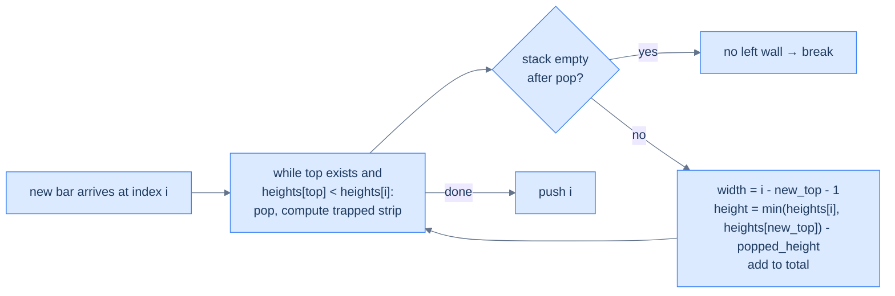

# Retained rainwater

## Problem Statement

Given an array `heights` of non-negative integers representing an elevation map (each bar has width 1), compute how much water can be trapped after rain.

### Example
> -   **Input:** `heights = [0, 2, 4, 3, 0, 3, 5, 2, 0, 4, 3, 0, 2]`
> -   **Output:** `14`

## Examples

**Example 1**
```
Input:  heights = [0, 2, 4, 3, 0, 3, 5, 2, 0, 4, 3, 0, 2]
Output: 14
Explanation: Water pools in each valley up to the shorter of its two surrounding walls.
The pockets across the elevation map sum to 14 units.
```

**Example 2**
```
Input:  heights = [3, 0, 3]
Output: 3
Explanation: The single valley of depth 3 and width 1 traps 3 units between the two walls of height 3.
```

**Example 3**
```
Input:  heights = [3, 0, 2]
Output: 2
Explanation: The valley is bounded by min(3, 2) = 2, so it traps 2 units, not 3.
```

**Example 4**
```
Input:  heights = [1, 2, 3, 4, 5]
Output: 0
Explanation: A monotonically increasing wall has no valley — water runs straight off.
```


<details>
<summary><h2>Intuition</h2></summary>


The structural property that makes this a **monotonic-stack** problem is that the water above any bar is bounded by its *next taller bar to the right* and its *nearest taller bar to the left*. Those two "find the nearest taller boundary" queries are exactly the next-greater shape the pattern fires on — only here a resolved boundary lets you *compute a trapped strip* instead of recording a single value.

The stack holds the indices of bars in **decreasing** height, each waiting for a taller bar on its right. When a taller bar arrives, it is the *right wall* for everything it dominates. Each popped bar is a valley floor; the new stack top (after the pop) is its *left wall*. The trapped strip on top of that floor is `(min(leftWall, rightWall) − floorHeight) × (rightIndex − leftIndex − 1)`, summed across every pop.

The naive approach computes, for each bar, the max height to its left and the max to its right, then sums `min(maxLeft, maxRight) − height`. Done with two nested scans that is `O(N²)` time. Precomputing the two max arrays drops it to `O(N)` time but `O(N)` extra space; the stack reaches the same `O(N)` time while building the boundaries on the fly.

</details>
<details>
<summary><h2>Applying the Diagnostic Questions</h2></summary>


| Check | Answer for Retained Rainwater |
|---|---|
| **Q1.** Does each position need an answer drawn from elements *after* it? | **Yes** — each valley is closed by its nearest taller bar to the right. |
| **Q2.** Is the answer the *closest* such element, not all of them? | **Yes** — the first taller bar to the right is the right wall; the nearest taller bar left is the left wall. |
| **Q3.** Is the comparison monotone — strictly greater or smaller? | **Yes** — a decreasing stack pops when a strictly taller bar arrives. |
| **Q4.** Is the per-element work `O(1)` amortised? | **Yes** — each index is pushed once and popped at most once; each pop computes one strip in `O(1)`. |

</details>
<details>
<summary><h2>Approach</h2></summary>


The water trapped above each "valley" is bounded by the heights of the **left and right walls**. The monotonic-stack approach: maintain a *decreasing* stack of bar indices. When a new taller bar arrives, it forms a *right wall* for everything popped off the stack; the *new top of the stack* (after popping) is the *left wall*. The trapped water on top of the popped bar is `(min(left, right) − popped_height) × (right_index − left_index − 1)`.



<p align="center"><strong>Trapping rain water — pop the "valley" bar, the new top is the left wall, the current bar is the right wall, and the area trapped on top is one strip. Sum the strips.</strong></p>

</details>
<details>
<summary><h2>Approach in Words</h2></summary>


Sweep left to right with a decreasing stack of bar indices, settling one horizontal strip of water on every pop.

1. **Allocate the holders.** Create an empty `stack` of indices and a running total `waterTrapped = 0`.
2. **Visit each bar.** For bar `i`, check whether it forms a right wall for the bars below it.
3. **Settle the trapped strips.** While the stack is non-empty and `heights[i] > heights[stack.top()]`, pop the top as the valley `floor`.
4. **Stop at no left wall.** If the stack is now empty, there is no left wall, so break — water spills off that side.
5. **Compute the strip.** The new top is the `left` wall and `i` is the `right` wall. Add `(min(heights[i], heights[left]) − heights[floor]) × (i − left − 1)` to `waterTrapped`.
6. **Push and continue.** Push `i` onto the stack and move on; return `waterTrapped` once the sweep ends.

</details>
<details>
<summary><h2>Solution</h2></summary>


```python run viz=array viz-root=stack viz-kind=stack
from typing import List

class Solution:
    def retained_rainwater(self, heights: List[int]) -> int:
        n = len(heights)
        stack = []
        water_trapped = 0

        for i in range(n):

            # While the stack is not empty and the current height is
            # greater than the height of the bar at the top of the stack
            while stack and heights[i] > heights[stack[-1]]:
                top = stack.pop()

                # No left boundary for trapping water
                if not stack:
                    break

                # Calculate the width of the trapped water
                width = i - stack[-1] - 1

                # Calculate the height of the trapped water
                # (min of left and right boundary minus the current
                # height)
                height = (
                    min(heights[i], heights[stack[-1]]) - heights[top]
                )
                water_trapped += width * height

            # Push the current bar index to the stack
            stack.append(i)

        return water_trapped


# Example from the problem statement
print(Solution().retained_rainwater([0, 2, 4, 3, 0, 3, 5, 2, 0, 4, 3, 0, 2]))  # 14

# Edge cases
print(Solution().retained_rainwater([]))                     # 0
print(Solution().retained_rainwater([5]))                    # 0
print(Solution().retained_rainwater([1, 2]))                 # 0
print(Solution().retained_rainwater([0, 1, 0]))              # 0 — single valley traps nothing (width 0)
print(Solution().retained_rainwater([3, 0, 3]))              # 3
print(Solution().retained_rainwater([3, 0, 2]))              # 2
print(Solution().retained_rainwater([1, 2, 3, 4, 5]))        # 0 — monotonically increasing
print(Solution().retained_rainwater([5, 4, 3, 2, 1]))        # 0 — monotonically decreasing
```

```java run viz=array viz-root=stack viz-kind=stack
import java.util.*;

public class Main {
    static class Solution {
        public int retainedRainwater(int[] heights) {
            int n = heights.length;
            Stack<Integer> stack = new Stack<>();
            int waterTrapped = 0;

            for (int i = 0; i < n; ++i) {

                // While the stack is not empty and the current height is
                // greater than the height of the bar at the top of the stack
                while (
                    !stack.isEmpty() && heights[i] > heights[stack.peek()]
                ) {
                    int top = stack.pop();

                    // No left boundary for trapping water
                    if (stack.isEmpty()) {
                        break;
                    }

                    // Calculate the width of the trapped water
                    int width = i - stack.peek() - 1;

                    // Calculate the height of the trapped water
                    // (min of left and right boundary minus the current
                    // height)
                    int height =
                        Math.min(heights[i], heights[stack.peek()]) -
                        heights[top];
                    waterTrapped += width * height;
                }

                // Push the current bar index to the stack
                stack.push(i);
            }

            return waterTrapped;
        }
    }

    public static void main(String[] args) {
        // Example from the problem statement
        System.out.println(new Solution().retainedRainwater(new int[]{0, 2, 4, 3, 0, 3, 5, 2, 0, 4, 3, 0, 2}));  // 14

        // Edge cases
        System.out.println(new Solution().retainedRainwater(new int[]{}));                    // 0
        System.out.println(new Solution().retainedRainwater(new int[]{5}));                   // 0
        System.out.println(new Solution().retainedRainwater(new int[]{1, 2}));                // 0
        System.out.println(new Solution().retainedRainwater(new int[]{0, 1, 0}));             // 0
        System.out.println(new Solution().retainedRainwater(new int[]{3, 0, 3}));             // 3
        System.out.println(new Solution().retainedRainwater(new int[]{3, 0, 2}));             // 2
        System.out.println(new Solution().retainedRainwater(new int[]{1, 2, 3, 4, 5}));       // 0
        System.out.println(new Solution().retainedRainwater(new int[]{5, 4, 3, 2, 1}));       // 0
    }
}
```

</details>
<details>
<summary><h2>Dry Run</h2></summary>


Walk the example — `heights = [0, 2, 4, 3, 0, 3, 5, 2, 0, 4, 3, 0, 2]` (indices `0`–`12`). The stack holds indices in decreasing height; every pop with a left wall present settles one strip. Only the six water-adding pops are shown:

```
i= 5  h=3  pop idx4 (floor=0)  left=idx3(h=3)  width=5-3-1=1  strip=min(3,3)-0=3 ×1 = 3   total=3
i= 6  h=5  pop idx5 (floor=3)  left=idx3(h=3)  width=6-3-1=2  strip=min(5,3)-3=0 ×2 = 0   total=3
i= 6  h=5  pop idx3 (floor=3)  left=idx2(h=4)  width=6-2-1=3  strip=min(5,4)-3=1 ×3 = 3   total=6
i= 9  h=4  pop idx8 (floor=0)  left=idx7(h=2)  width=9-7-1=1  strip=min(4,2)-0=2 ×1 = 2   total=8
i= 9  h=4  pop idx7 (floor=2)  left=idx6(h=5)  width=9-6-1=2  strip=min(4,5)-2=2 ×2 = 4   total=12
i=12  h=2  pop idx11(floor=0)  left=idx10(h=3) width=12-10-1=1 strip=min(2,3)-0=2 ×1 = 2  total=14

water_trapped = 14
```

The result `14` matches the expected output. The strip at `i=6` over `idx5` adds `0` because the right wall `5` and floor `3` differ by the same amount the left wall constrains — included to show that flat or fully-walled pops contribute nothing.

</details>
<details>
<summary><h2>Complexity Analysis</h2></summary>


| Measure | Value | Why |
|---|---|---|
| Time  | **O(N)** | One pass over the `N` bars; each index is pushed once and popped at most once. |
| Space | **O(N)** | The stack holds up to `N` indices in the worst case (a strictly decreasing elevation map). |

Each pop computes a single strip in `O(1)`, so the total strip work is bounded by the `O(N)` pop count — the nested `while` does not make this `O(N²)`.

</details>
<details>
<summary><h2>Edge Cases</h2></summary>


| Case | Example | Expected | Reasoning |
|---|---|---|---|
| Empty array | `heights = []` | `0` | No bars, no water. |
| Single bar | `heights = [5]` | `0` | One wall cannot trap anything. |
| Two bars | `heights = [1, 2]` | `0` | No bar sits between two taller walls. |
| Zero-width valley | `heights = [0, 1, 0]` | `0` | The dip has no floor below a pair of walls — width collapses to 0. |
| Symmetric valley | `heights = [3, 0, 3]` | `3` | One floor of depth 3, width 1, bounded by two walls of height 3. |
| Monotonic increasing | `heights = [1, 2, 3, 4, 5]` | `0` | No right wall ever closes a valley — water runs off the top. |
| Monotonic decreasing | `heights = [5, 4, 3, 2, 1]` | `0` | No left wall ever exists — water runs off the start. |

</details>
<details>
<summary><h2>Key Takeaway</h2></summary>


What is new here is *area aggregation*: instead of recording a single next-greater value, each pop computes a horizontal strip `(min(left, right) − floor) × width` and sums it. The decreasing stack is unchanged — the right wall is just the element that triggers the pop, and the left wall is the survivor beneath it.

</details>