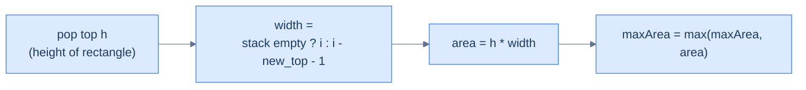

# Largest rectangle area

## Problem Statement

Given an array `histogram` of positive integers (heights of bars of unit width), return the area of the largest rectangle that can be formed.

### Example
> -   **Input:** `histogram = [2, 4, 3, 3, 5, 2, 4, 3, 2]` → **Output:** `18`

## Examples

**Example 1**
```
Input:  histogram = [2, 4, 3, 3, 5, 2, 4, 3, 2]
Output: 18
Explanation: The widest rectangle at height 2 spans all 9 bars → 2 × 9 = 18.
No taller rectangle covers enough width to beat it.
```

**Example 2**
```
Input:  histogram = [1, 100, 1]
Output: 100
Explanation: The single bar of height 100 and width 1 beats the width-3 rectangle of height 1.
```

**Example 3**
```
Input:  histogram = [3, 3, 3, 3]
Output: 12
Explanation: A flat run of four bars at height 3 forms one rectangle → 3 × 4 = 12.
```

**Example 4**
```
Input:  histogram = [5]
Output: 5
Explanation: A single bar is a rectangle of its own height and width 1.
```


<details>
<summary><h2>Intuition</h2></summary>


The structural property that makes this a **monotonic-stack** problem is that the widest rectangle *of a given bar's height* extends from just past the **previous shorter bar** to just before the **next shorter bar**. Those two "nearest strictly-shorter boundary" queries are the next-smaller shape — and resolving the right boundary lets you compute that bar's maximal rectangle.

The stack holds the indices of bars in **increasing** height, each waiting for a shorter bar on its right. When a shorter bar arrives, it is the right boundary for every taller bar above it. Each popped bar becomes a candidate rectangle: its height is the popped value, and its width spans from one past the new stack top to one before the current bar. The global maximum over all such candidates is the answer.

The naive approach fixes each pair of left and right endpoints, takes the minimum height in between, and multiplies by the width — `O(N²)` or `O(N³)` time depending on how the minimum is computed. The stack computes each bar's true left and right boundaries in a single pass, collapsing the work to `O(N)` time and `O(N)` space.

</details>
<details>
<summary><h2>Applying the Diagnostic Questions</h2></summary>


| Check | Answer for Largest Rectangle Area |
|---|---|
| **Q1.** Does each position need an answer drawn from elements *after* it? | **Yes** — each bar's rectangle is closed by its nearest strictly-shorter bar to the right. |
| **Q2.** Is the answer the *closest* such element, not all of them? | **Yes** — the first shorter bar to the right and the nearest shorter bar to the left bound the width. |
| **Q3.** Is the comparison monotone — strictly greater or smaller? | **Yes** — an increasing stack pops when a strictly shorter bar arrives. |
| **Q4.** Is the per-element work `O(1)` amortised? | **Yes** — each index is pushed once and popped at most once; each pop computes one rectangle in `O(1)`. |

</details>
<details>
<summary><h2>Approach</h2></summary>


For each bar, the largest rectangle whose *height equals this bar's height* extends from one past the **previous shorter bar** to one before the **next shorter bar**. Using a monotonic *increasing* stack of indices:

- When a new bar arrives that's shorter than the top, the top bar's "right boundary" is the new bar.
- Pop the top, look at the new top — that's the "left boundary".
- Width = `i − left − 1` (or `i` if the stack is empty after popping).
- Update the max area.

After the main loop, **flush** the stack as if a "0" bar appeared at index `n` — those bars extend all the way to the end.



<p align="center"><strong>When the increasing-stack invariant is broken, every popped bar represents a rectangle whose height is the popped value and whose horizontal extent runs from one past the new top to one before the current bar. Each pop is one candidate rectangle; the global max wins.</strong></p>

</details>
<details>
<summary><h2>Approach in Words</h2></summary>


Sweep left to right with an increasing stack of bar indices, scoring one candidate rectangle on every pop, then flush whatever remains.

1. **Allocate the holders.** Create an empty `stack` of indices and `maxArea = 0`.
2. **Visit each bar.** For bar `i`, settle every taller bar it ends before joining the stack.
3. **Score the popped rectangles.** While the stack is non-empty and `histogram[i] < histogram[stack.top()]`, pop the top as height `h`. Its width is `i` if the stack is now empty, else `i − stack.top() − 1`. Update `maxArea` with `h × width`.
4. **Push the current bar.** Push `i` onto the stack and continue the sweep.
5. **Flush the leftovers.** After the loop, pop every remaining bar as if a zero-height bar appeared at index `n`. Its width is `n` if the stack is empty, else `n − stack.top() − 1`. Update `maxArea` each time.
6. **Return `maxArea`.** It holds the largest rectangle found across all candidates.

</details>
<details>
<summary><h2>Solution</h2></summary>


```python run viz=array viz-root=stack viz-kind=stack
from typing import List

class Solution:
    def largest_rectangle_area(self, histogram: List[int]) -> int:
        n = len(histogram)

        # Stack to store indices of bars
        stack = []

        # To keep track of the maximum area
        max_area = 0

        # Iterate over all the bars in the histogram
        for i in range(n):

            # While the stack is not empty and the current height is
            # smaller than the height of the bar at the top of the stack
            while stack and histogram[i] < histogram[stack[-1]]:
                h = histogram[stack.pop()]

                # Calculate the width
                width = i if not stack else i - stack[-1] - 1

                # Update the maximum area
                max_area = max(max_area, h * width)

            # Push the current bar index to the stack
            stack.append(i)

        # After the loop, process any remaining bars in the stack
        while stack:
            h = histogram[stack.pop()]

            # Calculate the width
            width = n if not stack else n - stack[-1] - 1

            # Update the maximum area
            max_area = max(max_area, h * width)

        return max_area


# Example from the problem statement
print(Solution().largest_rectangle_area([2, 4, 3, 3, 5, 2, 4, 3, 2]))  # 18

# Edge cases
print(Solution().largest_rectangle_area([]))                            # 0
print(Solution().largest_rectangle_area([5]))                           # 5
print(Solution().largest_rectangle_area([2, 2]))                        # 4
print(Solution().largest_rectangle_area([1, 2, 3, 4, 5]))              # 9
print(Solution().largest_rectangle_area([5, 4, 3, 2, 1]))              # 9
print(Solution().largest_rectangle_area([3, 3, 3, 3]))                 # 12
print(Solution().largest_rectangle_area([1, 100, 1]))                  # 100
```

```java run viz=array viz-root=stack viz-kind=stack
import java.util.*;

public class Main {
    static class Solution {
        public int largestRectangleArea(int[] histogram) {
            int n = histogram.length;

            // Stack to store indices of bars
            Stack<Integer> stack = new Stack<>();

            // To keep track of the maximum area
            int maxArea = 0;

            // Iterate over all the bars in the histogram
            for (int i = 0; i < n; ++i) {

                // While the stack is not empty and the current height is
                // smaller than the height of the bar at the top of the stack
                while (
                    !stack.isEmpty() &&
                    histogram[i] < histogram[stack.peek()]
                ) {
                    int h = histogram[stack.pop()];

                    // Calculate the width
                    int width = stack.isEmpty() ? i : i - stack.peek() - 1;

                    // Update the maximum area
                    maxArea = Math.max(maxArea, h * width);
                }

                // Push the current bar index to the stack
                stack.push(i);
            }

            // After the loop, process any remaining bars in the stack
            while (!stack.isEmpty()) {
                int h = histogram[stack.pop()];

                // Calculate the width
                int width = stack.isEmpty() ? n : n - stack.peek() - 1;

                // Update the maximum area
                maxArea = Math.max(maxArea, h * width);
            }

            return maxArea;
        }
    }

    public static void main(String[] args) {
        // Example from the problem statement
        System.out.println(new Solution().largestRectangleArea(new int[]{2, 4, 3, 3, 5, 2, 4, 3, 2}));  // 18

        // Edge cases
        System.out.println(new Solution().largestRectangleArea(new int[]{}));                           // 0
        System.out.println(new Solution().largestRectangleArea(new int[]{5}));                          // 5
        System.out.println(new Solution().largestRectangleArea(new int[]{2, 2}));                       // 4
        System.out.println(new Solution().largestRectangleArea(new int[]{1, 2, 3, 4, 5}));             // 9
        System.out.println(new Solution().largestRectangleArea(new int[]{5, 4, 3, 2, 1}));             // 9
        System.out.println(new Solution().largestRectangleArea(new int[]{3, 3, 3, 3}));                // 12
        System.out.println(new Solution().largestRectangleArea(new int[]{1, 100, 1}));                 // 100
    }
}
```

</details>
<details>
<summary><h2>Key Takeaway</h2></summary>


Three lessons:

1. **Left-to-right with retroactive resolution is the idiomatic style.** When a new element arrives and dominates indices on the stack, *those* indices' answers are *the new element*. The algorithm fills in the answer table as it goes; anything left on the stack at end-of-input has no answer.
2. **Indices, not values, on the stack.** Storing indices lets you compute widths (rainwater, histogram), look up arbitrary fields of the original record, and resolve answers retroactively.
3. **The same monotonic-stack skeleton powers a vast family of problems.** Next-greater, next-smaller, daily temperatures, stock span, trapping rain water, histogram rectangles, sum-of-subarray-minimums, score-of-parentheses — all variations on "pop while dominated, resolve answers, push current index". Recognise the family and the implementation almost writes itself.

> *Coming up — **sequence validation**. The next pattern uses a stack as a "matching memory" — push opening symbols, pop on closing ones, and check that everything pairs up. The canonical applications are bracket matching, palindrome checking, and a few delightful permutation-validation puzzles.*

</details>
<details>
<summary><h2>Dry Run</h2></summary>


Walk the example — `histogram = [2, 4, 3, 3, 5, 2, 4, 3, 2]` (indices `0`–`8`, `n = 9`). The stack holds indices in increasing height; a shorter bar pops every taller bar and scores its rectangle:

```
i=0 h=2  no pop                                        push 0  stack=[0]
i=1 h=4  no pop                                        push 1  stack=[0,1]
i=2 h=3  pop idx1(h=4) w=1 area=4   max=4              push 2  stack=[0,2]
i=3 h=3  no pop                                        push 3  stack=[0,2,3]
i=4 h=5  no pop                                        push 4  stack=[0,2,3,4]
i=5 h=2  pop idx4(h=5) w=1 area=5   max=5
         pop idx3(h=3) w=2 area=6   max=6
         pop idx2(h=3) w=4 area=12  max=12             push 5  stack=[0,5]
i=6 h=4  no pop                                        push 6  stack=[0,5,6]
i=7 h=3  pop idx6(h=4) w=1 area=4   max=12             push 7  stack=[0,5,7]
i=8 h=2  pop idx7(h=3) w=2 area=6   max=12             push 8  stack=[0,5,8]

flush (zero-height bar at index n=9):
         pop idx8(h=2) w=3 area=6   max=12
         pop idx5(h=2) w=8 area=16  max=16
         pop idx0(h=2) w=9 area=18  max=18

max_area = 18
```

The result `18` matches the expected output. The winning rectangle is found in the flush: bar `0` (height `2`) extends across the full width `9`, since every bar is at least `2` tall, giving `2 × 9 = 18`.

</details>
<details>
<summary><h2>Complexity Analysis</h2></summary>


| Measure | Value | Why |
|---|---|---|
| Time  | **O(N)** | One forward pass plus one flush; each index is pushed once and popped exactly once. |
| Space | **O(N)** | The stack holds up to `N` indices (a strictly increasing histogram never pops until the flush). |

Each pop scores one rectangle in `O(1)`. The forward loop and the flush together perform exactly `N` pushes and `N` pops, so the nested `while` is `O(N)` amortised, not `O(N²)`.

</details>
<details>
<summary><h2>Edge Cases</h2></summary>


| Case | Example | Expected | Reasoning |
|---|---|---|---|
| Empty histogram | `histogram = []` | `0` | No bars, no rectangle. |
| Single bar | `histogram = [5]` | `5` | One bar is a rectangle of height 5, width 1. |
| Two equal bars | `histogram = [2, 2]` | `4` | A flat run of width 2 at height 2 → 4. |
| Monotonic increasing | `histogram = [1, 2, 3, 4, 5]` | `9` | The best rectangle is height 3 across the last three bars → 3 × 3 = 9. |
| Monotonic decreasing | `histogram = [5, 4, 3, 2, 1]` | `9` | The best rectangle is height 3 across the first three bars → 3 × 3 = 9. |
| Flat run | `histogram = [3, 3, 3, 3]` | `12` | Four bars at height 3 → 3 × 4 = 12. |
| Spike | `histogram = [1, 100, 1]` | `100` | The lone height-100 bar beats the width-3 rectangle of height 1. |

</details>
<details>
<summary><h2>Key Takeaway</h2></summary>


What is new here is the **flush** after the main loop: bars still on the stack at the end have no shorter bar to their right, so they extend all the way to index `n`. Like rainwater, this is area aggregation on a monotonic stack — but the stack is *increasing* (next-smaller) and each pop computes `height × width` rather than a trapped strip.

</details>