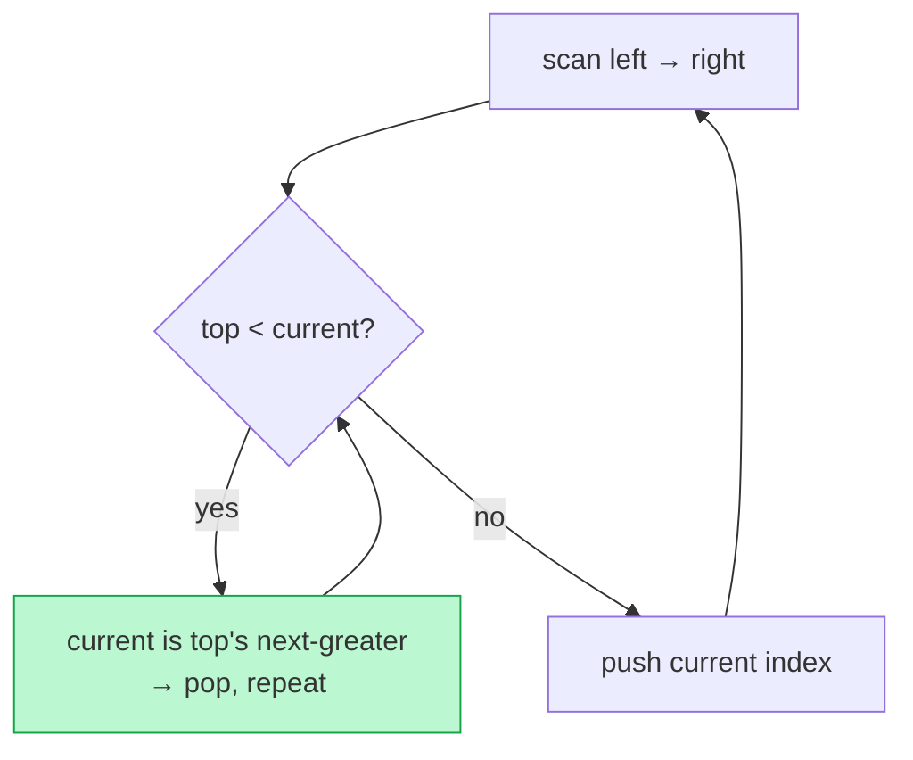

# Memorize: Next Closest Occurrence

## In a Hurry?

- **One-Line Idea**: Sweep left-to-right keeping a monotonic stack of unresolved indices; each new element resolves every stacked element it dominates, recording itself as their nearest greater (or smaller) successor.
- **Complexities**: `O(n)` time amortised, `O(n)` space — `n` is the array length; the stack and result each hold up to `n` entries.
- **When to Use**: Each position needs the *closest later* element passing a strict greater-than or less-than test — next-greater, next-smaller, daily temperatures, trapping rain water, largest rectangle in a histogram.

---

## One-Line Mnemonic

**"Walk forward; whoever you tower over, you are their answer; then take your place in line and wait."**

The image is a person walking down a queue, and every shorter person already waiting suddenly gets their answer — *you* are the first taller one to arrive after them.

---

## Real-World Analogy

Picture people queuing and each wanting to know the nearest *taller* person who arrives *after* them. As each newcomer walks in, they look back down the line and settle every shorter person still waiting — those people now have their answer, the newcomer, and they leave the "still waiting" list. The newcomer then joins the tail of that list to wait for someone taller behind them. The monotonic stack is precisely that shrinking shortlist of "people still waiting for a taller successor."

---

## Visual Summary



<p align="center"><strong>A monotonic stack resolves next-greater-to-the-right: each new element pops every smaller index still waiting and becomes their answer. Every element is pushed and popped once — O(n).</strong></p>

---

## Pattern Recognition Triggers

The problem fits the next-closest pattern when **all four** of the following hold. These are the same questions the pattern's Recognition Checklist asks.

- Each position needs an answer drawn from the elements **after** it — the query for index `i` ranges only over `j > i`.
- The answer is the **closest** qualifying successor, not a count and not the full list of them.
- The comparison is **monotone** — a consistent strict `>` (next-greater) or strict `<` (next-smaller).
- The per-element work is **`O(1)` amortised** — each index is pushed once and popped at most once.

Common surface signals: "for each element find the nearest greater/smaller to its right," "days until a warmer day looking forward," "water trapped between bars," "largest rectangle under a skyline." A *circular* array adds the `2n` doubled pass; an *area* problem (rainwater, histogram) stores indices and computes a width on each pop — but neither changes the trigger.

---

## Don't Confuse With

| | **Next Closest (this pattern)** | **Previous Closest (pattern 09)** |
|---|---|---|
| **Scan direction** | Left-to-right resolving on pop (or right-to-left peeking); the answer lies in the not-yet-confirmed suffix | Left-to-right peeking; the answer lies in the already-seen prefix |
| **What the stack holds** | Indices still waiting for their *successor* to arrive | Candidates that may still be a *later* element's predecessor |
| **Answer position** | The nearest qualifying element to the **right** of each index | The nearest qualifying element to the **left** of each index |
| **Problem shape** | "next greater / smaller," daily temperatures, trapping rain water, largest rectangle | "previous greater / smaller," stock span, nearest-taller-to-the-left |
| **When this goes wrong** | Your answers land to the *left* of each element — you wanted successors but swept the prefix peeking the top; switch to previous-closest. | Your answers land to the *right* of each element — you wanted predecessors but resolved forward on pop; switch to next-closest. |

Both patterns run the identical pop-resolve-push monotonic stack. The decisive question is *which side* of each element the answer lives on — the suffix still to come (next) or the prefix already scanned (previous).

---

## Template Code

```python
def next_closest(arr):
    n = len(arr)
    result = [-1] * n      # default when no qualifying successor exists
    stack = []             # holds INDICES; values run decreasing for next-greater

    for i in range(n):     # for a CIRCULAR array, use range(2 * n) and idx = i % n
        # Resolve dominated indices. Next-greater: arr[stack[-1]] < arr[i].
        # Next-smaller: flip to arr[stack[-1]] > arr[i].
        while stack and arr[stack[-1]] < arr[i]:
            j = stack.pop()
            result[j] = arr[i]   # the current element is j's nearest successor

        # Push the current index so it can be resolved by a later element.
        stack.append(i)

    # Indices still on the stack never found a successor → keep their -1.
    return result
```

Three knobs change per problem:

- **The resolve comparison** — `arr[stack[-1]] < arr[i]` for next-greater (decreasing stack), `>` for next-smaller (increasing stack).
- **The loop bound** — `range(n)` for a linear array, `range(2 * n)` with `idx = i % n` for a circular one.
- **What a pop computes** — record `arr[i]` for a value query, or a width `i − stack[-1] − 1` and an area for rainwater / histogram problems.

---

## Common Mistakes

- **Sweeping the prefix when you want successors**:
  - *What*: building a previous-closest stack (peeking the top for each element) and reporting answers that sit to each element's *left* instead of its right.
  - *Why*: the answer's *side* is set by whether you peek the survivor (previous) or resolve on pop (next) — peeking the prefix can never see the suffix.
  - *Fix*: resolve forward — on each new element, pop and assign `result[popped] = current`; leftovers stay `-1`.
- **Pushing values when you need indices**:
  - *What*: storing raw values on the stack, then being unable to write the answer back to the right slot (or compute a width) in rainwater and histogram problems.
  - *Why*: retroactive resolution writes into `result[poppedIndex]`, and area problems need `i − left − 1` — both require the index, not just the value.
  - *Fix*: push `i` (or `(index, value)` pairs); recover the value with `arr[stack[-1]]` when comparing.
- **Popping with the wrong strictness**:
  - *What*: using `<=` instead of `<` (or `>=` instead of `>`) so equal values resolve each other and a duplicate is reported as its own next-greater.
  - *Why*: "strictly greater" means an equal value does *not* qualify, so an equal element must *not* trigger a resolve.
  - *Fix*: resolve on strict `<` / `>` for the next strictly-greater/smaller; reserve `<=` / `>=` only when the spec wants the nearest *non-smaller* / *non-larger* element.
- **Forgetting the leftover sentinel**:
  - *What*: assuming every index gets resolved, so indices still on the stack at end-of-input show a garbage value instead of `-1` (or `0`).
  - *Why*: an index never popped has *no* qualifying successor — that is a real answer, not a skip.
  - *Fix*: initialise the result to the sentinel up front and only overwrite on a pop.
- **Single-pass circular indexing**:
  - *What*: handling a circular array with one `range(n)` pass, so values whose successor sits past the wrap are wrongly reported as `-1`.
  - *Why*: a single pass never lets the end of the array "see" the start, so wrapped successors are missed.
  - *Fix*: iterate `range(2 * n)` with `idx = i % n`; the second lap resolves the wrapped answers, still `O(n)`.

---

## Minimum Viable Example

Next-greater on `[2, 1, 5, 3]` with a decreasing stack of indices, resolving on pop:

```
[2, 1, 5, 3]   i=0 x=2  no resolve            push 0   stack=[0]
               i=1 x=1  no resolve            push 1   stack=[0,1]
               i=2 x=5  res[1]=5, res[0]=5    push 2   stack=[2]
               i=3 x=3  no resolve            push 3   stack=[2,3]

Result: [5, 5, -1, -1]   (indices 2 and 3 never resolved)
```

Four elements, one forward sweep, each index pushed once and popped at most once.

---

## Quick Recall

**Q: Which stack order finds the next *greater* element, and which finds the next *smaller*?**
A: A *decreasing* stack (resolve while `arr[top] < current`) finds next-greater; an *increasing* stack (resolve while `arr[top] > current`) finds next-smaller.

**Q: What is the time and space complexity of the next-closest pattern?**
A: `O(n)` time amortised and `O(n)` space — each index is pushed once and popped at most once, and the stack plus result each hold up to `n` entries.

**Q: Why store indices rather than values on the stack?**
A: Retroactive resolution writes the answer into `result[poppedIndex]`, and area problems compute a width `i − left − 1`; both need the index, recoverable value via `arr[index]`.

**Q: How do you adapt the pattern to a circular array?**
A: Iterate `2n` times with `idx = i % n`; the second lap lets a value's successor wrap past the array end, and the cost stays `O(n)`.

**Q: What distinguishes this pattern from previous-closest occurrence?**
A: Next-closest answers the nearest qualifying element to each index's *right*; previous-closest answers the nearest qualifying element to its *left*.
