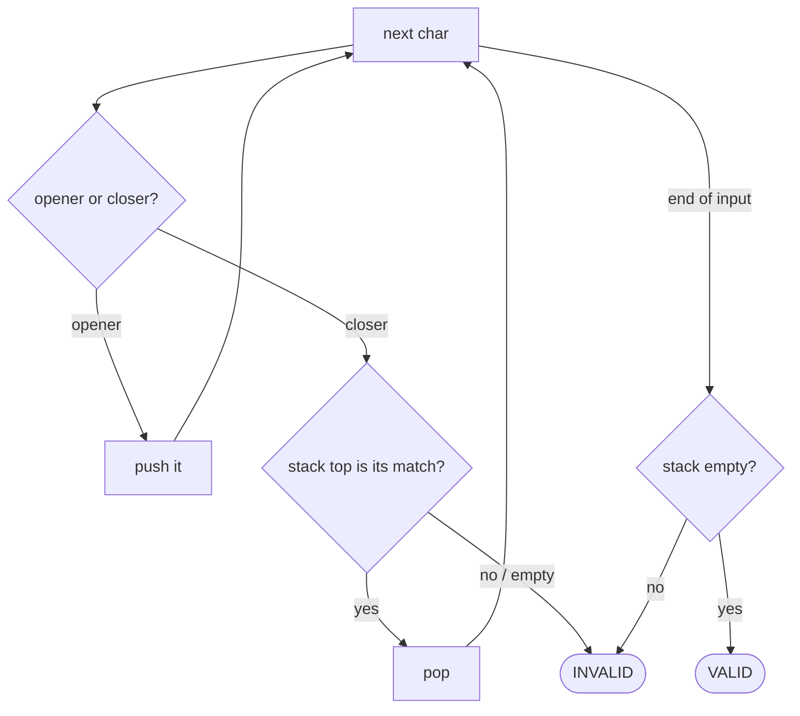

# Pattern: Sequence Validation

## Why It Exists

Is `"([{}])"` well-formed but `"([)]"` not? Validating nested brackets (or tags, or any open/close structure) has one hard requirement: a closing bracket must match the **most recently opened, still-unclosed** one. In `"([)]"` the `)` tries to close while `[` is still open — the nesting crosses, so it's invalid.

A single counter handles *one* bracket type ("count up on `(`, down on `)`, never go negative, end at zero"), but it falls apart the moment types mix — a counter can't tell `)` from `]`. What you need is "the most recent unmatched opener," and **last-in, first-out** is exactly that. A stack holds the open brackets; each closing bracket must match the top. The structure is valid only if every close finds its match *and* nothing is left open at the end.

## See It Work

Validate a bracket string — run it, then **Visualise** the open-bracket stack rise and fall.

> ▶ Run it, then click **Visualise** — each opener pushes; each closer must match the top and pop it; a clean run ends with an empty stack.

```python run viz=array viz-root=stack viz-kind=stack
def is_valid(s):
    pairs = {')': '(', ']': '[', '}': '{'}
    stack = []
    for ch in s:
        if ch in '([{':
            stack.append(ch)              # opener → remember it
        elif ch in pairs:
            if not stack or stack.pop() != pairs[ch]:   # closer must match the top
                return False
    return not stack                      # valid iff nothing left open

s = input()
print("true" if is_valid(s) else "false")
```

```java run viz=array viz-root=stack viz-kind=stack
import java.util.*;

public class Main {
  static boolean isValid(String s) {
    Map<Character, Character> pairs = Map.of(')', '(', ']', '[', '}', '{');
    Deque<Character> stack = new ArrayDeque<>();
    for (char ch : s.toCharArray()) {
      if (ch == '(' || ch == '[' || ch == '{') stack.push(ch);
      else if (pairs.containsKey(ch)) {
        if (stack.isEmpty() || stack.pop() != pairs.get(ch)) return false;
      }
    }
    return stack.isEmpty();
  }

  public static void main(String[] args) {
    String s = new Scanner(System.in).nextLine();
    System.out.println(isValid(s));
  }
}
```

```testcases
{
  "args": [
    { "id": "s", "label": "s", "type": "string", "placeholder": "([{}])" }
  ],
  "cases": [
    { "args": { "s": "([{}])" }, "expected": "true" },
    { "args": { "s": "()[]{}" }, "expected": "true" },
    { "args": { "s": "([)]" }, "expected": "false" },
    { "args": { "s": "(]" }, "expected": "false" },
    { "args": { "s": "(((" }, "expected": "false" }
  ]
}
```

## How It Works

Scan left to right with a stack of unmatched openers:

1. **Opener** (`(`, `[`, `{`) → push it.
2. **Closer** (`)`, `]`, `}`) → it must close the most recent opener, so the top of the stack must be its matching pair. If the stack is empty (nothing to close) or the top is the wrong type, the sequence is **invalid**. Otherwise pop the match.
3. **End** → the stack must be **empty**; any leftover openers were never closed.



<p align="center"><strong>openers push; a closer checks the top for its match and pops it; an empty stack at the end means every opener was matched.</strong></p>

Each character is handled once with `O(1)` stack work → **`O(n)` time, `O(n)` space** (worst case all openers, like `"((((("`). The stack *is* the validator: it remembers, in the right order, exactly which closer must come next.

### Key Takeaway

A stack validates nested sequences because closing must match the most-recent open — pure LIFO. Push openers, require each closer to match the top, and demand an empty stack at the end. `O(n)` time and space; a mere counter only works when there's a single bracket type.

## Trace It

Validating `"([{}])"`:

| char | action | stack (bottom → top) |
|---|---|---|
| `(` | push | `(` |
| `[` | push | `( [` |
| `{` | push | `( [ {` |
| `}` | top `{` matches → pop | `( [` |
| `]` | top `[` matches → pop | `(` |
| `)` | top `(` matches → pop | (empty) |
| end | stack empty → **VALID** | — |

Before you read on: contrast `"([)]"`. The first two chars push `(` then `[`. The third char is `)`. What does the stack top say, and why does that one check catch the crossed nesting that a counter would miss?

After pushing `(` and `[`, the top is `[`. The next char `)` wants to match a `(`, but `top != (` → **invalid**, immediately. A plain counter ("opens minus closes") would see two opens and one close — a perfectly balanced *count* — and wrongly accept it. The stack catches it because it tracks not just *how many* are open but *which one is innermost*: `)` cannot close while `[` is the most recent unclosed opener. That "which, not just how many" is precisely what LIFO buys you, and why nested validation needs a stack rather than a tally.

## Your Turn

The reusable bracket validator — implement `is_valid` yourself: push every opener; for each closer, the top must be its matching pair; valid iff the stack ends empty.

```python run viz=array viz-kind=stack
def is_valid(s):
    # Your code goes here — push openers; for each closer, check and pop
    # the top; return True only if the stack ends empty.
    return False

s = input()
print("true" if is_valid(s) else "false")
```

```java run viz=array viz-kind=stack
import java.util.*;

public class Main {
  static boolean isValid(String s) {
    // Your code goes here — push openers; for each closer, check and pop
    // the top; return true only if the stack ends empty.
    return false;
  }

  public static void main(String[] args) {
    String s = new Scanner(System.in).nextLine();
    System.out.println(isValid(s));
  }
}
```

```testcases
{
  "args": [
    { "id": "s", "label": "s", "type": "string", "placeholder": "([{}])" }
  ],
  "cases": [
    { "args": { "s": "([{}])" }, "expected": "true" },
    { "args": { "s": "()[]{}" }, "expected": "true" },
    { "args": { "s": "([)]" }, "expected": "false" },
    { "args": { "s": "(]" }, "expected": "false" },
    { "args": { "s": "(((" }, "expected": "false" },
    { "args": { "s": "no brackets here" }, "expected": "true" }
  ]
}
```

<details>
<summary>Editorial</summary>

A stack is the natural fit because brackets nest *last-opened, first-closed* — exactly LIFO. Push every opener; when a closer arrives, the only opener it can legally match is the one on top. Pop it and check: if the stack is empty (a closer with nothing to match) or the popped opener is the wrong kind, the string is invalid. After the whole scan, a non-empty stack means some opener never closed. One pass, `O(n)` time, `O(n)` worst-case stack space.

```python solution time=O(n) space=O(n)
def is_valid(s):
    pairs = {')': '(', ']': '[', '}': '{'}
    stack = []
    for ch in s:
        if ch in '([{':
            stack.append(ch)
        elif ch in pairs:
            if not stack or stack.pop() != pairs[ch]:
                return False
    return not stack

s = input()
print("true" if is_valid(s) else "false")
```

```java solution
import java.util.*;

public class Main {
  static boolean isValid(String s) {
    Map<Character, Character> pairs = Map.of(')', '(', ']', '[', '}', '{');
    Deque<Character> stack = new ArrayDeque<>();
    for (char ch : s.toCharArray()) {
      if (ch == '(' || ch == '[' || ch == '{') stack.push(ch);
      else if (pairs.containsKey(ch))
        if (stack.isEmpty() || stack.pop() != pairs.get(ch)) return false;
    }
    return stack.isEmpty();
  }

  public static void main(String[] args) {
    String s = new Scanner(System.in).nextLine();
    System.out.println(isValid(s));
  }
}
```

</details>

Drill the family in **Practice** — [Parentheses Checker](/cortex/data-structures-and-algorithms/linear-structures/stack/pattern-sequence-validation/problems/parentheses-checker), [Minimum Edits](/cortex/data-structures-and-algorithms/linear-structures/stack/pattern-sequence-validation/problems/minimum-edits), [Redundant Parentheses](/cortex/data-structures-and-algorithms/linear-structures/stack/pattern-sequence-validation/problems/redundant-parentheses), and [Balanced Span](/cortex/data-structures-and-algorithms/linear-structures/stack/pattern-sequence-validation/problems/balanced-span).

## Reflect & Connect

The stack-as-matching-register shows up wherever structure must nest correctly:

- **The family** — bracket matching, detecting **redundant** parentheses (`((a))`), **minimum edits** to balance a string, validating XML/HTML tag nesting, and checking expression well-formedness.
- **Counter vs stack is the lesson** — one bracket type is a counting problem (`O(1)` space); the instant types can mix, you need the stack to know *which* opener is innermost. Recognizing that boundary tells you which tool the problem needs.
- **It's the front half of parsing** — every recursive-descent parser and expression evaluator leans on this exact "match the most recent open" mechanic. The [next pattern](/cortex/data-structures-and-algorithms/linear-structures/stack/pattern-linear-evaluation/pattern) keeps the stack but, instead of just matching, *computes* with what it pops.

**Prerequisites:** [What Is a Stack?](/cortex/data-structures-and-algorithms/linear-structures/stack/what-is-a-stack).
**What's next:** pop operands and operators to compute a result — [Linear Evaluation](/cortex/data-structures-and-algorithms/linear-structures/stack/pattern-linear-evaluation/pattern).

## Recall

> **Mnemonic:** *Push openers; a closer must match the top (else invalid); end with an empty stack. LIFO = innermost-first, which a counter can't track.*

| | |
|---|---|
| Opener | push |
| Closer | top must be its match → pop; else **invalid** |
| End | stack must be empty (no unclosed openers) |
| Counter vs stack | counter works for one type; mixed types need the stack |
| Cost | `O(n)` time, `O(n)` space |

<details>
<summary><strong>Q:</strong> Why does nested validation need a stack instead of a counter?</summary>

**A:** A counter tracks *how many* are open; nesting needs *which* opener is innermost, and LIFO gives that.

</details>
<details>
<summary><strong>Q:</strong> What two conditions make a sequence valid?</summary>

**A:** Every closer matches the current top, and the stack is empty at the end.

</details>
<details>
<summary><strong>Q:</strong> Where does `"([)]"` fail?</summary>

**A:** At `)`, whose top is `[` — wrong match — so it's rejected immediately, though the open/close *count* is balanced.

</details>
<details>
<summary><strong>Q:</strong> When is a counter actually sufficient?</summary>

**A:** With a single bracket type — count up/down, never negative, end at zero.

</details>

## Sources & Verify

- **CLRS**, *Introduction to Algorithms*, 4th ed., §10.1 — stacks and the LIFO discipline.
- **Sedgewick & Wayne**, *Algorithms*, 4th ed., §1.3 — stacks; balanced-parentheses and expression parsing.
- "Valid parentheses via a stack" is the canonical example; both runnable blocks are verified by running (`([{}])`, `()[]{}` valid; `([)]`, `(]`, `(((` invalid).
