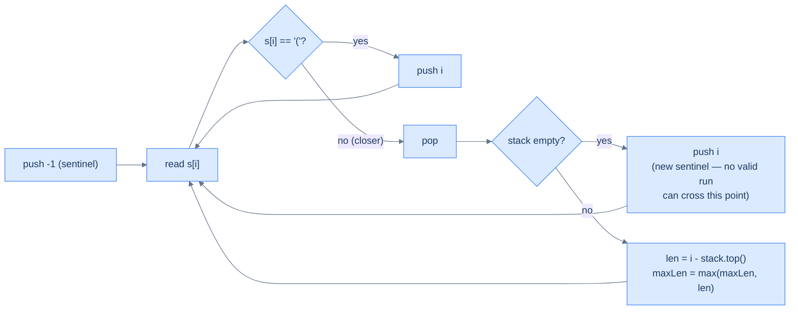

# Balanced span

## Problem Statement

Given a string `s` of `(` and `)`, return the length of the **longest valid (balanced) parentheses substring**.

## Examples

**Example 1**
```
Input:  s = "((()()"`
Output: 4
Explanation: the longest valid run is "()()" — positions 2..5. The two
leading '(' are never closed, so the run starts after them.
```

**Example 2**
```
Input:  s = "(()())(()"`
Output: 6
Explanation: "(()())" spans positions 0..5 — a fully balanced block.
The trailing "(()" is incomplete and cannot extend the answer.
```

**Example 3**
```
Input:  s = "(((("
Output: 0
Explanation: no closer ever arrives, so no valid substring exists.
```

**Example 4**
```
Input:  s = ")()("
Output: 2
Explanation: the leading ')' resets the sentinel; "()" at positions 1..2
is the longest valid run; the trailing '(' is unmatched.
```

```quiz
{
  "prompt": "Why does the stack store indices instead of characters?",
  "input": "s = \"(()\"",
  "options": [
    "Indices let you measure the span length with i − stack.top()",
    "Characters cannot be stored on a stack",
    "Indices are smaller than characters",
    "To avoid comparing ( and ) directly"
  ],
  "answer": "Indices let you measure the span length with i − stack.top()"
}
```

## Constraints

- `1 ≤ s.length ≤ 3 × 10⁴`
- `s` consists only of `(` and `)`

```python run
class Solution:
    def balanced_span(self, s: str) -> int:
        # Your code goes here — push indices on '('; on ')' pop, then if the
        # stack is empty push i as a new sentinel, otherwise measure the run
        # as i - stack[-1] and update the max.
        return 0

s = input()
print(Solution().balanced_span(s))
```

```java run
import java.util.*;

public class Main {
    static class Solution {
        public int balancedSpan(String s) {
            // Your code goes here — push indices on '('; on ')' pop, then if the
            // stack is empty push i as a new sentinel, otherwise measure the run
            // as i - stack.peek() and update the max.
            return 0;
        }
    }

    public static void main(String[] args) {
        String s = new Scanner(System.in).nextLine();
        System.out.println(new Solution().balancedSpan(s));
    }
}
```

```testcases
{
  "args": [
    { "id": "s", "label": "s", "type": "string", "placeholder": "((()(" }
  ],
  "cases": [
    { "args": { "s": "((()(" }, "expected": "2" },
    { "args": { "s": "((()()"},  "expected": "4" },
    { "args": { "s": "(()())(()"},  "expected": "6" },
    { "args": { "s": "((((" }, "expected": "0" },
    { "args": { "s": ")()(" }, "expected": "2" },
    { "args": { "s": "()()" }, "expected": "4" }
  ]
}
```

<details>
<summary><h2>Intuition</h2></summary>


This is a **sequence-validation** problem, but the answer is a *length*, not a yes/no — the longest contiguous run of correctly matched brackets. Validity is still decided by matching closers to the most recent openers; the new demand is measuring how far the current valid run stretches. That needs positions, so the stack stores **indices** rather than characters.

The stack holds the index of every unmatched `(`, plus a sentinel index at the bottom. The sentinel — pre-pushed as `-1` — marks "one position before the current valid run". The core trick: after popping on a `)`, the new top is the index just before the run that this closer extends, so `i − stack.top()` is the run's current length. When a `)` empties the stack, no valid run can cross that closer, so its own index becomes a fresh sentinel for everything after it.

The naive approach checks every substring for balance — `O(N³)` time across all start/end pairs with an `O(N)` validity test, or `O(N²)` with running counts. Both re-examine overlapping spans repeatedly. The index stack computes the longest valid length in one pass: each closer that matches immediately measures its run against the boundary on top, with no substring re-checking.

</details>
<details>
<summary><h2>Applying the Diagnostic Questions</h2></summary>


| Check | Answer for Balanced Span |
|---|---|
| **Q1.** Does the input pair up — openers matched by later closers? | **Yes** — each `)` matches the most recent unmatched `(`; only matched pairs extend a valid run. |
| **Q2.** Must a closer match the *most recent* unmatched opener? | **Yes** — order decides which `(` a `)` closes, and therefore where the current run begins. |
| **Q3.** Is one pass with `O(1)` work per token enough? | **Yes** — each index is pushed once and popped once; the span read is `O(1)`. |
| **Q4.** Is the answer decided by what the stack holds — here, boundary indices? | **Yes** — the top is "one before the current run", so `i − stack.top()` yields the length. |

</details>
<details>
<summary><h2>Approach</h2></summary>


Push indices, seed a sentinel, and measure each valid run against the boundary on top.

1. **Initialise the stack with a sentinel `-1`** and a `maxLength` of `0`. The sentinel marks the position before any run.
2. **Walk the string by index `i`**, classifying each character as `(` or `)`.
3. **`(` → push its index `i`.** It is an unmatched opener and a potential run boundary.
4. **`)` → pop.** This closer consumes the freshest unmatched opener (or the sentinel).
5. **If the stack is now empty, push `i` as a new sentinel.** No valid run can span this unmatched closer, so it becomes the new left boundary.
6. **Otherwise measure the run.** Set `maxLength = max(maxLength, i − stack.top())`, where the top is one index before the current valid run.
7. **After the pass, return `maxLength`** — the length of the longest valid substring.

The trick is to push **indices** (not characters), starting with a sentinel `-1` at the bottom. The top of the stack always represents *the index just before the current valid substring started*.



<p align="center"><strong>Balanced span — index stack with sentinel <code>-1</code>. The top is always "one before the current valid run". Pop on closer; if the stack drops to empty, the current index becomes the new sentinel (no run can cross an unmatched closer).</strong></p>

</details>
<details>
<summary><h2>Solution &amp; Analysis</h2></summary>

```python solution time=O(n) space=O(n)
from typing import List

class Solution:
    def balanced_span(self, s: str) -> int:
        stack = []
        max_length = 0

        # Push -1 to handle base case when there's no match
        stack.append(-1)

        for i in range(len(s)):

            # If the character is an opening bracket push its index
            # to the stack
            if s[i] == "(":

                # Push index of '('
                stack.append(i)

            # If the character is a closing bracket
            else:

                # Pop the last element
                stack.pop()

                # Push the current index if the stack is empty
                if not stack:
                    stack.append(i)

                # Otherwise, calculate the length of the valid substring
                else:
                    max_length = max(max_length, i - stack[-1])

        return max_length

s = input()
print(Solution().balanced_span(s))
```

```java solution
import java.util.*;

public class Main {
    static class Solution {
        public int balancedSpan(String s) {
            Stack<Integer> stack = new Stack<>();
            int maxLength = 0;

            // Push -1 to handle base case when there's no match
            stack.push(-1);

            for (int i = 0; i < s.length(); ++i) {

                // If the character is an opening bracket push the index
                // to the stack
                if (s.charAt(i) == '(') {

                    // Push index of '('
                    stack.push(i);
                }

                // If the character is a closing bracket
                else {

                    // Pop the last element
                    stack.pop();

                    // Push the current index if the stack is empty
                    if (stack.isEmpty()) {
                        stack.push(i);
                    }

                    // Otherwise, calculate the length of the valid substring
                    else {
                        maxLength = Math.max(maxLength, i - stack.peek());
                    }
                }
            }

            return maxLength;
        }
    }

    public static void main(String[] args) {
        String s = new Scanner(System.in).nextLine();
        System.out.println(new Solution().balancedSpan(s));
    }
}
```

### Dry Run — `s = "((()()"`

```
s = "((()()"`        stack=[-1]  max=0
     012345

i=0 '('  push 0          → stack: [-1, 0]
i=1 '('  push 1          → stack: [-1, 0, 1]
i=2 '('  push 2          → stack: [-1, 0, 1, 2]
i=3 ')'  pop 2           → stack: [-1, 0, 1]   len = 3 - 1 = 2   max=2
i=4 '('  push 4          → stack: [-1, 0, 1, 4]
i=5 ')'  pop 4           → stack: [-1, 0, 1]   len = 5 - 1 = 4   max=4

return max = 4 ✓
```

The two leading `(` at indices `0` and `1` are never closed, so they stay on the stack as the run boundary. The valid run `"()()"` spans indices `2..5`, measured as `5 − 1 = 4`.

### Complexity Analysis

| Measure | Value | Why |
|---|---|---|
| Time  | **O(N)** | One pass over `N` characters; each index is pushed once and popped at most once. |
| Space | **O(N)** | The stack holds the sentinel plus every unmatched opener index — up to `N + 1` for an all-opener string. |

### Edge Cases

| Case | Example | Expected | Reasoning |
|---|---|---|---|
| All openers | `s = "(((("` | `0` | No closer ever arrives, so no pair is matched. |
| All closers | `s = "))))"` | `0` | Each `)` empties the stack and re-seeds a sentinel; no run forms. |
| Leading closer | `s = ")()"` | `2` | The first `)` resets the sentinel; `"()"` at indices `1..2` gives length `2`. |
| Incomplete tail | `s = "(()"` | `2` | The inner `"()"` scores `2`; the outer `(` is never closed. |
| Adjacent runs | `s = "()()"` | `4` | Both pairs share the sentinel boundary, so the run measures across both as `4`. |

</details>
<details>
<summary><h2>Key Takeaway</h2></summary>


Storing *indices* with a sentinel `-1` turns validity into measurement: the top is always one position before the current valid run, so `i − stack.top()` reads off its length in `O(1)`. The new idea over the bracket checker is using the stack to compute a span, not just to confirm matching.

</details>
