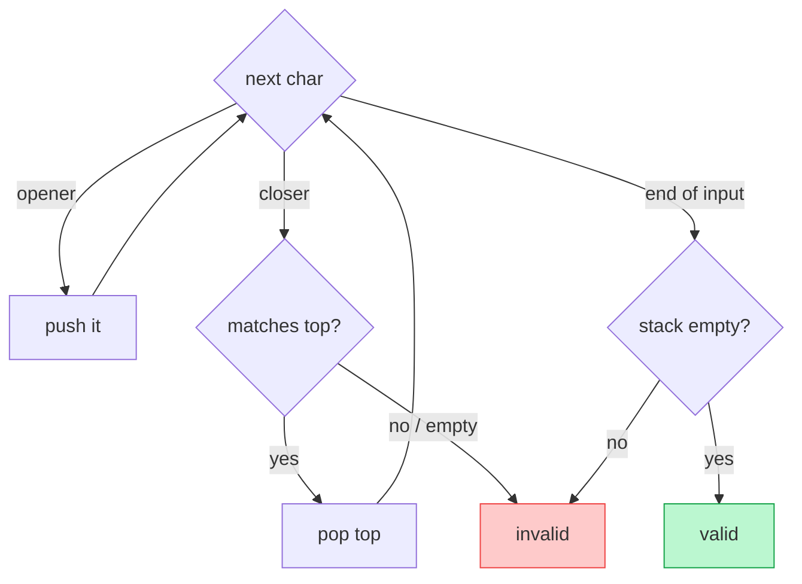

# Memorize: Sequence Validation

## In a Hurry?

- **One-Line Idea**: Push openers onto a stack; on each closer, match-and-pop the most recent opener; the sequence is valid only if the stack ends empty.
- **Complexities**: `O(N)` time, `O(N)` space worst case, where `N` is the number of tokens (an all-opener string pushes every token); `O(1)` time and space best case when a leading closer fails immediately.
- **When to Use**: The input is a *paired sequence with order constraints* — brackets, tags, start/end events — and a closer must match the freshest unmatched opener, not just any opener.

---

## One-Line Mnemonic

**"Push the openers, pop on a match, and the stack must end empty."**

The phrase encodes the whole pattern: a stack of unmatched openers newest-on-top, one match-and-pop per closer, and the final emptiness check that catches leftover openers.

---

## Real-World Analogy

Picture a stack of unpaid restaurant bills on a spike. Each time a table opens a tab, you spear its bill on top; each time a table pays, only the topmost bill can be settled and pulled off. If a payment arrives for a table whose bill is not on top — or for a table with no bill at all — something is wrong with the order of events. At closing time, the spike must be empty: any bill still speared means a tab nobody paid. A stack-based validator works the same way, with openers as unpaid bills and closers as payments that must clear the most recent tab first.

---

## Visual Summary



<p align="center"><strong>A stack matches nested open/close structure: push each opener, and on a closer check it pairs with the top. Valid only if every closer matches and the stack ends empty — O(n).</strong></p>

---

## Pattern Recognition Triggers

The pattern fits when **all four** answers are "yes" — the same diagnostic that gates each problem in the section.

- The input is a **paired sequence** — openers that must be matched by later closers (brackets, tags, start/end events).
- A closer must match the **most recent unmatched opener**, so order matters and a plain count is not enough (`"([)]"` balances by count yet is invalid).
- **One left-to-right pass** with `O(1)` work per token suffices — a single push, peek, or pop, no re-scanning of earlier tokens.
- The answer — validity, an edit count, or a span length — is read off **what the stack holds** and **whether it ends empty**.

Common surface signals: "is this bracket expression valid," "minimum insertions/deletions to balance," "are these tags well-nested," "longest valid parentheses substring," or any "valid push/pop sequence" check.

---

## Don't Confuse With

The sequence-validation stack and the **monotonic stack** (previous/next closest occurrence) both push and pop on a single stack — but they pop on completely different triggers and read different things.

| | **Sequence Validation (this pattern)** | **Monotonic Stack** |
|---|---|---|
| **Problem shape** | "Is this paired sequence well-formed?" — validity, edit count, or span is the answer | "For each element, find the nearest greater/smaller neighbour" — the per-element survivor is the answer |
| **What the stack holds** | The **unmatched openers** seen so far, newest on top | A **monotone chain** of un-disqualified candidates |
| **Pop rule** | Pop on a **closer that matches the top**; one pop discharges one pair | **Pop while** the top loses a monotone comparison to the current value |
| **What you read** | Whether the stack **ends empty** (plus what sat between a matched pair) | The **stack top at each step** — the nearest qualifying neighbour |
| **Complexity** | `O(N)` time, `O(N)` space worst case | `O(N)` time, `O(N)` space (each item pushed and popped at most once) |
| **When this goes wrong** | You compared element *values* to decide a pop, or skipped the final emptiness check — you have written a monotonic stack or accepted a string with leftover openers. | You matched tokens by *type* and demanded an empty stack at the end — you have written a validator; the monotonic stack never cares whether it ends empty. |

The split is the pop trigger: sequence validation pops on a *type match between a closer and the top*; the monotonic stack pops on a *value comparison*. Match-and-pop-then-check-empty means validation; pop-while-comparison-then-read-top means monotonic stack.

---

## Template Code

```python
# Sequence-validation pattern — the matching register.
# The stack holds unmatched openers, newest on top.
# Specialise three things per problem: what an opener is,
# what "match" means, and what you return instead of a bool.
from typing import List


def is_valid(s: str) -> bool:
    pairs = {")": "(", "]": "[", "}": "{"}   # closer → its opener
    stack: List[str] = []                    # unmatched openers

    for ch in s:
        if ch in "([{":                      # opener → push the promise
            stack.append(ch)
        else:                                # closer → redeem the freshest
            if not stack or stack[-1] != pairs[ch]:
                return False                 # empty, or wrong type on top
            stack.pop()                      # matched pair discharged

    return not stack                         # leftover openers → invalid
```

The three knobs are the opener test (`ch in "([{"`), the match test (`stack[-1] != pairs[ch]`), and the return. Swap the return for a *count* of unmatched items (minimum edits), a *redundancy flag* read off the content between a pair, or a *span length* measured from stored indices. The push-openers / match-closers / check-empty body never changes.

---

## Common Mistakes

- **Counting brackets instead of stacking them**:
  - *What*: deciding validity by comparing the number of openers to the number of closers, or tracking a single running depth.
  - *Why*: a count has no memory of *which* opener is unmatched, so it accepts order-violating strings — `"([)]"` balances by count yet is invalid.
  - *Fix*: push openers onto a stack and match each closer against the top; the stack remembers types and order, a counter does not.
- **Skipping the final empty-stack check**:
  - *What*: returning `true` as soon as the scan finishes without a mismatch.
  - *Why*: a string like `"((("` never triggers a mismatch but leaves openers unmatched on the stack — it is invalid.
  - *Fix*: return `stack.empty()` at the end, not `true`; a non-empty stack means leftover openers.
- **Popping without checking the top type**:
  - *What*: popping on any closer regardless of whether the top is the *matching* opener.
  - *Why*: this accepts cross-matched strings like `"([)]"`, where `)` pops an `[` it should never match.
  - *Fix*: compare the closer to the top's expected partner *before* popping; fail when they differ.
- **Closing against an empty stack**:
  - *What*: calling `peek` or `pop` on a closer when the stack is empty.
  - *Why*: a leading or surplus closer (`")"`) has no opener to match and crashes or misreads if you skip the empty check.
  - *Fix*: test `stack` is non-empty before reading the top; an empty stack on a closer is an immediate failure.
- **Storing characters when the problem needs positions**:
  - *What*: pushing bracket characters when the question asks for a *length* or *distance* (longest valid span).
  - *Why*: characters cannot measure how far a valid run stretches; you lose the position information.
  - *Fix*: push *indices* with a sentinel `-1` at the bottom, so `i − stack.top()` reads off the current run length.

---

## Minimum Viable Example

Validate `s = "(())"` with the matching register:

```
push '(', push '('   →  stack (bottom→top): ( (
')' matches top '('  →  pop  →  stack: (
')' matches top '('  →  pop  →  stack: (empty)
end of input, stack empty  →  valid (true)
```

Two openers stack up, two closers each match the freshest opener top-down, and the empty stack confirms validity.

---

## Quick Recall

**Q: What does the stack hold during a sequence-validation scan?**
A: The openers seen so far that have not yet been matched, with the most recent on top.

**Q: Why is counting openers and closers not enough?**
A: A count ignores order, so it accepts cross-matched strings like `"([)]"` that balance numerically but nest illegally.

**Q: What two checks catch every invalid string?**
A: A closer that finds an empty stack or a mismatched top fails mid-scan, and a non-empty stack at end-of-input means leftover openers.

**Q: What is the time and space complexity?**
A: `O(N)` time and `O(N)` space in the worst case (all openers); `O(1)` time and space in the best case when a leading closer fails immediately.

**Q: How do you adapt the pattern to measure the longest valid span?**
A: Push *indices* with a sentinel `-1`, and read each run length as `i − stack.top()` after popping on a closer.

**Q: How do you tell sequence validation apart from a monotonic stack?**
A: Sequence validation pops on a type match between a closer and the top, then checks the stack is empty; a monotonic stack pops on a value comparison and reads the surviving top.
