# Canonicalise path

## Problem Statement

Given an absolute UNIX-style path string, return its canonical form.

> -   `.` (dot) → current directory, ignored.
> -   `..` (double-dot) → parent directory, removes the last directory.
> -   `//` (multiple slashes) → treated as a single slash.
> -   Anything else is a directory name.

The output must:
- Begin with exactly one `/`.
- Have single-slash separators.
- Have no trailing slash (except for the root `/`).
- Have no `.` or `..`.

### Example 1
> -   **Input:** `/a/b/../c` → **Output:** `/a/c`

### Example 2
> -   **Input:** `/a/./../c` → **Output:** `/c`

### Example 3
> -   **Input:** `/a//b/c/../` → **Output:** `/a/b`

## Examples

**Example 1**
```
Input:  /a/b/../c
Output: /a/c
Explanation: push 'a', push 'b', then '..' pops 'b' (move up), push 'c'.
The stack holds [a, c], joined as "/a/c".
```

**Example 2**
```
Input:  /a/./../c
Output: /c
Explanation: push 'a', skip '.', then '..' pops 'a', push 'c'.
The stack holds [c], joined as "/c".
```

**Example 3**
```
Input:  /a//b/c/../
Output: /a/b
Explanation: the empty segment from '//' is skipped; push a, b, c,
then the trailing '..' pops 'c'. The stack holds [a, b] → "/a/b".
```

**Example 4**
```
Input:  /..
Output: /
Explanation: '..' on an empty stack does nothing — you cannot rise
above root. The stack stays empty, so the result is "/".
```


<details>
<summary><h2>Intuition</h2></summary>


This is a **linear-evaluation** problem because the path is a single sequence of segments you scan once, and a `..` token folds the work built so far by one level. Split on `/` and each segment is a token whose meaning is local: a name is data, `..` is a trigger, and `.` or an empty segment is noise. The stack lets each `..` undo exactly the most recent directory in `O(1)`.

The stack holds **the directory chain accumulated so far**, with the most recent directory on top. A name is pushed because it deepens the path; `..` pops because it rises one level, and the directory it cancels is always the freshest one on top. Empty segments — produced by leading, trailing, or doubled slashes — and `.` carry no directory, so they are skipped without touching the stack. At end-of-input the stack *is* the canonical directory list, bottom-to-top.

A naive approach rewrites the string in place — find a `/../`, splice it out, rescan — which re-reads resolved segments and costs `O(N²)` time. It also fumbles the corner cases: a `..` at the root must be a no-op, and runs of `//` must collapse. The stack handles both for free: popping an empty stack does nothing, and empty segments never get pushed. One pass replaces the repeated splicing.

</details>
<details>
<summary><h2>Applying the Diagnostic Questions</h2></summary>


| Check | Answer for Canonicalise Path |
|---|---|
| **Q1.** Is the input a single linear sequence scanned once? | **Yes** — split on `/` and walk the segments left to right in one pass. |
| **Q2.** Does some token defer work — open a group awaiting a closer? | **Partly** — there is no nesting, but `..` defers to whatever directory is currently on top, the one-level case of the fold. |
| **Q3.** Does a trigger fold only the *most recent* pending chunk? | **Yes** — `..` pops exactly the top directory, never one buried deeper. |
| **Q4.** Is the answer read off the stack at end-of-input? | **Yes** — the surviving directory names, joined with `/`, are the canonical path. |

</details>
<details>
<summary><h2>Approach in Words</h2></summary>


Split on `/`, push names, and let `..` pop the top directory.

1. **Initialise an empty stack** of directory-name strings.
2. **Split the path on `/`** and scan the segments left to right.
3. **Skip noise.** An empty segment (from `//`, or a leading/trailing slash) or `.` carries no directory — ignore it.
4. **Name → push.** Any segment that is not `.` or `..` is a directory name; push it onto the stack.
5. **`..` → pop if possible.** Rise one level by popping the top directory; if the stack is already empty, do nothing — you cannot go above root.
6. **After the pass, build the result.** Return `/` if the stack is empty, otherwise `/` followed by the stack joined with `/`.

</details>
<details>
<summary><h2>Approach</h2></summary>


Split on `/`. Each non-empty token is one of three things:

- `.` → ignore.
- `..` → pop the stack (move up one directory). If empty, do nothing (already at root).
- anything else → push as a directory name.

Final path = `/` + `'/'.join(stack)` (or just `/` if empty).

```mermaid
---
config:
  theme: base
  themeVariables:
    primaryColor: "#dbeafe"
    primaryBorderColor: "#3b82f6"
    primaryTextColor: "#1e3a5f"
    lineColor: "#64748b"
    secondaryColor: "#ede9fe"
    tertiaryColor: "#fef9c3"
---
flowchart LR
    A["/a/b/../c"] -->|"split"| B["[a, b, .., c]"]
    B --> C["scan tokens"]
    C --> S1["push 'a' → [a]"]
    S1 --> S2["push 'b' → [a, b]"]
    S2 --> S3["'..' → pop → [a]"]
    S3 --> S4["push 'c' → [a, c]"]
    S4 --> R["join → '/a/c'"]
    style R fill:#dcfce7,stroke:#22c55e
```



<p align="center"><strong>Canonicalise path — each token decides its action: push, pop, or skip. The final stack <em>is</em> the path's directory list, joined with slashes.</strong></p>

</details>
<details>
<summary><h2>Solution</h2></summary>


```python run viz=array viz-root=stack viz-kind=stack
from typing import List

class Solution:
    def canonicalise_path(self, path: str) -> str:

        # Stack to store valid directory names
        stack: List[str] = []

        # Split the path by '/' and iterate over components
        for token in path.split("/"):

            # Skip empty or current directory ('.') components
            if token == "" or token == ".":
                continue

            # Push the valid directory name onto the stack
            elif token != "..":
                stack.append(token)

            # Go up one directory if the current directory is '..' and
            # the stack is not empty
            elif stack:
                stack.pop()

        # If the stack is empty, return "/"
        if not stack:
            return "/"

        # Construct the simplified path by joining stack elements
        return "/" + "/".join(stack)


# Examples from the problem statement
print(Solution().canonicalise_path("/a/b/../c"))    # /a/c
print(Solution().canonicalise_path("/a/./../c"))    # /c
print(Solution().canonicalise_path("/a//b/c/../"))  # /a/b

# Edge cases
print(Solution().canonicalise_path("/"))            # /
print(Solution().canonicalise_path("/.."))          # / — can't go above root
print(Solution().canonicalise_path("/."))           # /
print(Solution().canonicalise_path("/a/b/c"))       # /a/b/c
print(Solution().canonicalise_path("/a/../../b"))   # /b
print(Solution().canonicalise_path("//home//foo/")) # /home/foo
```

```java run viz=array viz-root=stack viz-kind=stack
import java.util.*;

public class Main {
    static class Solution {
        public String canonicalisePath(String path) {

            // Stack to store valid directory names
            Stack<String> stack = new Stack<>();

            // Split the path by '/' and iterate over components
            for (String token : path.split("/")) {

                // Skip empty or current directory ('.') components
                if (token.equals("") || token.equals(".")) {
                    continue;
                }

                // Push the valid directory name onto the stack
                else if (!token.equals("..")) {
                    stack.push(token);
                }

                // Go up one directory if the current directory is '..' and
                // the stack is not empty
                else if (!stack.isEmpty()) {
                    stack.pop();
                }
            }

            // If the stack is empty, return "/"
            if (stack.isEmpty()) {
                return "/";
            }

            // Construct the simplified path by popping the stack
            StringBuilder result = new StringBuilder();
            for (String dir : stack) {
                result.append("/").append(dir);
            }

            return result.toString();
        }
    }

    public static void main(String[] args) {
        // Examples from the problem statement
        System.out.println(new Solution().canonicalisePath("/a/b/../c"));    // /a/c
        System.out.println(new Solution().canonicalisePath("/a/./../c"));    // /c
        System.out.println(new Solution().canonicalisePath("/a//b/c/../"));  // /a/b

        // Edge cases
        System.out.println(new Solution().canonicalisePath("/"));            // /
        System.out.println(new Solution().canonicalisePath("/.."));          // /
        System.out.println(new Solution().canonicalisePath("/."));           // /
        System.out.println(new Solution().canonicalisePath("/a/b/c"));       // /a/b/c
        System.out.println(new Solution().canonicalisePath("/a/../../b"));   // /b
        System.out.println(new Solution().canonicalisePath("//home//foo/")); // /home/foo
    }
}
```

</details>
<details>
<summary><h2>Dry Run</h2></summary>


Walk Example 1 — `path = "/a/b/../c"`. Split on `/` gives the segments `['', 'a', 'b', '..', 'c']`. The stack holds the directory chain; push names, pop on `..`, skip noise:

```
path = "/a/b/../c"   →  split  →  ['', 'a', 'b', '..', 'c']

''   empty   → skip          → stack (bottom→top): (empty)
'a'  name    → push          → stack: a
'b'  name    → push          → stack: a b
'..' trigger → pop 'b'       → stack: a
'c'  name    → push          → stack: a c

end of input → "/" + "/".join([a, c]) → "/a/c" ✓
```

A trace on `path = "/a/../../b"` shows the root guard — a `..` on an empty stack is ignored:

```
'a'  push          → stack: a
'..' pop 'a'       → stack: (empty)
'..' stack empty   → no-op  → stack: (empty)
'b'  push          → stack: b

end of input → "/b" ✓
```

</details>
<details>
<summary><h2>Complexity Analysis</h2></summary>


| Measure | Value | Why |
|---|---|---|
| Time  | **O(N)** | One pass over the `N` characters: splitting is `O(N)`, and each segment drives one `O(1)` push or pop. |
| Space | **O(N)** worst, **O(1)** best | A path of all names (`/a/b/c/...`) pushes every segment; a path that cancels everything (`/a/../b/..`) keeps the stack near empty. |

The time is `O(N)` where `N` is the path length: the split scans the string once, and the segment loop does `O(1)` work per token. The space is `O(N)` in the worst case — a path with no `..`, like `/a/b/c`, pushes every directory and the stack grows with the input. The best case is `O(1)` space when `..` tokens cancel directories as fast as they are pushed, keeping the stack shallow.

</details>
<details>
<summary><h2>Edge Cases</h2></summary>


| Case | Example | Expected | Reasoning |
|---|---|---|---|
| Root only | `/` | `/` | Splitting yields only empty segments; the stack stays empty, so the result is `/`. |
| `..` above root | `/..` | `/` | `..` pops an empty stack as a no-op; you cannot rise above root. |
| Single `.` | `/.` | `/` | `.` is the current directory — skipped, leaving the stack empty. |
| No special tokens | `/a/b/c` | `/a/b/c` | Every segment is a name; all three push and none pop. |
| Multiple `..` past root | `/a/../../b` | `/b` | `a` is popped, the second `..` no-ops on the empty stack, then `b` is pushed. |
| Doubled and trailing slashes | `//home//foo/` | `/home/foo` | The empty segments from `//` and the trailing `/` are skipped; only `home` and `foo` push. |

</details>
<details>
<summary><h2>Key Takeaway</h2></summary>


Split the path into segments and let a stack of directory names absorb each token — push a name, pop on `..`, skip `.` and empties. The new idea over the generic pattern is the *guarded fold*: popping an empty stack is a deliberate no-op, which is how the root boundary is enforced without a special case.

</details>