# Canonicalise path

## Problem Statement

Given an absolute UNIX-style path string, return its canonical form.

> -   `.` (dot) → current directory, ignored.
> -   `..` (double-dot) → parent directory, removes the last directory.
> -   `//` (multiple slashes) → treated as a single slash.
> -   Anything else is a directory name.

The output must:
- Begin with exactly one `/`.
- Have single-slash separators.
- Have no trailing slash (except for the root `/`).
- Have no `.` or `..`.

### Example 1
> -   **Input:** `/a/b/../c` → **Output:** `/a/c`

### Example 2
> -   **Input:** `/a/./../c` → **Output:** `/c`

### Example 3
> -   **Input:** `/a//b/c/../` → **Output:** `/a/b`

## Examples

**Example 1**
```
Input:  /a/b/../c
Output: /a/c
Explanation: push 'a', push 'b', then '..' pops 'b' (move up), push 'c'.
The stack holds [a, c], joined as "/a/c".
```

**Example 2**
```
Input:  /a/./../c
Output: /c
Explanation: push 'a', skip '.', then '..' pops 'a', push 'c'.
The stack holds [c], joined as "/c".
```

**Example 3**
```
Input:  /a//b/c/../
Output: /a/b
Explanation: the empty segment from '//' is skipped; push a, b, c,
then the trailing '..' pops 'c'. The stack holds [a, b] → "/a/b".
```

**Example 4**
```
Input:  /..
Output: /
Explanation: '..' on an empty stack does nothing — you cannot rise
above root. The stack stays empty, so the result is "/".
```

```quiz
{
  "prompt": "What does the stack hold at the end of processing \"/a/b/../c\"?",
  "input": "path = \"/a/b/../c\"",
  "options": ["[\"a\", \"b\", \"c\"]", "[\"a\", \"c\"]", "[\"c\"]", "[\"a\", \"b\"]"],
  "answer": "[\"a\", \"c\"]"
}
```

## Constraints

- The path is a non-empty absolute path (starts with `/`)
- `1 ≤ path.length ≤ 3000`
- `path` consists of English letters, digits, `/`, `.`, and `_`

```python run
class Solution:
    def canonicalise_path(self, path: str) -> str:
        # Your code goes here — split on "/", push names, pop on "..",
        # skip "." and empty segments, join with "/" at the end.
        return path

path = input()
print(Solution().canonicalise_path(path))
```

```java run
import java.util.*;
public class Main {
    static class Solution {
        public String canonicalisePath(String path) {
            // Your code goes here — split on "/", push names, pop on "..",
            // skip "." and empty segments, join with "/" at the end.
            return path;
        }
    }
    public static void main(String[] args) {
        String path = new Scanner(System.in).nextLine();
        System.out.println(new Solution().canonicalisePath(path));
    }
}
```

```testcases
{
  "args": [
    { "id": "path", "label": "path", "type": "string", "placeholder": "/a/b/../c" }
  ],
  "cases": [
    { "args": { "path": "/a/b/../c" }, "expected": "/a/c" },
    { "args": { "path": "/a/./../c" }, "expected": "/c" },
    { "args": { "path": "/a//b/c/../" }, "expected": "/a/b" },
    { "args": { "path": "/.." }, "expected": "/" },
    { "args": { "path": "/a/b/c" }, "expected": "/a/b/c" },
    { "args": { "path": "/a/../../b" }, "expected": "/b" },
    { "args": { "path": "//home//foo/" }, "expected": "/home/foo" }
  ]
}
```

<details>
<summary><h2>Intuition</h2></summary>


This is a **linear-evaluation** problem because the path is a single sequence of segments you scan once, and a `..` token folds the work built so far by one level. Split on `/` and each segment is a token whose meaning is local: a name is data, `..` is a trigger, and `.` or an empty segment is noise. The stack lets each `..` undo exactly the most recent directory in `O(1)`.

The stack holds **the directory chain accumulated so far**, with the most recent directory on top. A name is pushed because it deepens the path; `..` pops because it rises one level, and the directory it cancels is always the freshest one on top. Empty segments — produced by leading, trailing, or doubled slashes — and `.` carry no directory, so they are skipped without touching the stack. At end-of-input the stack *is* the canonical directory list, bottom-to-top.

A naive approach rewrites the string in place — find a `/../`, splice it out, rescan — which re-reads resolved segments and costs `O(N²)` time. It also fumbles the corner cases: a `..` at the root must be a no-op, and runs of `//` must collapse. The stack handles both for free: popping an empty stack does nothing, and empty segments never get pushed. One pass replaces the repeated splicing.

</details>
<details>
<summary><h2>Applying the Diagnostic Questions</h2></summary>


| Check | Answer for Canonicalise Path |
|---|---|
| **Q1.** Is the input a single linear sequence scanned once? | **Yes** — split on `/` and walk the segments left to right in one pass. |
| **Q2.** Does some token defer work — open a group awaiting a closer? | **Partly** — there is no nesting, but `..` defers to whatever directory is currently on top, the one-level case of the fold. |
| **Q3.** Does a trigger fold only the *most recent* pending chunk? | **Yes** — `..` pops exactly the top directory, never one buried deeper. |
| **Q4.** Is the answer read off the stack at end-of-input? | **Yes** — the surviving directory names, joined with `/`, are the canonical path. |

</details>
<details>
<summary><h2>Approach in Words</h2></summary>


Split on `/`, push names, and let `..` pop the top directory.

1. **Initialise an empty stack** of directory-name strings.
2. **Split the path on `/`** and scan the segments left to right.
3. **Skip noise.** An empty segment (from `//`, or a leading/trailing slash) or `.` carries no directory — ignore it.
4. **Name → push.** Any segment that is not `.` or `..` is a directory name; push it onto the stack.
5. **`..` → pop if possible.** Rise one level by popping the top directory; if the stack is already empty, do nothing — you cannot go above root.
6. **After the pass, build the result.** Return `/` if the stack is empty, otherwise `/` followed by the stack joined with `/`.

</details>
<details>
<summary><h2>Approach</h2></summary>


Split on `/`. Each non-empty token is one of three things:

- `.` → ignore.
- `..` → pop the stack (move up one directory). If empty, do nothing (already at root).
- anything else → push as a directory name.

Final path = `/` + `'/'.join(stack)` (or just `/` if empty).

```mermaid
---
config:
  theme: base
  themeVariables:
    primaryColor: "#dbeafe"
    primaryBorderColor: "#3b82f6"
    primaryTextColor: "#1e3a5f"
    lineColor: "#64748b"
    secondaryColor: "#ede9fe"
    tertiaryColor: "#fef9c3"
---
flowchart LR
    A["/a/b/../c"] -->|"split"| B["[a, b, .., c]"]
    B --> C["scan tokens"]
    C --> S1["push 'a' → [a]"]
    S1 --> S2["push 'b' → [a, b]"]
    S2 --> S3["'..' → pop → [a]"]
    S3 --> S4["push 'c' → [a, c]"]
    S4 --> R["join → '/a/c'"]
    style R fill:#dcfce7,stroke:#22c55e
```



<p align="center"><strong>Canonicalise path — each token decides its action: push, pop, or skip. The final stack <em>is</em> the path's directory list, joined with slashes.</strong></p>

</details>
<details>
<summary><h2>Solution &amp; Analysis</h2></summary>

```python solution time=O(N) space=O(N)
class Solution:
    def canonicalise_path(self, path: str) -> str:
        stack = []
        for token in path.split("/"):
            if token == "" or token == ".":
                continue
            elif token != "..":
                stack.append(token)
            elif stack:
                stack.pop()
        if not stack:
            return "/"
        return "/" + "/".join(stack)

path = input()
print(Solution().canonicalise_path(path))
```

```java solution
import java.util.*;
public class Main {
    static class Solution {
        public String canonicalisePath(String path) {
            Stack<String> stack = new Stack<>();
            for (String token : path.split("/")) {
                if (token.equals("") || token.equals(".")) {
                    continue;
                } else if (!token.equals("..")) {
                    stack.push(token);
                } else if (!stack.isEmpty()) {
                    stack.pop();
                }
            }
            if (stack.isEmpty()) {
                return "/";
            }
            StringBuilder result = new StringBuilder();
            for (String dir : stack) {
                result.append("/").append(dir);
            }
            return result.toString();
        }
    }
    public static void main(String[] args) {
        String path = new Scanner(System.in).nextLine();
        System.out.println(new Solution().canonicalisePath(path));
    }
}
```

**Dry Run — `path = "/a/b/../c"`**

Split on `/` gives `['', 'a', 'b', '..', 'c']`:

```
''   empty   → skip          → stack: (empty)
'a'  name    → push          → stack: a
'b'  name    → push          → stack: a b
'..' trigger → pop 'b'       → stack: a
'c'  name    → push          → stack: a c

end of input → "/" + "/".join([a, c]) → "/a/c" ✓
```

**Complexity**

| Measure | Value | Why |
|---|---|---|
| Time  | **O(N)** | One pass over the `N` characters: splitting is `O(N)`, each segment drives one `O(1)` push or pop. |
| Space | **O(N)** worst | A path of all names pushes every segment. |

**Edge Cases**

| Case | Example | Expected | Reasoning |
|---|---|---|---|
| Root only | `/` | `/` | Only empty segments; stack stays empty → `/`. |
| `..` above root | `/..` | `/` | `..` pops an empty stack as a no-op. |
| Single `.` | `/.` | `/` | `.` is skipped, stack stays empty. |
| No special tokens | `/a/b/c` | `/a/b/c` | All three push, none pop. |
| Multiple `..` past root | `/a/../../b` | `/b` | `a` is popped, second `..` no-ops, `b` pushes. |
| Doubled slashes | `//home//foo/` | `/home/foo` | Empty segments skipped. |

</details>
<details>
<summary><h2>Key Takeaway</h2></summary>


Split the path into segments and let a stack of directory names absorb each token — push a name, pop on `..`, skip `.` and empties. The new idea over the generic pattern is the *guarded fold*: popping an empty stack is a deliberate no-op, which is how the root boundary is enforced without a special case.

</details>
