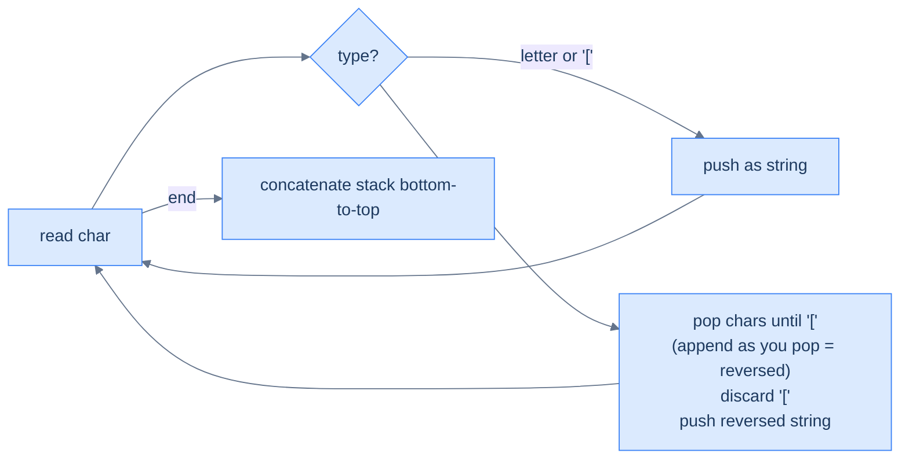

# Bracketed Reversal

## Problem Statement

Given a string of letters and `[`/`]` brackets, **reverse the substring inside each pair of brackets** and return the result. Brackets nest.

### Example 1
> -   **Input:** `s = "a[bcd]e"` → **Output:** `"adcbe"`

### Example 2
> -   **Input:** `s = "abcd[ef[gh]i]j"` → **Output:** `"abcdihgfej"`

### Example 3
> -   **Input:** `s = "abcdefghij"` → **Output:** `"abcdefghij"`

## Examples

**Example 1**
```
Input:  s = "a[bcd]e"
Output: "adcbe"
Explanation: 'a' stays. Inside the brackets, "bcd" reverses to "dcb".
'e' stays. Result: a + dcb + e = "adcbe".
```

**Example 2**
```
Input:  s = "abcd[ef[gh]i]j"
Output: "abcdihgfej"
Explanation: the inner "[gh]" reverses to "hg" first, giving "ef" + "hg"
+ "i" = "efhgi" inside the outer brackets, which reverses to "ighfe".
With "abcd" before and "j" after: "abcd" + "ighfe" + "j".
```

**Example 3**
```
Input:  s = "abcdefghij"
Output: "abcdefghij"
Explanation: no brackets, so nothing reverses. Every letter is pushed
and the stack joins back to the original string.
```

**Example 4**
```
Input:  s = "[[ab]]"
Output: "ba"
Explanation: the inner "[ab]" pops 'b' then 'a' (append-while-popping
builds "ba"), giving the token "ba". The outer ']' then pops "ba" as one
string token, building "ba" as a single unit. Net result: "ba".
```

```quiz
{
  "prompt": "What does ']' do in the bracketed-reversal stack algorithm?",
  "input": "stack so far: [ b c d",
  "options": [
    "Pushes ']' onto the stack",
    "Pops characters until '[', appending as it pops, then pushes the reversed substring",
    "Pops all characters and reverses the whole string",
    "Discards everything up to '[' without building a result"
  ],
  "answer": "Pops characters until '[', appending as it pops, then pushes the reversed substring"
}
```

## Constraints

- `1 ≤ s.length ≤ 3000`
- `s` consists of lowercase English letters and `[`/`]`
- Brackets are balanced and properly nested

```python run
class Solution:
    def bracketed_reversal(self, s: str) -> str:
        # Your code goes here — push letters and '['; on ']', pop-while-
        # appending (builds reversed substring), discard '[', push it back.
        return s

s = input()
print(Solution().bracketed_reversal(s))
```

```java run
import java.util.*;
public class Main {
    static class Solution {
        public String bracketedReversal(String s) {
            // Your code goes here — push letters and '['; on ']', pop-while-
            // appending (builds reversed substring), discard '[', push it back.
            return s;
        }
    }
    public static void main(String[] args) {
        String s = new Scanner(System.in).nextLine();
        System.out.println(new Solution().bracketedReversal(s));
    }
}
```

```testcases
{
  "args": [
    { "id": "s", "label": "s", "type": "string", "placeholder": "a[bcd]e" }
  ],
  "cases": [
    { "args": { "s": "a[bcd]e" }, "expected": "adcbe" },
    { "args": { "s": "abcd[ef[gh]i]j" }, "expected": "abcdihgfej" },
    { "args": { "s": "abcdefghij" }, "expected": "abcdefghij" },
    { "args": { "s": "[a]" }, "expected": "a" },
    { "args": { "s": "[ab]" }, "expected": "ba" },
    { "args": { "s": "[[ab]]" }, "expected": "ba" },
    { "args": { "s": "x[y[z]]" }, "expected": "xzy" }
  ]
}
```

<details>
<summary><h2>Intuition</h2></summary>


This is a **linear-evaluation** problem because the string is scanned once and each `]` folds the substring built since its matching `[`. Brackets nest, so an inner group must be fully reversed before the outer group sees it — the classic "evaluate the freshest pending chunk first" shape. The stack parks each outer context while the inner group resolves.

The stack holds **the characters and `[` markers not yet folded**, with the freshest on top. A letter or `[` is pushed as it arrives. When `]` fires, the run back to the nearest `[` is exactly the substring to reverse, and it sits right on top. The trick is in *how* you pop it: appending characters in pop order builds the reversed string for free, because the stack returns them last-in-first-out — the character pushed last comes out first and lands at the front of the reversed result.

A naive approach scans for each `[...]` pair, reverses it in place, and rescans for nested brackets — re-reading inner groups on every outer pass, which costs `O(N²)` time. The stack avoids that: an inner `]` folds and pushes its reversed string back as one token, so the outer `]` reverses across that already-reversed unit without re-reading its characters. One pass replaces the repeated rescans.

</details>
<details>
<summary><h2>Applying the Diagnostic Questions</h2></summary>


| Check | Answer for Bracketed Reversal |
|---|---|
| **Q1.** Is the input a single linear sequence scanned once? | **Yes** — one left-to-right walk over the characters of `s`. |
| **Q2.** Does some token defer work — open a group awaiting a closer? | **Yes** — every `[` opens a substring whose reversal waits until its matching `]`. |
| **Q3.** Does a trigger fold only the *most recent* pending chunk? | **Yes** — `]` reverses the run back to the nearest `[`, which is always on top. |
| **Q4.** Is the answer read off the stack at end-of-input? | **Yes** — the surviving tokens, concatenated bottom-to-top, are the result. |

</details>
<details>
<summary><h2>Approach in Words</h2></summary>


Push letters and `[`; on `]`, pop-while-appending to reverse the inner substring, then push it back.

1. **Initialise an empty stack** holding characters and reversed-substring tokens.
2. **Walk the string left to right.**
3. **Letter or `[` → push.** Both go on the stack as pending context.
4. **`]` → fold.** Pop characters into a result string *as you pop them* — pop order is reverse order, so this builds the reversed substring directly.
5. **Discard the matching `[`.** Pop it off and throw it away; it was only a marker.
6. **Push the reversed substring back** as a single token, so the next `]` can reverse across it.
7. **After the pass, concatenate the stack** bottom-to-top and return it.

</details>
<details>
<summary><h2>Approach</h2></summary>


Push characters and `[` onto a stack. On `]`, pop characters until you hit `[` — but **append them as you pop**, which builds the reversed substring naturally. Pop the `[`, push the reversed substring back as a single string token. Final answer = concatenate the stack bottom-to-top.



<p align="center"><strong>Bracketed reversal — popping while appending naturally builds the reversed substring (the topmost char comes out first and goes to the front of the result).</strong></p>

</details>
<details>
<summary><h2>Solution &amp; Analysis</h2></summary>

```python solution time=O(N) space=O(N)
class Solution:
    def bracketed_reversal(self, s: str) -> str:
        stack = []
        i = 0
        while i < len(s):
            if s[i] == "[" or s[i].isalpha():
                stack.append(s[i])
            else:
                reversed_str = ""
                while stack and stack[-1] != "[":
                    reversed_str += stack.pop()
                if stack:
                    stack.pop()
                stack.append(reversed_str)
            i += 1
        return "".join(stack)

s = input()
print(Solution().bracketed_reversal(s))
```

```java solution
import java.util.*;
public class Main {
    static class Solution {
        public String bracketedReversal(String s) {
            Stack<String> stack = new Stack<>();
            for (int i = 0; i < s.length(); i++) {
                if (s.charAt(i) == '[' || Character.isLetter(s.charAt(i))) {
                    stack.push(String.valueOf(s.charAt(i)));
                } else {
                    StringBuilder reversedStr = new StringBuilder();
                    while (!stack.isEmpty() && !stack.peek().equals("[")) {
                        reversedStr.append(stack.pop());
                    }
                    if (!stack.isEmpty()) {
                        stack.pop();
                    }
                    stack.push(reversedStr.toString());
                }
            }
            StringBuilder result = new StringBuilder();
            while (!stack.isEmpty()) {
                result.insert(0, stack.pop());
            }
            return result.toString();
        }
    }
    public static void main(String[] args) {
        String s = new Scanner(System.in).nextLine();
        System.out.println(new Solution().bracketedReversal(s));
    }
}
```

**Dry Run — `s = "a[bcd]e"`**

```
'a'  letter → push          → stack: a
'['  marker → push          → stack: a [
'b'  letter → push          → stack: a [ b
'c'  letter → push          → stack: a [ b c
'd'  letter → push          → stack: a [ b c d
']'  trigger → pop d,c,b appending → "dcb"; discard '[' → stack: a
                push "dcb"  → stack: a dcb
'e'  letter → push          → stack: a dcb e

end of input → concatenate → "a" + "dcb" + "e" = "adcbe" ✓
```

**Complexity**

| Measure | Value | Why |
|---|---|---|
| Time  | **O(N)** | One pass over `N` characters; each character is pushed once and popped at most once during a fold. |
| Space | **O(N)** | The stack holds the unfolded prefix; a bracket-free string pushes every character. |

**Edge Cases**

| Case | Example | Expected | Reasoning |
|---|---|---|---|
| Single pair | `[a]` | `a` | One character reverses to itself; brackets stripped. |
| Two-char reversal | `[ab]` | `ba` | `a` then `b` pushed; `]` pops `b` then `a`, building `ba`. |
| Double nesting | `[[ab]]` | `ba` | Inner folds `ab` to `ba` as one string token; outer folds `ba` as a single unit. |
| Nested with prefix | `x[y[z]]` | `xzy` | `z` folds to `z`, then `y z` folds to `zy`; `x` prefixes it. |
| No brackets | `abcdefghij` | `abcdefghij` | Every letter pushes and none folds; join is the original string. |

</details>
<details>
<summary><h2>Key Takeaway</h2></summary>


Push characters and `[` markers; on `]`, pop the run back to the marker *while appending*, which yields the reversed substring with no separate reverse step. The new idea over path canonicalisation is that the fold *transforms* the popped chunk — pop order doubles as reversal — and the combined token is pushed back so nesting composes automatically.

</details>
