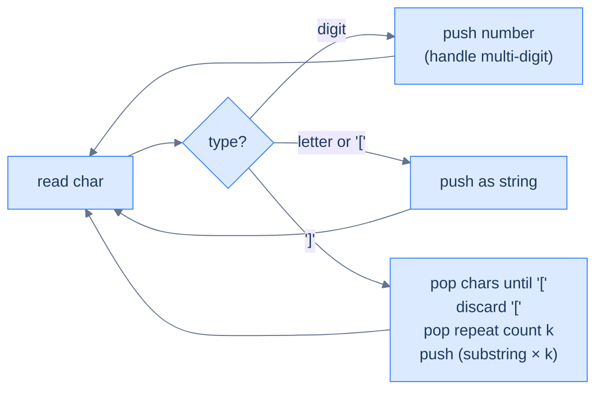

# String expansion

## Problem Statement

Given a string encoded with `k[substring]` notation (k a positive integer, substring possibly nested), return the decoded string. The encoding repeats the substring `k` times.

### Example 1
> -   **Input:** `"2[ab3[c]]"` → **Output:** `"abcccabccc"`

### Example 2
> -   **Input:** `"3[a]2[bc]"` → **Output:** `"aaabcbc"`

### Example 3
> -   **Input:** `"2[abc]3[cd]ef"` → **Output:** `"abcabccdcdcdef"`

## Examples

**Example 1**
```
Input:  "2[ab3[c]]"
Output: "abcccabccc"
Explanation: the inner "3[c]" expands to "ccc", giving "abccc" inside the
outer brackets. The outer "2[...]" repeats "abccc" twice: "abcccabccc".
```

**Example 2**
```
Input:  "3[a]2[bc]"
Output: "aaabcbc"
Explanation: two independent groups. "3[a]" → "aaa", "2[bc]" → "bcbc".
Concatenated: "aaa" + "bcbc" = "aaabcbc".
```

**Example 3**
```
Input:  "2[abc]3[cd]ef"
Output: "abcabccdcdcdef"
Explanation: "2[abc]" → "abcabc", "3[cd]" → "cdcdcd", then the trailing
"ef" stays. Result: "abcabc" + "cdcdcd" + "ef".
```

**Example 4**
```
Input:  "10[a]"
Output: "aaaaaaaaaa"
Explanation: the count is multi-digit. Both digits are read as one number
10 before the '[', so "a" repeats ten times — not "1" then "0[a]".
```


<details>
<summary><h2>Intuition</h2></summary>


This is a **linear-evaluation** problem with the same shape as bracketed reversal, but the `]` trigger *repeats* a substring instead of reversing it. The encoding `k[...]` nests, so an inner group expands before the outer group multiplies it. The stack parks the count, the `[` marker, and the characters until the matching `]` fires the fold.

The stack holds **counts, characters, `[` markers, and expanded substrings**, freshest on top. A digit run is read as one number and pushed; letters and `[` push directly. When `]` fires, the run back to the nearest `[` is the substring, the number sitting just below the `[` is the repeat count, and both are right where the fold needs them. The expansion — substring repeated `k` times — pushes back as one token, so an outer `]` multiplies across an already-expanded unit.

A naive approach finds the innermost `k[...]`, expands it, and rescans the whole string for the next innermost group — re-reading the growing result repeatedly, which is far worse than `O(N)` in the output size. A single accumulator fails differently: when `[` opens, the count and the text-so-far must be parked, and one variable cannot hold a stack of suspended `(count, prefix)` pairs. The stack parks each one and resumes it when its `]` closes, so one pass expands everything.

</details>
<details>
<summary><h2>Applying the Diagnostic Questions</h2></summary>


| Check | Answer for String Expansion |
|---|---|
| **Q1.** Is the input a single linear sequence scanned once? | **Yes** — one left-to-right walk over the encoded string. |
| **Q2.** Does some token defer work — open a group awaiting a closer? | **Yes** — every `[` opens a substring whose expansion waits for its matching `]`. |
| **Q3.** Does a trigger fold only the *most recent* pending chunk? | **Yes** — `]` expands the run back to the nearest `[`, always on top, with the count just beneath. |
| **Q4.** Is the answer read off the stack at end-of-input? | **Yes** — the surviving tokens, concatenated bottom-to-top, are the decoded string. |

</details>
<details>
<summary><h2>Approach in Words</h2></summary>


Push counts, letters, and `[`; on `]`, repeat the inner substring by the count below the marker.

1. **Initialise an empty stack** holding counts (as strings), characters, `[` markers, and expanded substrings.
2. **Walk the string left to right.**
3. **Digit → slurp the full number.** Read all consecutive digits as one multi-digit count, then push it as a string.
4. **Letter or `[` → push** directly onto the stack.
5. **`]` → fold.** Pop characters back to the nearest `[`, in left-to-right order, to rebuild the inner substring; pop and discard the `[`.
6. **Read the repeat count.** Pop the number that now sits on top — it is the `k` that preceded the `[`.
7. **Push the substring repeated `k` times** as a single token, so an enclosing `]` can multiply across it.
8. **After the pass, concatenate the stack** bottom-to-top and return it.

</details>
<details>
<summary><h2>Approach</h2></summary>


Same shape as bracketed reversal but the closer triggers a *repeat*, not a reverse. Push numbers (as strings), letters, and `[`. On `]`, pop the inner substring, pop the `[`, pop the repeat count (which is just before `[`), expand, push back.



<p align="center"><strong>String expansion — closer fires the substring×k folding. Multi-digit numbers (e.g. 12[ab]) are handled by reading consecutive digits before pushing the count as one string.</strong></p>

</details>
<details>
<summary><h2>Solution</h2></summary>


```python run viz=array viz-root=stack viz-kind=stack
from typing import List

class Solution:
    def string_expansion(self, s: str) -> str:

        # Stack to store characters, numbers, and decoded parts
        stack: List[str] = []

        i: int = 0
        while i < len(s):

            # If the current character is a digit, extract the full
            # number
            if s[i].isdigit():
                start: int = i

                # Extract the full number (handles multi-digit numbers)
                while i < len(s) and s[i].isdigit():
                    i += 1

                # Push the number as a string to the stack
                stack.append(s[start:i])

                # Adjust index because loop will increment i
                i -= 1

            # If the character is '[' or a letter, push it to the stack
            elif s[i] == "[" or s[i].isalpha():
                stack.append(s[i])

            # If the character is ']', it indicates the end of an
            # encoded section
            elif s[i] == "]":

                # Variable to store the decoded part inside the brackets
                decoded_str: str = ""

                # Pop characters from the stack until we reach '['
                while stack and stack[-1] != "[":
                    decoded_str = stack.pop() + decoded_str

                # Remove the '[' from the stack
                stack.pop()

                # Get the repeat count (the number just before '[')
                repeat_count: int = int(stack.pop())

                # Expand the string by repeating it 'repeat_count' times
                stack.append(decoded_str * repeat_count)

            i += 1

        # Return the final decoded string
        return "".join(stack)


# Examples from the problem statement
print(Solution().string_expansion("2[ab3[c]]"))    # abcccabccc
print(Solution().string_expansion("3[a]2[bc]"))    # aaabcbc
print(Solution().string_expansion("2[abc]3[cd]ef")) # abcabccdcdcdef

# Edge cases
print(Solution().string_expansion(""))             # ''
print(Solution().string_expansion("abc"))          # abc — no encoding
print(Solution().string_expansion("1[a]"))         # a
print(Solution().string_expansion("10[a]"))        # aaaaaaaaaa — multi-digit count
print(Solution().string_expansion("2[3[x]]"))      # xxxxxx
```

```java run viz=array viz-root=stack viz-kind=stack
import java.util.*;

public class Main {
    static class Solution {
        public String stringExpansion(String s) {

            // Stack to store characters, numbers, and decoded parts
            Stack<String> stack = new Stack<>();

            for (int i = 0; i < s.length(); i++) {

                // If the current character is a digit, extract the full
                // number
                if (Character.isDigit(s.charAt(i))) {
                    int start = i;

                    // Extract the full number (handles multi-digit numbers)
                    while (
                        i < s.length() && Character.isDigit(s.charAt(i))
                    ) {
                        i++;
                    }

                    // Push the number as a string to the stack
                    stack.push(s.substring(start, i));

                    // Adjust index because loop will increment i
                    i--;
                }

                // If the character is '[' or a letter, push it to the stack
                else if (
                    s.charAt(i) == '[' || Character.isLetter(s.charAt(i))
                ) {

                    // Push characters and '[' directly to the stack
                    stack.push(String.valueOf(s.charAt(i)));
                }

                // If the character is ']', it indicates the end of an
                // encoded section
                else if (s.charAt(i) == ']') {

                    // Variable to store the decoded part inside the brackets
                    StringBuilder decodedStr = new StringBuilder();

                    // Pop characters from the stack until we reach '['
                    while (!stack.isEmpty() && !stack.peek().equals("[")) {

                        // Prepend the characters to decodedStr
                        decodedStr.insert(0, stack.pop());
                    }

                    // Remove the '[' from the stack
                    stack.pop();

                    // Get the repeat count (the number just before '[')
                    int repeatCount = Integer.parseInt(stack.pop());

                    // Expand the string by repeating it 'repeatCount' times
                    StringBuilder expandedStr = new StringBuilder();
                    while (repeatCount-- > 0) {

                        // Append the decoded string repeatedly
                        expandedStr.append(decodedStr);
                    }

                    // Push the expanded string back to the stack
                    stack.push(expandedStr.toString());
                }
            }

            // Collect the final result by popping from the stack
            StringBuilder result = new StringBuilder();
            while (!stack.isEmpty()) {

                // Prepend the elements to the result string
                result.insert(0, stack.pop());
            }

            // Return the final decoded string
            return result.toString();
        }
    }

    public static void main(String[] args) {
        // Examples from the problem statement
        System.out.println(new Solution().stringExpansion("2[ab3[c]]"));     // abcccabccc
        System.out.println(new Solution().stringExpansion("3[a]2[bc]"));     // aaabcbc
        System.out.println(new Solution().stringExpansion("2[abc]3[cd]ef")); // abcabccdcdcdef

        // Edge cases
        System.out.println(new Solution().stringExpansion(""));              // ''
        System.out.println(new Solution().stringExpansion("abc"));           // abc
        System.out.println(new Solution().stringExpansion("1[a]"));          // a
        System.out.println(new Solution().stringExpansion("10[a]"));         // aaaaaaaaaa
        System.out.println(new Solution().stringExpansion("2[3[x]]"));       // xxxxxx
    }
}
```

</details>
<details>
<summary><h2>Dry Run</h2></summary>


Walk Example 1 — `s = "2[ab3[c]]"`. The stack holds counts, characters, `[`, and expanded parts; on `]`, the inner substring is rebuilt and repeated by the count below the marker:

```
s = "2[ab3[c]]"

'2'  digit  → push "2"        → stack (bottom→top): 2
'['  marker → push            → stack: 2 [
'a'  letter → push            → stack: 2 [ a
'b'  letter → push            → stack: 2 [ a b
'3'  digit  → push "3"        → stack: 2 [ a b 3
'['  marker → push            → stack: 2 [ a b 3 [
'c'  letter → push            → stack: 2 [ a b 3 [ c
']'  trigger → inner "c"; discard '['; count=3 → "ccc"; push → stack: 2 [ a b ccc
']'  trigger → inner "ab"+"ccc"="abccc"; discard '['; count=2 → "abcccabccc"; push → stack: abcccabccc

end of input → concatenate → "abcccabccc" ✓
```

A trace on `s = "10[a]"` shows the multi-digit slurp — both digits become one count:

```
'1','0' digits → slurp "10"; push "10"  → stack: 10
'['  push            → stack: 10 [
'a'  push            → stack: 10 [ a
']'  inner "a"; discard '['; count=10 → "aaaaaaaaaa"; push  → stack: aaaaaaaaaa

end of input → "aaaaaaaaaa" ✓
```

</details>
<details>
<summary><h2>Complexity Analysis</h2></summary>


| Measure | Value | Why |
|---|---|---|
| Time  | **O(M)** | One scan of the `N` input characters plus the work to build the decoded output of length `M`; `M` dominates because expansion multiplies. |
| Space | **O(M)** | The stack holds expanded substrings, which can be far larger than the input — `M` is the decoded length. |

The time is `O(M)`, where `N` is the input length and `M` is the decoded output length: the scan reads each input character once, but each `]` materialises a repeated substring, and the total characters written across all expansions sum to `M`. The space is `O(M)` for the same reason — the stack stores expanded substrings, so `10[a]` holds ten characters from one digit. Because `M` can be exponentially larger than `N` for stacked counts (`2[2[2[...]]]`), state the bound in `M`, not `N`.

</details>
<details>
<summary><h2>Edge Cases</h2></summary>


| Case | Example | Expected | Reasoning |
|---|---|---|---|
| Empty string | `""` | `''` | Nothing to scan; the stack stays empty and joins to the empty string. |
| No encoding | `abc` | `abc` | No digits or brackets, so every letter pushes and the join is the input. |
| Count of one | `1[a]` | `a` | The fold repeats `a` once — a single copy. |
| Multi-digit count | `10[a]` | `aaaaaaaaaa` | Both digits slurp into the count `10`, so `a` repeats ten times. |
| Nested counts | `2[3[x]]` | `xxxxxx` | The inner `3[x]` expands to `xxx`, then the outer doubles it to `xxxxxx`. |
| Trailing plain text | `2[abc]3[cd]ef` | `abcabccdcdcdef` | Two groups expand, then `ef` is pushed and concatenated unchanged. |

</details>
<details>
<summary><h2>Key Takeaway</h2></summary>


Push counts, characters, and `[` markers; on `]`, rebuild the inner substring, read the count just below the marker, and push the substring repeated that many times. The new idea over bracketed reversal is the *count token beneath the opener* — the fold must pop one extra item (the multiplier) before pushing the combined result, and multi-digit counts demand a slurp loop so `10[a]` is not misread as `1` then `0[a]`.

</details>