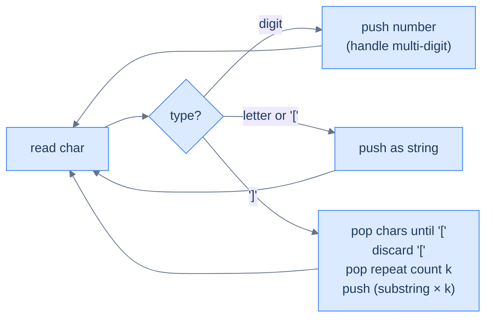

# String expansion

## Problem Statement

Given a string encoded with `k[substring]` notation (k a positive integer, substring possibly nested), return the decoded string. The encoding repeats the substring `k` times.

### Example 1
> -   **Input:** `"2[ab3[c]]"` → **Output:** `"abcccabccc"`

### Example 2
> -   **Input:** `"3[a]2[bc]"` → **Output:** `"aaabcbc"`

### Example 3
> -   **Input:** `"2[abc]3[cd]ef"` → **Output:** `"abcabccdcdcdef"`

## Examples

**Example 1**
```
Input:  "2[ab3[c]]"
Output: "abcccabccc"
Explanation: the inner "3[c]" expands to "ccc", giving "abccc" inside the
outer brackets. The outer "2[...]" repeats "abccc" twice: "abcccabccc".
```

**Example 2**
```
Input:  "3[a]2[bc]"
Output: "aaabcbc"
Explanation: two independent groups. "3[a]" → "aaa", "2[bc]" → "bcbc".
Concatenated: "aaa" + "bcbc" = "aaabcbc".
```

**Example 3**
```
Input:  "2[abc]3[cd]ef"
Output: "abcabccdcdcdef"
Explanation: "2[abc]" → "abcabc", "3[cd]" → "cdcdcd", then the trailing
"ef" stays. Result: "abcabc" + "cdcdcd" + "ef".
```

**Example 4**
```
Input:  "10[a]"
Output: "aaaaaaaaaa"
Explanation: the count is multi-digit. Both digits are read as one number
10 before the '[', so "a" repeats ten times — not "1" then "0[a]".
```

```quiz
{
  "prompt": "What is the result of decoding \"2[3[x]]\"?",
  "input": "s = \"2[3[x]]\"",
  "options": ["xx", "xxx", "xxxxx", "xxxxxx"],
  "answer": "xxxxxx"
}
```

## Constraints

- `1 ≤ s.length ≤ 3000`
- `s` consists of digits, lowercase English letters, and `[`/`]`
- Brackets are balanced and properly nested; counts are positive integers

```python run
class Solution:
    def string_expansion(self, s: str) -> str:
        # Your code goes here — push counts, letters, and '['; on ']', pop
        # the inner substring, discard '[', pop the repeat count k, push
        # the substring repeated k times.
        return s

s = input()
print(Solution().string_expansion(s))
```

```java run
import java.util.*;
public class Main {
    static class Solution {
        public String stringExpansion(String s) {
            // Your code goes here — push counts, letters, and '['; on ']', pop
            // the inner substring, discard '[', pop the repeat count k, push
            // the substring repeated k times.
            return s;
        }
    }
    public static void main(String[] args) {
        String s = new Scanner(System.in).nextLine();
        System.out.println(new Solution().stringExpansion(s));
    }
}
```

```testcases
{
  "args": [
    { "id": "s", "label": "s", "type": "string", "placeholder": "3[a]2[bc]" }
  ],
  "cases": [
    { "args": { "s": "2[ab3[c]]" }, "expected": "abcccabccc" },
    { "args": { "s": "3[a]2[bc]" }, "expected": "aaabcbc" },
    { "args": { "s": "2[abc]3[cd]ef" }, "expected": "abcabccdcdcdef" },
    { "args": { "s": "abc" }, "expected": "abc" },
    { "args": { "s": "1[a]" }, "expected": "a" },
    { "args": { "s": "10[a]" }, "expected": "aaaaaaaaaa" },
    { "args": { "s": "2[3[x]]" }, "expected": "xxxxxx" }
  ]
}
```

<details>
<summary><h2>Intuition</h2></summary>


This is a **linear-evaluation** problem with the same shape as bracketed reversal, but the `]` trigger *repeats* a substring instead of reversing it. The encoding `k[...]` nests, so an inner group expands before the outer group multiplies it. The stack parks the count, the `[` marker, and the characters until the matching `]` fires the fold.

The stack holds **counts, characters, `[` markers, and expanded substrings**, freshest on top. A digit run is read as one number and pushed; letters and `[` push directly. When `]` fires, the run back to the nearest `[` is the substring, the number sitting just below the `[` is the repeat count, and both are right where the fold needs them. The expansion — substring repeated `k` times — pushes back as one token, so an outer `]` multiplies across an already-expanded unit.

A naive approach finds the innermost `k[...]`, expands it, and rescans — re-reading the growing result repeatedly. A single accumulator cannot hold the suspended outer atoms while an inner group is being scaled. The stack parks each one and resumes it when its `]` closes, so one pass expands everything.

</details>
<details>
<summary><h2>Applying the Diagnostic Questions</h2></summary>


| Check | Answer for String Expansion |
|---|---|
| **Q1.** Is the input a single linear sequence scanned once? | **Yes** — one left-to-right walk over the encoded string. |
| **Q2.** Does some token defer work — open a group awaiting a closer? | **Yes** — every `[` opens a substring whose expansion waits for its matching `]`. |
| **Q3.** Does a trigger fold only the *most recent* pending chunk? | **Yes** — `]` expands the run back to the nearest `[`, always on top, with the count just beneath. |
| **Q4.** Is the answer read off the stack at end-of-input? | **Yes** — the surviving tokens, concatenated bottom-to-top, are the decoded string. |

</details>
<details>
<summary><h2>Approach in Words</h2></summary>


Push counts, letters, and `[`; on `]`, repeat the inner substring by the count below the marker.

1. **Initialise an empty stack** holding counts (as strings), characters, `[` markers, and expanded substrings.
2. **Walk the string left to right.**
3. **Digit → slurp the full number.** Read all consecutive digits as one multi-digit count, then push it as a string.
4. **Letter or `[` → push** directly onto the stack.
5. **`]` → fold.** Pop characters back to the nearest `[`, in left-to-right order, to rebuild the inner substring; pop and discard the `[`.
6. **Read the repeat count.** Pop the number that now sits on top — it is the `k` that preceded the `[`.
7. **Push the substring repeated `k` times** as a single token, so an enclosing `]` can multiply across it.
8. **After the pass, concatenate the stack** bottom-to-top and return it.

</details>
<details>
<summary><h2>Approach</h2></summary>


Same shape as bracketed reversal but the closer triggers a *repeat*, not a reverse. Push numbers (as strings), letters, and `[`. On `]`, pop the inner substring, pop the `[`, pop the repeat count (which is just before `[`), expand, push back.



<p align="center"><strong>String expansion — closer fires the substring×k folding. Multi-digit numbers (e.g. 12[ab]) are handled by reading consecutive digits before pushing the count as one string.</strong></p>

</details>
<details>
<summary><h2>Solution &amp; Analysis</h2></summary>

```python solution time=O(M) space=O(M)
class Solution:
    def string_expansion(self, s: str) -> str:
        stack = []
        i = 0
        while i < len(s):
            if s[i].isdigit():
                start = i
                while i < len(s) and s[i].isdigit():
                    i += 1
                stack.append(s[start:i])
                i -= 1
            elif s[i] == "[" or s[i].isalpha():
                stack.append(s[i])
            elif s[i] == "]":
                decoded_str = ""
                while stack and stack[-1] != "[":
                    decoded_str = stack.pop() + decoded_str
                stack.pop()
                repeat_count = int(stack.pop())
                stack.append(decoded_str * repeat_count)
            i += 1
        return "".join(stack)

s = input()
print(Solution().string_expansion(s))
```

```java solution
import java.util.*;
public class Main {
    static class Solution {
        public String stringExpansion(String s) {
            Stack<String> stack = new Stack<>();
            for (int i = 0; i < s.length(); i++) {
                if (Character.isDigit(s.charAt(i))) {
                    int start = i;
                    while (i < s.length() && Character.isDigit(s.charAt(i))) i++;
                    stack.push(s.substring(start, i));
                    i--;
                } else if (s.charAt(i) == '[' || Character.isLetter(s.charAt(i))) {
                    stack.push(String.valueOf(s.charAt(i)));
                } else if (s.charAt(i) == ']') {
                    StringBuilder decodedStr = new StringBuilder();
                    while (!stack.isEmpty() && !stack.peek().equals("[")) {
                        decodedStr.insert(0, stack.pop());
                    }
                    stack.pop();
                    int repeatCount = Integer.parseInt(stack.pop());
                    StringBuilder expandedStr = new StringBuilder();
                    while (repeatCount-- > 0) expandedStr.append(decodedStr);
                    stack.push(expandedStr.toString());
                }
            }
            StringBuilder result = new StringBuilder();
            while (!stack.isEmpty()) result.insert(0, stack.pop());
            return result.toString();
        }
    }
    public static void main(String[] args) {
        String s = new Scanner(System.in).nextLine();
        System.out.println(new Solution().stringExpansion(s));
    }
}
```

**Dry Run — `s = "2[ab3[c]]"`**

```
'2'  digit  → push "2"        → stack: 2
'['  marker → push            → stack: 2 [
'a'  letter → push            → stack: 2 [ a
'b'  letter → push            → stack: 2 [ a b
'3'  digit  → push "3"        → stack: 2 [ a b 3
'['  marker → push            → stack: 2 [ a b 3 [
'c'  letter → push            → stack: 2 [ a b 3 [ c
']'  trigger → inner "c"; discard '['; count=3 → "ccc"; push → stack: 2 [ a b ccc
']'  trigger → inner "ab"+"ccc"="abccc"; discard '['; count=2 → "abcccabccc"; push → stack: abcccabccc

end of input → "abcccabccc" ✓
```

**Complexity**

| Measure | Value | Why |
|---|---|---|
| Time  | **O(M)** | One scan of `N` input chars plus building the decoded output of length `M`; `M` dominates. |
| Space | **O(M)** | The stack holds expanded substrings — `10[a]` holds ten characters from one digit. |

**Edge Cases**

| Case | Example | Expected | Reasoning |
|---|---|---|---|
| No encoding | `abc` | `abc` | No digits or brackets; every letter pushes and join is the input. |
| Count of one | `1[a]` | `a` | Fold repeats `a` once — a single copy. |
| Multi-digit count | `10[a]` | `aaaaaaaaaa` | Both digits slurp into count `10`. |
| Nested counts | `2[3[x]]` | `xxxxxx` | Inner `3[x]` → `xxx`, outer doubles to `xxxxxx`. |
| Trailing plain text | `2[abc]3[cd]ef` | `abcabccdcdcdef` | Two groups expand, then `ef` stays. |

</details>
<details>
<summary><h2>Key Takeaway</h2></summary>


Push counts, characters, and `[` markers; on `]`, rebuild the inner substring, read the count just below the marker, and push the substring repeated that many times. The new idea over bracketed reversal is the *count token beneath the opener* — the fold must pop one extra item (the multiplier) before pushing the combined result, and multi-digit counts demand a slurp loop so `10[a]` is not misread as `1` then `0[a]`.

</details>
