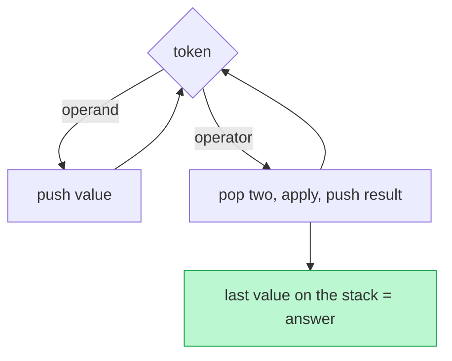

# Memorize: Linear Evaluation

## In a Hurry?

- **One-Line Idea**: Scan the input once, push data tokens, and on a trigger fold the most recent chunk back to its opener into one combined value pushed back onto the stack.
- **Complexities**: `O(N)` time for a fixed-size fold, where `N` is the input length; `O(N)` space worst case (pure data, no triggers). When a fold materialises a larger output `M` (string expansion), state both time and space as `O(M)`.
- **When to Use**: A single linear scan where some token *defers* work — opens a group whose evaluation waits for a later closer — and each trigger collapses the freshest pending chunk (paths, nested brackets, encoded substrings, grouped formulas).

---

## One-Line Mnemonic

**"Push the parts, fold on the trigger, read the stack at the end."**

The phrase encodes the whole pattern: data tokens accumulate as pending parts, a trigger collapses the freshest chunk into one combined value, and whatever remains on the stack — joined, summed, or concatenated — is the answer.

---

## Real-World Analogy

Picture assembling a flat-pack bookshelf from a numbered instruction sheet, with a tray beside you. Each part you unwrap goes on the tray in arrival order, the newest on top. Some steps say "join the last few parts into one sub-assembly" — you take exactly the pieces you just placed, combine them into a single unit, and set that unit back on the tray. A nested instruction ("build the drawer, then fit it into the cabinet") forces you to finish the inner sub-assembly before the outer step can use it. When the sheet ends, the tray holds the finished pieces in order, and stacking them is the bookshelf. The stack is the tray; folds are the join-steps; nesting is innermost-first.

---

## Visual Summary



<p align="center"><strong>Evaluate a linear expression with a stack: push operands, and when an operator (or closing bracket) arrives, pop its operands, compute, and push the result back. One pass — O(n).</strong></p>

---

## Pattern Recognition Triggers

The pattern fits when **all four** answers are "yes" — the same diagnostic that gates each problem in the section.

- The input is a **single linear sequence** you scan once, left to right — a string or token list, not a grid or graph.
- Some token **defers work** — opens a group whose evaluation waits for a later closer (brackets, parentheses, count-prefixes).
- A trigger folds only the **most recent pending chunk**, back to its matching opener — the chunk is always on top, never buried.
- The answer is **read off the stack** at end-of-input — joined, summed, or concatenated across what remains.

Common surface signals: "simplify this UNIX path," "decode the encoded string `k[...]`," "reverse the substrings inside brackets," "count the atoms in this chemical formula," or any "evaluate the nested expression" problem.

---

## Don't Confuse With

The linear-evaluation stack and the **sequence-validation** stack both scan a string once and push/pop a single stack on bracket-like tokens — but one *combines* the popped chunk into a new value, while the other only *matches and checks*.

| | **Linear Evaluation (this pattern)** | **Sequence Validation** |
|---|---|---|
| **Problem shape** | "Transform or evaluate this nested sequence" — the answer is a built value (string, number, records) | "Is this paired sequence well-formed?" — the answer is validity, an edit count, or a span |
| **What the stack holds** | **Partial results and pending context** — operands, counts, markers, combined tokens | The **unmatched openers** seen so far, newest on top |
| **Trigger action** | **Fold** — pop the chunk, combine it, push one new value back | **Match-and-pop** — pop one opener if its type matches the closer; push nothing back |
| **What you read** | The **stack contents** at end-of-input, joined or summed | Whether the stack **ends empty** (plus what sat between a matched pair) |
| **Complexity** | `O(N)` time / `O(N)` space (or `O(M)` when output expands) | `O(N)` time, `O(N)` space worst case |
| **When this goes wrong** | You only matched-and-popped without ever combining, or you checked for an empty stack at the end — you have written a validator and lost the computed value. | You pushed combined values back onto the stack or summed the contents at the end — you have written an evaluator; validation never builds a result, it only checks emptiness. |

The split is what the trigger does: linear evaluation *folds a chunk into a new value and pushes it back*; sequence validation *pops one opener and pushes nothing*. Build-and-push-back means evaluation; match-pop-then-check-empty means validation.

---

## Template Code

```python
# Linear-evaluation pattern — the pending-work register.
# The stack holds partial results and pending context, newest on top.
# Specialise three things per problem: which tokens are data,
# which token is the trigger, and how a fold combines the chunk.
from typing import List


def linear_evaluate(s: str) -> str:
    stack: List[str] = []                 # partial results + markers
    i = 0
    while i < len(s):
        ch = s[i]
        if ch == "]":                     # trigger → fold the freshest chunk
            chunk = ""
            while stack and stack[-1] != "[":
                chunk = stack.pop() + chunk   # rebuild in left-to-right order
            stack.pop()                   # discard the matching opener
            stack.append(combine(chunk))  # push one combined value back
        else:                             # data token → push (slurp multi-char first)
            stack.append(ch)
        i += 1

    return "".join(stack)                 # answer = the surviving stack
```

The three knobs are the data test (what you push), the trigger (`ch == "]"` here, or `..`, or `)`), and `combine` (reverse the chunk, repeat it by a count, scale a record group). The push-data / fold-on-trigger / read-the-stack body never changes. A multi-character token — a multi-digit count or multi-letter name — needs a slurp sub-loop before the push, otherwise `12[a]` pushes `1` then `2` and loses the count.

---

## Common Mistakes

- **Matching without combining**:
  - *What*: popping the chunk on a trigger but never folding it into a new value pushed back.
  - *Why*: that is sequence validation, not evaluation — you discard the inner result instead of computing with it, so the answer is lost.
  - *Fix*: on every trigger, combine the popped chunk into one value and `stack.append(it)`; the fold *produces* a token, it does not just remove them.
- **Splitting a multi-character token**:
  - *What*: pushing each digit or letter of a multi-character token separately, so `12[a]` becomes `1`, `2`, `[`, `a`.
  - *Why*: a count or name is one logical token; reading it one character at a time loses the value the next fold needs.
  - *Fix*: when you see the first digit (or letter), slurp all consecutive ones into a single token before pushing it.
- **Folding in the wrong order**:
  - *What*: rebuilding the inner chunk by appending in pop order when the problem wants left-to-right order, or vice versa.
  - *Why*: the stack returns characters last-in-first-out, so appending reverses them — correct for bracketed reversal, wrong for string expansion.
  - *Fix*: decide explicitly — `chunk += stack.pop()` reverses; `chunk = stack.pop() + chunk` preserves order. Pick the one the fold needs.
- **Forgetting to discard the opener marker**:
  - *What*: popping the chunk back to `[` but leaving the `[` on the stack after the fold.
  - *Why*: the stale marker corrupts the next fold's boundary, so an enclosing trigger stops at the wrong place.
  - *Fix*: after the pop-until-`[` loop, pop the `[` itself and throw it away before pushing the combined value.
- **Reading the count from the wrong side**:
  - *What*: looking for a repeat count or multiplier after the closer when it sits before the opener (or the reverse).
  - *Why*: each encoding fixes where the number lives — `k[...]` puts `k` before `[`, while `(...)k` puts `k` after `)` — and guessing wrong reads garbage.
  - *Fix*: match the scan to the grammar; pop the count from below the marker for `k[...]`, or slurp it after the closer for `(...)k`.

---

## Minimum Viable Example

Expand `s = "2[ab]"` with the pending-work register:

```
'2' push, '[' push, 'a' push, 'b' push  →  stack (bottom→top): 2 [ a b
']' fold: pop "b","a" → "ab"; discard '['; count 2 → "abab"; push
end of input  →  "abab"
```

Four data tokens stack up, the `]` trigger folds `ab` and repeats it by the count `2`, and the single combined token `abab` is the answer.

---

## Quick Recall

**Q: What does the stack hold during a linear-evaluation scan?**
A: The partial results and pending context produced so far — operands, counts, markers, and combined tokens — newest on top.

**Q: What does a trigger token do?**
A: It folds the freshest chunk: pop back to the matching opener, combine into one value, and push that single value back.

**Q: Why does the combined value get pushed back instead of appended to a result?**
A: So an enclosing trigger can fold across it, which is how nesting composes without recursion.

**Q: What is the time and space complexity?**
A: `O(N)` time and `O(N)` space for a fixed-size fold; `O(M)` time and space when a fold materialises a larger output of length `M`, as in string expansion.

**Q: Why must multi-digit counts and multi-letter names be slurped?**
A: They are single logical tokens; reading them one character at a time pushes fragments and loses the value the fold needs.

**Q: How do you tell linear evaluation apart from sequence validation?**
A: Linear evaluation folds a chunk into a new value and pushes it back; sequence validation pops one opener, pushes nothing, and only checks whether the stack ends empty.
