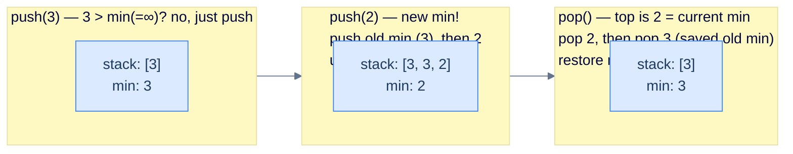

# Design a Min Stack

## The Problem

A normal stack does push, pop, and top in O(1). Can you add **`getMin()`** — the smallest value currently in the stack — *also* in O(1), with no scanning, using only **one** internal stack? The trick is to **encode the previous minimum directly into the storage stack**: when a new minimum is pushed, push the *old* minimum onto the stack first, then the new value on top. The only moment you need that old minimum is when you pop the current one — and it's sitting right underneath, ready to restore.

> Implement a `MinStack` class that supports, all in **O(1)**:
>
> - `MinStack()` — initialise an empty stack.
> - `push(val)` — push `val` onto the top.
> - `pop()` — remove the top element.
> - `top()` — return the top element.
> - `getMin()` — return the smallest value currently in the stack.

```
Input:
  ops  = [MinStack, push, push, top, getMin, pop, getMin, push, getMin]
  args = [[],        [2],  [3],  [],  [],     [],  [],     [-1], []]

Output:
  [null, null, null, 3, 2, null, 2, null, -1]
```

```quiz
{
  "prompt": "On a fresh MinStack, you run push(5), push(3), push(8), then pop(). What does getMin() return next?",
  "input": "push(5), push(3), push(8), pop()",
  "options": ["3", "5", "8", "Undefined"],
  "answer": "3"
}
```

## Constraints

- `getMin()` must run in **O(1)**.
- You may use only **one** internal stack.
- Assume no duplicate values are ever pushed.

The workbench drives your class through a fixed sequence: it pushes the `pushes` values in order, prints the current `top` and `min`, then performs `pops` pops, printing `top` and `min` after each one. Implement all four methods so every line matches.

```python run viz=array viz-root=storage_stack viz-kind=stack
import ast

class MinStack:
    def __init__(self):
        self.min = float("inf")          # running minimum-so-far
        self.storage_stack = []          # the single backing stack

    def push(self, val):
        # Your code goes here — if val is a new minimum, bury the old
        # minimum on the stack first, then push val and update min.
        pass

    def pop(self):
        # Your code goes here — pop the top; if it was the current min,
        # the value now exposed is the buried previous min — restore from it.
        pass

    def top(self):
        # Your code goes here — the top of the storage stack.
        return 0

    def get_min(self):
        # Your code goes here — O(1): return the tracked minimum.
        return 0

ms = MinStack()
pushes = ast.literal_eval(input())   # values to push, in order
pops = int(input())                  # number of pops afterwards

for v in pushes:
    ms.push(v)
print("top =", ms.top(), "min =", ms.get_min())
for _ in range(pops):
    ms.pop()
    print("top =", ms.top(), "min =", ms.get_min())
```

```java run viz=array viz-root=storage_stack viz-kind=stack
import java.util.*;

public class Main {
    static class MinStack {
        private int min = Integer.MAX_VALUE;          // running minimum-so-far
        private Stack<Integer> storageStack = new Stack<>();  // the single backing stack

        public void push(int val) {
            // Your code goes here — if val is a new minimum, bury the old
            // minimum on the stack first, then push val and update min.
        }

        public void pop() {
            // Your code goes here — pop the top; if it was the current min,
            // the value now exposed is the buried previous min — restore from it.
        }

        public int top() {
            // Your code goes here — the top of the storage stack.
            return 0;
        }

        public int getMin() {
            // Your code goes here — O(1): return the tracked minimum.
            return 0;
        }
    }

    public static void main(String[] args) {
        Scanner sc = new Scanner(System.in);
        MinStack ms = new MinStack();
        int[] pushes = parseIntArray(sc.nextLine());        // values to push, in order
        int pops = Integer.parseInt(sc.nextLine().trim());  // number of pops afterwards

        for (int v : pushes) ms.push(v);
        System.out.println("top = " + ms.top() + " min = " + ms.getMin());
        for (int i = 0; i < pops; i++) {
            ms.pop();
            System.out.println("top = " + ms.top() + " min = " + ms.getMin());
        }
    }

    // "[2, 3]" → {2, 3} — reads a test-case list
    static int[] parseIntArray(String line) {
        String inner = line.replaceAll("[\\[\\]\\s]", "");
        if (inner.isEmpty()) return new int[0];
        String[] parts = inner.split(",");
        int[] out = new int[parts.length];
        for (int i = 0; i < parts.length; i++) out[i] = Integer.parseInt(parts[i]);
        return out;
    }
}
```

```testcases
{
  "args": [
    { "id": "pushes", "label": "pushes", "type": "int[]", "placeholder": "[2, 3]" },
    { "id": "pops", "label": "pops", "type": "int", "placeholder": "1" }
  ],
  "cases": [
    { "args": { "pushes": "[2, 3]", "pops": "1" }, "expected": "top = 3 min = 2\ntop = 2 min = 2" },
    { "args": { "pushes": "[5]", "pops": "0" }, "expected": "top = 5 min = 5" },
    { "args": { "pushes": "[10, 1, 7]", "pops": "1" }, "expected": "top = 7 min = 1\ntop = 1 min = 1" },
    { "args": { "pushes": "[3, 1, 2]", "pops": "2" }, "expected": "top = 2 min = 1\ntop = 1 min = 1\ntop = 3 min = 3" },
    { "args": { "pushes": "[-1, -5, 3]", "pops": "0" }, "expected": "top = 3 min = -5" }
  ]
}
```

<details>
<summary><h2>Intuition</h2></summary>

The clever invariant: maintain a running `min` field; when a *new* minimum arrives, **push the OLD min onto the stack first**, *then* push the new value, and update `min`. Now the stack holds, just below every "minimum so far" record, the previous minimum. When you eventually pop the current min, the previous one is sitting right underneath — pop it too and it becomes the new current min.



<p align="center"><strong>Min Stack — when a new min lands, the previous min is buried just below it. When the current min is popped, restore from the buried record. Pushing a non-min value is just a regular push.</strong></p>

> **Why this works** — the only time you need the *previous* min is when you *remove* the current min. At that moment the value sitting just under the current-min slot is exactly the previous min. Encoding it inline is sufficient — no parallel auxiliary stack required.

**The Max Stack is the mirror image.** Want the *largest* value in O(1) instead? Flip three things: track `max` initialised to `-∞`, bury the old max when `val >= max`, and restore on a pop that equals `max`. Everything else — the single stack, the burial trick, the O(1) guarantees — is identical. The idea, not the comparison, is what transfers.

</details>
<details>
<summary><h2>Solution &amp; Analysis</h2></summary>

### Solution

```python solution time=O(1) space=O(n)
import ast

class MinStack:
    def __init__(self):

        # Variable to track the minimum element
        self.min = float("inf")

        # Stack to store the elements
        self.storage_stack = []

    def push(self, val):

        # If the new element is smaller or equal to the current minimum,
        # push the current minimum onto the stack and update the minimum
        if val <= self.min:
            self.storage_stack.append(self.min)
            self.min = val

        # Push the element onto the stack
        self.storage_stack.append(val)

    def pop(self):

        # If the popped element is the current minimum, restore the
        # previous minimum from the slot buried just beneath it
        if self.storage_stack.pop() == self.min:
            self.min = self.storage_stack.pop()

    def top(self):

        # Return the top element of the stack
        return self.storage_stack[-1]

    def get_min(self):

        # Return the current minimum element
        return self.min

ms = MinStack()
pushes = ast.literal_eval(input())   # values to push, in order
pops = int(input())                  # number of pops afterwards

for v in pushes:
    ms.push(v)
print("top =", ms.top(), "min =", ms.get_min())
for _ in range(pops):
    ms.pop()
    print("top =", ms.top(), "min =", ms.get_min())
```

```java solution
import java.util.*;

public class Main {
    static class MinStack {

        // Variable to track the minimum element
        private int min = Integer.MAX_VALUE;

        // Stack to store the elements
        private Stack<Integer> storageStack = new Stack<>();

        public void push(int val) {

            // If the new element is smaller or equal to the current
            // minimum, push the current minimum onto the stack and
            // update the minimum
            if (val <= min) {
                storageStack.push(min);
                min = val;
            }

            // Push the element onto the stack
            storageStack.push(val);
        }

        public void pop() {

            // If the popped element is the current minimum, restore the
            // previous minimum from the slot buried just beneath it
            if (storageStack.pop() == min) {
                min = storageStack.pop();
            }
        }

        public int top() {

            // Return the top element of the stack
            return storageStack.peek();
        }

        public int getMin() {

            // Return the current minimum element
            return min;
        }
    }

    public static void main(String[] args) {
        Scanner sc = new Scanner(System.in);
        MinStack ms = new MinStack();
        int[] pushes = parseIntArray(sc.nextLine());        // values to push, in order
        int pops = Integer.parseInt(sc.nextLine().trim());  // number of pops afterwards

        for (int v : pushes) ms.push(v);
        System.out.println("top = " + ms.top() + " min = " + ms.getMin());
        for (int i = 0; i < pops; i++) {
            ms.pop();
            System.out.println("top = " + ms.top() + " min = " + ms.getMin());
        }
    }

    // "[2, 3]" → {2, 3} — reads a test-case list
    static int[] parseIntArray(String line) {
        String inner = line.replaceAll("[\\[\\]\\s]", "");
        if (inner.isEmpty()) return new int[0];
        String[] parts = inner.split(",");
        int[] out = new int[parts.length];
        for (int i = 0; i < parts.length; i++) out[i] = Integer.parseInt(parts[i]);
        return out;
    }
}
```

### Dry Run — the canonical example sequence

```
Op          | storage_stack (bottom→top) | min | Return
------------|----------------------------|-----|-------
MinStack()  | []                         | ∞   | —
push(2)     | [∞, 2]                     | 2   | null   ← 2 ≤ ∞: bury ∞, then push 2
push(3)     | [∞, 2, 3]                  | 2   | null   ← 3 > 2: plain push
top()       | [∞, 2, 3]                  | 2   | 3
getMin()    | [∞, 2, 3]                  | 2   | 2
pop()       | [∞, 2]                     | 2   | null   ← popped 3 ≠ min: nothing buried
getMin()    | [∞, 2]                     | 2   | 2
push(-1)    | [∞, 2, 2, -1]             | -1  | null   ← -1 ≤ 2: bury 2, then push -1
getMin()    | [∞, 2, 2, -1]            | -1  | -1
```

### Complexity Analysis

| Operation | Time | Space | Notes |
|---|---|---|---|
| `MinStack()` | O(1) | O(1) | trivial init |
| `push(val)` | O(1) | — | at most one burial + one push |
| `pop()` | O(1) | — | at most two physical pops |
| `top()` | O(1) | — | peek the stack |
| `getMin()` | O(1) | O(1) | read the cached field |
| total | — | O(n) | one slot per element, plus one buried record per descending minimum |

### Edge Cases

| Case | Example | Expected behaviour |
|---|---|---|
| Single element | `push(5)` | `top` and `min` both `5` |
| Strictly increasing pushes | `[10, 1, 7]` after one pop | min stays `1` — popping the non-min `7` buries nothing |
| Pop the current min | `[3, 1, 2]`, two pops | popping `1` exposes the buried `3`, restoring `min = 3` |
| All-negative / new minima | `[-1, -5, 3]` | each new low buries the old one; `min = -5` |

</details>
<details>
<summary><h2>Key Takeaway</h2></summary>

1. **One auxiliary integer + one stack = O(1) min.** No second stack required — *bury* the previous minimum just below every new-minimum value in the same stack, and the restore comes for free on pop.
2. **The trigger to restore is `popped == current min`.** When the popped value equals the current min, the buried record sits one slot below — pop it and restore. Otherwise, no extra work.
3. **The move that transfers is encoding metadata *into* the structure**, not alongside it. A two-stack version (a parallel stack of running minima) also works and is more obvious, but the single-stack trick is the one worth keeping.

> **Transfer Challenge:** Turn this into a **Max Stack** — `getMax()` in O(1). What is the *minimum* set of edits? (Initialise the tracker to `-∞`, bury the old max when `val >= max`, restore on a pop equal to `max`. Three comparisons flip; the structure does not.)

</details>
