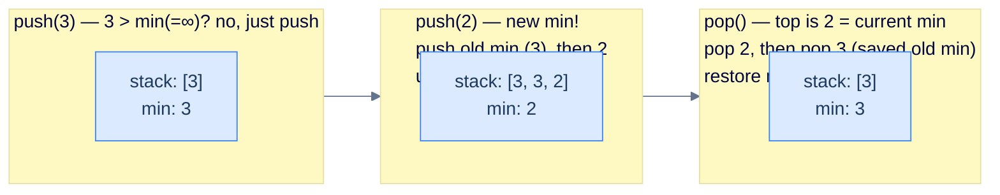

A normal stack does push, pop, and top in O(1). Can you add **`getMin()`** — the smallest value currently in the stack — *also* in O(1), with no scanning, using only **one** internal stack? The trick is to **encode the previous minimum directly into the storage stack**: when a new minimum is pushed, push the *old* minimum onto the stack first, then the new value on top. The only moment you need the old min is when you pop the current min — and it's sitting right underneath, ready to restore. This lesson designs **Min Stack** and its mirror **Max Stack** from that one idea: a single auxiliary integer plus one stack adds a whole new O(1) query without breaking any existing guarantee.

## Design a Min Stack

### Problem Statement

Implement a `MinStack` class with the following operations, all amortised **O(1)**:

> -   **`MinStack()`** — initialise.
> -   **`push(int val)`** — push onto the top.
> -   **`pop()`** — remove and discard the top.
> -   **`top()`** — return the top element.
> -   **`getMin()`** — return the smallest value currently in the stack.

> **Constraints:**
> - `getMin()` must run in **O(1)**.
> - You may use only **one** internal stack.
> - Assume no duplicate values are ever pushed.

> **Example:**
>
> | Operation | Stack state | Output |
> |---|---|---|
> | `MinStack()` | `[]` | `null` |
> | `push(2)` | `[2]` | `null` |
> | `push(3)` | `[3, 2]` (top first) | `null` |
> | `top()` | `[3, 2]` | `3` |
> | `getMin()` | `[3, 2]` | `2` |
> | `pop()` | `[2]` | `null` |
> | `getMin()` | `[2]` | `2` |
> | `push(-1)` | `[-1, 2]` | `null` |
> | `getMin()` | `[-1, 2]` | `-1` |

<details>
<summary><h2>Approach — encode the previous minimum into the stack</h2></summary>


The clever invariant: maintain a running `min` field; when a *new* minimum arrives, **push the OLD min onto the stack first**, *then* push the new value. Update `min` to the new value.

Now the stack contains, just below every "minimum so far" record, the previous minimum. When we eventually pop the current min, we know to also pop the saved previous min — and that saved value becomes the new current min.



<p align="center"><strong>Min Stack — when a new min lands, the previous min is buried just below it. When the current min is popped, restore from the buried record. Push of a non-min value is just a regular push.</strong></p>

> **Why this works** — the key observation is that the only time we need the *previous* min is when we *remove* the current min. At that moment, the value sitting just under the current-min slot is exactly the previous min. So encoding it inline is sufficient — we don't need a parallel auxiliary stack.

</details>
<details>
<summary><h2>Solution</h2></summary>


```python run viz=array viz-root=storage_stack viz-kind=stack
import math

class MinStack:
    def __init__(self):

        # Variable to track the minimum element
        self.min = float("inf")

        # Stack to store the elements
        self.storage_stack = []

    def push(self, val: int) -> None:

        # If the new element is smaller or equal to the current minimum,
        # push the current minimum onto the stack and update the
        # minimum
        if val <= self.min:
            self.storage_stack.append(self.min)
            self.min = val

        # Push the element onto the stack
        self.storage_stack.append(val)

    def pop(self) -> None:

        # If the top element is equal to the current minimum,
        # update the minimum by popping another element from the
        # stack
        if self.storage_stack.pop() == self.min:
            self.min = self.storage_stack.pop()

    def top(self) -> int:

        # Return the top element of the stack
        return self.storage_stack[-1]

    def get_min(self) -> int:

        # Return the current minimum element
        return self.min


# Example from the problem statement
ms = MinStack()
ms.push(2); ms.push(3)
print(ms.top())      # 3
print(ms.get_min())  # 2
ms.pop()
print(ms.get_min())  # 2
ms.push(-1)
print(ms.get_min())  # -1

# Edge cases
ms2 = MinStack()
ms2.push(5)
print(ms2.top())     # 5
print(ms2.get_min()) # 5

ms3 = MinStack()
ms3.push(10); ms3.push(1); ms3.push(7)
print(ms3.get_min()) # 1
ms3.pop()
print(ms3.get_min()) # 1
ms3.pop()
print(ms3.get_min()) # 10
```

```java run viz=array viz-root=storage_stack viz-kind=stack
import java.util.*;

public class Main {
    static class MinStack {

        // Variable to track the minimum element
        private int min = Integer.MAX_VALUE;

        // Stack to store the elements
        private Stack<Integer> storageStack = new Stack<Integer>();

        public void push(int val) {

            // If the new element is smaller or equal to the current
            // minimum, push the current minimum onto the stack and
            // update the minimum
            if (val <= min) {
                storageStack.push(min);
                min = val;
            }

            // Push the element onto the stack
            storageStack.push(val);
        }

        public void pop() {

            // If the popped element is equal to the current minimum,
            // update the minimum by popping another element from the
            // stack
            if (storageStack.pop() == min) {
                min = storageStack.pop();
            }
        }

        public int top() {

            // Return the top element of the stack
            return storageStack.peek();
        }

        public int getMin() {

            // Return the current minimum element
            return min;
        }
    }

    public static void main(String[] args) {
        // Example from the problem statement
        MinStack ms = new MinStack();
        ms.push(2); ms.push(3);
        System.out.println(ms.top());    // 3
        System.out.println(ms.getMin()); // 2
        ms.pop();
        System.out.println(ms.getMin()); // 2
        ms.push(-1);
        System.out.println(ms.getMin()); // -1

        // Edge cases
        MinStack ms2 = new MinStack();
        ms2.push(5);
        System.out.println(ms2.top());    // 5
        System.out.println(ms2.getMin()); // 5

        MinStack ms3 = new MinStack();
        ms3.push(10); ms3.push(1); ms3.push(7);
        System.out.println(ms3.getMin()); // 1
        ms3.pop();
        System.out.println(ms3.getMin()); // 1
        ms3.pop();
        System.out.println(ms3.getMin()); // 10
    }
}
```

</details>


***

## Design a Max Stack

### Problem Statement

Identical to Min Stack, but track the **maximum** instead of the minimum.

> -   **`MaxStack()`**, **`push(val)`**, **`pop()`**, **`top()`** — same semantics.
> -   **`getMax()`** — return the largest value currently in the stack, in **O(1)**.

> **Constraints:**
> - `getMax()` must run in **O(1)**.
> - Use only one internal stack.
> - No duplicate values.

> **Example:**
>
> | Operation | Stack state | Output |
> |---|---|---|
> | `MaxStack()` | `[]` | `null` |
> | `push(3)` | `[3]` | `null` |
> | `push(2)` | `[2, 3]` (top first) | `null` |
> | `top()` | `[2, 3]` | `2` |
> | `getMax()` | `[2, 3]` | `3` |
> | `pop()` | `[3]` | `null` |
> | `getMax()` | `[3]` | `3` |
> | `push(5)` | `[5, 3]` | `null` |
> | `getMax()` | `[5, 3]` | `5` |

<details>
<summary><h2>Approach</h2></summary>


Mirror image of MinStack. Maintain a running `max`. When a new max arrives, push the old max as a burial record, then the new value, and update max. When popping a value equal to the current max, also pop the buried record and restore max from it.

</details>
<details>
<summary><h2>Solution</h2></summary>


```python run viz=array viz-root=storage_stack viz-kind=stack
import math
from typing import List

class MaxStack:
    def __init__(self):

        # Variable to track the maximum element
        self.max = float("-inf")

        # Stack to store the elements
        self.storage_stack: List[int] = []

    def push(self, val: int) -> None:

        # If the new element is greater or equal to the current maximum,
        # push the current maximum onto the stack and update the
        # maximum
        if val >= self.max:
            self.storage_stack.append(self.max)
            self.max = val

        # Push the element onto the stack
        self.storage_stack.append(val)

    def pop(self) -> None:

        # If the popped element is equal to the current maximum,
        # update the maximum by popping another element from the
        # stack
        if self.storage_stack.pop() == self.max:
            self.max = self.storage_stack.pop()

    def top(self) -> int:

        # Return the top element of the stack
        return self.storage_stack[-1]

    def get_max(self) -> int:

        # Return the current maximum element
        return self.max


# Example from the problem statement
ms = MaxStack()
ms.push(3); ms.push(2)
print(ms.top())      # 2
print(ms.get_max())  # 3
ms.pop()
print(ms.get_max())  # 3
ms.push(5)
print(ms.get_max())  # 5

# Edge cases
ms2 = MaxStack()
ms2.push(7)
print(ms2.top())     # 7
print(ms2.get_max()) # 7

ms3 = MaxStack()
ms3.push(1); ms3.push(10); ms3.push(4)
print(ms3.get_max()) # 10
ms3.pop()
print(ms3.get_max()) # 10
ms3.pop()
print(ms3.get_max()) # 1
```

```java run viz=array viz-root=storage_stack viz-kind=stack
import java.util.*;

public class Main {
    static class MaxStack {

        // Variable to track the maximum element
        private int max = Integer.MIN_VALUE;

        // Stack to store the elements
        private Stack<Integer> storageStack = new Stack<Integer>();

        public void push(int val) {

            // If the new element is greater or equal to the current
            // maximum, push the current maximum onto the stack and
            // update the maximum
            if (val >= max) {
                storageStack.push(max);
                max = val;
            }

            // Push the element onto the stack
            storageStack.push(val);
        }

        public void pop() {

            // If the popped element is equal to the current maximum,
            // update the maximum by popping another element from the
            // stack
            if (storageStack.pop() == max) {
                max = storageStack.pop();
            }
        }

        public int top() {

            // Return the top element of the stack
            return storageStack.peek();
        }

        public int getMax() {

            // Return the current maximum element
            return max;
        }
    }

    public static void main(String[] args) {
        // Example from the problem statement
        MaxStack ms = new MaxStack();
        ms.push(3); ms.push(2);
        System.out.println(ms.top());    // 2
        System.out.println(ms.getMax()); // 3
        ms.pop();
        System.out.println(ms.getMax()); // 3
        ms.push(5);
        System.out.println(ms.getMax()); // 5

        // Edge cases
        MaxStack ms2 = new MaxStack();
        ms2.push(7);
        System.out.println(ms2.top());    // 7
        System.out.println(ms2.getMax()); // 7

        MaxStack ms3 = new MaxStack();
        ms3.push(1); ms3.push(10); ms3.push(4);
        System.out.println(ms3.getMax()); // 10
        ms3.pop();
        System.out.println(ms3.getMax()); // 10
        ms3.pop();
        System.out.println(ms3.getMax()); // 1
    }
}
```

</details>
## Key Takeaway

1. **One auxiliary integer + one stack = O(1) min/max.** No second stack required — *bury* the previous extremum just below every new-extremum value in the same stack.
2. **The trigger to restore is `top == current min`.** When the popped value equals the current min, a saved record sits one slot below — pop it and restore. Otherwise, no extra work.
3. **A two-stack version also works** (a parallel stack of running minima) and is more obvious; the single-stack version is the one that teaches the deeper move — encoding metadata *into* the structure rather than alongside it.
