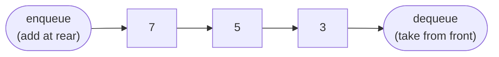

# Queues

## Why It Exists

A stack answers "what's the *most recent* thing?" — but a world of problems wants the opposite. A printer should print documents in the order they were submitted, not newest-first. A call centre should answer callers in the order they rang. A scheduler should give each waiting task its fair turn. All of them need **first come, first served** — the oldest waiting item handled next.

You've just met the structure that does the reverse of this (the stack, last in first out). Flip that one rule — *leave from the end you didn't add to* — and arrival order is preserved automatically. The newest item waits at the back while everything ahead of it is served first.

That's a **queue**: a line you join at the back and leave from the front. It's the structure behind schedulers, message brokers, and — the one that'll matter most later — breadth-first search.

## See It Work

A queue adds at the **rear** and removes from the **front**. Run this — enqueue three values, then dequeue twice — and click **Visualise** to watch the front advance as the oldest items leave first.

> ▶ Run it, then click **Visualise** — items join at the rear; each dequeue takes the *oldest* one from the front.

```python run viz=array viz-root=queue viz-kind=queue
queue = []
for x in [3, 5, 7]:
    queue.append(x)        # enqueue at the rear
print(queue.pop(0))        # dequeue the front → 3 (the oldest, out first)
print(queue.pop(0))        # → 5
print(queue)               # [7]
```

## How It Works

A queue is the stack's mirror image: a list restricted to its two ends, with items leaving from the **opposite** end to where they arrive.

- **enqueue** — add an item at the **rear** (back).
- **dequeue** — remove and return the item at the **front**.
- **front / size** — read the next item out, or how many are waiting.

This enforces **FIFO — first in, first out**: the oldest item is always the next to leave.



<p align="center"><strong>items join at the rear and leave from the front, in arrival order. The oldest (<code>3</code>) is served next; the newest (<code>7</code>) waits at the back.</strong></p>

A queue has one wrinkle a stack doesn't: **both ends move**. A stack only ever touches the top, so it reuses the same slot. A queue's front and rear *drift apart* — the front leaves a trail of freed slots behind it. Back it with an array naively and it reports "full" while the start sits empty. The fix is the **circular array** (ring buffer): when the rear hits the end, wrap it back to index `0` with modular arithmetic and reuse those freed slots. Backed by a linked list instead, the **head** is the front and a **tail** pointer is the rear. Either way — one wrap, or two pointers — enqueue, dequeue, front, and size are all `O(1)`.

### Key Takeaway

A queue restricts a list to FIFO — add at the rear, remove from the front — and because both ends move, it tracks two markers (a wrapping `front` index, or `head` + `tail`) to keep every operation `O(1)`.

## Trace It

Enqueue `3`, `5`, `7`, then dequeue twice:

| Step | Operation | Queue (front on the left) | Returned |
|---|---|---|---|
| 1 | enqueue 3 | `[3]` | — |
| 2 | enqueue 5 | `[3, 5]` | — |
| 3 | enqueue 7 | `[3, 5, 7]` | — |
| 4 | dequeue | `[5, 7]` | `3` |
| 5 | dequeue | `[7]` | `5` |

Before you read on: `3` went in first — so it comes out first. That's the exact opposite of the stack, where `3` would come out *last*. Same three pushes, opposite order out — and that one difference is what separates breadth-first search from depth-first.

## Your Turn

In real code you reach for a ready-made deque — `O(1)` at both ends, no manual ring-buffer bookkeeping:

```python run viz=array viz-kind=queue
from collections import deque

q = deque()
for x in [3, 5, 7]:
    q.append(x)          # enqueue at the rear — O(1)
print(q.popleft())       # dequeue the front → 3 (O(1), unlike list.pop(0))
print(q.popleft())       # → 5
print(list(q))           # [7]
```

```java run viz=array viz-kind=queue
import java.util.ArrayDeque;
import java.util.Queue;

public class Main {
  public static void main(String[] args) {
    Queue<Integer> q = new ArrayDeque<>();        // Java's go-to queue
    for (int x : new int[]{3, 5, 7}) q.add(x);    // enqueue at the rear
    System.out.println(q.poll());                  // dequeue front → 3
    System.out.println(q.poll());                  // → 5
    System.out.println(q);                         // [7]
  }
}
```

## Reflect & Connect

A stack and a queue are siblings — same shape, opposite rule — and the choice between them is quietly enormous:

| | Stack (LIFO) | Queue (FIFO) |
|---|---|---|
| Remove from | the end you added to | the *opposite* end |
| Recency | most recent first | oldest first |
| Powers | DFS, undo, the call stack | **BFS**, scheduling, buffering |

That last row is the leverage: swap the queue in a breadth-first search for a stack and the very same code becomes a depth-first search. The container picks the order, and the order picks the answer.

You'll meet queues all over real systems, always where work must be handled in arrival order: **OS schedulers** hand the CPU to a ready-queue of threads; **printer and I/O spoolers** serve jobs FIFO; **message brokers** (Kafka, RabbitMQ, SQS) sit between producers and consumers so a burst never overwhelms a slow reader; **event-loop runtimes** drain a task queue each tick. The backing choice mirrors the array-vs-list tradeoff from before: a circular array packs tight and stays cache-friendly; a linked list gives worst-case `O(1)` enqueue with no resize pause.

**Prerequisites:** [Arrays](/cortex/data-structures-and-algorithms/linear-structures/arrays/what-is-an-array), [Linked Lists](/cortex/data-structures-and-algorithms/linear-structures/singly-linked-list/what-is-a-linked-list), and [Measuring Cost](/cortex/data-structures-and-algorithms/foundations/measuring-cost).
**What's next:** drop ordering entirely and index by *content* instead of position — the [Hash Table](/cortex/data-structures-and-algorithms/linear-structures/hash-table/what-is-a-hash-table).

## Recall

> **Mnemonic:** *Join at the back, leave from the front. First in, first out. Both ends move, so track two markers.*

| Operation | Cost | Why |
|---|---|---|
| enqueue / dequeue / front | `O(1)` | touch one end and one or two markers — no scanning |
| search / access by position | `O(n)` | no random access; the contract only exposes the front |
| space | `O(n)` | one slot or node per waiting item |

<details>
<summary><strong>Q:</strong> What rule does a queue enforce?</summary>

**A:** FIFO — first in, first out; the oldest item leaves next.

</details>
<details>
<summary><strong>Q:</strong> Why does a naive array queue report "full" while half-empty, and what fixes it?</summary>

**A:** Both ends drift toward the high index, stranding freed front slots; a circular array wraps the rear to index `0` (modular arithmetic) to reuse them.

</details>
<details>
<summary><strong>Q:</strong> What two markers does a queue track, and why two (vs a stack's one)?</summary>

**A:** A wrapping `front` index (or `head` + `tail`) — because *both* ends move, unlike a stack's single top.

</details>
<details>
<summary><strong>Q:</strong> Swap a BFS's queue for a stack — what happens?</summary>

**A:** It becomes a DFS; the container chooses the traversal order.

</details>

## Sources & Verify

- **CLRS** (Cormen, Leiserson, Rivest, Stein), *Introduction to Algorithms*, 4th ed., **§10.1 — Stacks and Queues**: the array-backed queue with wrapping `head`/`tail` and the `O(1)` operation proofs.
- **Sedgewick & Wayne**, *Algorithms*, 4th ed., §1.3 — the queue ADT with resizing-array and linked-list implementations.
- **Linux kernel** `kfifo` (`include/linux/kfifo.h`) — a production circular-buffer queue; the power-of-two-capacity `& (size − 1)` wrap is the modular trick in the wild.
- Both runnable blocks are verified by running; the FIFO order and `O(1)` claims follow from the trace.
