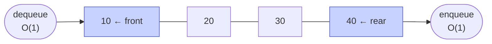

# Memorize: Queue

## In a Hurry?

- **Core Operations**: `enqueue` (add to the back), `dequeue` (remove and return the front), `front` (peek the oldest without removing), `back`/`rear` (peek the newest), `size`, and `isEmpty`/`empty`. The two mutators act on *opposite* ends — that opposition is what creates FIFO — and there is no indexed access, no search, and no middle insertion.
- **Complexities**: `enqueue` `O(1)`, `dequeue` `O(1)`, `front`/`back` `O(1)`, `size` `O(1)`, `isEmpty` `O(1)`, and space `O(n)` for `n` items. The one subtlety: a bounded circular-array `enqueue` and a linked-list `enqueue` are both *true worst-case* `O(1)`, while a growable-array `enqueue` is only *amortised* `O(1)` — an occasional resize copies all `n` elements, an `O(n)` spike. Searching for a value the interface does not expose is `O(n)`.
- **One Use-Case**: breadth-first search — BFS dequeues frontier nodes in exactly the level-by-level order a queue produces, so the first time it reaches the target is the shortest path; the same FIFO engine drives OS schedulers, print spoolers, and message brokers (Kafka, RabbitMQ, SQS) in `O(1)` per item.

---

## One-Line Mnemonic

A queue is the line at a coffee shop: newcomers join the back, the cashier serves the front, and the first person in is always the first person out.

---

## Real-World Analogy

Picture the checkout line at a supermarket. A new customer joins at the back of the line, and the cashier always serves whoever is at the front — never someone in the middle, and never the latest arrival. The person who has been waiting longest is served next, so the order of leaving exactly mirrors the order of arriving. Cutting in line is forbidden by social contract, just as the data structure forbids inserting anywhere but the back. Two ends, two roles: one end is write-only (join here), the other is read-and-remove only (served and leave). That physical "first in, first out" fairness is the whole contract — the line enforces it by where people stand, and a queue enforces it with a front marker and a back marker that both creep forward as customers flow through.

---

## Visual Summary

<strong>Items join at the rear and leave from the front — first in, first out. Both ends are O(1), and the oldest element is always the next one out.</strong>

---

## Key Operations

| Operation | Time | Space | Key Insight |
|---|---|---|---|
| `enqueue(x)` | `O(1)`* | `O(1)` | Adds `x` at the back; `size` grows by one. Array (circular): advance `backIndex = (backIndex + 1) % capacity`, write `arr[backIndex]`. Linked list: allocate a node and link it past `tail`, then advance `tail`. *True worst-case `O(1)` on a bounded array or a linked list; *amortised* `O(1)` on a growable array (an occasional resize copies all `n` items, an `O(n)` spike). A bounded queue rejects the enqueue when `size == capacity`. |
| `dequeue()` | `O(1)` | `O(1)` | Removes and returns the front, shrinking the queue by one. Array: read `arr[frontIndex]`, then advance `frontIndex = (frontIndex + 1) % capacity`. Linked list: read `head.val`, then advance `head` to `head.next`. Both must be guarded against an empty queue. |
| `front()` | `O(1)` | `O(1)` | Reads the oldest item without removing it; the queue is unchanged. Array reads `arr[frontIndex]`; linked list reads `head.val`. It is `dequeue` minus the removal. |
| `back()` / `rear()` | `O(1)` | `O(1)` | Reads the newest item without removing it. Array reads `arr[backIndex]`; linked list reads `tail.val`. The `tail` pointer is the *only* reason this is `O(1)` on a linked list — without it, reaching the back is an `O(n)` walk. |
| `size()` | `O(1)` | `O(1)` | Count of stored items. Both implementations keep a standalone `currentSize` counter bumped on enqueue and dropped on dequeue. The array needs it to tell *empty* from *full* once the indices wrap; the linked list needs it because a chain has no length field (counting nodes would be `O(n)`). |
| `isEmpty()` / `empty()` | `O(1)` | `O(1)` | True when there is no front. Both implementations test `currentSize == 0` (equivalently `head == null` for a linked list). This is the guard you run before every `dequeue`, `front`, and `back`. |

---

## Common Mistakes

- **Dequeuing, peeking the front, or peeking the back of an empty queue**:
  - *What*: calling `dequeue()`, `front()`, or `back()` when `size == 0`, getting a crash, a stale value, or a sentinel mistaken for data.
  - *Why*: forgetting that the front may not exist — reading `arr[frontIndex]` returns a vacated slot's stale value, and dereferencing a `null` `head` faults.
  - *Fix*: guard every `dequeue`/`front`/`back` with an `isEmpty()` check (`currentSize == 0`, or `head == null` for a linked list) before touching either end.
- **The "false full" trap in a naive array queue**:
  - *What*: a linear array queue reporting "full" and rejecting an enqueue while empty slots sit unused at the start of the buffer.
  - *Why*: both `frontIndex` and `backIndex` march toward the high index, so the back can hit `capacity - 1` while the front has advanced into the middle, stranding the slots the front left behind.
  - *Fix*: treat the array as a ring — wrap the back to index `0` with `backIndex = (backIndex + 1) % capacity` so every vacated slot is reusable before the queue declares itself full.
- **Dropping the modulo on one of the two index advances**:
  - *What*: writing a plain `backIndex + 1` (or `frontIndex + 1`) instead of `(idx + 1) % capacity` in a circular array queue.
  - *Why*: the moment that index reaches `capacity - 1`, the next step indexes one slot past the buffer — the wrap only happens through the modulo.
  - *Fix*: advance *both* indices with `(idx + 1) % capacity`; a missing modulo is an `IndexError` in Python, an `ArrayIndexOutOfBoundsException` in Java, or silent corruption in C.
- **Deriving size from the indices instead of storing it**:
  - *What*: computing the item count from `frontIndex` and `backIndex` on a circular buffer rather than keeping a `currentSize` counter.
  - *Why*: after a wrap, `frontIndex == backIndex + 1 (mod capacity)` describes *both* an empty queue and a full one, so the index gap cannot tell `0` items from `capacity` items in `O(1)`.
  - *Fix*: maintain a standalone `currentSize`, increment it on enqueue and decrement it on dequeue, and test fullness with `currentSize == capacity`.
- **Forgetting to sync `head` and `tail` at the empty boundary (linked list)**:
  - *What*: setting only `tail` on the first enqueue, or advancing only `head` on the last dequeue, leaving the other pointer wrong.
  - *Why*: a one-item queue has `head == tail`; the empty ⇄ non-empty transition is the one place both pointers must move together, and a stale `tail` then dangles at a freed node while a `null` `head` makes a non-empty queue look empty.
  - *Fix*: on the first enqueue set **both** `head` and `tail` to the new node; on a dequeue, after advancing `head`, test `if head == null` and reset `tail = null` too.
- **Letting `enqueue` or `size` walk the linked list**:
  - *What*: attaching at the back by traversing from `head` to the last node, or counting items by walking every node.
  - *Why*: both turn an intended `O(1)` operation into `O(n)` — the back of a singly linked list is `O(n)` to reach without help, and a chain has no length field.
  - *Fix*: keep a `tail` pointer aimed at the last node so `enqueue` links in one hop, and keep a `currentSize` counter so `size()` and `empty()` are reads, not walks.
- **Confusing FIFO with LIFO, or reaching for the middle**:
  - *What*: expecting the most-recently-enqueued item to come out first, or wanting "the third item from the front" and faking it.
  - *Why*: treating a queue like a stack or a list — a queue returns items in *arrival* order (the opposite of a stack), and exposes only the front and the back *by design*.
  - *Fix*: use a stack when you need most-recent-first; use an array or a deque when you need indexed or middle access — forcing it through a queue abuses the abstraction.

---

## Quick Recall

**Q: What does FIFO stand for, and what does it mean for a queue?**
First In, First Out — the item enqueued earliest is the first one dequeued, so removal order mirrors arrival order.

**Q: At which ends of a queue do `enqueue` and `dequeue` operate?**
They act at *opposite* ends — `enqueue` adds at the back, `dequeue` removes from the front — and that opposition is what creates FIFO.

**Q: What is the time complexity of `enqueue`, `dequeue`, `front`, and `back` on a queue?**
All four are `O(1)`.

**Q: Why does a queue need two markers when a stack needs only one?**
A stack adds and removes at the same end (the top), but a queue's two ends drift apart, so it must track the front and the back separately to keep both reachable in `O(1)`.

**Q: In an array-backed queue, what two pieces of state track the contents and locate the back?**
A `frontIndex` and a `currentSize` (or `frontIndex` and `backIndex`); the back slot sits at `frontIndex + size - 1`, taken modulo capacity once the queue wraps.

**Q: What single expression advances either index in a circular array queue?**
`(idx + 1) % capacity` — when `idx == capacity - 1` it wraps to `0` instead of stepping out of bounds.

**Q: Why does a circular array queue maintain `currentSize` separately from the indices?**
Because after a wrap the indices alone cannot distinguish an empty queue from a full one when they meet, so the counter is the only `O(1)` way to tell them apart.

**Q: Why is the "queue is full" check `currentSize == capacity` rather than `backIndex == capacity - 1`?**
After a wrap the back can sit anywhere on the ring, so a position-based check is wrong; the size-based test holds wherever the indices landed.

**Q: Why does an array-backed `dequeue` not need to erase the slot it removes?**
The queue is defined as the values between `frontIndex` and `backIndex` taken cyclically, so advancing `frontIndex` makes the old front invisible, and the next wrapping enqueue overwrites it.

**Q: In a linked-list queue, which pointer marks the front and which marks the back?**
`head` points at the front (oldest) node and `tail` points at the back (newest) node; both are `null` when the queue is empty.

**Q: Why does a linked-list queue keep a `tail` pointer?**
So `enqueue` can attach at the back in one hop — without `tail`, reaching the last node of a singly linked list is an `O(n)` walk, which would make `enqueue` `O(n)`.

**Q: What must the first enqueue into an empty linked-list queue do that later enqueues skip?**
Set *both* `head` and `tail` to the new node — the lone node is simultaneously the front and the back.

**Q: What must the last dequeue from a linked-list queue do besides advancing `head`?**
Reset `tail` to `null` — once `head` advances to `null`, a `tail` still aimed at the freed node would dangle and corrupt the next enqueue.

**Q: What is the trade-off between a circular-array queue and a linked-list queue?**
The array gives cache locality and no per-item allocation but is bounded (or pays an occasional `O(n)` resize); the linked list gives unbounded, spike-free growth with worst-case `O(1)` enqueue but loses cache locality and allocates one node per enqueue.

**Q: Why does a queue deliberately refuse middle insertion and traversal?**
Because the FIFO contract that algorithms like BFS and scheduling rely on demands that the only insertion point is the back and the only removal point is the front — the restriction is the feature.

**Q: What real algorithm is the canonical example of a queue, and why?**
Breadth-first search — it must explore all nodes at the current distance before going deeper, and a queue dequeues frontier nodes in exactly that level-by-level order.
