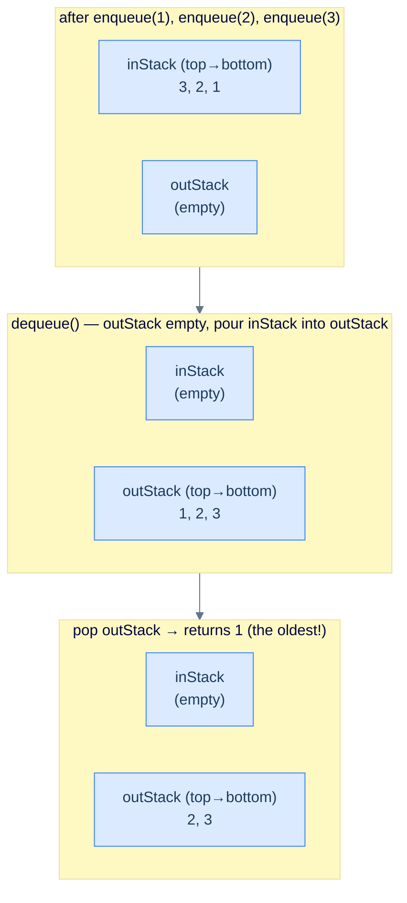

# Design a Queue Using Stacks

## The Problem

Stacks are **LIFO**, queues are **FIFO** — each other's mirror image. Can you build a queue using only stacks? The answer is *yes*, and the construction shows how *composition* of simple primitives simulates behaviour none of them has alone: pouring a stack into another stack reverses order, and reversing twice restores it — so two stacks simulate FIFO.

> Implement a `Queue` class whose **only** internal storage is **at most two stacks**:
>
> - `Queue(capacity)` — initialise with the given capacity.
> - `size()` — current number of elements.
> - `empty()` — `true` iff empty.
> - `front()` — the front element, or `-1` if empty.
> - `back()` — the back element, or `-1` if empty.
> - `enqueue(val)` — add at the back; return `true`, or `false` if full.
> - `dequeue()` — remove and return the front; `-1` if empty.

```
Input:
  ops  = [Queue, enqueue, back, enqueue, front, empty, dequeue, front, enqueue, enqueue, empty]
  args = [[2],   [2],     [],   [3],     [],    [],    [],      [],    [8],     [9],     []]

Output:
  [null, true, 2, true, 2, false, 2, 3, true, false, false]
```

```quiz
{
  "prompt": "You enqueue 1, 2, 3 into a two-stack queue, then call dequeue() three times. In what order do the values come out?",
  "input": "enqueue(1), enqueue(2), enqueue(3), dequeue() ×3",
  "options": ["1, 2, 3", "3, 2, 1", "1, 3, 2", "2, 1, 3"],
  "answer": "1, 2, 3"
}
```

## Constraints

- Use **at most two stacks** as internal storage. No arrays, linked lists, or deques.
- The two stacks expose only `push`, `pop`, `top`, `empty`, and `size`.
- `enqueue` fails (returns `false`) once `size() == capacity`.

The workbench drives your class through a fixed sequence: it enqueues the `enqueues` values in order (respecting capacity), prints the current `front`, `back`, and `size`, then performs `dequeues` dequeues — printing each returned value — and finally whether the queue is empty. Implement all seven methods so every line matches.

```python run viz=array viz-kind=queue
import ast

class Queue:
    def __init__(self, capacity):
        self.in_stack = []          # receives every enqueue (top = the back)
        self.out_stack = []         # dequeues happen here (top = the front)
        self.max_size = capacity

    def size(self):
        # Your code goes here — elements live across both stacks.
        return 0

    def empty(self):
        # Your code goes here — empty iff both stacks are empty.
        return True

    def front(self):
        # Your code goes here — if out_stack is empty, pour in_stack into it
        # (the reverse), then its top is the oldest element. -1 if empty.
        return -1

    def back(self):
        # Your code goes here — the most recent enqueue is in_stack's top;
        # if in_stack is empty, pour out_stack back to reach it. -1 if empty.
        return -1

    def enqueue(self, val):
        # Your code goes here — reject when full, else push onto in_stack.
        return False

    def dequeue(self):
        # Your code goes here — like front(), but pop the exposed element. -1 if empty.
        return -1

q = Queue(int(input()))              # capacity
enqueues = ast.literal_eval(input()) # values to enqueue, in order
dequeues = int(input())              # number of dequeues afterwards

for v in enqueues:
    q.enqueue(v)
print("front =", q.front(), "back =", q.back(), "size =", q.size())
for _ in range(dequeues):
    print("dequeue =", q.dequeue())
print("empty =", "true" if q.empty() else "false")
```

```java run viz=array viz-kind=queue
import java.util.*;

public class Main {
    static class Queue {
        private Stack<Integer> inStack = new Stack<>();   // receives every enqueue (top = the back)
        private Stack<Integer> outStack = new Stack<>();  // dequeues happen here (top = the front)
        private int maxSize;

        Queue(int capacity) { maxSize = capacity; }

        int size() {
            // Your code goes here — elements live across both stacks.
            return 0;
        }

        boolean empty() {
            // Your code goes here — empty iff both stacks are empty.
            return true;
        }

        int front() {
            // Your code goes here — if outStack is empty, pour inStack into it
            // (the reverse), then its top is the oldest element. -1 if empty.
            return -1;
        }

        int back() {
            // Your code goes here — the most recent enqueue is inStack's top;
            // if inStack is empty, pour outStack back to reach it. -1 if empty.
            return -1;
        }

        boolean enqueue(int val) {
            // Your code goes here — reject when full, else push onto inStack.
            return false;
        }

        int dequeue() {
            // Your code goes here — like front(), but pop the exposed element. -1 if empty.
            return -1;
        }
    }

    public static void main(String[] args) {
        Scanner sc = new Scanner(System.in);
        Queue q = new Queue(Integer.parseInt(sc.nextLine().trim()));  // capacity
        int[] enqueues = parseIntArray(sc.nextLine());               // values to enqueue, in order
        int dequeues = Integer.parseInt(sc.nextLine().trim());       // number of dequeues afterwards

        for (int v : enqueues) q.enqueue(v);
        System.out.println("front = " + q.front() + " back = " + q.back() + " size = " + q.size());
        for (int i = 0; i < dequeues; i++) System.out.println("dequeue = " + q.dequeue());
        System.out.println("empty = " + (q.empty() ? "true" : "false"));
    }

    // "[1, 2, 3]" → {1, 2, 3} — reads a test-case list
    static int[] parseIntArray(String line) {
        String inner = line.replaceAll("[\\[\\]\\s]", "");
        if (inner.isEmpty()) return new int[0];
        String[] parts = inner.split(",");
        int[] out = new int[parts.length];
        for (int i = 0; i < parts.length; i++) out[i] = Integer.parseInt(parts[i]);
        return out;
    }
}
```

```testcases
{
  "args": [
    { "id": "capacity", "label": "capacity", "type": "int", "placeholder": "3" },
    { "id": "enqueues", "label": "enqueues", "type": "int[]", "placeholder": "[1, 2, 3]" },
    { "id": "dequeues", "label": "dequeues", "type": "int", "placeholder": "2" }
  ],
  "cases": [
    { "args": { "capacity": "3", "enqueues": "[1, 2, 3]", "dequeues": "2" }, "expected": "front = 1 back = 3 size = 3\ndequeue = 1\ndequeue = 2\nempty = false" },
    { "args": { "capacity": "2", "enqueues": "[5, 6, 7]", "dequeues": "0" }, "expected": "front = 5 back = 6 size = 2\nempty = false" },
    { "args": { "capacity": "1", "enqueues": "[]", "dequeues": "1" }, "expected": "front = -1 back = -1 size = 0\ndequeue = -1\nempty = true" },
    { "args": { "capacity": "3", "enqueues": "[9]", "dequeues": "1" }, "expected": "front = 9 back = 9 size = 1\ndequeue = 9\nempty = true" },
    { "args": { "capacity": "5", "enqueues": "[1, 2, 3, 4]", "dequeues": "2" }, "expected": "front = 1 back = 4 size = 4\ndequeue = 1\ndequeue = 2\nempty = false" }
  ]
}
```

<details>
<summary><h2>Intuition — pour-and-reverse</h2></summary>

A stack reverses insertion order: push 1, 2, 3 → pop returns 3, 2, 1. That's *one* reversal. Reverse *twice* and you're back to the original order — exactly what a queue wants. **Reverse twice = identity = FIFO.**

- **inStack** receives every enqueue. Its top is the most-recent enqueue (the queue's *back*).
- **outStack** is where dequeues happen. Its top is the *oldest* enqueue (the queue's *front*).
- When `outStack` is empty and a dequeue is needed, **lazily transfer** everything from `inStack` to `outStack`. The pour reverses the order, so what was at the bottom of `inStack` (oldest) becomes the top of `outStack` (next out).



<p align="center"><strong>Pour-and-reverse — inStack's bottom (oldest) becomes outStack's top after the transfer. Dequeue stays O(1) for as long as outStack has items; only when it drains does another batch transfer happen.</strong></p>

**The subtle one is `back()`.** The back is the most-recent enqueue — `inStack`'s top, *unless* `inStack` is empty (everything got transferred to `outStack`), in which case the most-recent enqueue is at the *bottom* of `outStack`. The implementation reaches it by pouring `outStack` back into `inStack`, re-reversing so the newest lands on top again. Honest trade-off: `back()` is O(1) in the common case but O(N) when it has to pour back. The standard production fix is a single `backVal` field overwritten on every successful enqueue — then `back()` is a field read regardless. We keep the pour-back here to stay honest to "at most two stacks, nothing else."

</details>
<details>
<summary><h2>Solution &amp; Analysis</h2></summary>

### Solution

```python solution time=O(1) space=O(n)
import ast

class Queue:
    def __init__(self, capacity):

        # Stack that receives every enqueue
        self.in_stack = []

        # Stack that dequeues happen from
        self.out_stack = []

        # Maximum capacity of the queue
        self.max_size = capacity

    def size(self):

        # Size is the total elements across both stacks
        return len(self.in_stack) + len(self.out_stack)

    def empty(self):

        # Empty only when both stacks are empty
        return len(self.in_stack) == 0 and len(self.out_stack) == 0

    def front(self):
        if self.empty():
            return -1

        # If out_stack is empty, pour in_stack into it to reverse the order
        if len(self.out_stack) == 0:
            while self.in_stack:
                self.out_stack.append(self.in_stack.pop())

        # Top of out_stack is now the oldest element — the front
        return self.out_stack[-1]

    def back(self):
        if self.empty():
            return -1

        # The most-recent enqueue is on top of in_stack...
        if self.in_stack:
            return self.in_stack[-1]

        # ...or, if in_stack is empty, pour out_stack back to surface it
        while self.out_stack:
            self.in_stack.append(self.out_stack.pop())
        return self.in_stack[-1]

    def enqueue(self, val):

        # Reject when at capacity
        if self.size() == self.max_size:
            return False

        # Every enqueue lands on in_stack
        self.in_stack.append(val)
        return True

    def dequeue(self):
        if self.empty():
            return -1

        # Refill out_stack from in_stack if needed
        if len(self.out_stack) == 0:
            while self.in_stack:
                self.out_stack.append(self.in_stack.pop())

        # Pop the exposed front element
        return self.out_stack.pop()

q = Queue(int(input()))              # capacity
enqueues = ast.literal_eval(input()) # values to enqueue, in order
dequeues = int(input())              # number of dequeues afterwards

for v in enqueues:
    q.enqueue(v)
print("front =", q.front(), "back =", q.back(), "size =", q.size())
for _ in range(dequeues):
    print("dequeue =", q.dequeue())
print("empty =", "true" if q.empty() else "false")
```

```java solution
import java.util.*;

public class Main {
    static class Queue {

        // Stack that receives every enqueue
        private Stack<Integer> inStack = new Stack<>();

        // Stack that dequeues happen from
        private Stack<Integer> outStack = new Stack<>();

        // Maximum capacity of the queue
        private int maxSize;

        Queue(int capacity) { maxSize = capacity; }

        int size() {

            // Size is the total elements across both stacks
            return inStack.size() + outStack.size();
        }

        boolean empty() {

            // Empty only when both stacks are empty
            return inStack.empty() && outStack.empty();
        }

        int front() {
            if (empty()) return -1;

            // If outStack is empty, pour inStack into it to reverse the order
            if (outStack.empty()) {
                while (!inStack.empty()) outStack.push(inStack.pop());
            }

            // Top of outStack is now the oldest element — the front
            return outStack.peek();
        }

        int back() {
            if (empty()) return -1;

            // The most-recent enqueue is on top of inStack...
            if (!inStack.empty()) return inStack.peek();

            // ...or, if inStack is empty, pour outStack back to surface it
            while (!outStack.empty()) inStack.push(outStack.pop());
            return inStack.peek();
        }

        boolean enqueue(int val) {

            // Reject when at capacity
            if (size() == maxSize) return false;

            // Every enqueue lands on inStack
            inStack.push(val);
            return true;
        }

        int dequeue() {
            if (empty()) return -1;

            // Refill outStack from inStack if needed
            if (outStack.empty()) {
                while (!inStack.empty()) outStack.push(inStack.pop());
            }

            // Pop the exposed front element
            return outStack.pop();
        }
    }

    public static void main(String[] args) {
        Scanner sc = new Scanner(System.in);
        Queue q = new Queue(Integer.parseInt(sc.nextLine().trim()));  // capacity
        int[] enqueues = parseIntArray(sc.nextLine());               // values to enqueue, in order
        int dequeues = Integer.parseInt(sc.nextLine().trim());       // number of dequeues afterwards

        for (int v : enqueues) q.enqueue(v);
        System.out.println("front = " + q.front() + " back = " + q.back() + " size = " + q.size());
        for (int i = 0; i < dequeues; i++) System.out.println("dequeue = " + q.dequeue());
        System.out.println("empty = " + (q.empty() ? "true" : "false"));
    }

    // "[1, 2, 3]" → {1, 2, 3} — reads a test-case list
    static int[] parseIntArray(String line) {
        String inner = line.replaceAll("[\\[\\]\\s]", "");
        if (inner.isEmpty()) return new int[0];
        String[] parts = inner.split(",");
        int[] out = new int[parts.length];
        for (int i = 0; i < parts.length; i++) out[i] = Integer.parseInt(parts[i]);
        return out;
    }
}
```

### Why amortised O(1) per dequeue

A worst-case dequeue costs O(N) — the transfer. But every item moves *at most twice* in its lifetime: once into `inStack` (enqueue) and once from `inStack` to `outStack` (the lazy transfer). Spread the transfer cost across all the dequeues it enables, and the **amortised cost is O(1) per dequeue** — the same accounting trick that makes dynamic-array `push_back` amortised O(1) despite occasional O(N) resizes.

| Operation | Worst case | Amortised |
|---|---|---|
| `enqueue` | O(1) | O(1) |
| `dequeue` | O(N) (transfer) | **O(1)** |
| `front` | O(N) (transfer) | **O(1)** |
| `back` | O(N) (pour-back when inStack empty) | O(1) common case |
| `size`, `empty` | O(1) | O(1) |

The amortised guarantee holds for enqueue/dequeue workloads (each item moves at most twice). Interleaving `back()` calls after a transfer can force repeated pour-backs, so it no longer holds for `back`-heavy workloads — the `backVal` cache from the Intuition is the fix when that matters.

</details>
<details>
<summary><h2>The Dual — a Stack from Queues</h2></summary>

The construction runs both ways: you can build a **LIFO stack out of FIFO queues** too — but the cost shifts to the *other* operation. A queue dequeues from the front; a stack pops from the top. So the goal becomes: **after every push, the most recently pushed value sits at the front of the queue.** Then `pop` is just `dequeue` and `top` is `front`, both O(1) — at the price of an O(N) push.

- **Two queues.** To push `v`: enqueue `v` into the empty queue `q2`, then drain the full queue `q1` into `q2` behind it. Now `q2`'s front is `v`, followed by the rest in order. Swap the names so `q1` always holds the data.
- **One queue.** Same idea without the second container: enqueue `v` (it lands at the *back*), then rotate the queue `size − 1` times — dequeue from the front and re-enqueue at the back — so `v` ends up at the front and the rest trail behind it in order. (Rotate `size` times and you've gone all the way around, undoing it — hence `size − 1`.)

Both give **O(N) push, O(1) pop/top** — the exact mirror of the two-stack queue's amortised O(1). The single-queue version uses less memory and is the more elegant of the two.

</details>
<details>
<summary><h2>Key Takeaway</h2></summary>

1. **Queue from two stacks — amortised O(1).** The lazy transfer is the gem: every item moves at most twice, so the worst-case O(N) dequeue is paid back by the cheap dequeues after it. (The same idea powers Okasaki's banker's queue.)
2. **Stack from queues — push pays the price.** One queue or two, it's O(N) per push, O(1) per pop; the rotation happens on *every* push, so there's no amortisation — only a memory-vs-clarity trade-off.
3. **Stacks and queues are duals, not equivalents.** They can simulate each other, but never for free — amortised O(1) one way, worst-case O(N) the other. Picking the right primitive *first* is always cheaper than retrofitting.

> **Transfer Challenge:** Make `back()` O(1) in *every* case without breaking the two-stack constraint's spirit. (Cache a `backVal` integer, overwritten on every successful enqueue — a single field read, no pour-back. What invariant must `dequeue` preserve when it empties the queue?)

</details>
