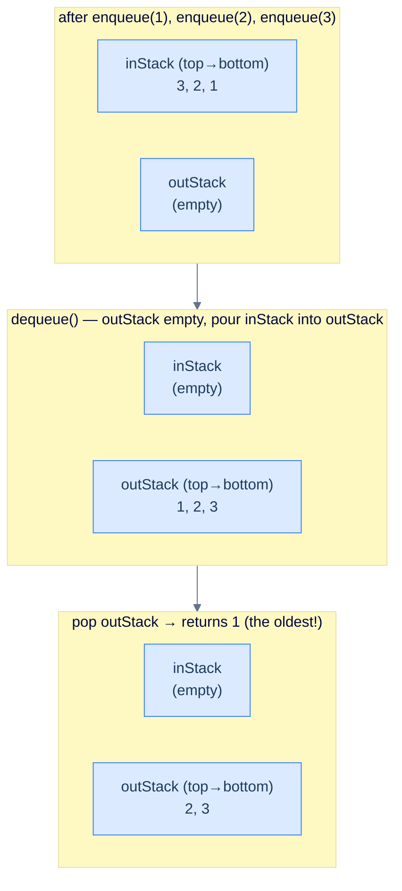
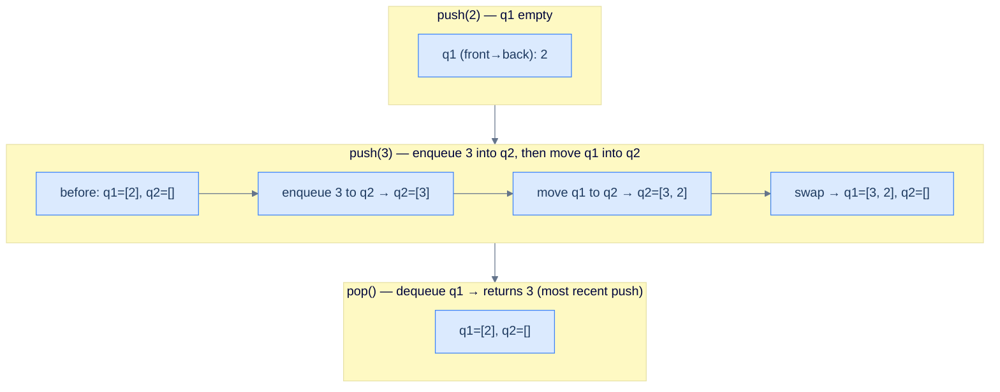
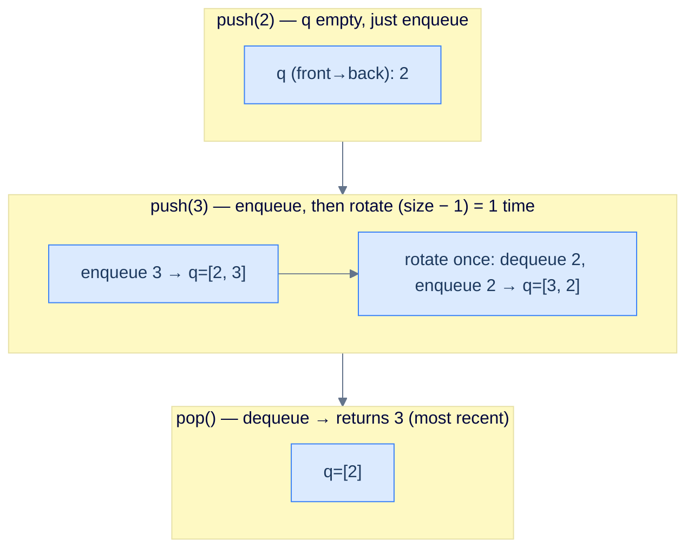

Stacks are **LIFO**, queues are **FIFO** — each other's mirror image. Can you build a queue using only stacks? A stack using only queues? Both answers are *yes*, and the construction shows how *composition* of simple primitives simulates behaviour none of them has alone: pouring a stack into another stack reverses order, and reversing twice restores it, so two stacks simulate FIFO. This lesson builds three such constructions end-to-end — **queue from two stacks**, **stack from two queues**, **stack from one queue** — each testing whether you understand FIFO and LIFO as *contracts* you can compose.

## Design a Queue Using Stacks

### Problem Statement

Implement a `Queue` class using **at most two stacks** as the only internal storage. All standard queue operations must be supported.

> -   **`Queue(int capacity)`** — initialise with the given capacity.
> -   **`size()`** — return current size.
> -   **`empty()`** — return `true` if empty.
> -   **`front()`** — front element, or `-1` if empty.
> -   **`back()`** — back element, or `-1` if empty.
> -   **`enqueue(int val)`** — add at the back; return `true`, or `false` if full.
> -   **`dequeue()`** — remove and return the front; `-1` if empty.

> **Constraints:**
> - Use **at most two stacks** as internal storage. No arrays, no linked lists, no deques.
> - The two stacks expose only `push`, `pop`, `top`, `empty`, and `size`.

> **Worked Example:**
>
> Input: `[Queue, enqueue, back, enqueue, front, empty, dequeue, front, enqueue, enqueue, empty]` with operands `[[2], [2], [], [3], [], [], [], [], [8], [9], []]`
>
> Output: `[null, true, 2, true, 2, false, 2, 3, true, false, false]`

<details>
<summary><h2>The Idea — pour-and-reverse</h2></summary>


A stack reverses the insertion order: push 1, 2, 3 → pop returns 3, 2, 1. That's *one* reversal. If you reverse *twice*, you're back to the original order — which is exactly what a queue wants. **Reverse twice = identity = FIFO.**

Concretely:

- **inStack** receives every enqueue. Its top is the most-recent enqueue (the queue's *back*).
- **outStack** is where dequeues happen. Its top is the *oldest* enqueue (the queue's *front*).
- When `outStack` is empty and we need to dequeue, we **lazily transfer** everything from `inStack` to `outStack`, popping from one and pushing to the other. The pour reverses the order — so what was at the bottom of `inStack` (oldest) becomes the top of `outStack` (next out).



<p align="center"><strong>Pour-and-reverse — inStack's bottom (oldest) becomes outStack's top after the transfer. From then on, dequeue is O(1) for as long as outStack still has items. Only when outStack drains again does another batch transfer happen.</strong></p>

</details>
<details>
<summary><h2>Why amortised O(1) per dequeue</h2></summary>


A worst-case dequeue costs O(N) (the transfer). But every item is moved *at most twice* during its lifetime in the queue: **once** into `inStack` (during enqueue) and **once** from `inStack` to `outStack` (during the lazy transfer). Spread the transfer cost across all the dequeues that the transfer enables, and the **amortised cost is O(1) per dequeue**.

This is the same accounting trick that makes dynamic-array `push_back` amortised O(1) despite occasional O(N) resizes.

</details>
<details>
<summary><h2>A subtle bit — `back()`</h2></summary>


The back of the queue is the most-recent enqueue, which is the *top of inStack* — *except* if inStack is empty, in which case the most-recent enqueue is currently sitting at the *bottom of outStack*. Reaching it is the awkward case.

The implementation below handles that case by **pouring outStack back into inStack** when inStack is empty: every element is popped off outStack and pushed onto inStack, which re-reverses the order so the most-recent enqueue lands back on top of inStack. Then `back()` just reads `inStack`'s top. The trade-off is honest — `back()` is O(1) in the common case (inStack non-empty) but O(N) in the worst case (outStack holds everything and we have to pour it all back).

> *Predict before reading on — how could you make <code>back()</code> O(1) in every case?*
>
> Maintain a separate `backVal` field that is overwritten on every successful enqueue. Then `back()` is just a field read regardless of which stack the most-recent item lives in. We don't take that shortcut here — the pour-back keeps the implementation honest to "use at most two stacks, nothing else" — but the single-integer cache is the standard production optimisation, and it sidesteps the O(N) corner.

</details>
<details>
<summary><h2>Solution &amp; Analysis</h2></summary>

### Solution

```python run viz=array viz-kind=queue
from typing import List

class Queue:
    def __init__(self, capacity):

        # Stack for enqueue operation
        self.in_stack: List[int] = []

        # Stack for dequeue operation
        self.out_stack: List[int] = []

        # Maximum capacity of the queue
        self.max_size: int = capacity

    def size(self):

        # Size of the queue is the sum of elements in both stacks
        return len(self.in_stack) + len(self.out_stack)

    def empty(self):

        # Queue is empty if both stacks are empty
        return len(self.in_stack) == 0 and len(self.out_stack) == 0

    def front(self):
        if self.empty():

            # If the queue is empty, return -1 (indicating no element)
            return -1

        if len(self.out_stack) == 0:

            # If the out_stack is empty, transfer elements from in_stack
            # to out_stack to reverse their order
            while len(self.in_stack) != 0:

                # Move the top element from in_stack to out_stack
                self.out_stack.append(self.in_stack.pop())

        # Return the top element of out_stack, which is the front of the
        # queue
        return self.out_stack[-1]

    def back(self) -> int:
        if self.empty():

            # If the queue is empty, return -1 (indicating no element)
            return -1

        # The most recently added element is at the top of in_stack
        if self.in_stack:
            return self.in_stack[-1]

        # If in_stack is empty, we have transferred everything to
        # out_stack. The back element is the bottom-most element of
        # out_stack
        else:
            while self.out_stack:
                self.in_stack.append(self.out_stack.pop())

            # Return true to indicate successful enqueue operation
            return self.in_stack[-1]

    def enqueue(self, val):
        if self.size() == self.max_size:

            # If the queue is already at maximum capacity, return False
            # (enqueue failed)
            return False

        # Push the new element into in_stack
        self.in_stack.append(val)

        # Return True to indicate successful enqueue
        return True

    def dequeue(self):
        if self.empty():

            # If the queue is empty, return -1 (indicating no element to
            # dequeue)
            return -1

        if len(self.out_stack) == 0:

            # If the out_stack is empty, transfer elements from in_stack
            # to out_stack to reverse their order
            while len(self.in_stack) != 0:

                # Move the top element from in_stack to out_stack
                self.out_stack.append(self.in_stack.pop())

        # Get the top element of out_stack, which is the front of the
        # queue
        front_element: int = self.out_stack.pop()

        # Return the front element
        return front_element


# Example from the problem statement
q = Queue(2)
print(q.enqueue(2))   # True
print(q.back())       # 2
print(q.enqueue(3))   # True
print(q.front())      # 2
print(q.empty())      # False
print(q.dequeue())    # 2
print(q.front())      # 3
print(q.enqueue(8))   # True
print(q.enqueue(9))   # False — full
print(q.empty())      # False

# Edge cases
q2 = Queue(1)
print(q2.front())     # -1 — empty queue
print(q2.dequeue())   # -1 — dequeue empty
q2.enqueue(5)
print(q2.size())      # 1
print(q2.dequeue())   # 5
print(q2.enqueue(7))  # True — enqueue after full drain
```

```java run viz=array viz-kind=queue
import java.util.*;

public class Main {
    static class Queue {

        // Stack for enqueue operation
        private Stack<Integer> inStack;

        // Stack for dequeue operation
        private Stack<Integer> outStack;

        // Maximum capacity of the queue
        private int maxSize;

        public Queue(int capacity) {
            maxSize = capacity;
            inStack = new Stack<>();
            outStack = new Stack<>();
        }

        public int size() {

            // Size of the queue is the sum of elements in both stacks
            return inStack.size() + outStack.size();
        }

        public boolean empty() {

            // Queue is empty if both stacks are empty
            return inStack.empty() && outStack.empty();
        }

        public int front() {
            if (empty()) {

                // If the queue is empty, return -1 (indicating no element)
                return -1;
            }

            if (outStack.empty()) {

                // If the outStack is empty, transfer elements from inStack
                // to outStack to reverse their order
                while (!inStack.empty()) {

                    // Move the top element from inStack to outStack
                    outStack.push(inStack.pop());
                }
            }

            // Return the top element of outStack, which is the front of the
            // queue
            return outStack.peek();
        }

        int back() {
            if (empty()) {

                // If the queue is empty, return -1 (indicating no element)
                return -1;
            }

            // The most recently added element is at the top of inStack
            if (!inStack.empty()) {
                return inStack.peek();
            }

            // If inStack is empty, we have transferred everything to
            // outStack. The back element is the bottom-most element of
            // outStack
            else {
                while (!outStack.empty()) {
                    inStack.push(outStack.peek());
                    outStack.pop();
                }

                // The last inserted element
                return inStack.peek();
            }
        }

        public boolean enqueue(int val) {
            if (size() == maxSize) {

                // If the queue is already at maximum capacity, return false
                // (enqueue failed)
                return false;
            }

            // Push the new element into inStack
            inStack.push(val);

            // Return true to indicate successful enqueue
            return true;
        }

        public int dequeue() {
            if (empty()) {

                // If the queue is empty, return -1 (indicating no element to
                // dequeue)
                return -1;
            }

            if (outStack.empty()) {

                // If the outStack is empty, transfer elements from inStack
                // to outStack to reverse their order
                while (!inStack.empty()) {

                    // Move the top element from inStack to outStack
                    outStack.push(inStack.pop());
                }
            }

            // Get the top element of outStack, which is the front of the
            // queue
            int frontElement = outStack.pop();

            // Return the front element
            return frontElement;
        }
    }

    public static void main(String[] args) {
        // Example from the problem statement
        Queue q = new Queue(2);
        System.out.println(q.enqueue(2));   // true
        System.out.println(q.back());       // 2
        System.out.println(q.enqueue(3));   // true
        System.out.println(q.front());      // 2
        System.out.println(q.empty());      // false
        System.out.println(q.dequeue());    // 2
        System.out.println(q.front());      // 3
        System.out.println(q.enqueue(8));   // true
        System.out.println(q.enqueue(9));   // false — full
        System.out.println(q.empty());      // false

        // Edge cases
        Queue q2 = new Queue(1);
        System.out.println(q2.front());     // -1 — empty queue
        System.out.println(q2.dequeue());   // -1 — dequeue empty
        q2.enqueue(5);
        System.out.println(q2.size());      // 1
        System.out.println(q2.dequeue());   // 5
        System.out.println(q2.enqueue(7));  // true — enqueue after full drain
    }
}
```

### Complexity Analysis

| Operation | Worst Case | Amortised |
|---|---|---|
| `enqueue`  | O(1) | O(1) |
| `dequeue`  | O(N) (transfer) | **O(1)** |
| `front`    | O(N) (transfer) | **O(1)** |
| `back`     | O(N) (pour-back when inStack is empty) | O(1) (common case: inStack non-empty) |
| `size`, `empty` | O(1) | O(1) |

For a workload that mixes enqueues and dequeues without interleaved `back()` calls, every item moves at most twice through the system (push to inStack, then transfer to outStack), so the *total* work over N operations is O(N), giving O(1) amortised per operation. If `back()` is called after items have been transferred to outStack, the pour-back undoes that work and can be repeated, so the amortised guarantee no longer holds for `back`-heavy workloads — the `backVal` cache from the previous section is the fix when that matters.

</details>

***

## Design a Stack Using Queues

### Problem Statement

Implement a `Stack` class using **at most two queues** as the only internal storage.

> -   **`Stack(int capacity)`** — initialise.
> -   **`size()`** — current size.
> -   **`empty()`** — `true` if empty.
> -   **`top()`** — top element, or `-1` if empty.
> -   **`push(int val)`** — push; return `true`, or `false` if full.
> -   **`pop()`** — remove and return the top; `-1` if empty.

> **Constraints:**
> - Use **at most two queues** internally. Each queue exposes only `enqueue`, `dequeue`, `front`, `empty`, `size`.

> **Worked Example:**
>
> Input: `[Stack, push, push, top, empty, pop, top, push, push, empty]` `[[2], [2], [3], [], [], [], [], [8], [9], []]`
>
> Output: `[null, true, true, 3, false, 3, 2, true, false, false]`

<details>
<summary><h2>The Idea — make every push land at the front</h2></summary>


A queue dequeues from the *front*. A stack pops from the *top*. So the construction we want is: **after every push, the most recently pushed element is at the front of the queue**. Then `pop` is just `dequeue`, and `top` is `front` — both O(1).

To achieve that with two queues: when pushing `v`, enqueue `v` into the *empty* queue (call it `q2`), then drain the *full* queue (`q1`) into `q2` in order. Now `q2`'s front is `v` (which we just pushed), followed by all the previous items in their original order. Swap the names `q1` and `q2` (so that `q1` is always "the queue with the data") and we're done.



<p align="center"><strong>Two-queue stack — every push pays O(N) to relocate everything; in return, pop and top are O(1). The "newest in front" invariant is what makes the stack discipline emerge from queue primitives.</strong></p>

> *Predict before reading on — could you instead make pop O(N) and push O(1)?*
>
> Yes — the "lazy" mirror works too. Push by simple enqueue (O(1)). To pop, rotate all but the last element from `q1` into `q2`, then dequeue the lone remaining element from `q1` (that's the most recent push), then swap. Both designs are correct; you choose based on which operation you expect to dominate. We pick *push-heavy O(N)* here because it makes `top()` also cheap.

</details>
<details>
<summary><h2>Solution &amp; Analysis</h2></summary>

### Solution

```python run viz=array viz-root=top_element
from queue import Queue

class Stack:
    def __init__(self, capacity: int):

        # Two queues to simulate the stack
        # First queue
        self.queue_1: Queue[int] = Queue()

        # Second queue
        self.queue_2: Queue[int] = Queue()

        # Maximum capacity of the stack
        self.capacity: int = capacity

        # Current size of the stack
        self.curr_size: int = 0

    def size(self) -> int:

        # Return the current size of the stack
        return self.curr_size

    def empty(self) -> bool:

        # Return True if the stack is empty (current size is 0),
        # otherwise False
        return self.curr_size == 0

    def top(self) -> int:

        # Stack is empty, return -1 as an error value
        if self.empty():
            return -1

        # Return the first element in queue_1 (top of the stack)
        return self.queue_1.queue[0]

    def push(self, val: int) -> bool:

        # Stack is full, cannot push more elements
        if self.curr_size == self.capacity:
            return False

        # Push the new element to queue_2
        self.queue_2.put(val)

        # Move elements from queue_1 to queue_2
        while not self.queue_1.empty():

            # Push the element from queue_1 to queue_2
            self.queue_2.put(self.queue_1.get())

        # Swap queue_1 and queue_2
        self.queue_1, self.queue_2 = self.queue_2, self.queue_1

        # Increment the size of the stack
        self.curr_size += 1
        return True

    def pop(self) -> int:

        # Stack is empty, return -1 as an error value
        if self.empty():
            return -1

        # Remove and return the first element in queue_1 (top of the
        # stack)
        top_element = self.queue_1.get()

        # Decrement the size of the stack
        self.curr_size -= 1

        # Return the top element
        return top_element


# Example from the problem statement
s = Stack(2)
print(s.push(2))    # True
print(s.push(3))    # True
print(s.top())      # 3
print(s.empty())    # False
print(s.pop())      # 3
print(s.top())      # 2
print(s.push(8))    # True
print(s.push(9))    # False — full
print(s.empty())    # False

# Edge cases
s2 = Stack(1)
print(s2.top())     # -1 — empty stack
print(s2.pop())     # -1 — pop empty
s2.push(5)
print(s2.size())    # 1
print(s2.pop())     # 5
print(s2.empty())   # True
```

```java run viz=array viz-root=top_element
import java.util.*;

public class Main {
    static class Stack {

        // Two queues to simulate the stack
        private Queue<Integer> queue1, queue2;

        // Maximum capacity of the stack
        private int capacity;

        // Current size of the stack
        private int currSize;

        public Stack(int capacity) {
            this.capacity = capacity;
            currSize = 0;
            queue1 = new LinkedList<>();
            queue2 = new LinkedList<>();
        }

        public int size() {

            // Return the current size of the stack
            return currSize;
        }

        public boolean empty() {

            // Return true if the stack is empty (current size is 0),
            // otherwise false
            return currSize == 0;
        }

        public int top() {

            // Stack is empty, return -1 as an error value
            if (empty()) {
                return -1;
            }

            // Return the front element of queue1 (top of the stack)
            return queue1.peek();
        }

        public boolean push(int val) {

            // Stack is full, cannot push more elements
            if (currSize == capacity) {
                return false;
            }

            // Push the new element to queue2
            queue2.add(val);

            // Move elements from queue1 to queue2
            while (!queue1.isEmpty()) {

                // Push the front element of queue1 to queue2 and remove it
                // from queue1
                queue2.add(queue1.poll());
            }

            // Swap queue1 and queue2 using a temporary variable
            Queue<Integer> temp = queue1;
            queue1 = queue2;
            queue2 = temp;

            // Increment the size of the stack
            currSize++;
            return true;
        }

        public int pop() {

            // Stack is empty, return -1 as an error value
            if (empty()) {
                return -1;
            }

            // Remove and return the front element of queue1 (top of the
            // stack)
            int topElement = queue1.poll();

            // Decrement the size of the stack
            currSize--;

            // Return the top element
            return topElement;
        }
    }

    public static void main(String[] args) {
        // Example from the problem statement
        Stack s = new Stack(2);
        System.out.println(s.push(2));    // true
        System.out.println(s.push(3));    // true
        System.out.println(s.top());      // 3
        System.out.println(s.empty());    // false
        System.out.println(s.pop());      // 3
        System.out.println(s.top());      // 2
        System.out.println(s.push(8));    // true
        System.out.println(s.push(9));    // false — full
        System.out.println(s.empty());    // false

        // Edge cases
        Stack s2 = new Stack(1);
        System.out.println(s2.top());     // -1 — empty stack
        System.out.println(s2.pop());     // -1 — pop empty
        s2.push(5);
        System.out.println(s2.size());    // 1
        System.out.println(s2.pop());     // 5
        System.out.println(s2.empty());   // true
    }
}
```

### Complexity Analysis

| Operation | Time |
|---|---|
| `push` | **O(N)** (drain + enqueue) |
| `pop`, `top`, `size`, `empty` | **O(1)** |

Push is genuinely O(N) here — there's no amortisation, because every push relocates *every* element. This is why two-stacks-as-queue is the more common interview answer (better amortised cost) — but two-queues-as-stack is still useful when push is rare and pop/top are hot.

</details>

***

## Design a Stack Using a Single Queue

### Problem Statement

Same interface as above, but with **only one queue** internally.

> -   **`Stack(int capacity)`** — initialise.
> -   **`size()`**, **`empty()`**, **`top()`**, **`push(int val)`**, **`pop()`** — same contracts as the two-queue version.

> **Constraint:** Use **exactly one** queue internally. No second queue, no auxiliary stack.

<details>
<summary><h2>The Idea — rotate after every push</h2></summary>


The two-queue solution moved data between containers to keep "newest at front". With only one queue, we use the *same* container as both source and destination — by rotating.

Concretely: after enqueueing `v` (which lands at the *back*), rotate the queue by `size − 1` positions: dequeue from the front and immediately re-enqueue at the back, `size − 1` times. The net effect: `v` ends up at the front, and the rest are behind it in their original relative order.



<p align="center"><strong>Single-queue stack — push enqueues then rotates so the new item lands at the front. Pop and top are then O(1) (just dequeue / front). The whole stack discipline emerges from O(N) work per push.</strong></p>

> **Why size − 1, not size?** After enqueueing `v`, the queue has `size` items, with `v` at the back and the rest in their old order ahead of it. Rotating `size − 1` times moves the `size − 1` *non-v* items to behind `v`, leaving `v` at the front. Rotate `size` times and you've gone all the way around — `v` is back at the back, defeating the purpose.

</details>
<details>
<summary><h2>Solution &amp; Analysis</h2></summary>

### Solution

```python run viz=array viz-root=queue
from queue import Queue

class Stack:
    def __init__(self, capacity: int):

        # Queue to store the elements of the stack
        self.queue: Queue[int] = Queue()

        # Maximum capacity of the stack
        self.capacity: int = capacity

    def size(self) -> int:

        # Returns the number of elements in the stack
        return self.queue.qsize()

    def empty(self) -> bool:

        # Return True if the stack is empty (current size is 0),
        # otherwise False
        return self.queue.empty()

    def top(self) -> int:

        # If stack is empty, return -1
        if self.queue.empty():
            return -1

        size: int = self.queue.qsize()
        for _ in range(size - 1):

            # Move the front element to the back of the queue (rotating
            # the elements)
            self.queue.put(self.queue.get())

        # The front element is now the top element
        top: int = self.queue.queue[0]

        # Push it back to maintain the original order
        self.queue.put(top)

        # Remove the duplicated element from the front
        self.queue.get()

        return top

    def push(self, val: int) -> bool:

        # Stack is full, unable to push
        if self.queue.qsize() == self.capacity:
            return False

        self.queue.put(val)

        # Element pushed successfully
        return True

    def pop(self) -> int:

        # Stack is empty, no element to pop
        if self.queue.empty():
            return -1

        size: int = self.queue.qsize()
        for _ in range(size - 1):

            # Move the front element to the back of the queue (rotating
            # the elements)
            self.queue.put(self.queue.get())

        # The front element is now the top element to be popped
        popped_element: int = self.queue.get()
        return popped_element


# Example from the problem statement
s = Stack(2)
print(s.push(2))    # True
print(s.push(3))    # True
print(s.top())      # 3
print(s.empty())    # False
print(s.pop())      # 3
print(s.top())      # 2
print(s.push(8))    # True
print(s.push(9))    # False — full
print(s.empty())    # False

# Edge cases
s2 = Stack(1)
print(s2.top())     # -1 — empty stack
print(s2.pop())     # -1 — pop empty
s2.push(5)
print(s2.size())    # 1
print(s2.pop())     # 5
print(s2.empty())   # True
```

```java run viz=array viz-root=queue
import java.util.*;

public class Main {
    static class Stack {

        // Queue to store the elements of the stack
        private Queue<Integer> queue;

        // Maximum capacity of the stack
        private int capacity;

        public Stack(int capacity) {
            this.capacity = capacity;
            this.queue = new LinkedList<>();
        }

        public int size() {

            // Returns the number of elements in the stack
            return queue.size();
        }

        public boolean empty() {

            // Return true if the stack is empty (current size is 0),
            // otherwise false
            return queue.isEmpty();
        }

        public int top() {

            // If stack is empty, return -1
            if (queue.isEmpty()) {
                return -1;
            }

            int size = queue.size();
            while (size > 1) {

                // Move the front element to the back of the queue (rotating
                // the elements)
                queue.add(queue.poll());
                size--;
            }

            // The front element is now the top element
            int top = queue.peek();

            // Push it back to maintain the original order
            queue.add(top);

            // Remove the duplicated element from the front
            queue.poll();

            return top;
        }

        public boolean push(int val) {

            // Stack is full, unable to push
            if (queue.size() == capacity) {
                return false;
            }

            queue.add(val);

            // Element pushed successfully
            return true;
        }

        public int pop() {

            // Stack is empty, no element to pop
            if (queue.isEmpty()) {
                return -1;
            }

            int size = queue.size();
            while (size > 1) {

                // Move the front element to the back of the queue (rotating
                // the elements)
                queue.add(queue.poll());
                size--;
            }

            // The front element is now the top element to be popped
            int poppedElement = queue.poll();
            return poppedElement;
        }
    }

    public static void main(String[] args) {
        // Example from the problem statement
        Stack s = new Stack(2);
        System.out.println(s.push(2));    // true
        System.out.println(s.push(3));    // true
        System.out.println(s.top());      // 3
        System.out.println(s.empty());    // false
        System.out.println(s.pop());      // 3
        System.out.println(s.top());      // 2
        System.out.println(s.push(8));    // true
        System.out.println(s.push(9));    // false — full
        System.out.println(s.empty());    // false

        // Edge cases
        Stack s2 = new Stack(1);
        System.out.println(s2.top());     // -1 — empty stack
        System.out.println(s2.pop());     // -1 — pop empty
        s2.push(5);
        System.out.println(s2.size());    // 1
        System.out.println(s2.pop());     // 5
        System.out.println(s2.empty());   // true
    }
}
```

### Complexity Analysis

| Operation | Time |
|---|---|
| `push` | **O(N)** (rotate after enqueue) |
| `pop`, `top`, `size`, `empty` | **O(1)** |

Same shape as the two-queue version — push pays for the abstraction; everything else is free. The single-queue version uses *less memory* (only one underlying queue) and is arguably the more elegant of the two.

</details>
## Key Takeaway

Each construction simulates one access discipline using primitives that support only the opposite — and you pay for it:

1. **Queue from two stacks — amortised O(1).** The lazy transfer is the gem: every item moves at most twice, so the worst-case O(N) dequeue is paid back by the cheap dequeues after it. (The same idea powers Okasaki's banker's queue.)
2. **Stack from queues — push pays the price.** One queue or two, the cost is O(N) per push, O(1) per pop; the rotation happens on *every* push, so there's no amortisation — only a memory-vs-clarity trade-off.
3. **Stacks and queues are duals, not equivalents.** They can simulate each other, but never for free — amortised O(1) one way, worst-case O(N) the other. Picking the right primitive *first* is always cheaper than retrofitting.
