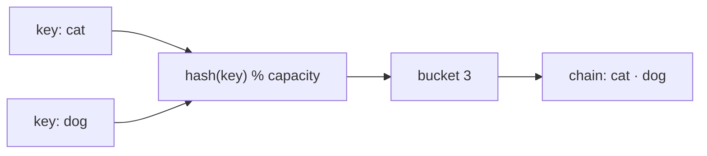

# Hash Tables

## Why It Exists

You want to look something up by a **key** — a username, a word, a phone-book name — and get its value back instantly. An array already does instant lookup, but only by *integer index*: `arr[3]` is `O(1)` because the index *is* the address. Your keys aren't integers, though. Searching a million `(name, number)` pairs for `"Neha"` means scanning until you find her — `O(n)`.

Here's the move that should feel like cheating: what if you could *compute* an array index straight from the key? Feed `"Neha"` to a function, get back `2`, and read `arr[2]` — no search at all. You'd have the array's `O(1)` speed, but keyed by *anything*.

That function is a **hash function**, and the array it indexes into is a **hash table**. It's how every dictionary, set, database index, and cache turns "find this key" from a walk into a single jump.

## See It Work

A hash function maps each key to a bucket index. Pick a case and **Run** it — each key hashes to a bucket — and click **Visualise** to watch two keys land in the *same* bucket and share it.

> ▶ Run it, then click **Visualise** — each key hashes to a bucket; when two collide, they chain together in that bucket.

```python run viz=hashmap viz-root=table viz-kind=hashmap
class Entry:
    def __init__(self, key, value):
        self.key, self.value = key, value

inner = input().strip()[1:-1]               # the test case's keys, e.g. [cat, dog, fish]
keys = [k.strip() for k in inner.split(",")]

table = {}                                  # bucket index -> chain of entries

def put(key, value):
    i = len(key) % 4                        # toy hash: key length, mod 4 buckets
    table.setdefault(i, []).append(Entry(key, value))

for order, key in enumerate(keys):
    put(key, order)                         # colliding keys chain in the same bucket
# sort by bucket index so the output is identical across languages
print({i: [e.key for e in ch] for i, ch in sorted(table.items())})
```

```java run viz=hashmap viz-root=table viz-kind=hashmap
import java.util.*;

public class Main {
  static class Entry {
    String key; int value;
    Entry(String key, int value) { this.key = key; this.value = value; }
  }

  public static void main(String[] args) {
    String inner = new Scanner(System.in).nextLine().replaceAll("[\\[\\]]", "");
    String[] keys = inner.split(",");                       // the test case's keys

    // a TreeMap keeps buckets in index order — so the printout matches Python's
    TreeMap<Integer, List<Entry>> table = new TreeMap<>();  // bucket index -> chain
    for (int order = 0; order < keys.length; order++) {
      String key = keys[order].trim();
      int i = key.length() % 4;                             // toy hash: key length, mod 4
      table.computeIfAbsent(i, b -> new ArrayList<>()).add(new Entry(key, order));
    }

    StringBuilder sb = new StringBuilder("{");
    boolean firstBucket = true;
    for (Map.Entry<Integer, List<Entry>> e : table.entrySet()) {
      if (!firstBucket) sb.append(", ");
      firstBucket = false;
      sb.append(e.getKey()).append(": [");
      for (int j = 0; j < e.getValue().size(); j++) {
        if (j > 0) sb.append(", ");
        sb.append("'").append(e.getValue().get(j).key).append("'");
      }
      sb.append("]");
    }
    sb.append("}");
    System.out.println(sb);                                 // {0: ['fish', 'bird'], 3: ['cat', 'dog']}
  }
}
```

```testcases
{
  "args": [
    { "id": "keys", "label": "keys", "type": "string[]", "placeholder": "[cat, dog, fish, bird]" }
  ],
  "cases": [
    { "args": { "keys": "[cat, dog, fish, bird]" }, "expected": "{0: ['fish', 'bird'], 3: ['cat', 'dog']}" },
    { "args": { "keys": "[a, bb, ccc]" }, "expected": "{1: ['a'], 2: ['bb'], 3: ['ccc']}" },
    { "args": { "keys": "[ant, bee, cow, duck, eel]" }, "expected": "{0: ['duck'], 3: ['ant', 'bee', 'cow', 'eel']}" }
  ]
}
```

## How It Works

A hash table is an **array of buckets** plus a **hash function** that turns a key into a bucket index:

```
index = hash(key) % capacity
```

`hash(key)` produces some integer; `% capacity` folds it into a valid slot. Insert, look up, and delete all do the same two steps — hash the key, go to that slot — so each is **`O(1)` on average**. There's no scan; you *compute* where the key lives.

But two different keys can hash to the same index — a **collision** — and they're not a rare accident: with more keys than buckets they're guaranteed (the pigeonhole principle). So every hash table needs a **collision-resolution** strategy, and there are two families:

- **Separate chaining** — each bucket holds a little *linked list*; colliding keys just join the list at that bucket.
- **Open addressing** — on a collision, *probe* forward to the next free slot and store the key there.



<p align="center"><strong>the hash function maps each key to a bucket; when two keys land in the same bucket (a collision), separate chaining stores both in a small list.</strong></p>

What keeps the average `O(1)` is the **load factor** — `entries / capacity`. Let it climb and buckets get crowded, so lookups drift toward `O(n)`. The fix is to **rehash**: once the load factor crosses a threshold (Java's `HashMap` uses `0.75`), allocate a bigger array and re-place every entry. That occasional `O(n)` rebuild is amortized away, exactly like the dynamic array's doubling.

### Key Takeaway

A hash table computes a key's slot with `hash(key) % capacity` for `O(1)`-average access; collisions are inevitable, so it resolves them (chaining or open addressing) and rehashes to keep the load factor — and the speed — in check.

## Trace It

Insert `"cat"`, `"dog"`, `"fish"` into a 4-bucket table, hashing by length (`len % 4`):

| Key | `len` | `% 4` → bucket | Result |
|---|---|---|---|
| `cat` | 3 | 3 | bucket 3: `[cat]` |
| `dog` | 3 | 3 | bucket 3: `[cat, dog]` ← collision, chained |
| `fish` | 4 | 0 | bucket 0: `[fish]` |

Before you read on: to now *find* `"dog"`, how much of the table does the lookup touch?

Just bucket 3 — hash `"dog"` to `3`, then walk that one short chain. It never looks at buckets 0, 1, or 2. That's the whole game: the hash jumps you to the right bucket, and only a collision adds a tiny bit of walking. (And it's why a *bad* hash that dumps every key into one bucket secretly turns your `O(1)` table back into an `O(n)` linked list.)

## Your Turn

The hash table's signature trick is the **`O(1)` counter**: to tally how often each character appears in a string, look up its running count and add one — no scanning, no sorting, one jump per character. Implement `char_counts(s)`, returning a map from each character to its count.

```python run viz=array
def char_counts(s):
    # Your code goes here — for each character, look up its current count
    # in the dict and add one. Return the dict of character -> count.
    pass

s = input()
counts = char_counts(s)
for ch in sorted(counts):           # sort keys: hash order isn't portable across languages
    print(ch, counts[ch])
```

```java run viz=array
import java.util.*;

public class Main {
  static Map<Character, Integer> charCounts(String s) {
    // Your code goes here — for each character, look up its current count
    // in the map and add one. Return the map of character -> count.
    return new HashMap<>();
  }
  public static void main(String[] args) {
    String s = new Scanner(System.in).nextLine();
    Map<Character, Integer> counts = charCounts(s);
    List<Character> keys = new ArrayList<>(counts.keySet());
    Collections.sort(keys);           // sort keys: hash order isn't portable across languages
    for (char ch : keys) System.out.println(ch + " " + counts.get(ch));
  }
}
```

```testcases
{
  "args": [
    { "id": "s", "label": "s", "type": "string", "placeholder": "banana" }
  ],
  "cases": [
    { "args": { "s": "banana" }, "expected": "a 3\nb 1\nn 2" },
    { "args": { "s": "aabbcc" }, "expected": "a 2\nb 2\nc 2" },
    { "args": { "s": "mississippi" }, "expected": "i 4\nm 1\np 2\ns 4" },
    { "args": { "s": "hello" }, "expected": "e 1\nh 1\nl 2\no 1" }
  ]
}
```

<details>
<summary>Editorial</summary>

This is the dictionary-as-counter idiom. Walk the string once; for each character, look up its current tally (defaulting to `0` the first time) and store one more. Every lookup-and-update is `O(1)` average, so counting the whole string is `O(n)` — versus the `O(n²)` you'd pay re-scanning for each distinct character without a hash table.

One subtlety the driver handles for you, and it's the headline gotcha of every hash structure: **a hash table has no reliable order.** Python's `dict` happens to keep insertion order; Java's `HashMap` scatters keys by hash. So if you print the entries in their native iteration order, Python and Java disagree — and so do two runs that inserted in different orders. The fix is to **sort the keys before printing** (here, alphabetically). Carry this rule through every problem in this section: any time your answer enumerates a `dict`/`set`/`Map`, canonicalize the order first.

```python solution time=O(n) space=O(n)
def char_counts(s):
    counts = {}
    for ch in s:
        counts[ch] = counts.get(ch, 0) + 1   # O(1) look-up-and-bump
    return counts

s = input()
counts = char_counts(s)
for ch in sorted(counts):                     # sort keys: hash order isn't portable
    print(ch, counts[ch])
```

```java solution
import java.util.*;

public class Main {
  static Map<Character, Integer> charCounts(String s) {
    Map<Character, Integer> counts = new HashMap<>();
    for (char ch : s.toCharArray())
      counts.merge(ch, 1, Integer::sum);       // O(1) look-up-and-bump
    return counts;
  }
  public static void main(String[] args) {
    String s = new Scanner(System.in).nextLine();
    Map<Character, Integer> counts = charCounts(s);
    List<Character> keys = new ArrayList<>(counts.keySet());
    Collections.sort(keys);                    // sort keys: hash order isn't portable
    for (char ch : keys) System.out.println(ch + " " + counts.get(ch));
  }
}
```

</details>

Want the two collision strategies in full? [Separate Chaining](/cortex/data-structures-and-algorithms/linear-structures/hash-table/separate-chaining) builds the linked-list-per-bucket version from scratch; the probing lessons cover open addressing.

## Reflect & Connect

The hash table is the workhorse of practical computing — any time you map keys to values or test membership, it's almost certainly underneath:

- **Every language's dictionary / map / set** — Python `dict`, Java `HashMap`, Go `map`, JS `Object`/`Map` — is a hash table.
- **Database indexes and caches** key on it; **compilers** keep a *symbol table* of names; **deduplication** drops a set of seen items into one.

Two cautions to carry forward. First, `O(1)` is an *average* — a poor hash function (or an adversary feeding worst-case keys) collapses it to `O(n)`, which is why production tables use well-mixed hashes and randomized seeds. Second, the order is gone: a hash table scatters keys by hash, so it gives up the *sorted* or *insertion* order that an array or a balanced tree keeps. When you need ordering, that's the tradeoff that sends you elsewhere.

**Prerequisites:** [Arrays](/cortex/data-structures-and-algorithms/linear-structures/arrays/what-is-an-array), [Linked Lists](/cortex/data-structures-and-algorithms/linear-structures/singly-linked-list/what-is-a-linked-list), and [Measuring Cost](/cortex/data-structures-and-algorithms/foundations/measuring-cost).
**What's next:** a structure that keeps the *largest* item always within reach — the [Heap](/cortex/data-structures-and-algorithms/trees/heap/what-is-a-heap).

## Recall

> **Mnemonic:** *Compute the slot, don't search it: `index = hash(key) % capacity`. Collisions are inevitable — chain or probe — and rehash to stay fast.*

| Operation | Cost | Why |
|---|---|---|
| insert / lookup / delete | `O(1)` average | hash the key, jump to the bucket — no scan |
| same, worst case | `O(n)` | a bad hash piles every key into one bucket |
| space | `O(n)` | buckets plus the entries they hold |

<details>
<summary><strong>Q:</strong> How does a hash table turn a key into a position?</summary>

**A:** `index = hash(key) % capacity` — it *computes* the slot instead of searching.

</details>
<details>
<summary><strong>Q:</strong> What is a collision, and why is it unavoidable?</summary>

**A:** Two keys hashing to the same bucket; with more keys than buckets the pigeonhole principle guarantees it.

</details>
<details>
<summary><strong>Q:</strong> Name the two collision-resolution families.</summary>

**A:** Separate chaining (a list per bucket) and open addressing (probe to the next free slot).

</details>
<details>
<summary><strong>Q:</strong> What is the load factor, and why rehash?</summary>

**A:** `entries / capacity`; when it climbs, buckets crowd and lookups slow, so you grow the array and re-place entries to restore `O(1)`.

</details>

## Sources & Verify

- **CLRS** (Cormen, Leiserson, Rivest, Stein), *Introduction to Algorithms*, 4th ed., **Ch. 11 — Hash Tables**: hashing, chaining, open addressing, and the average-case `O(1)` analysis under simple uniform hashing.
- **Sedgewick & Wayne**, *Algorithms*, 4th ed., §3.4 — hash tables, separate chaining vs linear probing, and load-factor resizing.
- **CPython** `Objects/dictobject.c` (open addressing + perturbation probe) and **OpenJDK** `HashMap.java` (chaining, `0.75` load factor, treeify at 8) — the real production designs; verify the load-factor and collision claims against source.
- Both runnable blocks are verified by running; the `O(1)`-average / `O(n)`-worst-case split follows from the collision argument.
