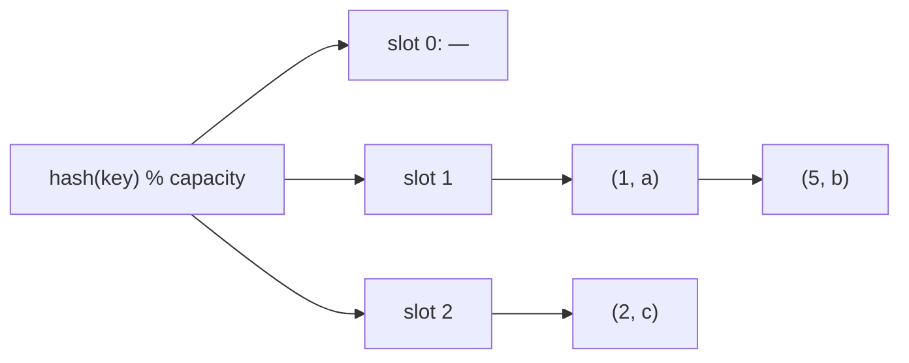

# Separate Chaining

## Why It Exists

A hash table maps a key to an array slot via `hash(key) % capacity`, giving `O(1)` access. But the hash function squeezes a huge key space into a small array, so two different keys will eventually map to the **same slot** — a *collision*. A single array cell can't hold two entries, so the table needs a collision-resolution strategy or it simply can't store both keys.

Separate chaining's answer is the simplest one: make each slot a **chain** — a small list of entries rather than a single cell. Hashing still lands you on a slot in `O(1)`; once there, you walk that slot's short list to find, insert, or remove a key. Collisions don't break anything — they just make one chain a little longer. As long as the chains stay short, every operation is `O(1)` on average.

## See It Work

A table of capacity 4 with integer keys. Keys `1` and `5` both hash to slot `1` (`1 % 4 == 5 % 4 == 1`), so they share a chain. Run it and watch the collision land in one bucket.

> The input is a list of `[key, value]` pairs (integer key, single-char value). The driver inserts them into a capacity-4 table, prints the full buckets array, then looks up the last key inserted.

```python run viz=array
import ast

class HashTable:
    def __init__(self, capacity=4):
        self.capacity = capacity
        self.buckets = [[] for _ in range(capacity)]   # each slot is a chain

    def _index(self, key):
        return key % self.capacity

    def put(self, key, value):
        bucket = self.buckets[self._index(key)]
        for i, (k, _) in enumerate(bucket):
            if k == key:
                bucket[i] = (key, value)    # key exists → update
                return
        bucket.append((key, value))         # new key → append to the chain

    def get(self, key):
        for k, v in self.buckets[self._index(key)]:
            if k == key:
                return v
        return None

pairs = ast.literal_eval(input())           # [[1,"a"],[5,"b"],[2,"c"]]
t = HashTable(4)
for k, v in pairs:
    t.put(k, v)
# build Python list-of-list-of-tuple repr byte-for-byte
parts = []
for bucket in t.buckets:
    if not bucket:
        parts.append("[]")
    else:
        inner = ", ".join(f"({k}, '{v}')" for k, v in bucket)
        parts.append(f"[{inner}]")
print("[" + ", ".join(parts) + "]")        # [[], [(1, 'a'), (5, 'b')], [(2, 'c')], []]
print(t.get(pairs[-1][0]))                 # look up the last key inserted
```

```java run viz=array
import java.util.*;

public class Main {
  static class HashTable {
    int capacity;
    List<int[]>[] buckets;          // each int[] is {key, charValue}
    @SuppressWarnings("unchecked")
    HashTable(int cap) {
      capacity = cap;
      buckets = new List[cap];
      for (int i = 0; i < cap; i++) buckets[i] = new ArrayList<>();
    }
    int index(int key) { return Math.floorMod(key, capacity); }
    void put(int key, char value) {
      List<int[]> b = buckets[index(key)];
      for (int[] e : b) if (e[0] == key) { e[1] = value; return; }
      b.add(new int[]{key, value});
    }
    String get(int key) {
      for (int[] e : buckets[index(key)]) if (e[0] == key) return String.valueOf((char) e[1]);
      return "None";
    }
  }

  public static void main(String[] args) {
    String line = new Scanner(System.in).nextLine().trim();
    // parse [[1,"a"],[5,"b"],[2,"c"]]
    line = line.substring(1, line.length() - 1).trim();   // strip outer []
    String[] tokens = line.split("\\],\\s*\\[");
    List<Integer> keys = new ArrayList<>();
    List<Character> vals = new ArrayList<>();
    for (String tok : tokens) {
      tok = tok.replaceAll("[\\[\\]\"\\s]", "");           // e.g. "1,a"
      String[] kv = tok.split(",");
      keys.add(Integer.parseInt(kv[0]));
      vals.add(kv[1].charAt(0));
    }

    HashTable t = new HashTable(4);
    for (int i = 0; i < keys.size(); i++) t.put(keys.get(i), vals.get(i));

    // build Python-style repr: [[], [(1, 'a'), (5, 'b')], [(2, 'c')], []]
    StringBuilder sb = new StringBuilder("[");
    for (int bi = 0; bi < t.capacity; bi++) {
      if (bi > 0) sb.append(", ");
      List<int[]> bucket = t.buckets[bi];
      if (bucket.isEmpty()) {
        sb.append("[]");
      } else {
        sb.append("[");
        for (int j = 0; j < bucket.size(); j++) {
          if (j > 0) sb.append(", ");
          sb.append("(").append(bucket.get(j)[0]).append(", '")
            .append((char) bucket.get(j)[1]).append("')");
        }
        sb.append("]");
      }
    }
    sb.append("]");
    System.out.println(sb);
    System.out.println(t.get(keys.get(keys.size() - 1)));  // look up last key
  }
}
```

```testcases
{
  "args": [
    { "id": "pairs", "label": "pairs", "type": "string", "placeholder": "[[1,\"a\"],[5,\"b\"],[2,\"c\"]]" }
  ],
  "cases": [
    { "args": { "pairs": "[[1,\"a\"],[5,\"b\"],[2,\"c\"]]" }, "expected": "[[], [(1, 'a'), (5, 'b')], [(2, 'c')], []]\nc" },
    { "args": { "pairs": "[[2,\"x\"],[6,\"y\"],[3,\"z\"]]" }, "expected": "[[], [], [(2, 'x'), (6, 'y')], [(3, 'z')]]\nz" },
    { "args": { "pairs": "[[4,\"m\"],[8,\"n\"]]" }, "expected": "[[(4, 'm'), (8, 'n')], [], [], []]\nn" }
  ]
}
```

## How It Works

The table is an array of `capacity` buckets, each a list of `(key, value)` entries:

1. **Index** — `hash(key) % capacity` picks the slot (`O(1)`).
2. **Walk the chain** — within that slot's list, scan for the key: `get` returns its value, `put` updates it (or appends if absent), `delete` removes it.



<p align="center"><strong>hash to a slot in O(1), then the slot's chain holds every key that landed there; colliding keys (1 and 5) sit in the same chain.</strong></p>

Cost depends on **chain length**. With `n` keys in `capacity` slots, the average chain length is the **load factor** `α = n / capacity`. A good hash function spreads keys evenly, so chains stay near `α` and operations are **`O(1 + α)` average** — effectively `O(1)` when `α` is kept small (a table resizes, doubling capacity and rehashing, when `α` crosses a threshold like 0.75). The **worst case is `O(n)`**: if every key hashes to the same slot, the table degenerates into one long list.

### Key Takeaway

Separate chaining makes each slot a list: hash in `O(1)`, then walk a short chain. Average `O(1 + α)` with the load factor `α = n/capacity` kept low by resizing; worst case `O(n)` when one chain absorbs every key. Simple, and deletion is trivial — just remove from the chain.

## Trace It

Inserting keys `1, 5, 2` into a capacity-4 table (`index = key % 4`):

| put | index | bucket after |
|---|---|---|
| `1 → "a"` | `1` | slot 1: `[(1,a)]` |
| `5 → "b"` | `1` | slot 1: `[(1,a), (5,b)]` ← collision, chained |
| `2 → "c"` | `2` | slot 2: `[(2,c)]` |

Before you read on: keys `1` and `5` landed in the same chain. If you inserted `1, 5, 9, 13` (all `≡ 1 mod 4`) into this capacity-4 table, what happens to performance — and what does a real hash map do to prevent it?

All four hash to slot `1`, so that one chain holds every key while the other three slots sit empty — every `get`/`put` becomes a linear walk of the whole chain, `O(n)`. Two things prevent this in practice: **a good hash function** that scatters keys across all slots (so no slot is favored), and **resizing** — when the load factor `α` exceeds a threshold, the table grows its capacity and rehashes every key, restoring short chains. Real maps also guard the worst case structurally: Java's `HashMap` converts a chain to a balanced (red-black) tree once it passes ~8 entries, capping a degenerate bucket at `O(log n)` instead of `O(n)`.

## Your Turn

The reusable chained hash table (with delete). Implement `put`, `get`, and `delete`, then run the driver — it inserts two keys that collide, does a get, a delete, and another get.

```python run viz=array
class HashTable:
    def __init__(self, capacity=8):
        self.capacity = capacity
        self.buckets = [[] for _ in range(capacity)]
    def _index(self, key):
        return key % self.capacity
    def put(self, key, value):
        # Your code goes here
        pass
    def get(self, key):
        # Your code goes here
        return None
    def delete(self, key):
        # Your code goes here
        return False

t = HashTable()
t.put(10, 100); t.put(18, 180)               # 10 and 18 collide at slot 2 (cap 8)
print(str(t.get(18)) + " " + ("true" if t.delete(10) else "false") + " " + ("null" if t.get(10) is None else str(t.get(10))))
```

```java run viz=array
import java.util.*;

public class Main {
  static class HashTable {
    int capacity; List<int[]>[] buckets;
    @SuppressWarnings("unchecked")
    HashTable(int cap) { capacity = cap; buckets = new List[cap]; for (int i = 0; i < cap; i++) buckets[i] = new ArrayList<>(); }
    int index(int key) { return Math.floorMod(key, capacity); }
    void put(int key, int value) {
      // Your code goes here
    }
    Integer get(int key) {
      // Your code goes here
      return null;
    }
    boolean delete(int key) {
      // Your code goes here
      return false;
    }
  }
  public static void main(String[] args) {
    HashTable t = new HashTable(8);
    t.put(10, 100); t.put(18, 180);          // collide at slot 2
    System.out.println(t.get(18) + " " + t.delete(10) + " " + t.get(10));
  }
}
```

```testcases
{
  "args": [],
  "cases": [
    { "args": {}, "expected": "180 true null" }
  ],
  "verifying": "solution"
}
```

<details>
<summary>Editorial</summary>

Walk the chain to find the key. `put` updates in place if the key exists, appends otherwise. `get` returns the value or `None`/`null`. `delete` removes by index — just `pop`/`remove` from the chain, no tombstoning needed (unlike open addressing). That's the whole structure.

```python solution time=O(1+α) space=O(n)
class HashTable:
    def __init__(self, capacity=8):
        self.capacity = capacity
        self.buckets = [[] for _ in range(capacity)]
    def _index(self, key):
        return key % self.capacity
    def put(self, key, value):
        bucket = self.buckets[self._index(key)]
        for i, (k, _) in enumerate(bucket):
            if k == key:
                bucket[i] = (key, value); return
        bucket.append((key, value))
    def get(self, key):
        for k, v in self.buckets[self._index(key)]:
            if k == key:
                return v
        return None
    def delete(self, key):
        bucket = self.buckets[self._index(key)]
        for i, (k, _) in enumerate(bucket):
            if k == key:
                bucket.pop(i); return True   # just unlink from the chain
        return False

t = HashTable()
t.put(10, 100); t.put(18, 180)               # 10 and 18 collide at slot 2 (cap 8)
print(str(t.get(18)) + " " + ("true" if t.delete(10) else "false") + " " + ("null" if t.get(10) is None else str(t.get(10))))
```

```java solution
import java.util.*;

public class Main {
  static class HashTable {
    int capacity; List<int[]>[] buckets;
    @SuppressWarnings("unchecked")
    HashTable(int cap) { capacity = cap; buckets = new List[cap]; for (int i = 0; i < cap; i++) buckets[i] = new ArrayList<>(); }
    int index(int key) { return Math.floorMod(key, capacity); }
    void put(int key, int value) {
      List<int[]> b = buckets[index(key)];
      for (int[] e : b) if (e[0] == key) { e[1] = value; return; }
      b.add(new int[]{key, value});
    }
    Integer get(int key) { for (int[] e : buckets[index(key)]) if (e[0] == key) return e[1]; return null; }
    boolean delete(int key) {
      List<int[]> b = buckets[index(key)];
      for (int i = 0; i < b.size(); i++) if (b.get(i)[0] == key) { b.remove(i); return true; }
      return false;
    }
  }
  public static void main(String[] args) {
    HashTable t = new HashTable(8);
    t.put(10, 100); t.put(18, 180);          // collide at slot 2
    System.out.println(t.get(18) + " " + t.delete(10) + " " + t.get(10));
  }
}
```

</details>

## Reflect & Connect

Separate chaining is the most forgiving collision strategy:

- **Deletion is trivial** — unlink the entry from its chain, no bookkeeping. (Open addressing, the next lessons, needs *tombstones* to delete safely — chaining's big simplicity win.)
- **The load factor governs everything** — `α = n/capacity` is the expected chain length, so keeping it low (by resizing/rehashing) is what preserves `O(1)`. Chaining tolerates `α > 1` gracefully; open addressing cannot.
- **The trade-off is memory and cache** — every entry carries list/pointer overhead, and walking a chain chases pointers all over memory (cache-unfriendly). Open addressing stores everything in the array itself for better locality — at the cost of harder deletion and clustering. That's the [next lesson](/cortex/data-structures-and-algorithms/linear-structures/hash-table/linear-probing).

**Prerequisites:** [What Is a Hash Table?](/cortex/data-structures-and-algorithms/linear-structures/hash-table/what-is-a-hash-table).
**What's next:** resolve collisions *inside* the array instead of in side-chains — [Linear Probing](/cortex/data-structures-and-algorithms/linear-structures/hash-table/linear-probing).

## Recall

> **Mnemonic:** *Each slot is a chain. Hash to the slot (`O(1)`), walk the short list. Average `O(1+α)`; resize to keep `α` low; worst case `O(n)`. Delete = unlink.*

| | |
|---|---|
| Slot | a list (chain) of `(key, value)` entries |
| Index | `hash(key) % capacity` |
| Operations | hash to slot, then scan the chain |
| Load factor | `α = n / capacity` = expected chain length |
| Cost | `O(1 + α)` average; `O(n)` worst (one chain) |

<details>
<summary><strong>Q:</strong> How does separate chaining resolve a collision?</summary>

**A:** It stores both keys in the same slot's chain (a list), found by walking that short list.

</details>
<details>
<summary><strong>Q:</strong> What is the load factor and why does it matter?</summary>

**A:** `α = n/capacity`, the expected chain length; keeping it low (via resizing) keeps operations `O(1)` average.

</details>
<details>
<summary><strong>Q:</strong> When does separate chaining degrade to `O(n)`?</summary>

**A:** When many keys hash to the same slot, making one chain hold most entries.

</details>
<details>
<summary><strong>Q:</strong> Why is deletion simpler than in open addressing?</summary>

**A:** You just unlink the entry from its chain — no tombstones needed to preserve other keys' lookups.

</details>

## Sources & Verify

- **CLRS**, *Introduction to Algorithms*, 4th ed., §11.2 — hashing with chaining and the `O(1 + α)` analysis.
- **Sedgewick & Wayne**, *Algorithms*, 4th ed., §3.4 — separate-chaining symbol tables and load-factor resizing.
- Java's `HashMap` chain-to-tree treeification (threshold 8) is documented in the JDK source; both runnable blocks are verified by running (collision chained at the shared slot; `get/delete` correct).
