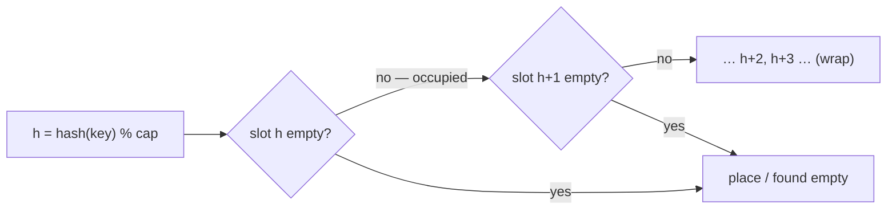

# Linear Probing

## Why It Exists

Separate chaining resolved collisions in side-lists — but every entry then carries list/pointer overhead, and walking a chain hops around memory, defeating the cache. **Open addressing** takes the opposite approach: store every entry *in the array itself*, no side structures. When a key's slot is taken, you **probe** for another open slot.

**Linear probing** is the simplest probe sequence: if slot `h` is occupied, try `h+1`, then `h+2`, … wrapping around, until you find an empty slot. Everything lives in one contiguous array, so lookups are cache-friendly and there are no pointers. The price is twofold: the table can actually *fill up* (load factor must stay below 1), and occupied slots tend to clump into long runs — *primary clustering* — that lengthen future probes.

## See It Work

A capacity-8 table where `1`, `9`, `17` all hash to slot `1` (`% 8`), so they probe to slots 1, 2, 3. Then delete the middle key and confirm the last is still findable — that's what the tombstone protects. Run it.

> The input is `[k1, k2, k3]` — three keys that all hash to the same slot. The driver inserts them (value = key), deletes `k2`, then looks up `k3` (should be found) and `k2` (should be gone).

```python run viz=array
import ast

EMPTY = None
DELETED = object()                  # tombstone sentinel

class LinearProbing:
    def __init__(self, capacity=8):
        self.capacity = capacity
        self.slots = [EMPTY] * capacity
    def put(self, key, value):
        start, first_deleted = key % self.capacity, -1
        for step in range(self.capacity):
            i = (start + step) % self.capacity      # walk forward, wrapping
            slot = self.slots[i]
            if slot is EMPTY:
                self.slots[first_deleted if first_deleted != -1 else i] = (key, value)
                return
            if slot is DELETED:
                if first_deleted == -1: first_deleted = i
            elif slot[0] == key:
                self.slots[i] = (key, value); return     # update in place
    def get(self, key):
        start = key % self.capacity
        for step in range(self.capacity):
            slot = self.slots[(start + step) % self.capacity]
            if slot is EMPTY:           return None        # empty ⇒ key absent
            if slot is not DELETED and slot[0] == key: return slot[1]
        return None
    def delete(self, key):
        start = key % self.capacity
        for step in range(self.capacity):
            i = (start + step) % self.capacity
            slot = self.slots[i]
            if slot is EMPTY: return False
            if slot is not DELETED and slot[0] == key:
                self.slots[i] = DELETED; return True       # tombstone, NOT empty
        return False

keys = ast.literal_eval(input())            # [1, 9, 17]
k1, k2, k3 = keys[0], keys[1], keys[2]
t = LinearProbing(8)
t.put(k1, k1); t.put(k2, k2); t.put(k3, k3)   # value = key
t.delete(k2)                                    # leaves a tombstone
r3 = t.get(k3)
r2 = t.get(k2)
print(r3 if r3 is not None else "null")         # found by walking past the tombstone
print(r2 if r2 is not None else "null")         # None → null
```

```java run viz=array
import java.util.*;

public class Main {
  static final int[] DELETED = new int[0];   // tombstone sentinel

  static class LinearProbing {
    int capacity; int[][] slots;
    LinearProbing(int cap) { capacity = cap; slots = new int[cap][]; }   // null = EMPTY
    void put(int key, int value) {
      int start = Math.floorMod(key, capacity), firstDel = -1;
      for (int step = 0; step < capacity; step++) {
        int i = (start + step) % capacity;
        int[] s = slots[i];
        if (s == null) { slots[firstDel != -1 ? firstDel : i] = new int[]{key, value}; return; }
        if (s == DELETED) { if (firstDel == -1) firstDel = i; }
        else if (s[0] == key) { slots[i] = new int[]{key, value}; return; }
      }
    }
    Integer get(int key) {
      int start = Math.floorMod(key, capacity);
      for (int step = 0; step < capacity; step++) {
        int[] s = slots[(start + step) % capacity];
        if (s == null) return null;
        if (s != DELETED && s[0] == key) return s[1];
      }
      return null;
    }
    boolean delete(int key) {
      int start = Math.floorMod(key, capacity);
      for (int step = 0; step < capacity; step++) {
        int i = (start + step) % capacity;
        int[] s = slots[i];
        if (s == null) return false;
        if (s != DELETED && s[0] == key) { slots[i] = DELETED; return true; }
      }
      return false;
    }
  }

  // "[1, 9, 17]" → {1, 9, 17}
  static int[] parseIntArray(String line) {
    String inner = line.replaceAll("[\\[\\]\\s]", "");
    if (inner.isEmpty()) return new int[0];
    String[] parts = inner.split(",");
    int[] out = new int[parts.length];
    for (int i = 0; i < parts.length; i++) out[i] = Integer.parseInt(parts[i]);
    return out;
  }

  public static void main(String[] args) {
    int[] keys = parseIntArray(new Scanner(System.in).nextLine());
    int k1 = keys[0], k2 = keys[1], k3 = keys[2];
    LinearProbing t = new LinearProbing(8);
    t.put(k1, k1); t.put(k2, k2); t.put(k3, k3);  // value = key
    t.delete(k2);
    System.out.println(t.get(k3));   // found by walking past the tombstone
    System.out.println(t.get(k2));   // null
  }
}
```

```testcases
{
  "args": [
    { "id": "keys", "label": "keys", "type": "int[]", "placeholder": "[1, 9, 17]" }
  ],
  "cases": [
    { "args": { "keys": "[1, 9, 17]" }, "expected": "17\nnull" },
    { "args": { "keys": "[3, 11, 19]" }, "expected": "19\nnull" },
    { "args": { "keys": "[2, 10, 18]" }, "expected": "18\nnull" }
  ]
}
```

## How It Works

Each slot is `EMPTY`, a `(key, value)` entry, or a `DELETED` **tombstone**. From `h = hash(key) % capacity`, probe forward (`h, h+1, h+2, …` mod capacity):

- **put** — stop at the first `EMPTY` slot (insert) or a slot holding the key (update). Reuse the first tombstone seen along the way.
- **get** — walk until you find the key (return it) or hit an `EMPTY` slot (the key is absent — stop). Skip over tombstones.
- **delete** — find the key and mark its slot `DELETED`, **not** `EMPTY`.



<p align="center"><strong>on collision, walk forward one slot at a time to the first empty cell; a deleted slot becomes a tombstone so later probes don't stop early.</strong></p>

Why must delete write a tombstone? A `get` stops at the first `EMPTY` slot. If deleting `9` (slot 2) wrote `EMPTY` there, then looking up `17` (sitting at slot 3, after probing past slots 1 and 2) would hit the new `EMPTY` at slot 2 and **wrongly conclude `17` is absent**. The `DELETED` tombstone keeps the probe chain continuous — `get` skips it and continues — while still freeing the slot for reuse by `put`. The cost: tombstones accumulate and lengthen probes, so heavily-churned tables must occasionally rehash. Load factor must stay `< 1` (and well below it — performance degrades sharply past ~0.7).

### Key Takeaway

Linear probing stores entries in the array and resolves collisions by walking forward to the next free slot — cache-friendly, pointer-free. Deletions must leave a `DELETED` tombstone (not `EMPTY`) or probe chains break. Keep the load factor well under 1; primary clustering is the cost.

## Trace It

Inserting `1, 9, 17` into a capacity-8 table (all `≡ 1 mod 8`):

| put | start | probe walk | lands at |
|---|---|---|---|
| `1` | 1 | slot 1 empty | slot 1 |
| `9` | 1 | slot 1 taken → slot 2 empty | slot 2 |
| `17` | 1 | slots 1, 2 taken → slot 3 empty | slot 3 |

Before you read on: three keys with the *same* hash formed a run of occupied slots 1–3. Now a *fourth* key that hashes to slot `2` arrives. How many slots must it probe — and what is this snowballing effect called?

It hashes to slot `2`, which is taken, so it probes `2 → 3` (both taken) → slot `4` (empty) — three probes, even though only *one* other key (`9`) actually shares its home slot. This is **primary clustering**: once a run of occupied slots forms, *any* key hashing *anywhere inside that run* extends it, and longer runs make future collisions and longer probes more likely — the cluster feeds itself. It's the central weakness of linear probing, and exactly what quadratic probing is designed to break up.

## Your Turn

The reusable open-addressing table (with tombstone delete). Implement `put`, `get`, and run the driver — it inserts two keys that collide, then looks up both plus a missing key.

```python run viz=array
EMPTY = None
DELETED = object()

class LinearProbing:
    def __init__(self, capacity=8):
        self.capacity = capacity
        self.slots = [EMPTY] * capacity
    def put(self, key, value):
        # Your code goes here
        pass
    def get(self, key):
        # Your code goes here
        return None

t = LinearProbing()
t.put(2, 20); t.put(10, 100)          # collide at slot 2 → 2, 3
r2 = t.get(2); r10 = t.get(10); r99 = t.get(99)
print(str(r2) + " " + str(r10) + " " + ("null" if r99 is None else str(r99)))
```

```java run viz=array
public class Main {
  static final int[] DELETED = new int[0];
  static class LinearProbing {
    int capacity; int[][] slots;
    LinearProbing(int cap) { capacity = cap; slots = new int[cap][]; }
    void put(int key, int value) {
      // Your code goes here
    }
    Integer get(int key) {
      // Your code goes here
      return null;
    }
  }
  public static void main(String[] args) {
    LinearProbing t = new LinearProbing(8);
    t.put(2, 20); t.put(10, 100);
    System.out.println(t.get(2) + " " + t.get(10) + " " + t.get(99));
  }
}
```

```testcases
{
  "args": [],
  "cases": [
    { "args": {}, "expected": "20 100 null" }
  ],
  "verifying": "solution"
}
```

<details>
<summary>Editorial</summary>

The `put` loop probes forward from the home slot, reusing the first tombstone it passes, and stops at `EMPTY` (insert) or the matching key (update). The `get` loop walks the same path but stops at `EMPTY` (key absent) or the matching key (found) — skipping tombstones. Tombstones on delete are what keep `get` from prematurely stopping at a gap left by a previous removal.

```python solution time=O(1) space=O(n)
EMPTY = None
DELETED = object()

class LinearProbing:
    def __init__(self, capacity=8):
        self.capacity = capacity
        self.slots = [EMPTY] * capacity
    def put(self, key, value):
        start, first_deleted = key % self.capacity, -1
        for step in range(self.capacity):
            i = (start + step) % self.capacity
            slot = self.slots[i]
            if slot is EMPTY:
                self.slots[first_deleted if first_deleted != -1 else i] = (key, value); return
            if slot is DELETED:
                if first_deleted == -1: first_deleted = i
            elif slot[0] == key:
                self.slots[i] = (key, value); return
    def get(self, key):
        start = key % self.capacity
        for step in range(self.capacity):
            slot = self.slots[(start + step) % self.capacity]
            if slot is EMPTY: return None
            if slot is not DELETED and slot[0] == key: return slot[1]
        return None

t = LinearProbing()
t.put(2, 20); t.put(10, 100)          # collide at slot 2 → 2, 3
r2 = t.get(2); r10 = t.get(10); r99 = t.get(99)
print(str(r2) + " " + str(r10) + " " + ("null" if r99 is None else str(r99)))
```

```java solution
public class Main {
  static final int[] DELETED = new int[0];
  static class LinearProbing {
    int capacity; int[][] slots;
    LinearProbing(int cap) { capacity = cap; slots = new int[cap][]; }   // null = EMPTY
    void put(int key, int value) {
      int start = Math.floorMod(key, capacity), firstDel = -1;
      for (int step = 0; step < capacity; step++) {
        int i = (start + step) % capacity;
        int[] s = slots[i];
        if (s == null) { slots[firstDel != -1 ? firstDel : i] = new int[]{key, value}; return; }
        if (s == DELETED) { if (firstDel == -1) firstDel = i; }
        else if (s[0] == key) { slots[i] = new int[]{key, value}; return; }
      }
    }
    Integer get(int key) {
      int start = Math.floorMod(key, capacity);
      for (int step = 0; step < capacity; step++) {
        int[] s = slots[(start + step) % capacity];
        if (s == null) return null;
        if (s != DELETED && s[0] == key) return s[1];
      }
      return null;
    }
  }
  public static void main(String[] args) {
    LinearProbing t = new LinearProbing(8);
    t.put(2, 20); t.put(10, 100);
    System.out.println(t.get(2) + " " + t.get(10) + " " + t.get(99));
  }
}
```

</details>

## Reflect & Connect

Linear probing is open addressing at its simplest, and it frames the whole family:

- **Open addressing vs chaining** — open addressing wins on **cache locality** (one contiguous array, no pointer-chasing) and memory (no list nodes), but it can't exceed load factor 1, needs **tombstones** for deletion, and suffers clustering. Chaining tolerates `α > 1` and deletes trivially. The trade is locality vs simplicity.
- **The tombstone is the subtle part** — deletion can't just empty a slot, or every key probed *past* the deleted one becomes unreachable. Tombstones preserve probe chains but accumulate, so churn-heavy tables rehash periodically.
- **Primary clustering motivates the sequels** — the `+1` walk merges runs. The [next lesson](/cortex/data-structures-and-algorithms/linear-structures/hash-table/quadratic-probing) replaces it with a quadratic jump to scatter colliding keys and break those clusters.

**Prerequisites:** [What Is a Hash Table?](/cortex/data-structures-and-algorithms/linear-structures/hash-table/what-is-a-hash-table) (and the contrast with [Separate Chaining](/cortex/data-structures-and-algorithms/linear-structures/hash-table/separate-chaining)).
**What's next:** swap the one-step walk for a quadratic jump — [Quadratic Probing](/cortex/data-structures-and-algorithms/linear-structures/hash-table/quadratic-probing).

## Recall

> **Mnemonic:** *Collision → walk `h, h+1, h+2 …` to the first empty slot. Delete = tombstone (not empty) or probes break. Load factor `< 1`; primary clustering is the cost.*

| | |
|---|---|
| Probe sequence | `h, h+1, h+2, …` (mod capacity) |
| Slot states | `EMPTY`, an entry, or `DELETED` (tombstone) |
| get stops at | the key, or an `EMPTY` slot (absent) — skips tombstones |
| delete | write a tombstone, never `EMPTY` |
| Cost / limit | `O(1)` average at low `α`; load factor must stay `< 1`; primary clustering |

<details>
<summary><strong>Q:</strong> How does linear probing resolve a collision?</summary>

**A:** It walks forward one slot at a time from the hashed index to the first empty slot.

</details>
<details>
<summary><strong>Q:</strong> Why must deletion leave a tombstone instead of emptying the slot?</summary>

**A:** A `get` stops at the first `EMPTY` slot, so emptying a slot mid-chain would make keys probed past it unreachable.

</details>
<details>
<summary><strong>Q:</strong> What is primary clustering?</summary>

**A:** Occupied slots form runs; any key hashing into a run extends it, so clusters grow and lengthen probes — a self-reinforcing slowdown.

</details>
<details>
<summary><strong>Q:</strong> Open addressing vs chaining — the core trade?</summary>

**A:** Open addressing gives cache locality and no pointers but caps `α < 1` and needs tombstones; chaining tolerates `α > 1` and deletes trivially.

</details>

## Sources & Verify

- **CLRS**, *Introduction to Algorithms*, 4th ed., §11.4 — open addressing, linear probing, and clustering.
- **Sedgewick & Wayne**, *Algorithms*, 4th ed., §3.4 — linear-probing hash tables and load-factor management.
- Linear probing with tombstones and primary clustering is standard; both runnable blocks are verified by running (collision probes to adjacent slots; tombstone keeps `get(17)` correct after deleting `9`).
