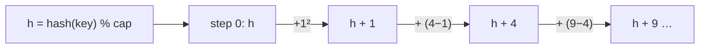

# Quadratic Probing

## Why It Exists

Linear probing's flaw is **primary clustering**: stepping `+1` on every collision merges occupied slots into long runs, and any key hashing into a run extends it, so clusters snowball and probes get long.

Quadratic probing attacks exactly that. Instead of walking one slot at a time, it jumps by *increasing squares*: try `h`, then `h+1²`, `h+2²`, `h+3²`, … — that is, `(h + i²) % capacity`. Because the jumps grow, two keys that collide at the same home slot fan out to slots that are far apart rather than adjacent, so a cluster no longer swallows every nearby key. Primary clustering is broken. The catch — there's always a catch — is **secondary clustering**: keys that share the *same home slot* still follow the *same* jump sequence, so they collide with each other all along that path.

## See It Work

The same three keys from the linear-probing lesson — `1, 9, 17`, all hashing to slot `1`. With the quadratic jump they land on slots `1, 2, 5` (not the adjacent `1, 2, 3` linear gave). Run it.

```python run viz=array
EMPTY = None
DELETED = object()

class QuadraticProbing:
    def __init__(self, capacity=8):
        self.capacity = capacity
        self.slots = [EMPTY] * capacity
    def _i(self, start, step):
        return (start + step * step) % self.capacity      # h + i²
    def put(self, key, value):
        start, first_deleted = key % self.capacity, -1
        for step in range(self.capacity):
            i = self._i(start, step)
            slot = self.slots[i]
            if slot is EMPTY:
                self.slots[first_deleted if first_deleted != -1 else i] = (key, value); return
            if slot is DELETED:
                if first_deleted == -1: first_deleted = i
            elif slot[0] == key:
                self.slots[i] = (key, value); return
    def get(self, key):
        start = key % self.capacity
        for step in range(self.capacity):
            slot = self.slots[self._i(start, step)]
            if slot is EMPTY: return None
            if slot is not DELETED and slot[0] == key: return slot[1]
        return None
    def slot_of(self, key):
        start = key % self.capacity
        for step in range(self.capacity):
            i = self._i(start, step)
            s = self.slots[i]
            if s is not EMPTY and s is not DELETED and s[0] == key: return i
        return None

t = QuadraticProbing(8)
t.put(1, "a"); t.put(9, "b"); t.put(17, "c")   # all home slot 1
print(t.slot_of(1), t.slot_of(9), t.slot_of(17))   # 1 2 5  — scattered, not 1,2,3
print(t.get(17))                                    # c
```

## How It Works

Identical to linear probing — entries live in the array, deletions leave tombstones, `get` stops at the first `EMPTY` — with **one change**: the probe at step `i` is `(h + i²) % capacity` instead of `(h + i)`.



<p align="center"><strong>on collision, jump by growing squares (1, 4, 9, …) instead of single steps, so colliding keys land far apart and don't form a contiguous run.</strong></p>

Breaking primary clustering improves probe lengths at higher load factors — but two caveats come with the square jumps:

- **Secondary clustering** — keys with the *same* home slot share the identical sequence `h, h+1, h+4, …`, so they still pile up along that one path. Quadratic probing fixes inter-cluster collisions, not intra-cluster ones.
- **Coverage** — the squared offsets don't necessarily visit every slot. The standard guarantee: with a **prime** capacity and load factor **`α < 0.5`**, `(h + i²)` is certain to find an empty slot. Without that, an insert can fail even though free slots exist. (Power-of-2 tables use the variant `(h + (i² + i)/2)`, which does cover all slots.)

So quadratic probing trades linear's primary clustering for milder secondary clustering, at the price of a tighter load-factor bound.

### Key Takeaway

Quadratic probing replaces the `+1` walk with `(h + i²)` jumps, scattering colliding keys to break primary clustering. It still suffers *secondary* clustering (same home slot → same path) and needs a prime capacity with `α < 0.5` to guarantee a free slot is found.

## Trace It

Inserting `1, 9, 17` (all `≡ 1 mod 8`) with `(1 + i²) % 8`:

| put | probe steps | lands at |
|---|---|---|
| `1` | `i=0`: slot 1 empty | slot 1 |
| `9` | `i=0`: 1 taken → `i=1`: `1+1=2` empty | slot 2 |
| `17` | `i=0`: 1 taken → `i=1`: 2 taken → `i=2`: `1+4=5` empty | slot 5 |

Linear gave `1, 2, 3` (a tight run); quadratic gives `1, 2, 5` (spread out).

Before you read on: quadratic probing scattered these three same-home-slot keys to `1, 2, 5` — yet they *still* collided with each other at steps 0 and 1 before finding room. So what exactly did quadratic probing fix, and what did it leave unfixed?

It fixed **primary** clustering — the problem where a key hashing *near* an occupied run (but to a *different* home slot) got sucked into it. With square jumps, a key whose home is slot 3 no longer probes into the slot-1 cluster's tail, so unrelated clusters stop merging. What it *didn't* fix is **secondary** clustering: `1`, `9`, and `17` share the *same* home slot, so they share the *same* jump path `1 → 2 → 5 → …` and keep colliding with each other. The fix scattered different-home keys apart but left same-home keys on a common track — which is precisely the gap double hashing closes by giving each key its own step size.

## Your Turn

The reusable quadratic-probing table:

```python run viz=array
EMPTY = None
DELETED = object()

class QuadraticProbing:
    def __init__(self, capacity=8):
        self.capacity = capacity
        self.slots = [EMPTY] * capacity
    def _i(self, start, step):
        return (start + step * step) % self.capacity
    def put(self, key, value):
        start, first_deleted = key % self.capacity, -1
        for step in range(self.capacity):
            i = self._i(start, step)
            slot = self.slots[i]
            if slot is EMPTY:
                self.slots[first_deleted if first_deleted != -1 else i] = (key, value); return
            if slot is DELETED:
                if first_deleted == -1: first_deleted = i
            elif slot[0] == key:
                self.slots[i] = (key, value); return
    def get(self, key):
        start = key % self.capacity
        for step in range(self.capacity):
            slot = self.slots[self._i(start, step)]
            if slot is EMPTY: return None
            if slot is not DELETED and slot[0] == key: return slot[1]
        return None

t = QuadraticProbing()
t.put(3, "p"); t.put(11, "q")          # both home slot 3 → 3, then 3+1=4
print(t.get(3), t.get(11), t.get(99))  # p q None
```

```java run viz=array
public class Main {
  static final int[] DELETED = new int[0];
  static class QuadraticProbing {
    int capacity; int[][] slots;
    QuadraticProbing(int cap) { capacity = cap; slots = new int[cap][]; }
    int idx(int start, int step) { return (start + step * step) % capacity; }
    void put(int key, int value) {
      int start = Math.floorMod(key, capacity), firstDel = -1;
      for (int step = 0; step < capacity; step++) {
        int i = idx(start, step);
        int[] s = slots[i];
        if (s == null) { slots[firstDel != -1 ? firstDel : i] = new int[]{key, value}; return; }
        if (s == DELETED) { if (firstDel == -1) firstDel = i; }
        else if (s[0] == key) { slots[i] = new int[]{key, value}; return; }
      }
    }
    Integer get(int key) {
      int start = Math.floorMod(key, capacity);
      for (int step = 0; step < capacity; step++) {
        int[] s = slots[idx(start, step)];
        if (s == null) return null;
        if (s != DELETED && s[0] == key) return s[1];
      }
      return null;
    }
  }
  public static void main(String[] args) {
    QuadraticProbing t = new QuadraticProbing(8);
    t.put(3, 30); t.put(11, 110);          // both home slot 3 → 3, 4
    System.out.println(t.get(3) + " " + t.get(11) + " " + t.get(99));   // 30 110 null
  }
}
```

## Reflect & Connect

Quadratic probing is the middle rung of the open-addressing ladder:

- **Primary vs secondary clustering** — quadratic probing eliminates primary (different-home keys merging) but keeps secondary (same-home keys sharing a path). Naming which clustering a scheme fixes is the way to reason about probe strategies.
- **The coverage caveat is real** — square offsets don't visit every slot, so the prime-capacity + `α < 0.5` rule (or the `(i²+i)/2` triangular-number variant) isn't optional; ignore it and inserts can fail with the table half-empty.
- **It motivates double hashing** — to kill secondary clustering you need each key to have its *own* probe step, not one determined solely by the home slot. That's the [next lesson](/cortex/data-structures-and-algorithms/linear-structures-hash-table-double-hashing): derive the step from a second hash of the key.

**Prerequisites:** [Linear Probing](/cortex/data-structures-and-algorithms/linear-structures-hash-table-linear-probing).
**What's next:** give every key its own probe step via a second hash — [Double Hashing](/cortex/data-structures-and-algorithms/linear-structures-hash-table-double-hashing).

## Recall

> **Mnemonic:** *Probe `(h + i²) % cap` — jump by growing squares. Breaks primary clustering; secondary remains (same home ⇒ same path). Prime cap + `α < 0.5` to guarantee a slot.*

| | |
|---|---|
| Probe sequence | `(h + i²) % capacity` |
| Fixes | primary clustering (different-home keys no longer merge) |
| Leaves | secondary clustering (same-home keys share the path) |
| Coverage rule | prime capacity + `α < 0.5` (or `(i²+i)/2` for power-of-2) |
| Otherwise | same as linear probing (tombstones, `get` stops at `EMPTY`) |

<details>
<summary><strong>Q:</strong> How does quadratic probing differ from linear probing?</summary>

**A:** The probe step is `i²` (jump by growing squares) instead of `i` (one slot), so collisions scatter.

</details>
<details>
<summary><strong>Q:</strong> What clustering does it fix, and what remains?</summary>

**A:** Fixes primary clustering (different home slots merging); secondary clustering remains (same home slot → same probe path).

</details>
<details>
<summary><strong>Q:</strong> Why the prime-capacity, `α < 0.5` requirement?</summary>

**A:** Square offsets don't necessarily cover every slot, so the bound guarantees an empty slot is reachable.

</details>
<details>
<summary><strong>Q:</strong> What does the leftover secondary clustering motivate?</summary>

**A:** Double hashing — give each key its own step size from a second hash so same-home keys diverge.

</details>

## Sources & Verify

- **CLRS**, *Introduction to Algorithms*, 4th ed., §11.4 — open addressing and probe sequences (linear, quadratic, double hashing).
- **Sedgewick & Wayne**, *Algorithms*, 4th ed., §3.4 — open-addressing variants and clustering.
- Quadratic probing, secondary clustering, and the `α < 0.5`/prime coverage guarantee are standard; both runnable blocks are verified by running (`1,9,17 ⇒ slots 1,2,5`; `get` correct).
