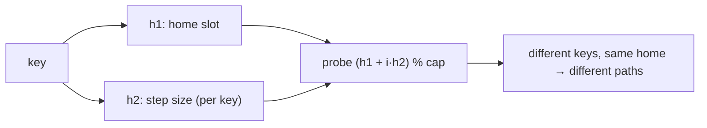

# Double Hashing

## Why It Exists

Quadratic probing broke up *primary* clustering but left *secondary* clustering: keys with the same home slot follow the identical jump sequence `h, h+1, h+4, …`, so they keep colliding with one another. The root cause is that the probe path depends only on the **home slot**, not on the **key**.

Double hashing removes that root cause. The step size comes from a **second hash function** of the key: the probe at step `i` is `(h1(key) + i · h2(key)) % capacity`. Now two keys that land on the same home slot almost always get *different* strides, so they peel apart on the very first step instead of marching down a shared track. With a well-chosen `h2`, the probe sequence behaves close to the theoretical ideal of *uniform hashing* — and secondary clustering disappears.

## See It Work

Three keys — `1, 8, 15` — all hash to home slot `1` (capacity `7`). But their second hash gives each a different step (`4, 2, 5`), so they scatter to slots `1, 3, 6` along *different* paths. Run it.

```python run viz=array
EMPTY = None
DELETED = object()
R = 5                                   # a prime < capacity, for the second hash

class DoubleHashing:
    def __init__(self, capacity=7):     # prime capacity ⇒ every slot reachable
        self.capacity = capacity
        self.slots = [EMPTY] * capacity
    def _h1(self, key): return key % self.capacity        # home slot
    def _h2(self, key): return R - (key % R)              # step in [1, R] — never 0
    def put(self, key, value):
        h1, h2, first_deleted = self._h1(key), self._h2(key), -1
        for step in range(self.capacity):
            i = (h1 + step * h2) % self.capacity           # per-key stride
            slot = self.slots[i]
            if slot is EMPTY:
                self.slots[first_deleted if first_deleted != -1 else i] = (key, value); return
            if slot is DELETED:
                if first_deleted == -1: first_deleted = i
            elif slot[0] == key:
                self.slots[i] = (key, value); return
    def get(self, key):
        h1, h2 = self._h1(key), self._h2(key)
        for step in range(self.capacity):
            slot = self.slots[(h1 + step * h2) % self.capacity]
            if slot is EMPTY: return None
            if slot is not DELETED and slot[0] == key: return slot[1]
        return None

t = DoubleHashing(7)
for k in (1, 8, 15):
    print(f"key {k}: home={t._h1(k)}, step={t._h2(k)}")   # all home 1; steps 4, 2, 5
t.put(1, "a"); t.put(8, "b"); t.put(15, "c")
print(t.get(15))                                          # c
```

## How It Works

Two hash functions:

- **`h1(key)`** = the home slot, `key % capacity`.
- **`h2(key)`** = the step size — a *second*, independent hash. The probe sequence is `(h1 + i·h2) % capacity`.

Everything else (entries in the array, tombstones on delete, `get` stops at `EMPTY`) is the same open-addressing skeleton. Two requirements make it work:



<p align="center"><strong>the home slot comes from <code>h1</code>; the <em>stride between probes</em> comes from <code>h2(key)</code>, so two keys with the same home but different second hashes walk different paths.</strong></p>

- **`h2` must never be `0`** — a zero step means every probe revisits the home slot forever, an infinite loop. The form `R − (key % R)` (with `R` a prime `< capacity`) yields a step in `[1, R]`, guaranteed non-zero.
- **The step must be coprime with the capacity** — otherwise the probe only visits a fraction of the slots and an insert can fail with the table not full. A **prime capacity** makes *every* non-zero step coprime with it, so the probe is guaranteed to visit all slots.

The payoff: no secondary clustering, near-uniform probe behavior. The costs: two hash computations per operation, and worse cache locality than linear probing (probes jump around the array rather than walking neighbors).

### Key Takeaway

Double hashing draws the probe *step* from a second hash of the key — `(h1 + i·h2) % capacity` — so same-home keys diverge immediately and secondary clustering vanishes. Require `h2 ≠ 0` and a prime capacity (so the step is coprime and every slot is reachable).

## Trace It

`1, 8, 15` into a capacity-7 table; `h1 = key % 7` (all `= 1`), `h2 = 5 − (key % 5)`:

| key | `h1` | `h2` (step) | probe walk | lands at |
|---|---|---|---|---|
| `1` | 1 | `5 − 1 = 4` | slot 1 empty | slot 1 |
| `8` | 1 | `5 − 3 = 2` | 1 taken → `1+2 = 3` empty | slot 3 |
| `15` | 1 | `5 − 0 = 5` | 1 taken → `1+5 = 6` empty | slot 6 |

Three same-home keys, three *different* steps → three different paths.

Before you read on: all three keys share the home slot `1`, exactly the situation that gives quadratic probing secondary clustering. Why does double hashing avoid it here — and what single property of `h2` is doing the work?

Because the step size comes from **the key itself**, not the home slot. Keys `1`, `8`, and `15` collide at slot `1`, but their *second* hashes differ (`4`, `2`, `5`), so after the first collision each walks a different stride and they stop interfering almost immediately. In quadratic probing the step depended only on the iteration number `i` (the same `i²` for everyone with that home), so same-home keys were locked onto one shared track. Making the stride a function of the *key* is the entire fix — which is why `h2` must produce a good spread (and never `0`): if two keys happened to share both `h1` *and* `h2`, they'd cluster again, so a well-distributed second hash is what keeps paths independent.

## Your Turn

The reusable double-hashing table:

```python run viz=array
EMPTY = None
DELETED = object()
R = 5

class DoubleHashing:
    def __init__(self, capacity=7):
        self.capacity = capacity
        self.slots = [EMPTY] * capacity
    def _h1(self, key): return key % self.capacity
    def _h2(self, key): return R - (key % R)
    def put(self, key, value):
        h1, h2, first_deleted = self._h1(key), self._h2(key), -1
        for step in range(self.capacity):
            i = (h1 + step * h2) % self.capacity
            slot = self.slots[i]
            if slot is EMPTY:
                self.slots[first_deleted if first_deleted != -1 else i] = (key, value); return
            if slot is DELETED:
                if first_deleted == -1: first_deleted = i
            elif slot[0] == key:
                self.slots[i] = (key, value); return
    def get(self, key):
        h1, h2 = self._h1(key), self._h2(key)
        for step in range(self.capacity):
            slot = self.slots[(h1 + step * h2) % self.capacity]
            if slot is EMPTY: return None
            if slot is not DELETED and slot[0] == key: return slot[1]
        return None

t = DoubleHashing(7)
t.put(2, "p"); t.put(9, "q")            # both home slot 2, different steps
print(t.get(2), t.get(9), t.get(99))    # p q None
```

```java run viz=array
public class Main {
  static final int[] DELETED = new int[0];
  static final int R = 5;
  static class DoubleHashing {
    int capacity; int[][] slots;
    DoubleHashing(int cap) { capacity = cap; slots = new int[cap][]; }
    int h1(int key) { return Math.floorMod(key, capacity); }
    int h2(int key) { return R - Math.floorMod(key, R); }     // [1,R], never 0
    void put(int key, int value) {
      int a = h1(key), b = h2(key), firstDel = -1;
      for (int step = 0; step < capacity; step++) {
        int i = (a + step * b) % capacity;
        int[] s = slots[i];
        if (s == null) { slots[firstDel != -1 ? firstDel : i] = new int[]{key, value}; return; }
        if (s == DELETED) { if (firstDel == -1) firstDel = i; }
        else if (s[0] == key) { slots[i] = new int[]{key, value}; return; }
      }
    }
    Integer get(int key) {
      int a = h1(key), b = h2(key);
      for (int step = 0; step < capacity; step++) {
        int[] s = slots[(a + step * b) % capacity];
        if (s == null) return null;
        if (s != DELETED && s[0] == key) return s[1];
      }
      return null;
    }
  }
  public static void main(String[] args) {
    DoubleHashing t = new DoubleHashing(7);
    t.put(2, 20); t.put(9, 90);          // both home slot 2, different steps
    System.out.println(t.get(2) + " " + t.get(9) + " " + t.get(99));   // 20 90 null
  }
}
```

## Reflect & Connect

Double hashing is the top rung of the open-addressing ladder:

- **The ladder** — *linear* (step `+1`, primary clustering) → *quadratic* (step `i²`, fixes primary, leaves secondary) → *double hashing* (step `h2(key)`, fixes both). Each rung removes the previous one's clustering by making the probe depend on more than the home slot.
- **`h2`'s two rules are non-negotiable** — never `0` (else infinite loop) and coprime with capacity (else partial coverage). A prime capacity makes every non-zero step coprime, which is why double-hashing tables are usually sized to a prime.
- **The trade-off vs linear probing** — double hashing has the best clustering behavior (near-uniform), but pays with a second hash per probe and poor cache locality, since consecutive probes jump across the array. Linear probing's contiguous walk is faster *per probe* and cache-friendly; double hashing wins when clustering would otherwise dominate. Real engineering picks per workload — which is the lens the [hash-table overview](/cortex/data-structures-and-algorithms/linear-structures/hash-table/what-is-a-hash-table) frames.

This completes the collision-resolution track: separate chaining plus the three open-addressing probe sequences.

**Prerequisites:** [Quadratic Probing](/cortex/data-structures-and-algorithms/linear-structures/hash-table/quadratic-probing).
**What's next:** revisit how these strategies fit the bigger picture in [What Is a Hash Table?](/cortex/data-structures-and-algorithms/linear-structures/hash-table/what-is-a-hash-table).

## Recall

> **Mnemonic:** *Step = `h2(key)`, so probe `(h1 + i·h2) % cap`. Same home, different key ⇒ different path → no secondary clustering. `h2 ≠ 0`; prime capacity for full coverage.*

| | |
|---|---|
| Probe sequence | `(h1(key) + i · h2(key)) % capacity` |
| `h2` rules | never `0`; coprime with capacity (prime capacity guarantees it) |
| Fixes | both primary and secondary clustering (near-uniform) |
| Cost | two hashes per probe; poor cache locality (jumps around) |
| Sizing | prime capacity (every non-zero step then coprime) |

<details>
<summary><strong>Q:</strong> How does double hashing differ from quadratic probing?</summary>

**A:** The step size comes from a second hash of the *key*, not from the iteration number, so same-home keys get different strides.

</details>
<details>
<summary><strong>Q:</strong> Why must `h2` never return `0`?</summary>

**A:** A zero step revisits the home slot forever — an infinite probe loop.

</details>
<details>
<summary><strong>Q:</strong> Why a prime capacity?</summary>

**A:** It makes every non-zero step coprime with the capacity, so the probe visits all slots and inserts can't fail prematurely.

</details>
<details>
<summary><strong>Q:</strong> What's the trade-off against linear probing?</summary>

**A:** Double hashing avoids clustering (near-uniform) but costs a second hash per probe and has poor cache locality; linear is faster per probe and cache-friendly.

</details>

## Sources & Verify

- **CLRS**, *Introduction to Algorithms*, 4th ed., §11.4 — double hashing, the coprime-step requirement, and the uniform-hashing ideal.
- **Sedgewick & Wayne**, *Algorithms*, 4th ed., §3.4 — open addressing and probe-sequence design.
- Double hashing, the `h2 ≠ 0` / prime-capacity rules, and its clustering-free behavior are standard; both runnable blocks are verified by running (same-home keys `1,8,15` take steps `4,2,5` → slots `1,3,6`; `get` correct).
