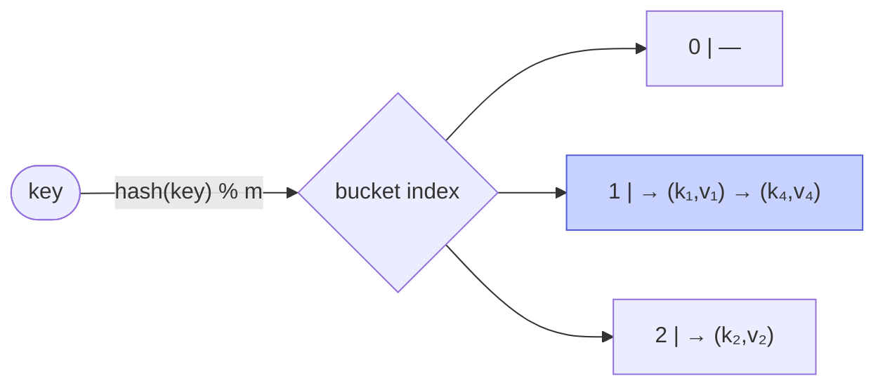

# Memorize: Hash Table

## In a Hurry?

- **Core Operations**: `insert(key, value)` (store or overwrite a mapping), `search(key)` (return the value or a not-found sentinel), and `delete(key)` (remove a mapping, a no-op if absent). All three are "hash the key, go to that slot, then read/write/clear." A hash table is a *dictionary*, not a sequence — there is no indexed access, no range query, and **no ordered iteration**: entries sit at hash positions, so iteration order is effectively arbitrary.
- **Complexities**: `insert` `O(1)` average / `O(N)` worst, `search` `O(1)` average / `O(N)` worst, `delete` `O(1)` average / `O(N)` worst, and space `O(N)` for `N` entries. The `O(1)` is *probabilistic* — it holds while a good hash function keeps collisions rare and the load factor low. The `O(N)` worst case fires when every key collides onto one slot, collapsing the structure into one long chain (separate chaining) or one long probe run (open addressing). A single resize-and-rehash is an `O(N)` time and `O(N)` space spike.
- **One Use-Case**: an in-memory cache or language dictionary — Python's `dict`, Java's `HashMap`, and Redis all need average `O(1)` keyed `get`/`set` under heavy traffic, which only hash-then-index access delivers; the same engine backs database hash indexes, compiler symbol tables, and set-membership dedup.

---

## One-Line Mnemonic

A hash table doesn't *search* for your data, it *computes* where the data lives: run the key through a function to get an array index, then read that one slot.

---

## Real-World Analogy

Picture a coat-check counter at a theatre. You hand over your coat and get a numbered ticket; the attendant hangs the coat on the hook with that exact number. When you come back, nobody walks the whole rack comparing coats — they read your ticket number and go straight to that one hook. The ticket number is the *hash*: a small integer computed from you (the key) that names exactly where your coat (the value) hangs. Two guests can be handed the same hook number by accident — that is a **collision** — and the counter needs a house rule for it: either hang both coats on that one hook and flip through the few that share it (separate chaining), or send the second guest to the next free hook down the rack (open addressing). Either way the magic is the same: the ticket *derives* the location instead of forcing a search, which is why retrieval feels instant no matter how full the cloakroom gets — right up until everyone is crammed onto a handful of hooks and the attendant is back to flipping through coats.

---

## Visual Summary

<strong>A hash function maps each key to a bucket in O(1) average. Collisions chain inside a bucket; a good hash keeps chains short, so lookup, insert, and delete stay ~O(1).</strong>

---

## Key Operations

| Operation | Time | Space | Key Insight |
|---|---|---|---|
| `insert(key, value)` | `O(1)` avg / `O(N)` worst | `O(1)` | Hash the key to a slot, then store the `(key, value)` pair. If the key already exists, **update** the value rather than duplicating it — that walk-then-act rule is what makes the table a dictionary, not a multiset. Separate chaining appends to (or updates within) the chain at the slot; open addressing probes forward to the first writable slot (`EMPTY`, or a reusable `DELETED` tombstone). The pair stores the key alongside the value so a colliding stranger can be told apart with one comparison. |
| `search(key)` | `O(1)` avg / `O(N)` worst | `O(1)` | Hash the key, go to the slot, confirm the stored key matches. Separate chaining walks the chain until a match or the chain ends; open addressing walks the probe sequence until a match, an `EMPTY` slot (proves absence — stop), or a full scan. The verification step is the whole reason the key is stored, not the value alone. |
| `delete(key)` | `O(1)` avg / `O(N)` worst | `O(1)` | Hash, find the matching key, remove it; a no-op if the key was never present. Separate chaining unlinks the node from its chain. Open addressing **cannot** clear the slot to `EMPTY` — that would sever the probe chain and orphan later keys; it flips the slot to a `DELETED` tombstone that searches walk past and future inserts may reuse. |
| Load factor & rehash | rehash is `O(N)` | `O(N)` | The load factor `α = N / capacity` is entries divided by slots, and it governs how often collisions happen. As `α` climbs toward `1`, chains lengthen and probe runs stretch, so a production table **resizes** — allocates a larger array and rehashes every key into it — once `α` crosses a threshold (`HashMap` uses `0.75`; quadratic/double-hashing schemes prefer to stay near `0.5` on a prime capacity). The resize is an occasional `O(N)` time and `O(N)` space spike that keeps the per-operation average at `O(1)`. |

---

## Common Mistakes

- **Treating `O(1)` as a worst-case guarantee**:
  - *What*: assuming every lookup is constant time, then being blindsided when a hash-heavy endpoint slows to a crawl or an adversary stalls the service.
  - *Why*: the `O(1)` is an *average* that rests on a good hash spreading keys evenly; when every key lands on one slot, the structure degenerates to one chain or one probe run and a lookup walks all `N` entries in `O(N)` time. An attacker who knows the hash can craft colliding keys on purpose — an algorithmic-complexity denial-of-service attack.
  - *Fix*: state the bounds as `O(1)` average / `O(N)` worst, keep the load factor low, and use a randomised or cryptographic hash in adversarial settings rather than the toy `key mod capacity` used for teaching.
- **Ignoring the load factor and never resizing**:
  - *What*: a table that fills up and silently rots — operations that started fast degrade until each one walks dozens of entries.
  - *Why*: average chain length (or probe length) tracks `α = N / capacity`, so a fixed-capacity table holding far more keys than slots has long chains everywhere; a capacity-`4` table with `400` keys has `α = 100`, and every "constant-time" lookup touches about `100` entries.
  - *Fix*: resize and rehash into a larger array once `α` crosses a threshold (`0.75` for chaining, `~0.5` for quadratic/double hashing on a prime capacity), accepting one `O(N)` rehash to restore `O(1)` averages.
- **Mutating a key after it is inserted**:
  - *What*: changing a field of a stored key (or using a mutable object as a key and mutating it), then finding the entry has vanished on the next lookup.
  - *Why*: the slot is fixed by `hash(key)` *at insertion time*; mutating a field the hash reads makes the table recompute a *different* index on retrieval and miss the entry, which sits stranded in its old slot, unreachable.
  - *Fix*: use immutable keys (strings, numbers, frozen tuples), or never mutate a key while it lives in a table — remove it, mutate, and re-insert.
- **Clearing a deleted slot in open addressing instead of tombstoning**:
  - *What*: on delete, setting an open-addressing slot back to `EMPTY`, after which a later `search` returns "not found" for a key that is still physically present further down the probe chain.
  - *Why*: search stops at the first `EMPTY` slot (an empty slot proves the key was never inserted on this chain); blanking a slot mid-chain makes the search halt early and orphans every record placed past it — silent data loss.
  - *Fix*: flip the slot to a `DELETED` tombstone — searches walk *past* it while inserts may reuse it — so the probe chain stays intact and the table doesn't bloat.
- **A weak hash function that clusters real keys**:
  - *What*: a function that looks uniform on paper but piles real-world keys into a few slots, dragging lookups toward `O(N)` and wasting `O(N)` space on empty slots.
  - *Why*: `key mod m` with a non-prime `m` collapses keys that share a factor with `m` — every multiple of `4` with `m = 8` lands in slots `0` and `4`; linear probing then forms **primary clusters** (consecutive runs) and quadratic probing leaves **secondary clusters** (same-start keys sharing a path).
  - *Fix*: pick `m` prime, or use a function that scrambles every bit of the key (mid-square, multiplicative, or a production hash); for open addressing, double hashing gives each key its own stride to disperse the clustering.
- **Choosing a double-hashing stride that is zero or shares a factor with the capacity**:
  - *What*: an open-addressing table that loops forever on the first collision, or reports "full" with half its slots empty.
  - *Why*: a stride of `0` re-probes the same slot endlessly; a stride sharing a common factor with `capacity` makes the probe cycle through only a fraction of the slots (`capacity = 8`, stride `2` visits only the even slots), so it never reaches the rest.
  - *Fix*: build the second hash so it is never zero (the classic `hashPrime − (key % hashPrime)` lands in `[1, hashPrime]`), and use a **prime capacity** so every stride in `[1, capacity − 1]` is automatically coprime with it and the probe visits every slot.
- **Expecting entries to come back in insertion or sorted order**:
  - *What*: iterating a plain hash table and relying on a stable or sorted key order, then breaking when the order shifts across resizes or language versions.
  - *Why*: a hash table stores entries by hash value, not by arrival or sort order, so iteration order is effectively arbitrary and not part of the contract.
  - *Fix*: reach for a tree-based map when you need sorted order or range queries, or an insertion-ordered map when arrival order matters — don't lean on a plain hash table's accidental ordering.

---

## Quick Recall

**Q: What is the one move that defines a hash table?**
It runs the key through a hash function to *compute* an array index, then reads or writes that single slot — it stops searching and starts computing.

**Q: What three pieces make up a hash table?**
A hash function (key → index), an internal array storing the `(key, value)` pairs at those indices, and a collision-resolution scheme for when two keys hash to the same slot.

**Q: What are the time and space complexities of insert, search, and delete?**
All three are `O(1)` average time and `O(N)` worst-case time, with `O(N)` space for `N` entries.

**Q: Why is a hash table `O(1)` on average but `O(N)` in the worst case?**
On average a good hash spreads keys evenly so each operation touches roughly one slot; in the worst case every key hashes to the same slot and the structure becomes one chain (or probe run) of length `N`, so a lookup walks all `N` entries.

**Q: Why does each slot store the key, not the value alone, when the index already came from the key?**
Because collisions mean a slot may hold a *different* key than the one you hashed, so the stored key lets one comparison confirm you found the right entry rather than a colliding stranger.

**Q: What three properties make a hash function good?**
It must be **deterministic** (same key always yields the same index), **efficient** (fast, since it runs on every operation), and **uniform** (spreads keys evenly to keep collisions rare).

**Q: What is the load factor, and why does it matter?**
The load factor is `α = N / capacity` — entries divided by slots; as it climbs toward `1`, collisions get more frequent and operations slow, which is why production tables resize and rehash once `α` crosses a threshold.

**Q: What does rehashing cost, and when does it happen?**
A resize allocates a larger array and re-inserts every key, costing `O(N)` time and `O(N)` space; it happens when the load factor crosses a threshold (`0.75` for `HashMap`).

**Q: What are the two great families of collision resolution?**
**Separate chaining** — every slot holds a growable chain (a linked list) of all keys that hashed there; and **open addressing** — a collision reroutes the key to another slot in the same array via a probe sequence.

**Q: How does separate chaining absorb a collision, and what does it cost?**
It appends the colliding key to the chain at that slot, so the slot grows rather than relocating the key; the cost is per-node pointer overhead (about `16` bytes per node) and cache misses from chasing scattered heap nodes.

**Q: How does open addressing absorb a collision?**
It probes other slots in the same contiguous array — forward `+1` (linear), by `a·i² + b·i` (quadratic), or by a per-key stride (double hashing) — and stores the key in the first writable slot it finds.

**Q: Why does open addressing need a `DELETED` tombstone instead of clearing a slot outright?**
A search stops at the first `EMPTY` slot, so blanking a slot mid-chain would orphan every key placed past it; the `DELETED` tombstone keeps the probe chain walkable while still letting inserts reuse the slot.

**Q: What is primary clustering, and which scheme suffers from it?**
Linear probing's `+1` step makes colliding keys land in consecutive slots, forming runs that absorb any nearby key and grow worse as the table fills — that is primary clustering.

**Q: What is secondary clustering, and how does double hashing fix it?**
Quadratic probing's offset depends only on the probe number, so keys sharing a start index follow the identical path; double hashing derives the step from a *second* hash of the key, giving each key its own stride so same-start keys diverge after the first hop.

**Q: Why should a double-hashing (or quadratic-probing) table use a prime capacity?**
A prime capacity makes every step size in `[1, capacity − 1]` coprime with the capacity, which guarantees the probe sequence visits every slot instead of cycling through only a fraction of them.

**Q: Why does a quadratic-probing table typically cap its load factor near `0.5`?**
With a prime capacity and `a = 1, b = 0`, only the first `capacity / 2` probes are guaranteed to hit distinct slots, so keeping `α` under `0.5` ensures an insert can always find a free slot.

**Q: What is the trade-off between separate chaining and open addressing?**
Chaining gives unbounded slot capacity and the simplest deletion but pays pointer overhead and loses cache locality; open addressing stores records contiguously for cache-friendly speed and zero pointers but has a hard capacity ceiling and needs tombstones for deletion.

**Q: Why does a hash table deliberately offer no ordered iteration or range query?**
Entries are placed by hash value, which bears no relation to key order, so the structure trades ordering for `O(1)` average keyed access — the restriction is the price of the speed.

**Q: What happens to a stored entry if you mutate its key after insertion?**
Its slot was fixed by `hash(key)` at insert time, so a mutated key hashes to a different index on lookup and the entry becomes unreachable, stranded in its old slot.
