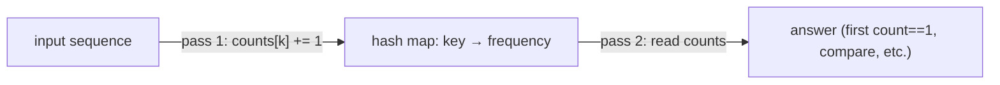

# Pattern: Counting

## Why It Exists

A huge family of problems reduces to one question: *how many times does each thing appear?* The first non-repeating character, "are these two strings anagrams?", "can I build this word from those letters?", "group the anagrams together" — all are really about per-element counts.

The brute force re-scans the data to count each element — `O(n²)`. But a hash map turns counting into a single pass: map each key to a running tally and increment it as you go. Because a hash map does insert and lookup in **`O(1)` average** time (the property from the intro), building the full frequency table is `O(n)`. Once you have the counts, the original question is usually a trivial read — find the key with count 1, compare two count maps, check for an odd count.

## See It Work

Find the first non-repeating character of `"leetcode"`. Tally every character, then scan for the first one that appeared exactly once. Run it, then **Visualise** the frequency map fill in.

> ▶ Run it, then click **Visualise** — one pass builds `char → count`; a second pass returns the first character whose count is `1`.

```python run viz=hashmap viz-root=counts viz-kind=hashmap
def first_unique(s):
    counts = {}
    for ch in s:
        counts[ch] = counts.get(ch, 0) + 1   # tally — O(1) average per update
    for ch in s:
        if counts[ch] == 1:                   # first character seen exactly once
            return ch
    return None

print(first_unique("leetcode"))               # l
```

## How It Works

Two linear passes over a hash map keyed by element:

1. **Build the counts.** Walk the input once; for each key, set `counts[key] = counts.get(key, 0) + 1`. After this pass the map holds every element's exact frequency.
2. **Answer from the counts.** Walk again (or query directly) to extract what you need — here, the first key whose count is `1`.



<p align="center"><strong>pass one tallies each element into a <code>key → count</code> map; pass two reads the map to answer the question.</strong></p>

Both passes are `O(n)` and each map operation is `O(1)` average, so the whole thing is **`O(n)` time, `O(k)` space** for `k` distinct keys. The hash map is what makes "count occurrences" a lookup instead of a nested scan — the same realization behind dozens of string and array problems.

### Key Takeaway

Build a `key → frequency` hash map in one `O(n)` pass, then read it to answer the question. The map's `O(1)`-average updates turn an `O(n²)` re-count into a single sweep; counting is the substrate under anagram, constructibility, and grouping problems.

## Trace It

Counting `"leetcode"` (pass 1), then scanning (pass 2):

| char | counts after |
|---|---|
| `l` | `l:1` |
| `e` | `l:1, e:1` |
| `e` | `l:1, e:2` |
| `t` | `…, t:1` |
| `c,o,d,e` | `l:1, e:3, t:1, c:1, o:1, d:1` |

Pass 2 scans `"leetcode"` in order: `l` has count `1` → return `l`.

Before you read on: the very first character `l` turned out to be the answer. But why does pass 2 re-scan the *string* in order rather than just scanning the *map* for a key with count 1 — wouldn't the map be simpler?

Because the map has **no reliable order** for "first". The question asks for the first non-repeating character *as it appears in the input*, and a hash map's iteration order doesn't encode input position (it's based on hashing, not insertion sequence in general). Scanning the original string in order guarantees you return the *earliest* count-1 character. The map answers "how many times?"; the input order answers "which came first?" — you need both. (This is exactly why some languages offer an *insertion-ordered* map: to fuse the two.)

## Your Turn

The reusable frequency-count solution:

```python run viz=array
def first_unique(s):
    counts = {}
    for ch in s:
        counts[ch] = counts.get(ch, 0) + 1
    for ch in s:
        if counts[ch] == 1:
            return ch
    return None

print(first_unique("loveleetcode"))   # v
print(first_unique("aabb"))            # None
```

```java run viz=array
import java.util.*;

public class Main {
  static Character firstUnique(String s) {
    Map<Character, Integer> counts = new HashMap<>();
    for (char ch : s.toCharArray()) counts.merge(ch, 1, Integer::sum);   // tally
    for (char ch : s.toCharArray()) if (counts.get(ch) == 1) return ch;  // first count==1
    return null;
  }

  public static void main(String[] args) {
    System.out.println(firstUnique("loveleetcode"));   // v
    System.out.println(firstUnique("aabb"));           // null
  }
}
```

Drill the family in **Practice** — [First Non-Repeating Character](/cortex/data-structures-and-algorithms/linear-structures-hash-table-pattern-counting-problems-first-non-repeating-character), [Constructibility Check](/cortex/data-structures-and-algorithms/linear-structures-hash-table-pattern-counting-problems-constructibility-check), [Anagram Checker](/cortex/data-structures-and-algorithms/linear-structures-hash-table-pattern-counting-problems-anagram-checker), [Build Palindrome](/cortex/data-structures-and-algorithms/linear-structures-hash-table-pattern-counting-problems-build-palindrome), and [Cluster Anagrams](/cortex/data-structures-and-algorithms/linear-structures-hash-table-pattern-counting-problems-cluster-anagrams).

## Reflect & Connect

A frequency map is one of the most reused tools in algorithms — spotting "this is a counting problem" is half the battle:

- **The family** — first non-repeating, **anagram check** (two strings are anagrams iff their count maps are equal), **constructibility** (can you build word A from the letters of B? — subtract counts and check none go negative), **palindrome buildability** (at most one character may have an odd count), **group anagrams** (use the sorted string or the count signature as a map *key*).
- **The map is a multiset** — counting treats the hash map as a bag of elements with multiplicities; comparing, subtracting, or thresholding those multiplicities solves the problem.
- **It's the substrate for sliding windows** — when the "window state" is "which elements, and how many," a count map *is* that state. The next patterns slide a window while maintaining exactly such a map.

**Prerequisites:** [What Is a Hash Table?](/cortex/data-structures-and-algorithms/linear-structures-hash-table-what-is-a-hash-table).
**What's next:** use a hash map to build and look up keys you construct on the fly — [Pattern Generation](/cortex/data-structures-and-algorithms/linear-structures-hash-table-pattern-pattern-generation-pattern).

## Recall

> **Mnemonic:** *One pass builds `key → count`; a second pass (in input order) reads it. `O(n)` via `O(1)`-average map ops. The map says "how many," input order says "which first."*

| | |
|---|---|
| Build | `counts[k] = counts.get(k, 0) + 1` over one pass |
| Read | scan again (in order) or query the map directly |
| Cost | `O(n)` time, `O(k)` space (`k` distinct keys) |
| "First" caveat | scan the input in order — a plain map has no positional order |
| Map as | a multiset (elements with multiplicities) |

<details>
<summary><strong>Q:</strong> Why is hash-map counting `O(n)` and not `O(n²)`?</summary>

**A:** Each element is tallied with one `O(1)`-average map update, so the whole count builds in a single pass.

</details>
<details>
<summary><strong>Q:</strong> Why scan the input again for "first non-repeating" instead of scanning the map?</summary>

**A:** A plain hash map has no input-order, so only the original sequence tells you which count-1 element came first.

</details>
<details>
<summary><strong>Q:</strong> How does counting solve anagram checking?</summary>

**A:** Two strings are anagrams iff their `char → count` maps are identical.

</details>
<details>
<summary><strong>Q:</strong> How does counting connect to sliding windows?</summary>

**A:** When the window's state is "which elements and how many," a count map *is* that state, maintained as the window moves.

</details>

## Sources & Verify

- **CLRS**, *Introduction to Algorithms*, 4th ed., §11 — hash tables and `O(1)`-average operations.
- **Sedgewick & Wayne**, *Algorithms*, 4th ed., §3.4–3.5 — hash tables and symbol-table applications (frequency counts).
- Frequency counting with a hash map is the canonical application; both runnable blocks are verified by running (`leetcode ⇒ l`, `loveleetcode ⇒ v`, `aabb ⇒ None`).
