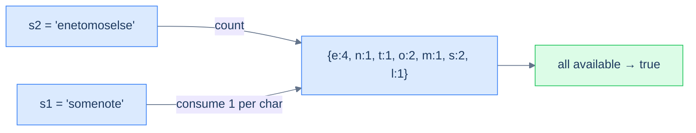

# Constructibility check

## Problem Statement

Given two strings `s1` and `s2`, return `true` if `s1` can be constructed using the letters from `s2` (each letter usable at most once). Return `false` otherwise.

## Examples

**Example 1**
```
Input:  s1 = "somenote", s2 = "enetomoselse"
Output: true
Explanation: s2 has every letter s1 needs, with enough copies — s1 is buildable.
```

**Example 2**
```
Input:  s1 = "thief", s2 = "hifacqet"
Output: true
Explanation: t, h, i, e, f all appear in s2 at least once → buildable.
```

**Example 3**
```
Input:  s1 = "alpha", s2 = "beta"
Output: false
Explanation: s1 needs 'l' and 'p', which s2 lacks → not buildable.
```

**Example 4**
```
Input:  s1 = "aa", s2 = "a"
Output: false
Explanation: s1 needs two 'a's but s2 supplies only one → not buildable.
```

<details>
<summary><h2>Intuition</h2></summary>


The structural property that makes this a **counting** problem is that order is irrelevant — `s1` is buildable from `s2` only if `s2` supplies *enough copies* of each needed letter. That is a per-letter count comparison, the signal the counting pattern fires on.

The frequency map of `s2` models the available-letters pool. Build it once, then walk `s1` and *consume* one copy per character by decrementing its count. A count that is missing or already zero when `s1` still demands the letter means the pool is short — the build is impossible. The map is the natural structure because it answers "how many of this letter remain?" in `O(1)`.

The naive approach breaks the time budget. For each character of `s1` it scans `s2` for an unused match and marks it, costing `O(|s1| × |s2|)` time. That re-derives the same availability counts repeatedly. Counting builds the pool once in `O(|s2|)`, so each consume step is an `O(1)` decrement-and-check.

</details>
<details>
<summary><h2>Applying the Diagnostic Questions</h2></summary>


| Check | Answer for Constructibility Check |
|---|---|
| **Q1.** Does the answer depend on how *often* items appear? | **Yes** — `s2` must supply at least as many copies of each letter as `s1` needs. |
| **Q2.** Is the input a linear sequence? | **Yes** — two strings, each walked character by character. |
| **Q3.** Can the answer be read off the counts after one pass? | **Yes** — count `s2`, then decrement while walking `s1`. |
| **Q4.** Is the per-item work `O(1)` amortised? | **Yes** — one hash-map update or lookup per character. |

</details>
<details>
<summary><h2>Approach</h2></summary>


Build the frequency map of `s2`. Then walk `s1`; for each character, *consume* one from the map by decrementing it. If any character's count drops to zero (or below) while we still need it, `s2` doesn't have enough letters — return `false`.



<p align="center"><strong>Constructibility — the s2 frequency map is the "available letters" pool. Walking s1 consumes from the pool. If you ever try to consume a letter that's exhausted, the build fails.</strong></p>

</details>
<details>
<summary><h2>Approach in Words</h2></summary>


Count the supply, then spend it as you walk the demand.

1. **Build the supply pool.** Count every character in `s2` into a `frequency` map — this is the multiset of available letters.
2. **Walk `s1` and consume.** For each character of `s1`, check its remaining count in the pool.
3. **Fail on shortage.** If the count is zero or the letter is absent, `s2` cannot supply it — return `false`.
4. **Spend one copy.** Otherwise decrement the letter's count and continue.
5. **Succeed if `s1` finishes.** Reaching the end of `s1` means every demand was met — return `true`.

</details>

```quiz
{
  "prompt": "Can \"note\" be constructed from \"tnoee\"?",
  "input": "s1 = \"note\"\ns2 = \"tnoee\"",
  "options": ["true", "false"],
  "answer": "true"
}
```

## Constraints

- `1 ≤ s1.length, s2.length ≤ 10⁵`
- `s1` and `s2` consist of lowercase English letters

```python run
class Solution:
    def constructibility_check(self, s1: str, s2: str) -> bool:
        # Your code goes here — count s2, then consume from the pool as you walk s1.
        return False

s1 = input()
s2 = input()
print("true" if Solution().constructibility_check(s1, s2) else "false")
```

```java run
import java.util.*;

public class Main {
    static class Solution {
        public boolean constructibilityCheck(String s1, String s2) {
            // Your code goes here — count s2, then consume from the pool as you walk s1.
            return false;
        }
    }

    public static void main(String[] args) {
        Scanner sc = new Scanner(System.in);
        String s1 = sc.nextLine();
        String s2 = sc.nextLine();
        System.out.println(new Solution().constructibilityCheck(s1, s2));
    }
}
```

```testcases
{
  "args": [
    { "id": "s1", "label": "s1", "type": "string", "placeholder": "somenote" },
    { "id": "s2", "label": "s2", "type": "string", "placeholder": "enetomoselse" }
  ],
  "cases": [
    { "args": { "s1": "somenote", "s2": "enetomoselse" }, "expected": "true" },
    { "args": { "s1": "thief", "s2": "hifacqet" }, "expected": "true" },
    { "args": { "s1": "alpha", "s2": "beta" }, "expected": "false" },
    { "args": { "s1": "aa", "s2": "a" }, "expected": "false" },
    { "args": { "s1": "a", "s2": "a" }, "expected": "true" },
    { "args": { "s1": "abc", "s2": "abc" }, "expected": "true" },
    { "args": { "s1": "abc", "s2": "xyz" }, "expected": "false" }
  ]
}
```

<details>
<summary>Editorial</summary>

Count the supply (`s2`), then decrement while walking the demand (`s1`), failing the instant a needed letter is exhausted.

```python solution time=O(|s1|+|s2|) space=O(k)
class Solution:
    def constructibility_check(self, s1: str, s2: str) -> bool:
        s2_frequency = {}
        for ch in s2:
            s2_frequency[ch] = s2_frequency.get(ch, 0) + 1
        for ch in s1:
            if s2_frequency.get(ch, 0) == 0:
                return False
            s2_frequency[ch] -= 1
        return True

s1 = input()
s2 = input()
print("true" if Solution().constructibility_check(s1, s2) else "false")
```

```java solution
import java.util.*;

public class Main {
    static class Solution {
        public boolean constructibilityCheck(String s1, String s2) {
            Map<Character, Integer> s2Frequency = new HashMap<>();
            for (char ch : s2.toCharArray())
                s2Frequency.put(ch, s2Frequency.getOrDefault(ch, 0) + 1);
            for (char ch : s1.toCharArray()) {
                if (s2Frequency.getOrDefault(ch, 0) == 0) return false;
                s2Frequency.put(ch, s2Frequency.get(ch) - 1);
            }
            return true;
        }
    }

    public static void main(String[] args) {
        Scanner sc = new Scanner(System.in);
        String s1 = sc.nextLine();
        String s2 = sc.nextLine();
        System.out.println(new Solution().constructibilityCheck(s1, s2));
    }
}
```

### Dry Run

Walk Example 1 — `s1 = "somenote"`, `s2 = "enetomoselse"`. Build the `s2` pool, then consume one copy per `s1` character:

```
build pool from s2 = "enetomoselse"
  {e:4, n:1, t:1, o:2, m:1, s:2, l:1}

consume s1 = "somenote"
  's'  count 2 > 0  →  {e:4, n:1, t:1, o:2, m:1, s:1, l:1}
  'o'  count 2 > 0  →  {e:4, n:1, t:1, o:1, m:1, s:1, l:1}
  'm'  count 1 > 0  →  {e:4, n:1, t:1, o:1, m:0, s:1, l:1}
  'e'  count 4 > 0  →  {e:3, n:1, t:1, o:1, m:0, s:1, l:1}
  'n'  count 1 > 0  →  {e:3, n:0, t:1, o:1, m:0, s:1, l:1}
  'o'  count 1 > 0  →  {e:3, n:0, t:1, o:0, m:0, s:1, l:1}
  't'  count 1 > 0  →  {e:3, n:0, t:0, o:0, m:0, s:1, l:1}
  'e'  count 3 > 0  →  {e:2, n:0, t:0, o:0, m:0, s:1, l:1}

every character consumed without shortage → return true
```

### Complexity Analysis

| Measure | Value | Why |
|---|---|---|
| Time  | **O(\|s1\| + \|s2\|)** | One pass to count `s2`, one pass to consume over `s1`; each step is amortised `O(1)`. |
| Space | **O(k)** | The pool holds `k` distinct characters of `s2` — `O(1)` for a fixed alphabet, `O(\|s2\|)` in general. |

### Edge Cases

| Case | Example | Expected | Reasoning |
|---|---|---|---|
| Not enough copies | `s1 = "aa", s2 = "a"` | `false` | `s1` needs two `'a'`s; the pool has one. |
| Exact match | `s1 = "abc", s2 = "abc"` | `true` | Every letter present with exactly enough copies. |
| Missing letter | `s1 = "alpha", s2 = "beta"` | `false` | `'l'` and `'p'` never appear in the pool. |

</details>
<details>
<summary><h2>Key Takeaway</h2></summary>


This is the two-sequence reconcile shape: count the supply (`s2`) once, then decrement it while walking the demand (`s1`), failing the instant a needed letter is exhausted. The directionality matters — the pool is `s2`, and `s1` only spends from it.

</details>
