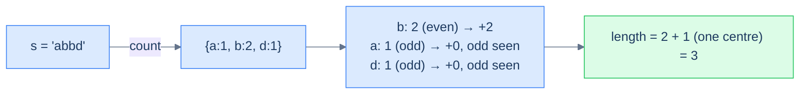

# Build palindrome

## Problem Statement

Given a case-sensitive string `s`, return the length of the **longest palindrome** that can be built using all or some of its letters.

### Example 1
> -   **Input:** `s = "AaAaBbBbc"`
> -   **Output:** `9`
> -   **Explanation:** Use every character — e.g. `"BAabcbaAB"`.

### Example 2
> -   **Input:** `s = "abbd"`
> -   **Output:** `3`
> -   **Explanation:** `"bab"` or `"bdb"`.

### Example 3
> -   **Input:** `s = "abc"`
> -   **Output:** `1`

## Examples

**Example 1**
```
Input:  s = "AaAaBbBbc"
Output: 9
Explanation: A, a, B, b each appear twice (8 paired letters); 'c' sits in the
middle → 8 + 1 = 9. Letters are case-sensitive, so 'A' and 'a' are distinct.
```

**Example 2**
```
Input:  s = "abbd"
Output: 3
Explanation: 'b' pairs (+2); one of 'a' or 'd' takes the centre (+1) → 3.
```

**Example 3**
```
Input:  s = "abc"
Output: 1
Explanation: no letter repeats, so a single centre character is the whole palindrome.
```

**Example 4**
```
Input:  s = "aabb"
Output: 4
Explanation: a and b both pair fully (+2 each) with no leftover centre → 4.
```


<details>
<summary><h2>Intuition</h2></summary>


The structural property that makes this a **counting** problem is that a palindrome is built from *pairs*. Each character used an even number of times mirrors around the centre, and at most one odd character sits alone in the middle. Position in `s` is irrelevant — only each letter's count matters, the signal counting fires on.

The frequency map gives every letter's count in one pass. Each even count contributes fully to the length, since all its copies pair off. Each odd count contributes `count − 1` — its largest even part — and flags that a leftover single exists. The map is the right structure because palindrome length is a pure function of these per-letter counts.

The naive approach breaks the time budget. Generating candidate palindromes and measuring them is exponential, and even checking arrangements is far worse than linear. Counting reduces the whole question to summing even parts plus one optional centre — `O(N)` time, no construction needed.

</details>
<details>
<summary><h2>Applying the Diagnostic Questions</h2></summary>


| Check | Answer for Build Palindrome |
|---|---|
| **Q1.** Does the answer depend on how *often* items appear? | **Yes** — pair counts and a single odd centre decide the length. |
| **Q2.** Is the input a linear sequence? | **Yes** — a string, walked character by character. |
| **Q3.** Can the answer be read off the counts after one pass? | **Yes** — count once, then sum even parts plus one optional centre. |
| **Q4.** Is the per-item work `O(1)` amortised? | **Yes** — one hash-map increment per character, then one pass over the counts. |

</details>
<details>
<summary><h2>Approach</h2></summary>


A palindrome reads the same forward and backward. Every character used in pairs contributes 2 to the length; **at most one** odd-count character can sit alone in the middle. So:

1. Count each character's frequency.
2. For each frequency: if **even**, add it all; if **odd**, add `count − 1` (the largest even part) and remember we saw an odd.
3. If any odd count was seen, add 1 (one character can sit in the middle).



<p align="center"><strong>Build palindrome — every even-frequency character contributes fully; odd-frequency characters contribute (count − 1); a single bonus +1 for the optional middle character.</strong></p>

</details>
<details>
<summary><h2>Approach in Words</h2></summary>


Count the letters, then add up the pairs and grant one centre if any odd remains.

1. **Build the frequency map.** Count every character in `s`.
2. **Add the even parts.** For each count, add its largest even value — the whole count if even, or `count − 1` if odd.
3. **Track odds.** Record whether any odd count was seen.
4. **Add the centre.** If at least one odd count existed, add `1` for the single middle character.
5. **Return the length.** The accumulated total is the longest buildable palindrome's length.

</details>
<details>
<summary><h2>Solution</h2></summary>


```python run viz=array
from collections import defaultdict
from typing import Dict

class Solution:
    def count_frequency(self, s: str) -> Dict[str, int]:
        frequency = defaultdict(int)
        for ch in s:
            frequency[ch] += 1

        return frequency

    def build_palindrome(self, s: str) -> int:

        # Create a map to store the frequency of each character in the
        # string
        frequency = self.count_frequency(s)

        # Initialize the length of the longest palindrome
        length = 0

        # Initialize a boolean flag to check if there are odd counts of
        # characters
        odd = False

        # Iterate over the map to calculate the length of the longest
        # palindrome
        for count in frequency.values():

            # If the count of the character is even, add it to the length
            if count % 2 == 0:
                length += count

            # If the count of the character is odd, add the count minus
            # one to the length and set the odd flag to true
            else:
                length += count - 1
                odd = True

        # If there are odd counts of characters, add one to the length
        return length + 1 if odd else length


# Examples from the problem statement
print(Solution().build_palindrome("AaAaBbBbc"))  # 9
print(Solution().build_palindrome("abbd"))       # 3
print(Solution().build_palindrome("abc"))        # 1

# Edge cases
print(Solution().build_palindrome(""))           # 0
print(Solution().build_palindrome("a"))          # 1
print(Solution().build_palindrome("aa"))         # 2
print(Solution().build_palindrome("aabb"))       # 4
print(Solution().build_palindrome("aaaa"))       # 4
```

```java run viz=array
import java.util.*;

public class Main {
    static class Solution {
        private Map<Character, Integer> countFrequency(String s) {
            Map<Character, Integer> frequency = new HashMap<>();
            for (char ch : s.toCharArray()) {
                frequency.put(ch, frequency.getOrDefault(ch, 0) + 1);
            }

            return frequency;
        }

        public int buildPalindrome(String s) {

            // Create a map to store the frequency of each character in the
            // string
            Map<Character, Integer> frequency = countFrequency(s);

            // Initialize the length of the longest palindrome
            int length = 0;

            // Initialize a boolean flag to check if there are odd counts of
            // characters
            boolean odd = false;

            // Iterate over the map to calculate the length of the longest
            // palindrome
            for (var entry : frequency.entrySet()) {

                // If the count of the character is even, add it to the
                // length
                if (entry.getValue() % 2 == 0) {
                    length += entry.getValue();
                }

                // If the count of the character is odd, add the count minus
                // one to the length and set the odd flag to true
                else {
                    length += entry.getValue() - 1;
                    odd = true;
                }
            }

            // If there are odd counts of characters, add one to the length
            return odd ? length + 1 : length;
        }
    }

    public static void main(String[] args) {
        // Examples from the problem statement
        System.out.println(new Solution().buildPalindrome("AaAaBbBbc")); // 9
        System.out.println(new Solution().buildPalindrome("abbd"));      // 3
        System.out.println(new Solution().buildPalindrome("abc"));       // 1

        // Edge cases
        System.out.println(new Solution().buildPalindrome(""));          // 0
        System.out.println(new Solution().buildPalindrome("a"));         // 1
        System.out.println(new Solution().buildPalindrome("aa"));        // 2
        System.out.println(new Solution().buildPalindrome("aabb"));      // 4
        System.out.println(new Solution().buildPalindrome("aaaa"));      // 4
    }
}
```

</details>
<details>
<summary><h2>Dry Run</h2></summary>


Walk Example 1 — `s = "AaAaBbBbc"`. Letters are case-sensitive, so `'A'` and `'a'` are distinct. Count, then sum even parts plus one optional centre:

```
count s = "AaAaBbBbc"
  {A:2, a:2, B:2, b:2, c:1}

accumulate (length starts at 0, odd flag starts false)
  A:2  even  → length += 2  → 2
  a:2  even  → length += 2  → 4
  B:2  even  → length += 2  → 6
  b:2  even  → length += 2  → 8
  c:1  odd   → length += 0  → 8,  odd = true

odd seen → add 1 centre → 8 + 1 = 9
```

The result `9` matches the expected output — eight paired letters plus one centre character.

</details>
<details>
<summary><h2>Complexity Analysis</h2></summary>


| Measure | Value | Why |
|---|---|---|
| Time  | **O(N)** | One pass to count, one pass over the distinct counts; each step is amortised `O(1)`. |
| Space | **O(N)** | The map holds up to `N` distinct characters — `O(1)` for a fixed alphabet, `O(N)` in general. |

</details>
<details>
<summary><h2>Edge Cases</h2></summary>


| Case | Example | Expected | Reasoning |
|---|---|---|---|
| Empty string | `s = ""` | `0` | No characters, so the longest palindrome is empty. |
| Single character | `s = "a"` | `1` | One odd count contributes a lone centre. |
| One pair | `s = "aa"` | `2` | A single even count pairs fully, no centre. |
| All pairs | `s = "aabb"` | `4` | Two even counts pair fully; no odd centre to add. |
| All same, even | `s = "aaaa"` | `4` | One even count of `4` contributes all four. |
| No repeats | `s = "abc"` | `1` | Three odd counts, but only one centre is allowed → `1`. |

</details>
<details>
<summary><h2>Key Takeaway</h2></summary>


This is the count-then-inspect shape: the palindrome length is `sum of even parts + 1 if any odd count exists`. The subtlety is that *many* odd counts still grant only a single centre — the `+1` is capped at one regardless of how many odds appear.

</details>