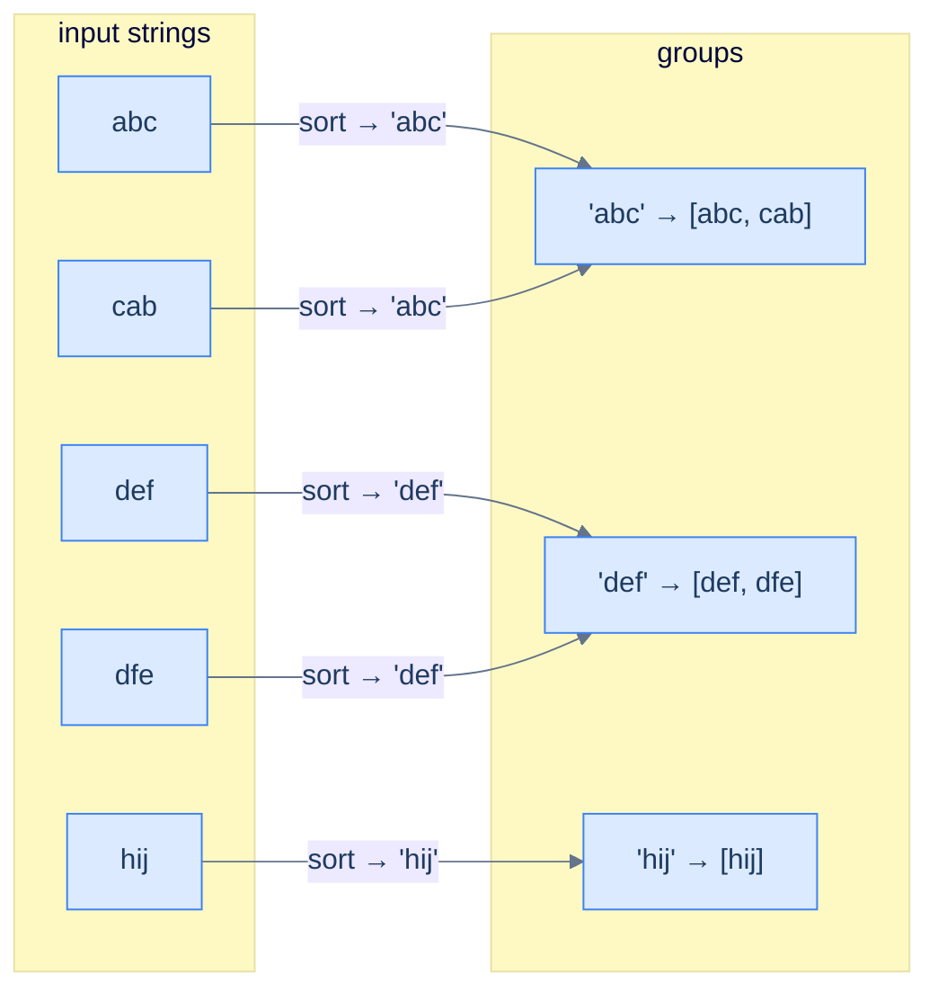

# Cluster anagrams

## Problem Statement

Given an array of strings `strs`, group all anagrams together. Return the groups in any order.

### Example 1
> -   **Input:** `["abc", "cab", "def", "dfe", "hij"]`
> -   **Output:** `[["abc", "cab"], ["def", "dfe"], ["hij"]]`

### Example 2
> -   **Input:** `["a", "b", "c", "d", "e"]`
> -   **Output:** `[["a"], ["b"], ["c"], ["d"], ["e"]]`

### Example 3
> -   **Input:** `[]`
> -   **Output:** `[]`

## Examples

**Example 1**
```
Input:  ["abc", "cab", "def", "dfe", "hij"]
Output: [["abc", "cab"], ["def", "dfe"], ["hij"]]
Explanation: "abc"/"cab" share a letter-count signature, as do "def"/"dfe";
"hij" stands alone. Group order is unspecified.
```

**Example 2**
```
Input:  ["a", "b", "c", "d", "e"]
Output: [["a"], ["b"], ["c"], ["d"], ["e"]]
Explanation: every string has a distinct signature → five singleton groups.
```

**Example 3**
```
Input:  []
Output: []
Explanation: no strings means no groups.
```

**Example 4**
```
Input:  ["eat", "tea", "tan", "ate", "nat", "bat"]
Output: [["ate", "eat", "tea"], ["nat", "tan"], ["bat"]]
Explanation: eat/tea/ate collide on one signature; tan/nat on another; bat alone.
```


<details>
<summary><h2>Intuition</h2></summary>


The structural property that makes this a **counting** problem is that two strings are anagrams exactly when their letter-frequency maps match. So a string's *frequency signature* is a grouping key — any two anagrams produce the same signature, the collision the counting pattern exploits.

The hash map keys on that signature and values a list of the strings sharing it. For lowercase input, a 26-slot tuple `(count_a, …, count_z)` is the cleanest key, costing `O(K)` per string of length `K`. Walk the input once, compute each string's signature, and append the string to its bucket. The buckets *are* the anagram groups, so no comparison between strings is ever needed.

The naive approach breaks the time budget. Comparing every string to every other to test anagram-hood is `O(N² · K)` time. Counting assigns each string to a bucket in `O(K)`, so the whole grouping is `O(N · K)` — the per-pair comparison vanishes into a single hash lookup.

</details>
<details>
<summary><h2>Applying the Diagnostic Questions</h2></summary>


| Check | Answer for Cluster Anagrams |
|---|---|
| **Q1.** Does the answer depend on how *often* items appear? | **Yes** — anagrams are defined by matching letter counts. |
| **Q2.** Is the input a linear sequence? | **Yes** — an array of strings, walked one string at a time. |
| **Q3.** Can the answer be read off the counts after one pass? | **Yes** — each string's frequency signature is its group key. |
| **Q4.** Is the per-item work `O(1)` amortised? | **Yes** — building the signature is `O(K)`; the bucket insert is amortised `O(1)`. |

</details>
<details>
<summary><h2>Approach</h2></summary>


Two strings are anagrams iff their character frequency maps match. So the **frequency tuple itself** is a perfect grouping key — any two anagrams produce the same key. Build a hash map from frequency-key to list of strings.

For lowercase-only inputs, a 26-element tuple `(count_a, count_b, …, count_z)` is the cleanest key. For the general case, the **sorted string** (e.g. `"cab"` → `"abc"`) is an equivalent key — anagrams sort to the same canonical form.



<p align="center"><strong>Cluster anagrams — the canonical form (sorted letters or letter-frequency tuple) is the same for every anagram, so anagrams collide into the same hash-map bucket. The buckets <em>are</em> the groups.</strong></p>

</details>
<details>
<summary><h2>Approach in Words</h2></summary>


Key each string by its letter-count signature, then read the buckets out as groups.

1. **Prepare the bucket map.** Use a map from frequency signature to a list of string indices.
2. **Walk the input.** For each string, build its 26-slot letter-count signature.
3. **Bucket by signature.** Append the string's index to the list under its signature, creating the list on first sight.
4. **Collect the groups.** For each bucket, map its stored indices back to the original strings to form one anagram group.
5. **Return the groups.** The list of buckets is the answer; group order is unspecified.

</details>
<details>
<summary><h2>Solution</h2></summary>


```python run viz=array viz-root=frequency
from typing import List, Tuple

class Solution:
    def count_frequency(self, str: str) -> List[int]:

        # Initialize frequency list for 26 letters
        frequency = [0] * 26
        for c in str:

            # Increment the count for each character
            frequency[ord(c) - ord("a")] += 1
        return frequency

    def cluster_anagrams(self, strs: List[str]) -> List[List[str]]:

        # Map to store character frequency lists as keys and lists of
        # indices as values
        frequency_groups = {}

        # Populate the frequency_groups with indices of strings grouped
        # by character frequencies
        for i, s in enumerate(strs):

            # Count the frequency of each character in the string
            frequency = self.count_frequency(s)

            # Group strings with the same frequency list by storing
            # their indices
            if tuple(frequency) not in frequency_groups:
                frequency_groups[tuple(frequency)] = []
            frequency_groups[tuple(frequency)].append(i)

        # Collect grouped anagrams into the result list
        result = []

        # Iterate over each group of indices in frequencyGroups
        for entry in frequency_groups.items():
            anagram_group = []
            for index in entry[1]:

                # Use the index to get the original string and add it to
                # the anagram group
                anagram_group.append(strs[index])

            # Add the anagram group to the result
            result.append(anagram_group)
        return result


# Examples from the problem statement
r1 = Solution().cluster_anagrams(["abc", "cab", "def", "dfe", "hij"])
print(sorted([sorted(g) for g in r1]))   # [['abc', 'cab'], ['def', 'dfe'], ['hij']]

r2 = Solution().cluster_anagrams(["a", "b", "c", "d", "e"])
print(sorted([sorted(g) for g in r2]))   # [['a'], ['b'], ['c'], ['d'], ['e']]

print(Solution().cluster_anagrams([]))   # []

# Edge cases
r4 = Solution().cluster_anagrams(["eat", "tea", "tan", "ate", "nat", "bat"])
print(sorted([sorted(g) for g in r4]))   # [['ate', 'eat', 'tea'], ['bat'], ['nat', 'tan']]

r5 = Solution().cluster_anagrams(["a"])
print(r5)                                # [['a']]
```

```java run viz=array viz-root=frequency
import java.util.*;
import java.util.stream.*;

public class Main {
    static class Solution {
        private List<Integer> countFrequency(String str) {

            // Initialize frequency list for 26 letters
            List<Integer> frequency = new ArrayList<>(
                Collections.nCopies(26, 0)
            );
            for (char c : str.toCharArray()) {

                // Increment the count for each character
                frequency.set(c - 'a', frequency.get(c - 'a') + 1);
            }
            return frequency;
        }

        public List<List<String>> clusterAnagrams(String[] strs) {

            // Map to store character frequency lists as keys and lists of
            // indices as values
            Map<List<Integer>, List<Integer>> frequencyGroups =
                new HashMap<>();

            // Populate the frequencyGroups with indices of strings grouped
            // by character frequencies
            for (int i = 0; i < strs.length; i++) {

                // Count the frequency of each character in the string
                List<Integer> frequency = countFrequency(strs[i]);

                // Group strings with the same frequency list by storing
                // their indices
                frequencyGroups.put(
                    frequency,
                    frequencyGroups.getOrDefault(
                        frequency,
                        new ArrayList<>()
                    )
                );
                frequencyGroups.get(frequency).add(i);
            }

            // Collect grouped anagrams into the result array
            List<List<String>> result = new ArrayList<>();

            // Iterate over each group of indices in frequencyGroups
            for (List<Integer> indices : frequencyGroups.values()) {

                // Use the index to get the original string and add it to
                // the anagram group
                List<String> anagramGroup = indices
                    .stream()
                    .map(i -> strs[i])
                    .collect(Collectors.toList());

                // Add the anagram group to the result
                result.add(anagramGroup);
            }

            return result;
        }
    }

    public static void main(String[] args) {
        // Examples from the problem statement
        var r1 = new Solution().clusterAnagrams(new String[]{"abc", "cab", "def", "dfe", "hij"});
        r1.forEach(g -> { Collections.sort(g); System.out.print(g + " "); }); System.out.println();
        // [abc, cab] [def, dfe] [hij] (order of groups may vary)

        var r2 = new Solution().clusterAnagrams(new String[]{"a", "b", "c", "d", "e"});
        r2.forEach(g -> System.out.print(g + " ")); System.out.println();
        // [a] [b] [c] [d] [e] (order may vary)

        var r3 = new Solution().clusterAnagrams(new String[]{});
        System.out.println(r3);  // []

        // Edge cases
        var r4 = new Solution().clusterAnagrams(new String[]{"eat", "tea", "tan", "ate", "nat", "bat"});
        r4.forEach(g -> { Collections.sort(g); System.out.print(g + " "); }); System.out.println();
        // [ate, eat, tea] [nat, tan] [bat] (order of groups may vary)

        var r5 = new Solution().clusterAnagrams(new String[]{"a"});
        System.out.println(r5);  // [[a]]
    }
}
```


**Complexity:** O(N · K) where N is the number of strings and K is the average length — this implementation builds a 26-element frequency tuple per string, which costs O(K) and avoids the O(K log K) of sorting each string.

</details>
<details>
<summary><h2>Dry Run</h2></summary>


Walk Example 1 — `["abc", "cab", "def", "dfe", "hij"]`. Each signature is the letter-count tuple, shown here as the equivalent sorted form for readability:

```
i=0  "abc"  signature (a:1,b:1,c:1)  new bucket  → { abc-sig: [0] }
i=1  "cab"  signature (a:1,b:1,c:1)  matches i=0 → { abc-sig: [0,1] }
i=2  "def"  signature (d:1,e:1,f:1)  new bucket  → { …, def-sig: [2] }
i=3  "dfe"  signature (d:1,e:1,f:1)  matches i=2 → { …, def-sig: [2,3] }
i=4  "hij"  signature (h:1,i:1,j:1)  new bucket  → { …, hij-sig: [4] }

collect buckets → indices [0,1] → ["abc","cab"]
                  indices [2,3] → ["def","dfe"]
                  indices [4]   → ["hij"]

result = [["abc","cab"], ["def","dfe"], ["hij"]]
```

The result matches the expected output — anagrams collide into shared buckets while group order stays unspecified.

</details>
<details>
<summary><h2>Complexity Analysis</h2></summary>


| Measure | Value | Why |
|---|---|---|
| Time  | **O(N · K)** | For `N` strings of average length `K`, each builds a 26-slot signature in `O(K)`; the bucket insert is amortised `O(1)`. |
| Space | **O(N · K)** | Every input string is stored across the buckets, plus one signature key per distinct group. |

Building a fixed 26-slot tuple per string avoids the `O(K log K)` cost of sorting each string into a canonical key.

</details>
<details>
<summary><h2>Edge Cases</h2></summary>


| Case | Example | Expected | Reasoning |
|---|---|---|---|
| Empty input | `[]` | `[]` | No strings, so no groups. |
| Single string | `["a"]` | `[["a"]]` | One string forms one singleton group. |
| All distinct | `["a", "b", "c"]` | `[["a"], ["b"], ["c"]]` | Every signature differs → all singletons. |
| All anagrams | `["abc", "cab", "bca"]` | `[["abc", "cab", "bca"]]` | One shared signature collapses every string into one group. |
| Mixed groups | `["eat", "tea", "tan", "nat", "bat"]` | `[["eat", "tea"], ["tan", "nat"], ["bat"]]` | Three signatures yield three buckets of differing sizes. |

</details>
<details>
<summary><h2>Key Takeaway</h2></summary>


This is the canonical-form-key shape: hash each string on its letter-count signature so anagrams collide into the same bucket, then read the buckets out as groups. The signature replaces all pairwise anagram comparison with one hash lookup per string.

</details>
<details>
<summary><h2>Key Takeaway</h2></summary>


Counting is the gateway pattern of hash-table problem solving. The **template** — *build a frequency map first, then answer the question* — is so common that you'll see it in dozens of interview problems and hundreds of production codebases. Five lessons in one paragraph:

- **Trade space for time.** O(N) memory buys you O(N) time when the alternative is O(N²).
- **A hash map *is* a multiset.** Anagram, equality, subset-of, palindrome-buildability — all reduce to multiset comparisons that the map handles in two lines.
- **Pick the right key.** Sometimes the key is the item itself; sometimes it's a *canonical form* (sorted string, frequency tuple) that collapses many inputs to one.
- **Two passes are usually enough.** First pass builds the map; second pass uses it. Resist the urge to do everything in one loop — clarity beats cleverness.
- **Counting rarely solves the problem alone.** It builds the *input* to the rest of your algorithm. The map is a tool, not the answer.

> *Coming up — the **key-generation pattern**. Counting answers "how often did X appear?". Key generation answers "have I seen *something equivalent to* X before?" — where "equivalent" means *the same key under some canonical transformation*. We just used it to cluster anagrams (sorted-string key); the next lesson generalises it to deduplication, isomorphism checks, and a host of "is this the same as that?" problems.*

</details>
