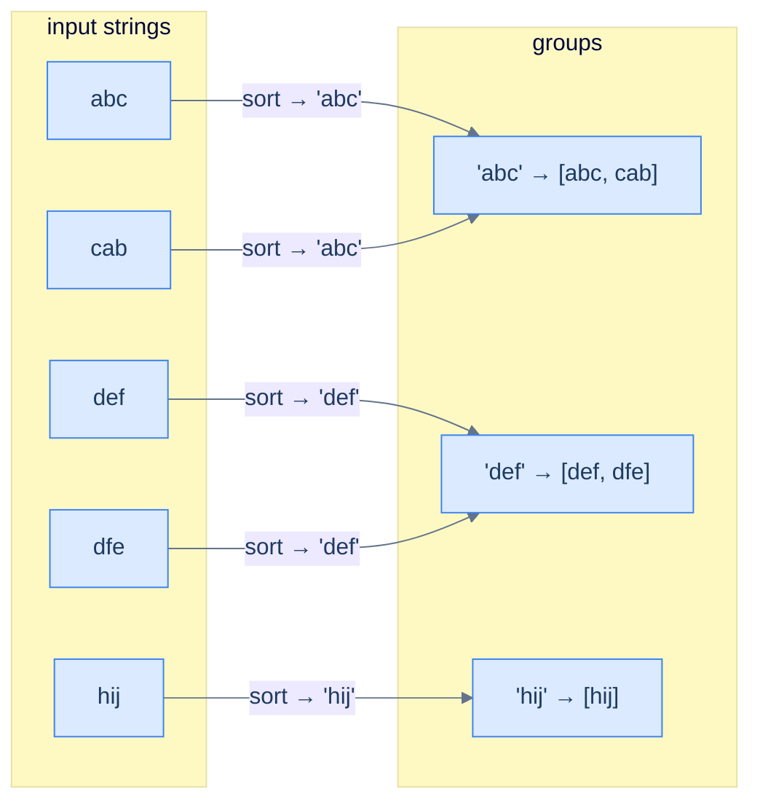

# Cluster anagrams

## Problem Statement

Given an array of strings `strs`, group all anagrams together. Return the groups in any order.

## Examples

**Example 1**
```
Input:  ["abc", "cab", "def", "dfe", "hij"]
Output: [["abc", "cab"], ["def", "dfe"], ["hij"]]
Explanation: "abc"/"cab" share a letter-count signature, as do "def"/"dfe";
"hij" stands alone. Group order is unspecified.
```

**Example 2**
```
Input:  ["a", "b", "c", "d", "e"]
Output: [["a"], ["b"], ["c"], ["d"], ["e"]]
Explanation: every string has a distinct signature → five singleton groups.
```

**Example 3**
```
Input:  ["eat", "tea", "tan", "ate", "nat", "bat"]
Output: [["ate", "eat", "tea"], ["bat"], ["nat", "tan"]]
Explanation: eat/tea/ate collide on one signature; tan/nat on another; bat alone.
```

<details>
<summary><h2>Intuition</h2></summary>


The structural property that makes this a **counting** problem is that two strings are anagrams exactly when their letter-frequency maps match. So a string's *frequency signature* is a grouping key — any two anagrams produce the same signature, the collision the counting pattern exploits.

The hash map keys on that signature and values a list of the strings sharing it. For lowercase input, a 26-slot tuple `(count_a, …, count_z)` is the cleanest key, costing `O(K)` per string of length `K`. Walk the input once, compute each string's signature, and append the string to its bucket. The buckets *are* the anagram groups, so no comparison between strings is ever needed.

The naive approach breaks the time budget. Comparing every string to every other to test anagram-hood is `O(N² · K)` time. Counting assigns each string to a bucket in `O(K)`, so the whole grouping is `O(N · K)` — the per-pair comparison vanishes into a single hash lookup.

</details>
<details>
<summary><h2>Applying the Diagnostic Questions</h2></summary>


| Check | Answer for Cluster Anagrams |
|---|---|
| **Q1.** Does the answer depend on how *often* items appear? | **Yes** — anagrams are defined by matching letter counts. |
| **Q2.** Is the input a linear sequence? | **Yes** — an array of strings, walked one string at a time. |
| **Q3.** Can the answer be read off the counts after one pass? | **Yes** — each string's frequency signature is its group key. |
| **Q4.** Is the per-item work `O(1)` amortised? | **Yes** — building the signature is `O(K)`; the bucket insert is amortised `O(1)`. |

</details>
<details>
<summary><h2>Approach</h2></summary>


Two strings are anagrams iff their character frequency maps match. So the **frequency tuple itself** is a perfect grouping key — any two anagrams produce the same key. Build a hash map from frequency-key to list of strings.

For lowercase-only inputs, a 26-element tuple `(count_a, count_b, …, count_z)` is the cleanest key. For the general case, the **sorted string** (e.g. `"cab"` → `"abc"`) is an equivalent key — anagrams sort to the same canonical form.



<p align="center"><strong>Cluster anagrams — the canonical form (sorted letters or letter-frequency tuple) is the same for every anagram, so anagrams collide into the same hash-map bucket. The buckets <em>are</em> the groups.</strong></p>

Key each string by its letter-count signature, then read the buckets out as groups.

1. **Prepare the bucket map.** Use a map from frequency signature to a list of string indices.
2. **Walk the input.** For each string, build its 26-slot letter-count signature.
3. **Bucket by signature.** Append the string's index to the list under its signature, creating the list on first sight.
4. **Collect the groups.** For each bucket, map its stored indices back to the original strings to form one anagram group.
5. **Return the groups.** The list of buckets is the answer; group order is unspecified.

</details>

## Constraints

- `1 ≤ strs.length ≤ 10⁴`
- `0 ≤ strs[i].length ≤ 100`
- `strs[i]` consists of lowercase English letters

```python run
import ast
from typing import List

class Solution:
    def cluster_anagrams(self, strs: List[str]) -> List[List[str]]:
        # Your code goes here — key each string by its frequency signature,
        # collect buckets, return the groups.
        return []

strs = ast.literal_eval(input())
result = Solution().cluster_anagrams(strs)
# Canonicalize: sort within each group, then sort groups by their first element
groups = sorted([sorted(g) for g in result])
print("[" + ", ".join("[" + ", ".join(g) + "]" for g in groups) + "]")
```

```java run
import java.util.*;

public class Main {
    static class Solution {
        public List<List<String>> clusterAnagrams(String[] strs) {
            // Your code goes here — key each string by its frequency signature,
            // collect buckets, return the groups.
            return new ArrayList<>();
        }
    }

    public static void main(String[] args) {
        String[] strs = parseStringArray(new Scanner(System.in).nextLine());
        List<List<String>> result = new Solution().clusterAnagrams(strs);
        // Canonicalize: sort within each group, then sort groups by their first element
        for (List<String> g : result) Collections.sort(g);
        result.sort(Comparator.comparing(g -> g.get(0)));
        StringBuilder sb = new StringBuilder("[");
        for (int i = 0; i < result.size(); i++) {
            if (i > 0) sb.append(", ");
            sb.append(result.get(i).toString());
        }
        sb.append("]");
        System.out.println(sb);
    }

    // '["abc", "cab", "def"]' → {"abc", "cab", "def"}
    static String[] parseStringArray(String line) {
        String s = line.trim();
        if (s.equals("[]")) return new String[0];
        s = s.substring(1, s.length() - 1).trim();
        List<String> out = new ArrayList<>();
        for (String part : s.split(",\\s*")) {
            String p = part.trim();
            if (p.startsWith("\"")) p = p.substring(1, p.length() - 1);
            out.add(p);
        }
        return out.toArray(new String[0]);
    }
}
```

```testcases
{
  "args": [
    { "id": "strs", "label": "strs", "type": "string", "placeholder": "[\"abc\", \"cab\", \"def\", \"dfe\", \"hij\"]" }
  ],
  "cases": [
    { "args": { "strs": "[\"abc\", \"cab\", \"def\", \"dfe\", \"hij\"]" }, "expected": "[[abc, cab], [def, dfe], [hij]]" },
    { "args": { "strs": "[\"a\", \"b\", \"c\", \"d\", \"e\"]" }, "expected": "[[a], [b], [c], [d], [e]]" },
    { "args": { "strs": "[\"eat\", \"tea\", \"tan\", \"ate\", \"nat\", \"bat\"]" }, "expected": "[[ate, eat, tea], [bat], [nat, tan]]" },
    { "args": { "strs": "[\"abc\", \"cab\", \"bca\"]" }, "expected": "[[abc, bca, cab]]" },
    { "args": { "strs": "[\"a\"]" }, "expected": "[[a]]" }
  ]
}
```

<details>
<summary>Editorial</summary>

Key each string by its 26-slot letter-frequency signature, collect strings into matching buckets, then canonicalize before printing so both languages agree on order.

```python solution time=O(N·K) space=O(N·K)
import ast
from typing import List

class Solution:
    def cluster_anagrams(self, strs: List[str]) -> List[List[str]]:
        frequency_groups = {}
        for i, s in enumerate(strs):
            frequency = [0] * 26
            for c in s:
                frequency[ord(c) - ord("a")] += 1
            key = tuple(frequency)
            if key not in frequency_groups:
                frequency_groups[key] = []
            frequency_groups[key].append(i)
        result = []
        for indices in frequency_groups.values():
            result.append([strs[i] for i in indices])
        return result

strs = ast.literal_eval(input())
result = Solution().cluster_anagrams(strs)
# Canonicalize: sort within each group, then sort groups by their first element
groups = sorted([sorted(g) for g in result])
print("[" + ", ".join("[" + ", ".join(g) + "]" for g in groups) + "]")
```

```java solution
import java.util.*;

public class Main {
    static class Solution {
        public List<List<String>> clusterAnagrams(String[] strs) {
            Map<List<Integer>, List<Integer>> frequencyGroups = new HashMap<>();
            for (int i = 0; i < strs.length; i++) {
                List<Integer> frequency = new ArrayList<>(Collections.nCopies(26, 0));
                for (char c : strs[i].toCharArray())
                    frequency.set(c - 'a', frequency.get(c - 'a') + 1);
                frequencyGroups.computeIfAbsent(frequency, k -> new ArrayList<>()).add(i);
            }
            List<List<String>> result = new ArrayList<>();
            for (List<Integer> indices : frequencyGroups.values()) {
                List<String> group = new ArrayList<>();
                for (int i : indices) group.add(strs[i]);
                result.add(group);
            }
            return result;
        }
    }

    public static void main(String[] args) {
        String[] strs = parseStringArray(new Scanner(System.in).nextLine());
        List<List<String>> result = new Solution().clusterAnagrams(strs);
        // Canonicalize: sort within each group, then sort groups by their first element
        for (List<String> g : result) Collections.sort(g);
        result.sort(Comparator.comparing(g -> g.get(0)));
        StringBuilder sb = new StringBuilder("[");
        for (int i = 0; i < result.size(); i++) {
            if (i > 0) sb.append(", ");
            sb.append(result.get(i).toString());
        }
        sb.append("]");
        System.out.println(sb);
    }

    // '["abc", "cab", "def"]' → {"abc", "cab", "def"}
    static String[] parseStringArray(String line) {
        String s = line.trim();
        if (s.equals("[]")) return new String[0];
        s = s.substring(1, s.length() - 1).trim();
        List<String> out = new ArrayList<>();
        for (String part : s.split(",\\s*")) {
            String p = part.trim();
            if (p.startsWith("\"")) p = p.substring(1, p.length() - 1);
            out.add(p);
        }
        return out.toArray(new String[0]);
    }
}
```

### Dry Run

Walk Example 1 — `["abc", "cab", "def", "dfe", "hij"]`. Each signature is the 26-slot letter-count tuple, shown here as the equivalent sorted form for readability:

```
i=0  "abc"  signature (a:1,b:1,c:1)  new bucket  → { abc-sig: [0] }
i=1  "cab"  signature (a:1,b:1,c:1)  matches i=0 → { abc-sig: [0,1] }
i=2  "def"  signature (d:1,e:1,f:1)  new bucket  → { …, def-sig: [2] }
i=3  "dfe"  signature (d:1,e:1,f:1)  matches i=2 → { …, def-sig: [2,3] }
i=4  "hij"  signature (h:1,i:1,j:1)  new bucket  → { …, hij-sig: [4] }

collect buckets → indices [0,1] → ["abc","cab"]
                  indices [2,3] → ["def","dfe"]
                  indices [4]   → ["hij"]

canonicalize → sort within groups and sort groups by first element
result = [[abc, cab], [def, dfe], [hij]]
```

### Complexity Analysis

| Measure | Value | Why |
|---|---|---|
| Time  | **O(N · K)** | For `N` strings of average length `K`, each builds a 26-slot signature in `O(K)`; the bucket insert is amortised `O(1)`. |
| Space | **O(N · K)** | Every input string is stored across the buckets, plus one signature key per distinct group. |

### Edge Cases

| Case | Example | Expected | Reasoning |
|---|---|---|---|
| Single string | `["a"]` | `[[a]]` | One string forms one singleton group. |
| All distinct | `["a", "b", "c"]` | `[[a], [b], [c]]` | Every signature differs → all singletons. |
| All anagrams | `["abc", "cab", "bca"]` | `[[abc, bca, cab]]` | One shared signature collapses every string into one group. |

</details>
<details>
<summary><h2>Key Takeaway</h2></summary>


This is the canonical-form-key shape: hash each string on its letter-count signature so anagrams collide into the same bucket, then read the buckets out as groups. The signature replaces all pairwise anagram comparison with one hash lookup per string. Because a hash map has no reliable iteration order, both levels must be canonicalized before printing — sort within each group, then sort the groups themselves.

</details>
