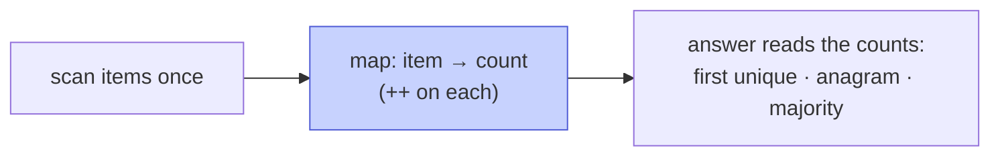

# Memorize: Counting

## In a Hurry?

- **One-Line Idea**: Sweep the sequence once into a hash map from item to count, then answer every occurrence question by reading the map.
- **Complexities**: `O(n)` time, `O(k)` space — `n` is the sequence length, `k` the number of distinct items (`O(1)` for a fixed alphabet, `O(n)` worst case).
- **When to Use**: The answer depends on *how often* items appear — uniqueness, multiset equality, subset-of, palindrome buildability, anagram grouping.

---

## One-Line Mnemonic

**"Tally first, ask later — one pass turns the input into a census you read off in O(1)."**

The image is a turnstile counter at a gate: every item that walks through bumps its tally by one, and once the gate closes you know the exact headcount of each kind without recounting.

---

## Real-World Analogy

Picture sorting a bag of mixed coins by tipping them into labelled trays — one tray per denomination. You pass through the pile a single time, dropping each coin into its tray, and when you finish each tray's height tells you exactly how many of that coin you have. You never compare one coin to another; the trays *are* the counts. A frequency map is that rack of trays, and the single pour is the counting sweep.

---

## Visual Summary



<p align="center"><strong>One pass fills a hash map of item → frequency; a second pass reads it. Turns 'how many of each?' questions — first non-repeating char, anagram check, majority — into O(n).</strong></p>

---

## Pattern Recognition Triggers

The problem fits the counting pattern when **all four** of the following hold. These are the same questions the pattern's Recognition Checklist asks.

- The answer depends on **how often** items appear, not on their order or position.
- The input is a **linear sequence** — an array, string, or list walked end to end.
- The question is answered by **reading the counts** after one pass — the map is an input to the answer, not the answer itself.
- The per-item work is **`O(1)` amortised** — each item triggers one hash-map insert or update.

Common surface signals: "first non-repeating," "is X an anagram of Y," "can X be built from Y's letters," "longest palindrome from these letters," "group the anagrams." A *canonical-form* key (sorted string, 26-slot letter tuple) is still counting — it hashes on a derived signature.

---

## Don't Confuse With

| | **Counting (this pattern)** | **Key Generation (next lesson)** |
|---|---|---|
| **What the map values** | An integer count per item | A list (or flag) of items sharing a key |
| **The question asked** | "How *often* did X appear?" | "Have I seen something *equivalent to* X before?" |
| **What the key is** | The item itself (or its frequency tuple) | A canonical transform — sorted form, normalised shape, hash of structure |
| **Typical output** | A number, a boolean, an index | Groups, deduplicated sets, isomorphism verdicts |
| **When this goes wrong** | You are storing lists and asking about *equivalence*, not tallying frequencies — you actually need key generation. | You are storing plain integer counts and asking "how many," not "is this the same as that" — you actually need counting. |

Both build a hash map in one pass. The decisive question is *what the map holds* — a tally of frequencies (counting) or buckets of items under a canonical key (key generation). Cluster-anagrams sits on the border: it counts letters to *build the key*, then groups — the counting is a means, the grouping is the end.

---

## Template Code

```python
from collections import defaultdict

def counting_template(sequence):
    # Pass 1 — build the frequency map in one sweep.
    frequency = defaultdict(int)
    for item in sequence:
        frequency[item] += 1   # amortised O(1) per item

    # Pass 2 — answer the question by reading the counts.
    # e.g. first item with count 1:
    for item in sequence:
        if frequency[item] == 1:
            return item
    return None
```

Three knobs change per problem:

- **What you key on** — the item itself for direct tallies, a derived signature (sorted string, 26-slot tuple) when grouping equivalent items.
- **Build vs reconcile** — one sequence increments into the map; a second sequence decrements to test supply or equality.
- **The post-build question** — read a single count (uniqueness), inspect parities (palindrome), or drain the map to empty (anagram).

---

## Common Mistakes

- **Trying to solve the problem during the count**:
  - *What*: weaving the answer logic into the building loop, then getting wrong results because the map is still incomplete mid-pass.
  - *Why*: the counting sweep only finishes the census on its last item, so any "first" or "all" question asked mid-build sees partial counts.
  - *Fix*: separate the two passes — build the full map first, then run a second pass that reads it.
- **Reading position off the map instead of the sequence**:
  - *What*: iterating the map (or its keys) to answer an order-sensitive question like "first non-repeating," yielding an arbitrary order.
  - *Why*: hash-map iteration order does not reflect the input order, so "first" by map order is meaningless.
  - *Fix*: re-scan the *original sequence* in order, looking each item up in the map.
- **Forgetting the length gate on two-sequence problems**:
  - *What*: comparing two strings for anagram-hood without first checking equal length, so a prefix match passes incorrectly.
  - *Why*: equal multisets require equal totals; differing lengths can never be anagrams.
  - *Fix*: short-circuit with a length check before counting, then drain one map with the other.
- **Mishandling the missing-key lookup**:
  - *What*: indexing the map with a key that was never inserted and crashing, or treating a default `0` as a real count.
  - *Why*: a plain dict raises on absent keys; the absent case is a real answer ("count is zero"), not an error.
  - *Fix*: use `defaultdict(int)` or `.get(key, 0)` so absent items read as `0`.
- **Counting when you actually need positions**:
  - *What*: reaching for a frequency map on a problem whose answer is *where* items sit (a subarray, a pair of indices), not how often they appear.
  - *Why*: counting discards position, so it cannot recover an index-sensitive answer.
  - *Fix*: if the answer is a position or range, switch to a position-aware tool (two pointers, sliding window, prefix sums).

---

## Minimum Viable Example

First non-repeating character on `"aabc"`:

```
"aabc"   pass 1 → frequency = {a:2, b:1, c:1}
         pass 2 → i=0 'a' count 2  skip
                  i=1 'a' count 2  skip
                  i=2 'b' count 1  return 2

Result: index 2
```

Four characters, one build pass, one read pass — the map is the whole answer source.

---

## Quick Recall

**Q: What two phases make up every counting-pattern solution?**
A: A build pass that fills the frequency map, then a read pass that answers the question from the completed map.

**Q: What is the time and space complexity of the counting pattern?**
A: `O(n)` time for the passes and `O(k)` space for `k` distinct items — `O(1)` for a fixed alphabet, `O(n)` in the worst case.

**Q: Why must "first non-repeating character" re-scan the string rather than iterate the map?**
A: Hash-map iteration order is arbitrary, so "first by position" can only be recovered by walking the original sequence in order.

**Q: How do two-sequence counting problems (anagram, constructibility) use the map?**
A: Count one sequence, then walk the second and decrement — the map draining to empty (or going short) is the verdict.

**Q: When should you key on a canonical form instead of the item itself?**
A: When grouping *equivalent* items — a sorted string or 26-slot letter tuple makes every anagram hash to the same bucket.
