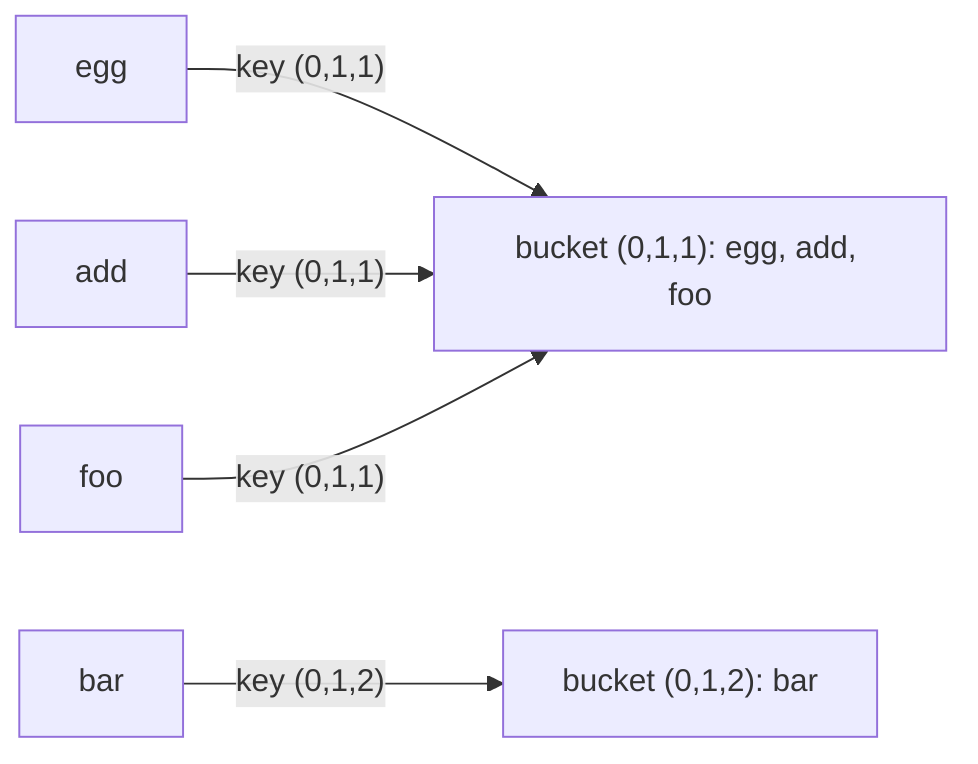

# Pattern: Key Generation

## Why It Exists

Sometimes you must treat inputs as "the same" even when they differ literally: anagrams, **isomorphic** strings (`"egg"` and `"add"` share the shape "first letter, then a doubled second"), shifted sequences, rotated arrays. You can't hash the raw input — `"egg"` and `"add"` are different strings — so a plain map won't group them.

The move: generate a **canonical key** — a normalized fingerprint that comes out *identical* for every input in the same equivalence class and *different* otherwise. Then use that key in a hash map, and equivalent inputs collide into the same bucket by construction. The brute force compares every pair (`O(n²)` comparisons); key-generation computes one key per input and lets the hash map do the grouping in `O(n)` overall.

## See It Work

Group strings by their **pattern** — `"egg"`, `"add"`, `"foo"` all have shape "A B B", so they belong together; `"bar"` ("A B C") stands apart. The key is each character's *first-occurrence index*. Run it.

```python run viz=array
def pattern_key(s):
    seen = {}
    key = []
    for ch in s:
        if ch not in seen:
            seen[ch] = len(seen)     # first time we see a char → give it the next index
        key.append(seen[ch])
    return tuple(key)                # canonical fingerprint, e.g. "egg" → (0, 1, 1)

def group_isomorphic(words):
    groups = {}
    for w in words:
        groups.setdefault(pattern_key(w), []).append(w)   # bucket by canonical key
    return list(groups.values())

print(group_isomorphic(["egg", "add", "foo", "bar"]))     # [['egg', 'add', 'foo'], ['bar']]
```

## How It Works

Two ingredients: a **key function** and a **hash map of buckets**.

1. **Generate the key.** For each input, compute a canonical form. Here, walk the string and replace each character by the order in which it *first appeared*: `"egg" → (0, 1, 1)`, `"add" → (0, 1, 1)`, `"paper" → (0, 1, 0, 2, 3)`. Two strings produce the same tuple exactly when they're isomorphic.
2. **Bucket by key.** `groups.setdefault(key, []).append(input)` — every input lands in the bucket named by its key. Same key → same bucket → equivalent inputs grouped.



<p align="center"><strong>each input is reduced to a canonical key; the hash map buckets inputs by key, so equivalent inputs collect together.</strong></p>

Computing a key is `O(len)` and bucketing is `O(1)` average, so grouping `n` inputs is **`O(n · len)` time, `O(n · len)` space**. The whole pattern lives or dies on the key function: it must be **invariant** over the equivalence you want (equivalent inputs → equal keys) and **distinguishing** otherwise (different classes → different keys).

### Key Takeaway

Reduce each input to a canonical key that's identical for equivalent inputs, then let a hash map group or look them up. The technique is generic; the design work is choosing a key that's invariant over your equivalence and distinguishing across classes.

## Trace It

Keys for `["egg", "add", "foo", "bar"]`:

| word | first-occurrence walk | key |
|---|---|---|
| `egg` | e→0, g→1, g→1 | `(0,1,1)` |
| `add` | a→0, d→1, d→1 | `(0,1,1)` |
| `foo` | f→0, o→1, o→1 | `(0,1,1)` |
| `bar` | b→0, a→1, r→2 | `(0,1,2)` |

Before you read on: `"egg"`, `"add"`, and `"foo"` all map to `(0,1,1)` even though they share *no letters*. Why is encoding *positions of first occurrence* the right key here, instead of, say, the sorted letters (which worked for anagrams)?

Because the equivalence is **isomorphism of structure**, not identity of letters. Sorting `"egg"` gives `egg` and sorting `"add"` gives `add` — different, so a sorted key would *separate* them, which is wrong for this problem. The first-occurrence encoding throws away *which* letters appear and keeps only the *shape* of repetition, which is exactly the property isomorphic strings share. The lesson generalizes: the key must capture precisely the equivalence you care about and nothing more — a sorted key captures "same multiset of letters" (anagrams), a pattern key captures "same shape" (isomorphism). Choose the fingerprint to match the question.

## Your Turn

The reusable key-generation grouping:

```python run viz=array
def pattern_key(s):
    seen, key = {}, []
    for ch in s:
        if ch not in seen:
            seen[ch] = len(seen)
        key.append(seen[ch])
    return tuple(key)

def group_isomorphic(words):
    groups = {}
    for w in words:
        groups.setdefault(pattern_key(w), []).append(w)
    return list(groups.values())

print(group_isomorphic(["paper", "title", "abc", "xyz", "aab"]))
# [['paper', 'title'], ['abc', 'xyz'], ['aab']]
```

```java run viz=array
import java.util.*;

public class Main {
  static String patternKey(String s) {
    Map<Character, Integer> seen = new HashMap<>();
    StringBuilder key = new StringBuilder();
    for (char ch : s.toCharArray()) {
      seen.putIfAbsent(ch, seen.size());     // first-occurrence index
      key.append(seen.get(ch)).append(',');
    }
    return key.toString();
  }

  static List<List<String>> groupIsomorphic(String[] words) {
    Map<String, List<String>> groups = new LinkedHashMap<>();
    for (String w : words) groups.computeIfAbsent(patternKey(w), k -> new ArrayList<>()).add(w);
    return new ArrayList<>(groups.values());
  }

  public static void main(String[] args) {
    System.out.println(groupIsomorphic(new String[]{"paper", "title", "abc", "xyz", "aab"}));
    // [[paper, title], [abc, xyz], [aab]]
  }
}
```

Drill the family in **Practice** — [Row-Specific Words](/cortex/data-structures-and-algorithms/linear-structures/hash-table/pattern-pattern-generation/problems/row-specific-words), [Homomorphic Strings](/cortex/data-structures-and-algorithms/linear-structures/hash-table/pattern-pattern-generation/problems/homomorphic-strings), [Pattern Matching](/cortex/data-structures-and-algorithms/linear-structures/hash-table/pattern-pattern-generation/problems/pattern-matching), and [Cluster Displaced Strings](/cortex/data-structures-and-algorithms/linear-structures/hash-table/pattern-pattern-generation/problems/cluster-displaced-strings).

## Reflect & Connect

Key generation is "design a fingerprint, let the hash map do the rest":

- **The family** — group **anagrams** (sorted letters, or the count signature — a key the counting pattern can produce), group **isomorphic** strings (first-occurrence pattern, above), cluster **shifted** strings (encode consecutive differences mod 26), dedup **rotations** (a canonical rotation). Each is a different key over a different equivalence.
- **The key must match the equivalence exactly** — invariant within a class, distinguishing across classes. A too-coarse key merges things that differ; a too-fine key splits things that should match. That design choice *is* the problem.
- **It composes with counting** — a frequency map can itself be the canonical key (the count signature for anagrams), so the previous pattern often *supplies* the key this one buckets on.

**Prerequisites:** [What Is a Hash Table?](/cortex/data-structures-and-algorithms/linear-structures/hash-table/what-is-a-hash-table).
**What's next:** carry a hash map as the state of a sliding window — [Fixed-Size Sliding Window](/cortex/data-structures-and-algorithms/linear-structures/hash-table/pattern-fixed-sized-sliding-window/pattern).

## Recall

> **Mnemonic:** *Reduce each input to a canonical key (invariant over the equivalence), bucket by key in a hash map. Same key ⇒ same group, by construction.*

| | |
|---|---|
| Key function | canonical fingerprint, e.g. first-occurrence pattern `"egg" → (0,1,1)` |
| Bucket | `groups.setdefault(key, []).append(input)` |
| Good key | invariant within a class, distinguishing across classes |
| Cost | `O(n · len)` time and space |
| Composes with | counting (a count signature can *be* the key) |

<details>
<summary><strong>Q:</strong> Why generate a canonical key instead of hashing the raw input?</summary>

**A:** Equivalent inputs differ literally; only a canonical key makes them collide into the same bucket.

</details>
<details>
<summary><strong>Q:</strong> What two properties must a good key have?</summary>

**A:** Invariant over the equivalence (equal keys for equivalent inputs) and distinguishing across classes (different keys otherwise).

</details>
<details>
<summary><strong>Q:</strong> Why use a first-occurrence pattern, not sorted letters, for isomorphic strings?</summary>

**A:** Isomorphism is about repetition *shape*, not letter identity; sorted letters would wrongly separate `"egg"` and `"add"`.

</details>
<details>
<summary><strong>Q:</strong> How does this compose with counting?</summary>

**A:** A frequency/count signature can serve as the canonical key (e.g., for anagram grouping).

</details>

## Sources & Verify

- **CLRS**, *Introduction to Algorithms*, 4th ed., §11 — hash tables and keying.
- **Sedgewick & Wayne**, *Algorithms*, 4th ed., §3.4 — hash functions; designing keys for symbol tables.
- Canonical-key grouping (anagrams, isomorphic strings) is a standard hash-map application; both runnable blocks are verified by running (`[['egg','add','foo'],['bar']]` and `[['paper','title'],['abc','xyz'],['aab']]`).
