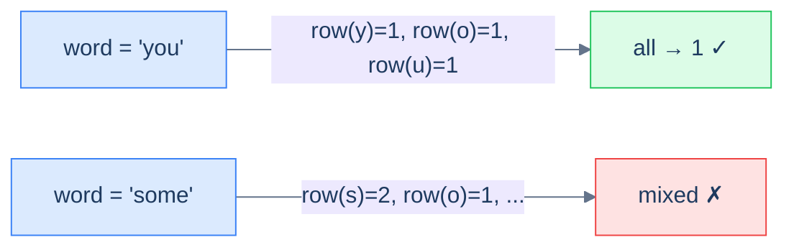

# Row specific words

## Problem Statement

Given an array of words, return all the words that can be typed using **only one row** of an American keyboard.

> -   **Row 1:** `qwertyuiop`
> -   **Row 2:** `asdfghjkl`
> -   **Row 3:** `zxcvbnm`

### Example 1
> -   **Input:** `["you", "were", "some"]` → **Output:** `[you, were]`

### Example 2
> -   **Input:** `["sdk", "nvm", "hut"]` → **Output:** `[sdk, nvm]`

### Example 3
> -   **Input:** `["him", "else", "bat"]` → **Output:** `[]`

## Examples

**Example 1**
```
Input:  ["you", "were", "some"]
Output: [you, were]
Explanation: "you" → y,o,u all on row 1 (qwertyuiop). "were" → w,e,r,e all on row 1.
"some" → s is row 2 but o is row 1, so it spans two rows and is dropped.
```

**Example 2**
```
Input:  ["sdk", "nvm", "hut"]
Output: [sdk, nvm]
Explanation: "sdk" → s,d,k all on row 2 (asdfghjkl). "nvm" → n,v,m all on row 3 (zxcvbnm).
"hut" → h is row 2 but u is row 1, so it is dropped.
```

**Example 3**
```
Input:  ["him", "else", "bat"]
Output: []
Explanation: "him" → h is row 2, i is row 1. "else" → e is row 1, l is row 2.
"bat" → b is row 3, a is row 2. Every word spans more than one row.
```

**Example 4**
```
Input:  ["Alaska", "Dad"]
Output: [Alaska, Dad]
Explanation: Case is ignored. "Alaska" → a,l,a,s,k,a all on row 2. "Dad" → d,a,d all on row 2.
```

## Constraints

- `1 ≤ words.length ≤ 20`
- `1 ≤ words[i].length ≤ 100`
- `words[i]` consists of English letters only.

```python run
import ast
from typing import List

class Solution:
    def row_specific_words(self, words: List[str]) -> List[str]:
        # Your code goes here
        pass

words = ast.literal_eval(input())
result = Solution().row_specific_words(words)
print("[" + ", ".join(result) + "]")
```

```java run
import java.util.*;

public class Main {
    static class Solution {
        public List<String> rowSpecificWords(String[] words) {
            // Your code goes here
            return new ArrayList<>();
        }
    }

    static String[] parseStringArray(String line) {
        line = line.trim();
        if (line.equals("[]")) return new String[0];
        line = line.substring(1, line.length() - 1);
        String[] parts = line.split(",\\s*");
        for (int i = 0; i < parts.length; i++) {
            parts[i] = parts[i].trim();
            if ((parts[i].startsWith("\"") && parts[i].endsWith("\"")) ||
                (parts[i].startsWith("'") && parts[i].endsWith("'")))
                parts[i] = parts[i].substring(1, parts[i].length() - 1);
        }
        return parts;
    }

    public static void main(String[] args) {
        Scanner sc = new Scanner(System.in);
        String[] words = parseStringArray(sc.nextLine());
        List<String> result = new Solution().rowSpecificWords(words);
        System.out.println("[" + String.join(", ", result) + "]");
    }
}
```

```testcases
{
  "args": [
    { "id": "words", "label": "words", "type": "string", "placeholder": "[\"you\", \"were\", \"some\"]" }
  ],
  "cases": [
    { "args": { "words": "[\"you\", \"were\", \"some\"]" }, "expected": "[you, were]" },
    { "args": { "words": "[\"sdk\", \"nvm\", \"hut\"]" }, "expected": "[sdk, nvm]" },
    { "args": { "words": "[\"him\", \"else\", \"bat\"]" }, "expected": "[]" },
    { "args": { "words": "[\"Alaska\", \"Dad\"]" }, "expected": "[Alaska, Dad]" },
    { "args": { "words": "[\"type\", \"row\"]" }, "expected": "[type, row]" }
  ]
}
```

<details>
<summary>Editorial</summary>

Each character's keyboard row is its **categorical key** (1, 2, or 3). A word passes iff every character shares the same key as the first character. Lowercase before lookup to handle mixed-case input. Walk each word once — `O(|word|)` per word, `O(S)` total where `S` is the combined length of all words. Fixed-size row sets cost `O(1)` space. Output preserves input order; no sorting needed because the filter is positional, not hash-based.

```python solution time=O(S) space=O(1)
import ast
from typing import List

class Solution:
    def get_row(self, c: str) -> int:
        if c in {"q","w","e","r","t","y","u","i","o","p"}: return 1
        if c in {"a","s","d","f","g","h","j","k","l"}: return 2
        return 3

    def can_be_typed_with_one_row(self, word: str) -> bool:
        row = self.get_row(word[0].lower())
        for c in word:
            if self.get_row(c.lower()) != row: return False
        return True

    def row_specific_words(self, words: List[str]) -> List[str]:
        return [word for word in words if self.can_be_typed_with_one_row(word)]

words = ast.literal_eval(input())
result = Solution().row_specific_words(words)
print("[" + ", ".join(result) + "]")
```

```java solution
import java.util.*;

public class Main {
    static class Solution {
        private int getRow(char c) {
            String row1 = "qwertyuiop", row2 = "asdfghjkl";
            if (row1.indexOf(c) >= 0) return 1;
            if (row2.indexOf(c) >= 0) return 2;
            return 3;
        }

        private boolean canBeTypedWithOneRow(String word) {
            int row = getRow(Character.toLowerCase(word.charAt(0)));
            for (char c : word.toCharArray())
                if (getRow(Character.toLowerCase(c)) != row) return false;
            return true;
        }

        public List<String> rowSpecificWords(String[] words) {
            List<String> result = new ArrayList<>();
            for (String word : words)
                if (canBeTypedWithOneRow(word)) result.add(word);
            return result;
        }
    }

    static String[] parseStringArray(String line) {
        line = line.trim();
        if (line.equals("[]")) return new String[0];
        line = line.substring(1, line.length() - 1);
        String[] parts = line.split(",\\s*");
        for (int i = 0; i < parts.length; i++) {
            parts[i] = parts[i].trim();
            if ((parts[i].startsWith("\"") && parts[i].endsWith("\"")) ||
                (parts[i].startsWith("'") && parts[i].endsWith("'")))
                parts[i] = parts[i].substring(1, parts[i].length() - 1);
        }
        return parts;
    }

    public static void main(String[] args) {
        Scanner sc = new Scanner(System.in);
        String[] words = parseStringArray(sc.nextLine());
        List<String> result = new Solution().rowSpecificWords(words);
        System.out.println("[" + String.join(", ", result) + "]");
    }
}
```

</details>
<details>
<summary><h2>Intuition</h2></summary>


The structural property that makes this a **key-generation** problem is that each character carries a single categorical label — its **keyboard row** — and a word is acceptable exactly when every character shares one label. The "row" is the key, and the question collapses to "does this word map to a single key?"

The key per character is its row id (`1`, `2`, or `3`), looked up from three fixed character sets. For a whole word the test is uniformity: compute the first character's row, then confirm every other character resolves to that same row. The word survives the filter only when all its per-character keys agree, so a single mismatched character disqualifies it.

</details>
<details>
<summary><h2>Approach</h2></summary>


The "key" here is the **row id** (1, 2, or 3). Each character maps to one of three rows; a word is single-row iff every character maps to the same row. So: look up every character's row, ensure they're all equal.



<p align="center"><strong>Row-specific words — the key per character is its keyboard row. A word survives the filter only if all its characters share the same key.</strong></p>

</details>
<details>
<summary><h2>Dry Run</h2></summary>


Walk Example 1 — `["you", "were", "some"]`. Rows: `1 = qwertyuiop`, `2 = asdfghjkl`, `3 = zxcvbnm`.

```
word "you"
  y → row 1 (target)   o → row 1 ✓   u → row 1 ✓     all match → KEEP

word "were"
  w → row 1 (target)   e → row 1 ✓   r → row 1 ✓   e → row 1 ✓   all match → KEEP

word "some"
  s → row 2 (target)   o → row 1 ✗                  mismatch → DROP

result = [you, were]
```

</details>
<details>
<summary><h2>Complexity Analysis</h2></summary>


| Measure | Value | Why |
|---|---|---|
| Time  | **O(S)** | `S` is the total length of all words; each character is one `O(1)` set lookup. |
| Space | **O(1)** | The three row sets are fixed-size (26 letters total); the result is output, not auxiliary. |

</details>
<details>
<summary><h2>Key Takeaway</h2></summary>


The key here is a **categorical label** — each character's keyboard row — and a word qualifies only when all its per-character keys agree. Unlike the first-occurrence-index problems, the key is a fixed lookup, not a derived order.

</details>
