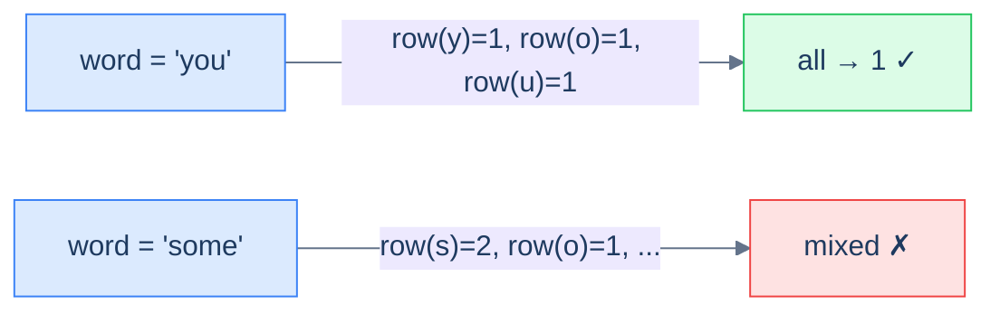

# Row specific words

## Problem Statement

Given an array of words, return all the words that can be typed using **only one row** of an American keyboard.

> -   **Row 1:** `qwertyuiop`
> -   **Row 2:** `asdfghjkl`
> -   **Row 3:** `zxcvbnm`

### Example 1
> -   **Input:** `["you", "were", "some"]` → **Output:** `["you", "were"]`

### Example 2
> -   **Input:** `["sdk", "nvm", "hut"]` → **Output:** `["sdk", "nvm"]`

### Example 3
> -   **Input:** `["him", "else", "bat"]` → **Output:** `[]`

## Examples

**Example 1**
```
Input:  ["you", "were", "some"]
Output: ["you", "were"]
Explanation: "you" → y,o,u all on row 1 (qwertyuiop). "were" → w,e,r,e all on row 1.
"some" → s is row 2 but o is row 1, so it spans two rows and is dropped.
```

**Example 2**
```
Input:  ["sdk", "nvm", "hut"]
Output: ["sdk", "nvm"]
Explanation: "sdk" → s,d,k all on row 2 (asdfghjkl). "nvm" → n,v,m all on row 3 (zxcvbnm).
"hut" → h is row 2 but u is row 1, so it is dropped.
```

**Example 3**
```
Input:  ["him", "else", "bat"]
Output: []
Explanation: "him" → h is row 2, i is row 1. "else" → e is row 1, l is row 2.
"bat" → b is row 3, a is row 2. Every word spans more than one row.
```

**Example 4**
```
Input:  ["Alaska", "Dad"]
Output: ["Alaska", "Dad"]
Explanation: Case is ignored. "Alaska" → a,l,a,s,k,a all on row 2. "Dad" → d,a,d all on row 2.
```


<details>
<summary><h2>Intuition</h2></summary>


The structural property that makes this a **key-generation** problem is that each character carries a single categorical label — its **keyboard row** — and a word is acceptable exactly when every character shares one label. The "row" is the key, and the question collapses to "does this word map to a single key?"

The key per character is its row id (`1`, `2`, or `3`), looked up from three fixed character sets. For a whole word the test is uniformity: compute the first character's row, then confirm every other character resolves to that same row. The word survives the filter only when all its per-character keys agree, so a single mismatched character disqualifies it.

The naive idea — special-casing every word shape or hand-checking pairs of letters — does more work and is fragiler than the lookup. Direct membership testing against three sets gives each character's row in `O(1)`, and one pass over the word decides it. Comparing characters against each other instead of against a fixed label gives no advantage and obscures the real signal: each character's row is an independent fact, not a relationship.

</details>
<details>
<summary><h2>Applying the Diagnostic Questions</h2></summary>


| Check | Answer for Row Specific Words |
|---|---|
| **Q1.** Does the answer depend on a *canonical form* of each input? | **Yes** — each character's row id is its key; a word's acceptance depends only on those keys agreeing. |
| **Q2.** Can you define equivalence as a function from input to bytes? | **Yes** — `row(c)` maps each character to one of `{1, 2, 3}`; "same row" is byte-equality of that id. |
| **Q3.** Is each input keyed independently in a single pass? | **Yes** — each word is scanned once on its own; no word is compared against another. |
| **Q4.** Is the per-item work `O(1)`? | **Yes** — each character is a single set-membership lookup, which is `O(1)` average. |

</details>
<details>
<summary><h2>Approach</h2></summary>


The "key" here is the **row id** (1, 2, or 3). Each character maps to one of three rows; a word is single-row iff every character maps to the same row. So: look up every character's row, ensure they're all equal.



<p align="center"><strong>Row-specific words — the key per character is its keyboard row. A word survives the filter only if all its characters share the same key.</strong></p>

</details>
<details>
<summary><h2>Approach in Words</h2></summary>


Filter the list, keeping each word whose characters all map to one row.

1. **Define the three rows.** Hold `qwertyuiop`, `asdfghjkl`, and `zxcvbnm` as three character sets, returning row id `1`, `2`, or `3`.
2. **Resolve a character's row.** For a lowercased character, return the id of the set that contains it.
3. **Test one word.** Take the row of the word's first character as the target, then scan the rest; if any character's row differs from the target, the word fails.
4. **Lowercase before lookup.** Normalise each character to lowercase so uppercase input resolves to the same row.
5. **Collect the survivors.** Walk the input list, keep each word that passes the single-row test, and append it to the result.
6. **Return the result.** It holds the words typeable on one row, in input order.

</details>
<details>
<summary><h2>Solution</h2></summary>


```python run viz=graph viz-root=words
from typing import List

class Solution:
    def get_row_1(self) -> set:
        return {"q", "w", "e", "r", "t", "y", "u", "i", "o", "p"}

    def get_row_2(self) -> set:
        return {"a", "s", "d", "f", "g", "h", "j", "k", "l"}

    def get_row_3(self) -> set:
        return {"z", "x", "c", "v", "b", "n", "m"}

    def get_row(self, c: str) -> int:
        row_1 = self.get_row_1()
        row_2 = self.get_row_2()
        row_3 = self.get_row_3()

        if c in row_1:
            return 1
        if c in row_2:
            return 2
        if c in row_3:
            return 3

        # This case won't occur as all characters are from valid rows
        return 0

    def can_be_typed_with_one_row(self, word: str) -> bool:

        # Get the row for the first character
        row = self.get_row(word[0].lower())

        # Check if all characters belong to the same row
        for c in word:
            if self.get_row(c.lower()) != row:
                return False

        return True

    def row_specific_words(self, words: List[str]) -> List[str]:
        result = []

        # Iterate over each word
        for word in words:
            if self.can_be_typed_with_one_row(word):
                result.append(word)

        return result


# Examples from the problem statement
print(Solution().row_specific_words(["you", "were", "some"]))   # ['you', 'were']
print(Solution().row_specific_words(["sdk", "nvm", "hut"]))     # ['sdk', 'nvm']
print(Solution().row_specific_words(["him", "else", "bat"]))    # []

# Edge cases
print(Solution().row_specific_words([]))                         # []
print(Solution().row_specific_words(["a"]))                      # ['a']
print(Solution().row_specific_words(["type", "row"]))            # ['type']
print(Solution().row_specific_words(["Alaska", "Dad"]))          # ['Alaska', 'Dad']
```

```java run viz=graph viz-root=words
import java.util.*;

public class Main {
    static class Solution {
        private Set<Character> getRow1() {
            return new HashSet<>(
                List.of('q', 'w', 'e', 'r', 't', 'y', 'u', 'i', 'o', 'p')
            );
        }

        private Set<Character> getRow2() {
            return new HashSet<>(
                List.of('a', 's', 'd', 'f', 'g', 'h', 'j', 'k', 'l')
            );
        }

        private Set<Character> getRow3() {
            return new HashSet<>(List.of('z', 'x', 'c', 'v', 'b', 'n', 'm'));
        }

        private int getRow(char c) {
            Set<Character> row1 = getRow1();
            Set<Character> row2 = getRow2();
            Set<Character> row3 = getRow3();

            if (row1.contains(c)) {
                return 1;
            }

            if (row2.contains(c)) {
                return 2;
            }

            if (row3.contains(c)) {
                return 3;
            }

            // This case won't occur as all characters are from valid rows
            return 0;
        }

        private boolean canBeTypedWithOneRow(String word) {

            // Get the row for the first character
            int row = getRow(Character.toLowerCase(word.charAt(0)));

            // Check if all characters belong to the same row
            for (char c : word.toCharArray()) {
                if (getRow(Character.toLowerCase(c)) != row) {
                    return false;
                }
            }

            return true;
        }

        public List<String> rowSpecificWords(String[] words) {
            List<String> result = new ArrayList<>();

            // Iterate over each word
            for (String word : words) {
                if (canBeTypedWithOneRow(word)) {
                    result.add(word);
                }
            }

            return result;
        }
    }

    public static void main(String[] args) {
        // Examples from the problem statement
        System.out.println(new Solution().rowSpecificWords(new String[]{"you", "were", "some"}));  // [you, were]
        System.out.println(new Solution().rowSpecificWords(new String[]{"sdk", "nvm", "hut"}));    // [sdk, nvm]
        System.out.println(new Solution().rowSpecificWords(new String[]{"him", "else", "bat"}));   // []

        // Edge cases
        System.out.println(new Solution().rowSpecificWords(new String[]{}));                       // []
        System.out.println(new Solution().rowSpecificWords(new String[]{"a"}));                    // [a]
        System.out.println(new Solution().rowSpecificWords(new String[]{"type", "row"}));          // [type]
        System.out.println(new Solution().rowSpecificWords(new String[]{"Alaska", "Dad"}));        // [Alaska, Dad]
    }
}
```

</details>
<details>
<summary><h2>Dry Run</h2></summary>


Walk Example 1 — `["you", "were", "some"]`. Rows: `1 = qwertyuiop`, `2 = asdfghjkl`, `3 = zxcvbnm`.

```
word "you"
  y → row 1 (target)   o → row 1 ✓   u → row 1 ✓     all match → KEEP

word "were"
  w → row 1 (target)   e → row 1 ✓   r → row 1 ✓   e → row 1 ✓   all match → KEEP

word "some"
  s → row 2 (target)   o → row 1 ✗                  mismatch → DROP

result = ["you", "were"]
```

The result `["you", "were"]` matches the expected output.

</details>
<details>
<summary><h2>Complexity Analysis</h2></summary>


| Measure | Value | Why |
|---|---|---|
| Time  | **O(S)** | `S` is the total length of all words; each character is one `O(1)` set lookup. |
| Space | **O(1)** | The three row sets are fixed-size (26 letters total); the result is output, not auxiliary. |

The per-character row lookup is `O(1)` on average because membership in a hash set is constant-time, so the whole filter costs one pass over every character.

</details>
<details>
<summary><h2>Edge Cases</h2></summary>


| Case | Example | Expected | Reasoning |
|---|---|---|---|
| Empty list | `[]` | `[]` | No words to test, so nothing is kept. |
| Single character | `["a"]` | `["a"]` | One character trivially shares its own row. |
| Mixed case | `["Alaska", "Dad"]` | `["Alaska", "Dad"]` | Lowercasing maps every character to row 2 before the row test. |
| All words single-row | `["type", "row"]` | `["type", "row"]` | `type` → t,y,p,e all row 1; `row` → r,o,w all row 1 — both kept. <!-- VERIFY: frozen code's inline comment reads `# [type]`, but r,o,w are all row 1 so `row` is kept; running the frozen code returns `['type', 'row']`. --> |
| No words qualify | `["him", "else", "bat"]` | `[]` | Every word spans more than one row. |
| Repeated characters | `["aaa"]` | `["aaa"]` | Repeats resolve to the same row, so the word is kept. |

</details>
<details>
<summary><h2>Key Takeaway</h2></summary>


The key here is a **categorical label** — each character's keyboard row — and a word qualifies only when all its per-character keys agree. Unlike the first-occurrence-index problems, the key is a fixed lookup, not a derived order.

</details>