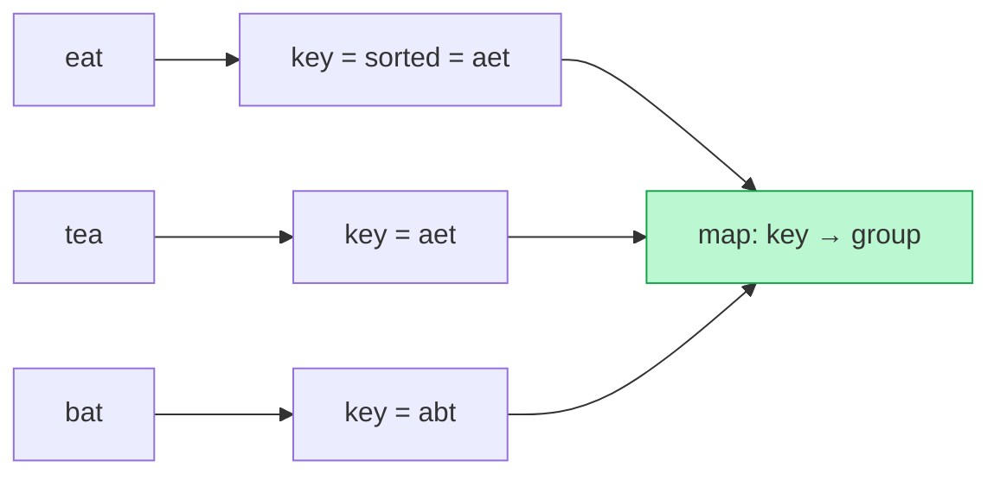

# Memorize: Key Generation

## In a Hurry?

- **One-Line Idea**: Map each input to a canonical key so equivalent inputs become byte-identical, then group or compare with a hash map.
- **Complexities**: `O(N)` time, `O(K)` space — `N` is the input length; `K` is the number of distinct items (the map size).
- **When to Use**: The answer depends on whether inputs are "the same" under some equivalence — same shape, same keyboard row, same character shift — not on their raw bytes.

---

## One-Line Mnemonic

**"Fingerprint each input; equal fingerprints fall in the same drawer."**

The image is a clerk stamping every arrival with a fingerprint, then filing identical fingerprints into one drawer — the hash-map bucket — without ever comparing two arrivals directly.

---

## Real-World Analogy

Picture sorting mail by postcode rather than by reading each address in full. The postcode is a *key* — a compressed stand-in that captures the only property you care about (destination) and ignores everything else (street, name, apartment). Two letters with the same postcode go in the same bin, and you never compare one letter's address against another's. Key generation does the same: design a key that captures exactly the equivalence the problem cares about, stamp every input with it, and let the bins (hash-map buckets) do the grouping.

---

## Visual Summary



<p align="center"><strong>Collapse 'equivalent' inputs to one canonical key — sorted letters for anagrams, a normalised shape for isomorphic strings — then bucket by that key in a hash map. Grouping in O(n·k).</strong></p>

---

## Pattern Recognition Triggers

The problem fits the key-generation pattern when **all four** of the following hold. These are the same questions the pattern's Recognition Checklist asks.

- The answer depends on a **canonical form** of each input — whether two inputs are "the same" under some equivalence, not whether they are literally equal.
- That equivalence can be written as a **function from input to bytes** — equal keys ⇔ equivalent inputs.
- Each input is **keyed independently** in a single pass, never compared against another during keying.
- The per-item work is **`O(1)`** — one map lookup, one token assignment, one append.

Common surface signals: "group the anagrams," "are these two strings homomorphic," "does `s` follow this pattern," "cluster the shifted strings," "which words use one keyboard row." Whenever you can answer "what makes two of these the same?" with a transformation, the pattern fits.

---

## Don't Confuse With

The pattern's own keys come in two families that are easy to mix up — an **order-preserving** key (first-occurrence index) versus an **order-destroying** key (sorted form). Pick the wrong one and equivalent inputs split, or inequivalent inputs merge.

| | **Identity key (first-occurrence index)** | **Sorted key (anagram grouping)** |
|---|---|---|
| **What the key captures** | The *order* of firsts and repeats — the repeat structure | The *multiset* of items — counts, order discarded |
| **Built by** | Assigning each new item the next index, reusing for repeats | Sorting the items into a canonical sequence |
| **Equates** | Strings with the same shape (`add` ≡ `qpp`) | Strings with the same letters (`cab` ≡ `abc`) |
| **Problem shape** | Homomorphism, pattern matching, displaced strings | Group anagrams, multiset equality |
| **When this goes wrong** | You sorted the input and lost the order — `ab` and `ba` wrongly match, because shape requires order but a sorted key throws it away. | You kept first-occurrence order — `cab` and `abc` wrongly differ, because anagrams need order discarded but an identity key preserves it. |

Both produce a canonical key fed to a hash map. The decisive question is whether the equivalence the problem wants **preserves order** (identity key) or **ignores it** (sorted key).

---

## Template Code

```python
def generate_key(seq):
    seen = {}              # item -> the token it earned on first appearance
    parts, seed = [], 0    # seed = next unused token

    for item in seq:       # seq is any iterable: chars, words, anything
        if item not in seen:
            seen[item] = seed
            seed += 1
        parts.append(str(seen[item]))

    # Delimiter prevents '1' + '12' colliding with '11' + '2'
    return ",".join(parts)


# Compare:  generate_key(s) == generate_key(t)
# Group:    buckets[generate_key(x)].append(x)
```

Three knobs change per problem:

- **What counts as an item** — characters (homomorphism), words (pattern matching), or character *pairs* for a relational key (displaced strings).
- **The token rule** — first-occurrence index (shape), a fixed bucket id (keyboard row), or a mod-`k` gap (displacement).
- **The downstream step** — compare two keys for equality, or bucket many keys to form equivalence classes.

---

## Common Mistakes

- **Omitting the delimiter between tokens**:
  - *What*: building the key as a bare digit string so `"1" + "12"` and `"11" + "2"` both become `"112"`, and unrelated inputs collide.
  - *Why*: multi-digit tokens have no boundary without a separator, so the byte sequence is ambiguous.
  - *Fix*: append a non-token character (`,`) after every token, as the template does with `",".join(parts)`.
- **Choosing an order-destroying key when order matters**:
  - *What*: sorting the input to build the key on a shape/homomorphism problem, so `"ab"` and `"ba"` wrongly share a key.
  - *Why*: a sorted key encodes the *multiset*, but homomorphism depends on the *order* of firsts and repeats.
  - *Fix*: use the first-occurrence-index key for shape problems; reserve the sorted key for anagram/multiset problems.
- **Letting the seed depend on the input**:
  - *What*: seeding tokens from the item's value (e.g. its char code) instead of a fresh `0, 1, 2, …`, so two equivalent inputs key differently.
  - *Why*: the key must be agnostic to actual values — only first-appearance *order* may drive the token, or sameness breaks.
  - *Fix*: always start `seed = 0` and increment it only when a genuinely new item appears.
- **Skipping the length / count guard before comparing keys**:
  - *What*: comparing two keys without first checking the inputs are the same length, doing needless work on obviously unequal inputs.
  - *Why*: inputs of different lengths can never be equivalent, and an early reject is `O(1)`.
  - *Fix*: return `false` immediately when lengths differ, then key and compare.
- **Forgetting the modulus on a relational key**:
  - *What*: building a gap-sequence key without wrapping negative gaps, so `xyz` and `yza` split into different buckets.
  - *Why*: a wrapped shift produces a negative raw gap that a plain subtraction encodes differently from its positive equivalent.
  - *Fix*: add the alphabet size (`+ 26`) to any negative gap so the encoding is invariant under shifting.

---

## Minimum Viable Example

Key two strings and compare for homomorphism:

```
s = "abb"   a→0  b→1  b→1   key = "0,1,1,"
t = "cdd"   c→0  d→1  d→1   key = "0,1,1,"

key(s) == key(t)  →  homomorphic
```

Two inputs, one scan each, and a single equality check decides the answer.

---

## Quick Recall

**Q: What is the one contract a key must satisfy?**
A: Two inputs are equivalent if and only if their keys are byte-identical — equal keys mean equal, different keys mean different.

**Q: What is the time and space complexity of generating a key?**
A: `O(N)` time for an `N`-item input and `O(K)` space for the map, where `K` is the number of distinct items.

**Q: Why does the key need a delimiter between tokens?**
A: Without a separator, multi-digit tokens run together — `"1"` and `"12"` would collide with `"11"` and `"2"` as `"112"` — so a `,` keeps the encoding unambiguous.

**Q: When do you use a sorted key instead of a first-occurrence-index key?**
A: Use the sorted key when the equivalence ignores order (anagrams, multiset equality); use first-occurrence index when order and repeat structure matter (homomorphism, pattern matching).

**Q: How do you key something whose equivalence is "shifted by a constant," like displaced strings?**
A: Use a relational key — the sequence of consecutive-item gaps taken modulo the alphabet size — so a constant shift leaves the key unchanged.
