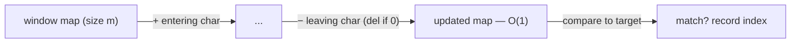

# Pattern: Fixed-Size Sliding Window

## Why It Exists

This is the array [fixed sliding window](/cortex/data-structures-and-algorithms/linear-structures/arrays/pattern-fixed-sliding-window/pattern) with a richer state. There, the window's value was a single number (a sum) you patched with one add and one subtract. Here the questions are about *composition*: "find every window of length `m` that's an anagram of `p`," "every window of size `k` with all-distinct values," "is there a duplicate within `k` positions?" The window's state is no longer a number — it's a **frequency map**.

Recomputing that map from scratch for each of the ~`n` windows costs `O(n · m)`. But the map is *slidable* just like the sum was: when the window advances one step, exactly one element enters and one leaves. **Increment the entering element's count; decrement the leaving one's.** That's `O(1)` per step, and a query against the map (compare to a target, count distinct keys) answers each window. Same incremental-maintenance trick, with a hash map as the aggregate.

## See It Work

Find every starting index where `s = "cbaebabacd"` contains an anagram of `p = "abc"`. Maintain the window's letter counts and compare to `p`'s counts. Run it.

```python run viz=array
def find_anagrams(s, p):
    if len(p) > len(s):
        return []

    def counts(chars):
        d = {}
        for c in chars:
            d[c] = d.get(c, 0) + 1
        return d

    need = counts(p)                              # target frequency map
    window = counts(s[:len(p)])                   # first window's map
    result = [0] if window == need else []
    for i in range(len(p), len(s)):
        window[s[i]] = window.get(s[i], 0) + 1    # element entering on the right
        out = s[i - len(p)]
        window[out] -= 1                          # element leaving on the left
        if window[out] == 0:
            del window[out]                       # keep the map clean for == to work
        if window == need:
            result.append(i - len(p) + 1)
    return result

print(find_anagrams("cbaebabacd", "abc"))         # [0, 6]
```

## How It Works

The window holds a fixed `m = len(p)` elements; its state is a `char → count` map:

1. **Seed** the first window's map from `s[0:m]`.
2. **Slide** one step at a time. The element at `i` enters (increment its count); the element at `i − m` leaves (decrement its count, and **delete the key when it hits 0**).
3. **Query** after each slide: the window is an anagram of `p` exactly when its map equals `p`'s map.



<p align="center"><strong>slide the fixed window by one: bump the entering element's count, drop the leaving element's, then compare the window map to the target.</strong></p>

Each slide is `O(1)` map work plus an `O(σ)` comparison (`σ` = alphabet size, a constant for fixed alphabets), so the whole scan is **`O(n)` time, `O(σ)` space**. Two details matter: **deleting keys at zero** keeps the dictionary equality check honest (a lingering `x: 0` would make `window == need` falsely fail), and the window width stays fixed — entering and leaving happen in lockstep.

### Key Takeaway

Maintain a frequency map as the fixed window's state: on each slide, increment the entering element and decrement (and delete at zero) the leaving one, then query the map. `O(1)` per step → `O(n)` total — the array sliding window fused with hash-map counting.

## Trace It

`p = "abc"` (`need = {a:1, b:1, c:1}`) sliding over `"cbaebabacd"`:

| window | map | `== need`? |
|---|---|---|
| `cba` (i=0..2) | `{c:1, b:1, a:1}` | ✓ → index 0 |
| `bae` | `{b:1, a:1, e:1}` | ✗ |
| … | … | … |
| `bac` (i=6..8) | `{b:1, a:1, c:1}` | ✓ → index 6 |

Before you read on: when the count of the leaving character drops to `0`, the code does `del window[out]` rather than leaving it at `0`. Why is that deletion essential for the `window == need` check, even though `0` "means the same as absent"?

Because dictionary equality is **structural**: `{a:1, b:1, c:0}` is *not* equal to `{a:1, b:1}` in Python (or Java's `Map.equals`). If you left zero-count keys in the map, a window that *is* an anagram would carry stale `x: 0` entries and the equality test would return `False` — a silent bug that only shows on certain inputs. Deleting at zero keeps the map's key set exactly "characters currently in the window," so `==` against `need` is correct. (The alternative is to compare with a tolerance for zeros, but pruning is simpler and keeps the map small.)

## Your Turn

The reusable fixed-window anagram finder:

```python run viz=array
def find_anagrams(s, p):
    if len(p) > len(s):
        return []
    def counts(chars):
        d = {}
        for c in chars:
            d[c] = d.get(c, 0) + 1
        return d
    need = counts(p)
    window = counts(s[:len(p)])
    result = [0] if window == need else []
    for i in range(len(p), len(s)):
        window[s[i]] = window.get(s[i], 0) + 1
        out = s[i - len(p)]
        window[out] -= 1
        if window[out] == 0:
            del window[out]
        if window == need:
            result.append(i - len(p) + 1)
    return result

print(find_anagrams("abab", "ab"))      # [0, 1, 2]
```

```java run viz=array
import java.util.*;

public class Main {
  static Map<Character, Integer> counts(String s, int from, int to) {
    Map<Character, Integer> d = new HashMap<>();
    for (int i = from; i < to; i++) d.merge(s.charAt(i), 1, Integer::sum);
    return d;
  }

  static List<Integer> findAnagrams(String s, String p) {
    List<Integer> result = new ArrayList<>();
    if (p.length() > s.length()) return result;
    Map<Character, Integer> need = counts(p, 0, p.length());
    Map<Character, Integer> window = counts(s, 0, p.length());
    if (window.equals(need)) result.add(0);
    for (int i = p.length(); i < s.length(); i++) {
      window.merge(s.charAt(i), 1, Integer::sum);                       // entering
      char out = s.charAt(i - p.length());
      if (window.merge(out, -1, Integer::sum) == 0) window.remove(out); // leaving, del at 0
      if (window.equals(need)) result.add(i - p.length() + 1);
    }
    return result;
  }

  public static void main(String[] args) {
    System.out.println(findAnagrams("abab", "ab"));   // [0, 1, 2]
  }
}
```

Drill the family in **Practice** — [Duplicate Detection](/cortex/data-structures-and-algorithms/linear-structures/hash-table/pattern-fixed-sized-sliding-window/problems/duplicate-detection), [Subarray Distinctness](/cortex/data-structures-and-algorithms/linear-structures/hash-table/pattern-fixed-sized-sliding-window/problems/subarray-distinctness), [Contains Variation](/cortex/data-structures-and-algorithms/linear-structures/hash-table/pattern-fixed-sized-sliding-window/problems/contains-variation), and [Anagram Finder](/cortex/data-structures-and-algorithms/linear-structures/hash-table/pattern-fixed-sized-sliding-window/problems/anagram-finder).

## Reflect & Connect

This pattern is the meeting point of two earlier ideas:

- **The family** — anagram finder (window map equals target), "contains duplicate within `k`" (a key reappears in the window), "`k` distinct values in every length-`m` window" (map size). All are a fixed window plus a map query.
- **It's [fixed sliding window](/cortex/data-structures-and-algorithms/linear-structures/arrays/pattern-fixed-sliding-window/pattern) + [counting](/cortex/data-structures-and-algorithms/linear-structures/hash-table/pattern-counting/pattern)** — the array pattern supplies the slide-by-one mechanics; the counting pattern supplies the map as state. The "slidable aggregate" test from the array pattern still applies: incremental add/evict must be `O(1)`, which counts are.
- **Delete-at-zero is the recurring gotcha** — any time you compare maps for equality, prune zero entries first, or the structural comparison lies.

**Prerequisites:** [What Is a Hash Table?](/cortex/data-structures-and-algorithms/linear-structures/hash-table/what-is-a-hash-table).
**What's next:** let the window grow and shrink on a condition, still map-backed — [Variable-Size Sliding Window](/cortex/data-structures-and-algorithms/linear-structures/hash-table/pattern-variable-sized-sliding-window/pattern).

## Recall

> **Mnemonic:** *Fixed window, map as state. Each slide: `+entering`, `−leaving` (del at 0), then query. `O(1)`/step ⇒ `O(n)`. Prune zeros so `==` works.*

| | |
|---|---|
| State | `char → count` map over the current window |
| Slide | increment entering, decrement leaving, delete key at `0` |
| Query | compare to target map (anagram), or read map size (distinct count) |
| Gotcha | delete zero-count keys or dictionary equality silently fails |
| Cost | `O(n)` time, `O(σ)` space (`σ` = alphabet) |

<details>
<summary><strong>Q:</strong> How does this differ from the array fixed sliding window?</summary>

**A:** The window's state is a frequency map, not a single number, but the slide-by-one add/evict maintenance is the same.

</details>
<details>
<summary><strong>Q:</strong> Why delete a key when its count hits zero?</summary>

**A:** Structural map equality treats `{x:0}` as different from absent, so a stale zero makes the anagram check silently fail.

</details>
<details>
<summary><strong>Q:</strong> What's the per-step cost and why is it `O(1)`?</summary>

**A:** One increment and one decrement (plus an `O(σ)` constant-alphabet comparison) — no recompute of the whole window.

</details>
<details>
<summary><strong>Q:</strong> Which two earlier patterns does this combine?</summary>

**A:** The array fixed sliding window (slide mechanics) and hash-map counting (the map as state).

</details>

## Sources & Verify

- **CLRS**, *Introduction to Algorithms*, 4th ed., §11 — hash tables and `O(1)`-average operations.
- **Sedgewick & Wayne**, *Algorithms*, 4th ed., §3.4–3.5 — hash tables and symbol-table applications.
- The fixed-window-with-frequency-map technique (anagram search, window distinctness) is standard; both runnable blocks are verified by running (`cbaebabacd`/`abc ⇒ [0,6]`, `abab`/`ab ⇒ [0,1,2]`).
