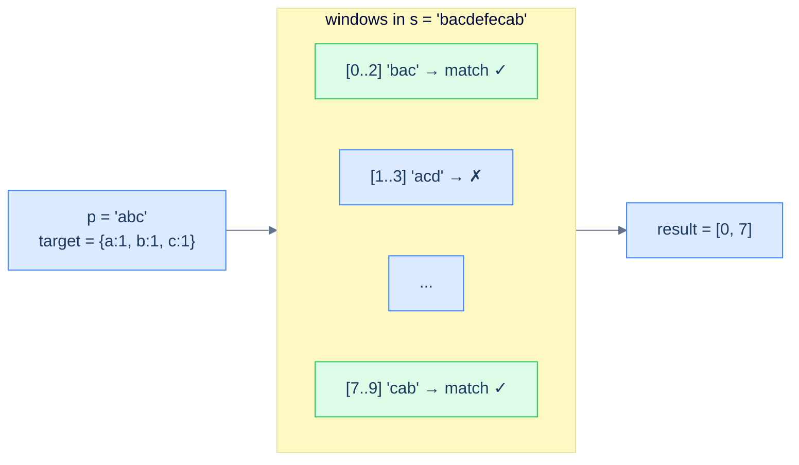

# Anagram finder

## Problem Statement

Given strings `s` and `p`, return all the start indices in `s` of substrings that are anagrams of `p`.

### Example 1
> -   **Input:** `s = "bacdefecab", p = "abc"` → **Output:** `[0, 7]` (`"bac"` at 0, `"cab"` at 7)

### Example 2
> -   **Input:** `s = "fdef", p = "def"` → **Output:** `[0, 1]` (`"fde"` at 0, `"def"` at 1; both are anagrams of `"def"`)

> *Wait — `"fde"` is an anagram of `"def"`? Yes — same multiset of letters {d, e, f}.*

### Example 3
> -   **Input:** `s = "abcdef", p = "gh"` → **Output:** `[]`

## Examples

**Example 1**
```
Input:  s = "bacdefecab", p = "abc"
Output: [0, 7]
Explanation: "bac" at index 0 and "cab" at index 7 are both anagrams of "abc".
```

**Example 2**
```
Input:  s = "fdef", p = "def"
Output: [0, 1]
Explanation: "fde" at index 0 and "def" at index 1 are both anagrams of "def".
```

**Example 3**
```
Input:  s = "abcdef", p = "gh"
Output: []
Explanation: no length-2 window of s is an anagram of "gh".
```

**Example 4**
```
Input:  s = "cbaebabacd", p = "abc"
Output: [0, 6]
Explanation: "cba" at index 0 and "bac" at index 6 are anagrams of "abc".
```


<details>
<summary><h2>Intuition</h2></summary>


The structural property that makes this a **fixed-sized sliding window** problem is that an anagram of `p` has exactly `len(p)` characters — so every candidate substring of `s` is a window of that fixed width. An anagram is a rearrangement, which is the same multiset of characters, and a frequency map captures a multiset exactly.

The window's two pointers each carry a fixed job, and this solution tracks a `count` rather than comparing full maps. The `count` starts at `len(p)` and records how many character demands of `p` are still unmet inside the window. Bringing in a needed character lowers `count`; dropping one that `p` still wanted raises it. When `count` hits `0`, every demand is satisfied, so the current `start` is an anagram index.

The naive approach breaks the time budget. For each of the `len(s) − len(p) + 1` windows it builds and compares a fresh map, costing `O(N·K)` time for `O(K)` space where `K = len(p)`. That re-counts the `K − 1` shared characters per slide. The `count`-based window updates in `O(1)` per step, so each window's anagram test is a single `count == 0` check.

</details>
<details>
<summary><h2>Applying the Diagnostic Questions</h2></summary>


| Check | Answer for Anagram Finder |
|---|---|
| **Q1.** Is the window size fixed at exactly `k`? | **Yes** — every window is `len(p)` wide; the size comes from the pattern string. |
| **Q2.** Is the input a linear sequence? | **Yes** — `s` is a string, walked character by character. |
| **Q3.** Is the per-window answer read from an `O(1)`-updatable map? | **Yes** — a `count` derived from `p`'s frequency map signals a match in `O(1)`. |
| **Q4.** Is the per-step work `O(1)` amortised? | **Yes** — each character adjusts `count` and one map entry on entry and exit. |

</details>
<details>
<summary><h2>Approach</h2></summary>


Pre-count `p`, then slide a window of size `len(p)` over `s`, recording every start index where the window is an anagram.

1. **Guard and build `p`'s map.** Return `[]` if `s` or `p` is empty or `s` is shorter than `p`; otherwise count every character of `p`.
2. **Add the entering character.** If `s[end]` is a character `p` wants, lower `count` when its remaining demand is still positive, then decrement its entry (which may go negative to record a surplus).
3. **Record a match.** When `count == 0`, every demand of `p` is met inside the window, so append `start` to the result.
4. **Contract from the left.** When the window reaches size `len(p)`, restore `s[start]`'s entry; if that character was genuinely demanded, raise `count` back, then advance `start`.
5. **Advance and finish.** Increment `end` and continue; return the list of all matching start indices.

</details>
<details>
<summary><strong>Anagram finder vs Contains variation</strong></summary>


`Contains variation` returns the *first* match; `Anagram finder` returns *all* matches. Same scanning pattern, same window size (`len(p)`) — but instead of returning on the first match, append the start index to the result list and keep going.

Rather than comparing two frequency maps each step, this solution keeps a single running counter, `count`, of how many characters from `p` are still *needed* in the current window. It starts at `len(p)`. When the right pointer brings in a character that the window still needs (`frequency[char] > 0`), `count` drops by one; the character's required count in `frequency` is then decremented (and may go negative, recording a surplus). When the left pointer drops a character that was genuinely part of `p`'s demand (`frequency[char] >= 0` after restoring it), `count` goes back up. Whenever `count` hits `0`, every character of `p` is accounted for inside the window — `start` is a valid anagram index.



<p align="center"><strong>Anagram finder — slide a window of size <code>len(p)</code> across <code>s</code>, recording start indices wherever the window's frequency map matches <code>p</code>'s. Same skeleton as <code>Contains variation</code>, just append-don't-return.</strong></p>

</details>
<details>
<summary><h2>Solution</h2></summary>


```python run viz=array viz-root=result
from collections import defaultdict
from typing import List, Dict

class Solution:
    def count_frequency(self, s: str) -> Dict[str, int]:
        frequency = defaultdict(int)
        for ch in s:
            frequency[ch] += 1
        return frequency

    def find_anagrams_in_window(
        self, s: str, frequency: Dict[str, int], k: int
    ) -> List[int]:
        start = 0
        end = 0
        count = k
        result = []

        # Traverse the string using two pointers
        while end < len(s):
            char_end = s[end]

            # If the character is in the pattern, update the frequency
            # map
            if char_end in frequency:
                if frequency[char_end] > 0:
                    count -= 1
                frequency[char_end] -= 1

            # If all characters in the pattern are found, add start index
            # to result
            if count == 0:
                result.append(start)

            # Shrink the window from the left if the window size is equal
            # to p's size
            if end - start + 1 == k:
                char_start = s[start]
                if char_start in frequency:
                    if frequency[char_start] >= 0:
                        count += 1
                    frequency[char_start] += 1
                start += 1

            end += 1

        return result

    def anagram_finder(self, s: str, p: str) -> List[int]:
        if not s or not p or len(s) < len(p):
            return []

        # Create a frequency map for characters in the pattern
        p_frequency = self.count_frequency(p)

        # Use sliding window approach to find anagrams of p in s
        return self.find_anagrams_in_window(s, p_frequency, len(p))


# Examples from the problem statement
print(Solution().anagram_finder("bacdefecab", "abc"))  # [0, 7]
print(Solution().anagram_finder("fdef", "def"))        # [0, 1]
print(Solution().anagram_finder("abcdef", "gh"))       # []

# Edge cases
print(Solution().anagram_finder("", "a"))              # []
print(Solution().anagram_finder("a", ""))              # []
print(Solution().anagram_finder("aaa", "aa"))          # [0, 1]
print(Solution().anagram_finder("abc", "abc"))         # [0]
print(Solution().anagram_finder("cbaebabacd", "abc"))  # [0, 6]
```

```java run viz=array viz-root=result
import java.util.*;

public class Main {
    static class Solution {
        private Map<Character, Integer> countFrequency(String s) {
            Map<Character, Integer> frequency = new HashMap<>();
            for (char ch : s.toCharArray()) {
                frequency.put(ch, frequency.getOrDefault(ch, 0) + 1);
            }
            return frequency;
        }

        private List<Integer> findAnagramsInWindow(
            String s,
            Map<Character, Integer> frequency,
            int K
        ) {
            int start = 0;
            int end = 0;
            int count = K;
            List<Integer> result = new ArrayList<>();

            // Traverse the string using two pointers
            while (end < s.length()) {
                char endChar = s.charAt(end);

                // If the character is in the pattern, update the frequency
                // map
                if (frequency.containsKey(endChar)) {
                    if (frequency.get(endChar) > 0) {
                        count--;
                    }
                    frequency.put(endChar, frequency.get(endChar) - 1);
                }

                // If all characters in the pattern are found, add start
                // index to result
                if (count == 0) {
                    result.add(start);
                }

                // Shrink the window from the left if the window size is
                // equal to p's size
                if (end - start + 1 == K) {
                    char startChar = s.charAt(start);
                    if (frequency.containsKey(startChar)) {
                        if (frequency.get(startChar) >= 0) {
                            count++;
                        }
                        frequency.put(
                            startChar,
                            frequency.get(startChar) + 1
                        );
                    }
                    start++;
                }
                end++;
            }

            return result;
        }

        public List<Integer> anagramFinder(String s, String p) {
            if (s.isEmpty() || p.isEmpty() || s.length() < p.length()) {
                return new ArrayList<>();
            }

            // Create a frequency map for characters in the pattern
            Map<Character, Integer> pFrequency = countFrequency(p);

            // Use sliding window approach to find anagrams of p in s
            return findAnagramsInWindow(s, pFrequency, p.length());
        }
    }

    public static void main(String[] args) {
        // Examples from the problem statement
        System.out.println(new Solution().anagramFinder("bacdefecab", "abc")); // [0, 7]
        System.out.println(new Solution().anagramFinder("fdef", "def"));       // [0, 1]
        System.out.println(new Solution().anagramFinder("abcdef", "gh"));      // []

        // Edge cases
        System.out.println(new Solution().anagramFinder("", "a"));             // []
        System.out.println(new Solution().anagramFinder("a", ""));             // []
        System.out.println(new Solution().anagramFinder("aaa", "aa"));         // [0, 1]
        System.out.println(new Solution().anagramFinder("abc", "abc"));        // [0]
        System.out.println(new Solution().anagramFinder("cbaebabacd", "abc")); // [0, 6]
    }
}
```

</details>
<details>
<summary><h2>Dry Run</h2></summary>


Walk Example 1 — `s = "bacdefecab"`, `p = "abc"`, window size `3`. The target map is `{a:1, b:1, c:1}`, and `count` starts at `3`:

```
frequency={a:1,b:1,c:1}, count=3, start=0, end=0, result=[]

end=0  'b' wanted, demand 1>0 → count=2, freq[b]=0           count≠0
end=1  'a' wanted, demand 1>0 → count=1, freq[a]=0           count≠0
end=2  'c' wanted, demand 1>0 → count=0, freq[c]=0           count==0 → append 0 → result=[0]
       window size 3 → restore s[0]='b' (demand 0≥0 → count=1), freq[b]=1, start=1
end=3  'd' not in p                                          count≠0
       window size 3 → restore s[1]='a' (demand 0≥0 → count=2), freq[a]=1, start=2
end=4  'e' not in p                                          count≠0
       window size 3 → restore s[2]='c' (demand 0≥0 → count=3), freq[c]=1, start=3
end=5  'f' not in p                                          count≠0 → restore s[3]='d' (not in p), start=4
end=6  'e' not in p                                          count≠0 → restore s[4]='e' (not in p), start=5
end=7  'c' wanted, demand 1>0 → count=2, freq[c]=0           count≠0 → restore s[5]='f' (not in p), start=6
end=8  'a' wanted, demand 1>0 → count=1, freq[a]=0           count≠0 → restore s[6]='e' (not in p), start=7
end=9  'b' wanted, demand 1>0 → count=0, freq[b]=0           count==0 → append 7 → result=[0, 7]
       window size 3 → restore s[7]='c' (demand 0≥0 → count=1), start=8

result = [0, 7]
```

The result `[0, 7]` matches the expected output — the windows `"bac"` (start `0`) and `"cab"` (start `7`) each drive `count` to `0`.

</details>
<details>
<summary><h2>Complexity Analysis</h2></summary>


| Measure | Value | Why |
|---|---|---|
| Time  | **O(N)** | `N = len(s)`; `end` sweeps once, and each character adjusts `count` and one map entry in `O(1)` — the `count` trick removes any per-window map comparison. |
| Space | **O(A)** | The frequency map holds at most `A` distinct characters of `p`, where `A` is the alphabet size. |

The `count` counter is what keeps this strictly `O(N)`: it replaces the `O(K)` map-equality check of Contains Variation with one `O(1)` comparison.

</details>
<details>
<summary><h2>Edge Cases</h2></summary>


| Case | Example | Expected | Reasoning |
|---|---|---|---|
| Empty `s` | `s = "", p = "a"` | `[]` | No window can exist in an empty string. |
| Empty `p` | `s = "a", p = ""` | `[]` | The guard rejects an empty pattern up front. |
| Overlapping matches | `s = "aaa", p = "aa"` | `[0, 1]` | Windows `"aa"` at indices `0` and `1` both match. |
| Whole-string anagram | `s = "abc", p = "abc"` | `[0]` | The single window equals `p`'s multiset. |
| Scattered matches | `s = "cbaebabacd", p = "abc"` | `[0, 6]` | `"cba"` at `0` and `"bac"` at `6` are anagrams of `"abc"`. |
| No anagram | `s = "abcdef", p = "gh"` | `[]` | No length-`2` window matches `{g:1, h:1}`. |

</details>
<details>
<summary><h2>Key Takeaway</h2></summary>


The fixed-sized sliding window is the **moving** version of the counting pattern. The hash map keeps a running summary of the window's contents; the window's size never changes, so the map's overall workload is O(1) per shift. Three lessons worth memorising:

1. **Add right, drop left, process if-size-matches.** The four-line skeleton is identical for every problem; only the "process" step differs.
2. **Delete keys whose count drops to zero.** It's not just hygiene — `len(map)` is a valid distinct-count answer only if you maintain that invariant.
3. **Window-size = len(pattern).** When a problem says "find any anagram of p in s" or "any permutation of p", the window size is *given to you* by the second string. The hardest part is recognising it.

> *Coming up — what if the window can grow and shrink based on a *condition* rather than a fixed size? That's the **variable-sized sliding window**, and it solves a different family of problems: "longest substring with at most K distinct chars", "smallest subarray with sum ≥ S", "longest substring without repeating characters". Same hash-map summary, but the window flexes — and that flexibility unlocks a much wider class of problems.*

</details>
<details>
<summary><h2>Key Takeaway</h2></summary>


This is the all-matches shape of the pattern-match window: append every start index where the window is an anagram of `p`, instead of returning on the first. Tracking a single `count` of unmet demands replaces the map-equality check, keeping each window's test at `O(1)`.

</details>