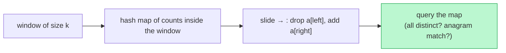

# Memorize: Fixed-Sized Sliding Window

## In a Hurry?

- **One-Line Idea**: Slide a window of fixed size `k` across the sequence, keeping a hash-map summary of its contents that you update in `O(1)` by adding the entering element and removing the leaving one.
- **Complexities**: `O(n)` time, `O(k)` space — `n` is the sequence length and `k` is the window size; the map holds at most `k` distinct entries.
- **When to Use**: The problem asks a question about *every* contiguous window of a fixed size `k` (or `len(pattern)`), and that question is answerable from a frequency map.

---

## One-Line Mnemonic

**"Add the joiner, drop the leaver — the map between them is the answer for this window."**

The image is a turnstile booth `k` seats wide: each step one person enters, one exits, and the tally board inside updates by those two only — never a full recount of who is seated.

---

## Real-World Analogy

Picture a security desk watching a corridor exactly `k` people long. As the queue shuffles forward, one person steps into view at the far end and one disappears behind you, and the guard's clipboard — a tally of how many of each badge colour are currently in view — changes by just those two. The guard never recounts the whole corridor. That clipboard is the frequency map, the corridor is the window, and the question ("any two matching badges? how many distinct colours?") is answered by reading the clipboard at each step.

---

## Visual Summary



<p align="center"><strong>The fixed window, but its contents live in a hash map of counts: each slide decrements the leaving element and increments the entering one, so window questions stay O(1) per step.</strong></p>

---

## Pattern Recognition Triggers

The problem fits the fixed-sized sliding window when **all four** of the following hold. These are the same questions the pattern's Recognition Checklist asks.

- The window size is **fixed at `k`** — given directly in the input or set to `len(pattern)`, never resized by a condition.
- The input is a **linear sequence** — an array or string walked one element at a time.
- The per-window answer comes from a **hash-map summary** you can update in `O(1)` on each slide.
- The per-step work is **`O(1)` amortised** — one increment on expand, one decrement on contract.

Common surface signals: "any duplicate in a window of size `k`," "distinct count for every window of size `k`," "does any window match this multiset," "find all anagrams / permutations of `p`." If the problem fixes the window width in its statement (or hands it to you as `len(p)`), reach for this pattern first.

---

## Don't Confuse With

| | **Fixed-Sized Sliding Window (this pattern)** | **Variable-Sized Sliding Window (next pattern)** |
|---|---|---|
| **Window size** | Always exactly `k` — given in the input or `len(pattern)` | Grows or shrinks to satisfy a running condition |
| **Loop shape** | Single `while end < n` with a size guard (`> k` or `== k`) | Inner `while` that contracts `start` while a condition holds |
| **What controls `start`** | A hard size constraint — drop the leftmost once width hits `k` | A condition — shrink while "distinct > K" or "sum ≥ S" stays true |
| **Problem shape** | "every / any window of size `k`" | "longest / shortest / count of windows satisfying condition C" |
| **When this goes wrong** | You start writing an inner `while` to shrink the window past size `k` → wrong pattern, the problem actually has a condition, not a fixed size — use variable sliding window | You keep guarding `if end − start + 1 > k` for a known fixed `k` → wrong pattern, the problem actually fixes the size — use fixed sliding window |

Both patterns share the `start`/`end` pointers and the "add the joiner, drop the leaver" mechanic. They diverge on what moves `start`: a fixed width here, a running condition there.

---

## Template Code

```python
from collections import defaultdict

# Fixed-sized sliding window over a sequence with a hash-map summary.
def fixed_size_sliding_window(arr, k):
    start = end = 0
    frequency = defaultdict(int)
    # result = []            # only for per-window-report variants

    while end < len(arr):
        # Expand: add the entering element's contribution.
        frequency[arr[end]] += 1

        # Contract if oversized: drop the leaving element, advance start.
        if end - start + 1 > k:
            frequency[arr[start]] -= 1
            if frequency[arr[start]] == 0:
                del frequency[arr[start]]   # keep len(map) an honest distinct count
            start += 1

        # Process if full: read the map for this exact window.
        if end - start + 1 == k:
            pass                            # e.g. result.append(len(frequency))

        # Advance the right edge.
        end += 1
```

Two knobs change per problem:

- **The map's payload** — plain counts for duplicate / distinct questions, or a comparison against a pre-built pattern map for anagram / permutation questions.
- **The process step** — short-circuit on a count (Duplicate Detection), append `len(map)` (Subarray Distinctness), or compare maps / track a match counter (Contains Variation, Anagram Finder).

---

## Common Mistakes

- **Processing the window before contracting it**:
  - *What*: running the `== k` process branch before the `> k` shrink, so the first time `end` reaches `k` you read a window holding `k + 1` elements.
  - *Why*: the contract step exists to bring the window back to exactly `k`; processing first means you sometimes summarise an oversized window.
  - *Fix*: keep the canonical order — Expand → Contract-if-`> k` → Process-if-`== k` → Advance.
- **Forgetting to delete zero-count keys**:
  - *What*: decrementing a leaving element's count but leaving the key at `0` in the map, then reporting `len(map)` as the distinct count.
  - *Why*: a key sitting at `0` still counts toward `len(map)`, so the distinct count is inflated by every element that has left the window.
  - *Fix*: `del frequency[key]` (or remove it) the moment its count hits `0`, so the map's size reflects only present elements.
- **Re-counting the window from scratch each step**:
  - *What*: rebuilding the frequency map with a fresh `Counter(arr[start:end+1])` inside the loop because the slice "reads cleaner."
  - *Why*: that slice-and-count is `O(k)`, so the loop becomes `O(n·k)` — exactly the brute-force cost the pattern eliminates.
  - *Fix*: maintain the map incrementally with one increment on entry and one decrement on exit; never recompute over the whole window.
- **Mismatching the contract guard with the process guard**:
  - *What*: mixing `if end - start >= k` and `if end - start + 1 == k` styles across the same loop, so the window is off by one when processed.
  - *Why*: `end - start + 1` is the current width; `end - start` is the width *before* this step's add — using both inconsistently shifts the window boundary.
  - *Fix*: pick one convention per problem and use it for both the contract and the process check, as the worked solutions do.
- **Assuming the window is full from the first iteration**:
  - *What*: reading or reporting the map on early iterations, before `end` has advanced far enough for the window to reach size `k`.
  - *Why*: the first `k − 1` steps build a partial window; their map is not a valid size-`k` answer.
  - *Fix*: gate every report behind the `end - start + 1 == k` check, so only full windows are processed.

---

## Minimum Viable Example

Distinct count for every window of size `3` on `[1, 1, 2, 4]`:

```
[1, 1, 2, 4]   end=2, start=0 → window [1,1,2], map {1:2, 2:1} → len 2  → result = [2]
[1, 1, 2, 4]   end=3 → add 4, size 4 > 3 → drop 1 → window [1,2,4], map {1:1, 2:1, 4:1} → len 3  → result = [2, 3]
end past n − 1 → loop exits; result = [2, 3]  (n − k + 1 = 2 windows)
```

Four elements, two windows, the complete pattern.

---

## Quick Recall

**Q: What is the canonical four-step order inside the loop body?**
A: Expand (add `arr[end]`) → Contract-if-`> k` (drop `arr[start]`, advance `start`) → Process-if-`== k` → Advance `end`.

**Q: What time and space complexity does the fixed-sized sliding window achieve?**
A: `O(n)` time and `O(k)` space — each element is added once and removed at most once, and the map holds at most `k` entries.

**Q: Why must you delete a key whose count drops to zero?**
A: A zero-count key still counts toward `len(map)`, so leaving it in inflates any distinct-count answer read from the map's size.

**Q: How does the window size get fixed in a pattern-match problem like Anagram Finder?**
A: It is `len(pattern)` — the second string hands you the width, and every candidate window in the source string is exactly that size.

**Q: What is the symptom that you reached for fixed sliding window when you needed the variable version?**
A: You catch yourself writing an inner `while` to shrink the window past size `k`, or the "size" turns out to be a condition (distinct ≤ K, sum ≥ S) rather than a fixed number.
