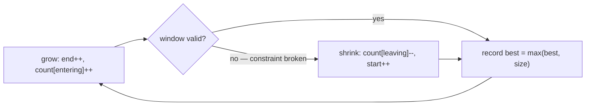

# Pattern: Variable-Size Sliding Window

## Why It Exists

This is the array [variable sliding window](/cortex/data-structures-and-algorithms/linear-structures/arrays/pattern-variable-sliding-window/pattern) raised to *composition* constraints. There, validity was a number (a sum ≤ target). Here it's about *which elements and how many*: "the longest substring with **no repeating** character," "the longest with **at most `k` distinct**," "the shortest window **containing all** of a target set." The window's validity depends on its element counts — so its state is a **hash map**.

Brute force re-examines every start/end pair — `O(n²)`. The fix is the same breathing window as before, with a count map as state: **grow** the right edge (add the entering element to the map), and whenever the constraint breaks, **shrink** the left edge (remove elements) until it holds again. Each pointer only ever moves forward, so the whole sweep is `O(n)` despite the inner shrink loop.

## See It Work

Find the length of the longest substring of `"abcabcbb"` with no repeating character (it's `"abc"`, length `3`). Run it, then **Visualise** the window grow and shrink.

> ▶ Run it, then click **Visualise** — `end` grows the window and adds to the count map; a repeat triggers `start` to shrink from the left until the window is valid again.

```python run viz=array viz-root=s
s = input()                           # the test case's string
count = {}                            # window state: char → count
start = best = 0
for end in range(len(s)):
    ch = s[end]
    count[ch] = count.get(ch, 0) + 1  # grow: fold in the entering char
    while count[ch] > 1:              # invalid (a repeat) → shrink from the left
        count[s[start]] -= 1
        start += 1
    best = max(best, end - start + 1) # longest valid window so far
print(best)
```

```java run viz=array viz-root=s
import java.util.*;

public class Main {
  public static void main(String[] args) {
    String s = new Scanner(System.in).nextLine();   // the test case's string
    Map<Character, Integer> count = new HashMap<>();
    int start = 0, best = 0;
    for (int end = 0; end < s.length(); end++) {
      char ch = s.charAt(end);
      count.merge(ch, 1, Integer::sum);             // grow: fold in the entering char
      while (count.get(ch) > 1) {                  // invalid (a repeat) → shrink
        count.merge(s.charAt(start), -1, Integer::sum);
        start++;
      }
      best = Math.max(best, end - start + 1);       // longest valid window so far
    }
    System.out.println(best);
  }
}
```

```testcases
{
  "args": [
    { "id": "s", "label": "s", "type": "string", "placeholder": "abcabcbb" }
  ],
  "cases": [
    { "args": { "s": "abcabcbb" }, "expected": "3" },
    { "args": { "s": "pwwkew" }, "expected": "3" },
    { "args": { "s": "bbbbb" }, "expected": "1" },
    { "args": { "s": "abcdef" }, "expected": "6" }
  ]
}
```

## How It Works

Two pointers `start` and `end` bound the window; a count map tracks how many of each element it holds. The loop has a driver and a repair:

- **Grow** — `end` advances every step, incrementing `count[s[end]]`.
- **Shrink** — a `while` loop advances `start`, decrementing the leaving element's count, *until the window is valid again* (here, until no character appears twice).



<p align="center"><strong>grow on the right into the count map; when the constraint breaks, shrink from the left until valid; record the best valid window.</strong></p>

The inner `while` *looks* quadratic but isn't: `start` only ever moves forward, crossing the string at most once total, so across the whole run `end` advances `n` times and `start` advances ≤ `n` times — **`O(n)` time, `O(σ)` space**. Swap the validity test to change the problem: `count[ch] > 1` → no repeats; `len(count) > k` → at most `k` distinct; "map covers a target multiset" → minimum window substring.

### Key Takeaway

Grow the window on the right into a count map, shrink from the left whenever the count-based constraint breaks, and track the best valid window. Both pointers move forward only → `O(n)`. The validity test is the single knob that selects the problem.

## Trace It

Longest-no-repeat over `"abcabcbb"`:

| `end` | char | window `[start..end]` | action |
|---|---|---|---|
| 0–2 | `a,b,c` | `abc` | valid, **best = 3** |
| 3 | `a` | `abca` → repeat `a` | shrink: drop `a` at 0 → `start=1`, window `bca` |
| 4 | `b` | `bcab` → repeat `b` | shrink: drop `b` at 1 → `start=2`, window `cab` |
| 5 | `c` | `cabc` → repeat `c` | shrink → `start=3`, window `abc` |
| 6 | `b` | `abcb` → repeat `b` | shrink to `start=5`, window `cb` |

Before you read on: at `end = 3` the window held `abca`, the shrink loop ran, and `start` advanced. Across the entire scan, `start` only ever increases. Why does that one fact guarantee the algorithm is `O(n)` and not `O(n²)`, even though there's a loop inside a loop?

Because the total work of the inner loop is bounded by *how far `start` can travel*, and `start` goes from `0` to at most `n` — **once**. Each position is left by `start` exactly one time; it never backtracks. So summed over the whole run, the inner shrink executes at most `n` times total, not `n` times per outer step. Add the `n` steps of `end`, and the work is `≤ 2n` — linear. This amortized argument ("an inner loop isn't quadratic if the pointer it advances never resets") is the transferable idea, the same one behind the array variable window.

## Your Turn

The reusable longest-substring-without-repeats:

```python run viz=array
def longest_unique(s):
    count = {}
    start = best = 0
    for end in range(len(s)):
        ch = s[end]
        count[ch] = count.get(ch, 0) + 1
        while count[ch] > 1:              # shrink while invalid
            count[s[start]] -= 1
            start += 1
        best = max(best, end - start + 1)
    return best

s = input()
print(longest_unique(s))
```

```java run viz=array
import java.util.*;

public class Main {
  static int longestUnique(String s) {
    Map<Character, Integer> count = new HashMap<>();
    int start = 0, best = 0;
    for (int end = 0; end < s.length(); end++) {
      char ch = s.charAt(end);
      count.merge(ch, 1, Integer::sum);
      while (count.get(ch) > 1) {         // shrink while invalid
        count.merge(s.charAt(start), -1, Integer::sum);
        start++;
      }
      best = Math.max(best, end - start + 1);
    }
    return best;
  }

  public static void main(String[] args) {
    String s = new Scanner(System.in).nextLine();
    System.out.println(longestUnique(s));
  }
}
```

```testcases
{
  "args": [
    { "id": "s", "label": "s", "type": "string", "placeholder": "pwwkew" }
  ],
  "cases": [
    { "args": { "s": "pwwkew" }, "expected": "3" },
    { "args": { "s": "bbbbb" }, "expected": "1" },
    { "args": { "s": "abcabcbb" }, "expected": "3" },
    { "args": { "s": "abcdef" }, "expected": "6" },
    { "args": { "s": "a" }, "expected": "1" },
    { "args": { "s": "dvdf" }, "expected": "3" }
  ]
}
```

<details>
<summary>Editorial</summary>

The grow-right / shrink-left skeleton with a count map as window state: extend `end` every step, folding the new character into `count`; while the newest character's count exceeds `1` (a repeat), evict from the left. After the inner loop the window is valid — every count is ≤ 1. Record `end − start + 1`. Both pointers only move forward, so total work is `≤ 2n` — `O(n)` time, `O(σ)` space.

```python solution time=O(n) space=O(σ)
def longest_unique(s):
    count = {}
    start = best = 0
    for end in range(len(s)):
        ch = s[end]
        count[ch] = count.get(ch, 0) + 1
        while count[ch] > 1:              # shrink while invalid
            count[s[start]] -= 1
            start += 1
        best = max(best, end - start + 1)
    return best

s = input()
print(longest_unique(s))
```

```java solution
import java.util.*;

public class Main {
  static int longestUnique(String s) {
    Map<Character, Integer> count = new HashMap<>();
    int start = 0, best = 0;
    for (int end = 0; end < s.length(); end++) {
      char ch = s.charAt(end);
      count.merge(ch, 1, Integer::sum);
      while (count.get(ch) > 1) {         // shrink while invalid
        count.merge(s.charAt(start), -1, Integer::sum);
        start++;
      }
      best = Math.max(best, end - start + 1);
    }
    return best;
  }

  public static void main(String[] args) {
    String s = new Scanner(System.in).nextLine();
    System.out.println(longestUnique(s));
  }
}
```

</details>

Drill the family in **Practice** — [Unique Character Span](/cortex/data-structures-and-algorithms/linear-structures/hash-table/pattern-variable-sized-sliding-window/problems/unique-character-span), [K Characters Span](/cortex/data-structures-and-algorithms/linear-structures/hash-table/pattern-variable-sized-sliding-window/problems/k-characters-span), [Maximal Character Swap](/cortex/data-structures-and-algorithms/linear-structures/hash-table/pattern-variable-sized-sliding-window/problems/maximal-character-swap), [Subarray Sum Equals K](/cortex/data-structures-and-algorithms/linear-structures/hash-table/pattern-variable-sized-sliding-window/problems/subarray-sum-equals-k), and [Twin in Proximity](/cortex/data-structures-and-algorithms/linear-structures/hash-table/pattern-variable-sized-sliding-window/problems/twin-in-proximity).

## Reflect & Connect

This is among the most common interview patterns — "longest/shortest substring satisfying a count condition" is almost always a map-backed variable window:

- **The family, by validity test** — `count[ch] > 1` (no repeats), `len(count) > k` (at most `k` distinct), "map covers the target" (minimum window substring), or longest-with-at-most-`k`-of-some-value. The skeleton is fixed; the test selects the problem.
- **It's [variable sliding window](/cortex/data-structures-and-algorithms/linear-structures/arrays/pattern-variable-sliding-window/pattern) + [counting](/cortex/data-structures-and-algorithms/linear-structures/hash-table/pattern-counting/pattern)** — the array pattern's grow/shrink machinery with a frequency map as the validity state.
- **Longest vs shortest flips the shrink rule** — for *longest valid*, shrink only while invalid and measure after; for *shortest valid*, shrink while still valid and measure inside the loop. Same window, opposite shrink condition.

**Prerequisites:** [Fixed-Size Sliding Window](/cortex/data-structures-and-algorithms/linear-structures/hash-table/pattern-fixed-sized-sliding-window/pattern).
**What's next:** answer subarray-sum questions with a running total and a map of seen prefixes — [Prefix Sum](/cortex/data-structures-and-algorithms/linear-structures/hash-table/pattern-prefix-sum/pattern).

## Recall

> **Mnemonic:** *Grow right into a count map; shrink left while invalid; track the best. Both pointers forward-only ⇒ `O(n)`. The validity test picks the problem.*

| | |
|---|---|
| State | `element → count` map over the current window |
| Grow | `end++`, `count[entering]++` |
| Shrink | `while invalid: count[leaving]--, start++` |
| Validity test | `count[ch] > 1` (no repeats), `len(count) > k` (≤ `k` distinct), covers-target (min window) |
| Cost | `O(n)` time, `O(σ)` space — `start` never resets |

<details>
<summary><strong>Q:</strong> How does this differ from the fixed-size map window?</summary>

**A:** The window size isn't fixed — it grows and shrinks based on whether the count-based constraint holds.

</details>
<details>
<summary><strong>Q:</strong> Why is the inner shrink loop not `O(n²)`?</summary>

**A:** `start` only moves forward, crossing the input once total, so total shrink work is `≤ n` — amortized `O(1)` per step.

</details>
<details>
<summary><strong>Q:</strong> What single change switches problems (no-repeat vs ≤ `k` distinct)?</summary>

**A:** The validity test — `count[ch] > 1` versus `len(count) > k`.

</details>
<details>
<summary><strong>Q:</strong> Longest-valid vs shortest-valid — what flips?</summary>

**A:** Longest: shrink only while invalid, measure after; shortest: shrink while still valid, measure inside.

</details>

## Sources & Verify

- **CLRS**, *Introduction to Algorithms*, 4th ed., §11 and §17 — hash tables and amortized analysis.
- **Sedgewick & Wayne**, *Algorithms*, 4th ed., §1.4 / §3.4 — amortized cost and hash tables.
- The map-backed variable window (longest-no-repeat, ≤ `k` distinct, minimum window) is standard; both runnable blocks are verified by running (`abcabcbb`/`pwwkew ⇒ 3`, `bbbbb ⇒ 1`).
