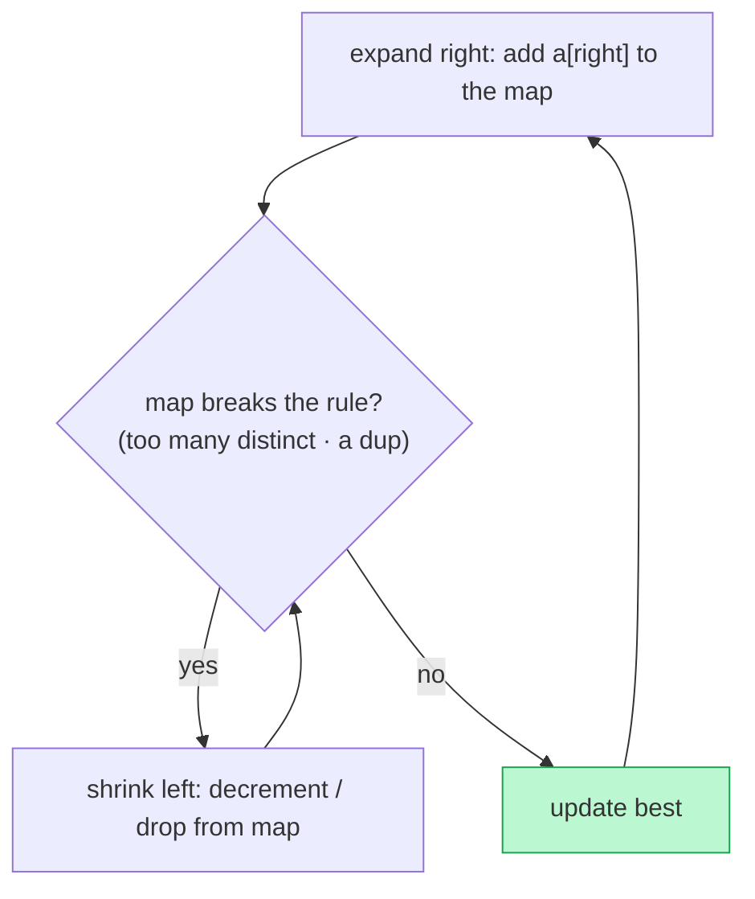

# Memorize: Variable-Sized Sliding Window

## In a Hurry?

- **One-Line Idea**: Grow a window with `end`; whenever a hash-map summary breaks the rule, shrink from `start` until it holds again — a single forward pass.
- **Complexities**: `O(n)` time, `O(k)` space — `n` is the sequence length, `k` the number of distinct keys the window holds (`O(1)` for a fixed alphabet, `O(n)` worst case).
- **When to Use**: The answer is the longest/shortest/count of a *contiguous* subsequence satisfying a **monotonic** rule that a hash map can check in `O(1)`.

---

## One-Line Mnemonic

**"Stretch right always, shrink left only on a broken rule — the map says when."**

The image is a concertina pulled along a rail: the right handle slides forward every beat, and the left handle only chases it when the bellows over-stretch past their limit.

---

## Real-World Analogy

Picture reading a sentence through a cardboard slot that you can widen or narrow. You push the right edge forward one letter at a time, building up a tally of which letters are visible. The moment the slot shows a letter twice — or more distinct letters than you are allowed — you slide the left edge inward, dropping letters off the back, until the rule is satisfied again. You never push the left edge backward; both edges only travel forward along the sentence, so you read the whole line in one sweep. The tally on your scratch pad is the hash map — it tells you, at a glance, whether the current slot obeys the rule.

---

## Visual Summary



<p align="center"><strong>A condition-driven window backed by a hash map: grow right and record counts; when the map breaks the rule (too many distinct, a repeat), shrink left until it holds. Each index enters/leaves once — O(n).</strong></p>

---

## Pattern Recognition Triggers

- The problem asks for the **longest** or **shortest** contiguous substring or subarray satisfying a condition.
- The problem asks for the **count of contiguous windows** satisfying a condition (use the `end − start + 1` counting trick).
- The condition reads off a **hash-map summary** that supports `O(1)` add *and* `O(1)` remove — a frequency map, a distinct-key count, a most-frequent tally.
- The problem mentions a **budget or constraint** the window must respect — "no duplicates", "at most `k` distinct", "at most `k` replacements", "values within distance `k`".
- The condition is **monotonic**: extending the window can only make the rule harder to satisfy in one direction, easier in the other.

Common surface signals: "longest substring without repeating characters", "longest substring with at most `k` distinct", "longest run after `k` replacements", "is there a duplicate within distance `k`". If the rule is *non-monotonic* (negatives, "sum exactly `k`"), this pattern fails — reach for prefix sums instead.

---

## Don't Confuse With

| Aspect | **Variable-Sized Sliding Window** | **Fixed-Sized Sliding Window** |
|---|---|---|
| Window size | Grows and shrinks based on a rule | Always exactly `k` |
| Pointer motion | `end` advances every step; `start` advances only on violation | Both edges advance together in lockstep |
| What drives contraction | A rule check against the hash-map summary | The window crossing width `k`, mechanically |
| Typical output | Longest/shortest window, or count of valid windows | An aggregate over every window of size `k` |
| **When this goes wrong** | The window size never changes across iterations — you needed the *fixed* window, not the variable one | You find yourself searching for the best width — you needed the *variable* window, not the fixed one |

Both walk two forward-only pointers over a sequence with a hash-map summary. The decisive question is *what sets the window's size* — a rule the window must satisfy (variable) or a constant `k` (fixed). When the rule is non-monotonic, neither window applies: a prefix-sum + hash map is the right tool, as in subarray-sum-equals-k.

---

## Template Code

The annotated Python skeleton below is the generic shape. Pick `if` or `while` on the contraction based on whether one expansion can ever force multiple shrinks — default to `while`.

```python
def variable_sliding_window(seq):
    start = 0
    window = {}            # frequency map / distinct-count source / latest-index map
    result = INIT_RESULT    # 0 for a max length, 0 for a count, False for existence

    for end in range(len(seq)):
        # Expand — admit seq[end] into the window summary.
        window[seq[end]] = window.get(seq[end], 0) + 1

        # Contract — shrink from the left while the rule is broken.
        while rule_broken(window, start, end):
            window[seq[start]] -= 1
            if window[seq[start]] == 0:
                del window[seq[start]]   # keep len(window) honest
            start += 1

        # Process — the window [start..end] is now the best valid one ending at end.
        result = update(result, start, end, window)

    return result
```

Common counting trick: when the question is "how many windows satisfy the rule", every window ending at `end` whose start lies in `[start, end]` is also valid, so `result += end − start + 1` after each restoration.

---

## Common Mistakes

- **Using `if` when you need `while` on contraction**:
  - *What*: the window stays wider than the rule allows after one expansion that should have forced several shrinks.
  - *Why*: a single new element can break the rule by several slots; one `if` only evicts one element.
  - *Fix*: default to `while rule_broken(...)` and only downgrade to `if` when you can *prove* one shrink always restores the rule.
- **Forgetting to delete a key when its count hits zero**:
  - *What*: `len(map)` overcounts distinct keys, so the "at most `k` distinct" rule contracts too late or never.
  - *Why*: a count of `0` still leaves the key in the map, and `len(map)` counts it as present.
  - *Fix*: `del map[key]` the instant its count reaches `0`, so `len(map)` is exactly the distinct-count.
- **Recomputing the whole window each iteration**:
  - *What*: rebuilding the map or rescanning `[start..end]` from scratch every step, collapsing back to `O(n²)`.
  - *Why*: treating the window as a fresh slice instead of incrementally maintained state.
  - *Fix*: add only `seq[end]` on expand and remove only `seq[start]` on contract — never touch the interior.
- **Applying the window to a non-monotonic rule**:
  - *What*: using contract-on-violation on "subarray sum equals `k`" with negative values, getting wrong answers.
  - *Why*: with negatives, extending can lower the sum and contracting can raise it, so there is no safe direction to shrink.
  - *Fix*: confirm the rule is monotonic before using a window; for non-monotonic sums, switch to a prefix-sum + hash map.
- **Reading the result only inside the contraction branch**:
  - *What*: a valid window that never triggers a contraction (e.g. an all-distinct string) is never recorded, so the answer is too small.
  - *Why*: tying the `result` update to the shrink step means windows that never shrink go uncounted.
  - *Fix*: update `result` *every* iteration after contraction, not only when `start` moves.

---

## Minimum Viable Example

The smallest end-to-end run of the pattern — the longest substring without repeating characters in `s = "abca"`:

```
s = "abca"   rule: no duplicate character

end=0  add 'a'  map={a:1}        window "a"    len 1  best=1
end=1  add 'b'  map={a:1,b:1}    window "ab"   len 2  best=2
end=2  add 'c'  map={a:1,b:1,c:1} window "abc" len 3  best=3
end=3  add 'a'  map={a:2,b:1,c:1} 'a' dup → evict 'a' (start 0→1)
                map={b:1,c:1,a:1} window "bca" len 3  best=3

Result: 3
```

The single eviction at `end=3` is the entire pattern. Without it, this is `O(n²)`; with it, `O(n)`.

---

## Quick Recall

**Q: What is the loop invariant for a variable-sized sliding window?**
A: After contraction, the window `seq[start..end]` is the largest valid window ending at `end` — the rule holds at the start of every iteration.

**Q: When do you use `if` vs `while` on the contraction?**
A: `while` when one expansion can force multiple shrinks (the default); `if` only when you can prove a single shrink always restores the rule.

**Q: Why must you delete a map key when its count drops to zero?**
A: Because `len(map)` is the distinct-count only if dead keys are removed — leaving zero-count keys makes the "at most `k` distinct" rule wrong.

**Q: What is the time complexity and why?**
A: `O(n)`, because both `start` and `end` only move forward and each index is admitted once and evicted at most once — amortising the inner `while`.

**Q: When does the variable-sized window *not* apply?**
A: When the rule is non-monotonic — arrays with negatives, or "sum exactly `k`" — because contraction has no safe direction; use a prefix-sum + hash map instead.

**Q: How do you count subarrays that satisfy a condition?**
A: Add `end − start + 1` to the running total each iteration, after the rule is restored.
