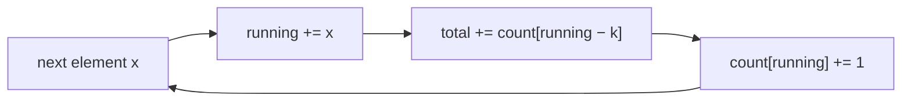

# Pattern: Prefix Sum

## Why It Exists

"How many subarrays sum to `k`?" The brute force sums every `(i, j)` subarray — `O(n²)` (or `O(n³)` naively). The structural insight: the sum of the subarray `(i, j]` equals `prefix[j] − prefix[i]`, where `prefix[t]` is the running total of the first `t` elements. So a subarray ending at `j` sums to `k` **exactly when** some earlier prefix equals `prefix[j] − k`.

That reframes the search. Instead of trying every start, keep a **running prefix sum** and a **hash map of how many times each prefix value has occurred**. At each position, the number of valid subarrays ending here is just how many earlier prefixes equal `running − k` — an `O(1)` map lookup. The hash map turns "find a matching earlier prefix" from a scan into a constant-time question, collapsing `O(n²)` to `O(n)`.

## See It Work

Count the subarrays of `[1, 1, 1]` that sum to `k = 2` (there are two: indices `0..1` and `1..2`). Run it.

```python run viz=array
def subarray_sum_count(nums, k):
    count = {0: 1}        # one "empty" prefix of sum 0 (see the trace for why)
    running = 0
    total = 0
    for x in nums:
        running += x
        total += count.get(running - k, 0)   # earlier prefixes that make the gap = k
        count[running] = count.get(running, 0) + 1
    return total

print(subarray_sum_count([1, 1, 1], 2))      # 2
```

## How It Works

Sweep left to right with two pieces of state — a running prefix sum and a map `prefix value → how many times seen`:

1. **Extend** the prefix: `running += x`.
2. **Count** matches: a subarray ending here sums to `k` iff an earlier prefix equals `running − k`. Add `count[running − k]` to the total.
3. **Record** the current prefix: `count[running] += 1`, so positions to the right can match it.

Seed the map with `{0: 1}` — a single "empty prefix" of sum `0` — so that a prefix which *itself* equals `k` is counted (its matching earlier prefix is the empty one).



<p align="center"><strong>carry a running prefix sum; at each step look up <code>running − k</code> in the map of seen prefixes to count subarrays ending here, then record the current prefix.</strong></p>

Each element is one map lookup and one map update — `O(1)` average — so the whole count is **`O(n)` time, `O(n)` space**. The map is really a *frequency counter over prefix values* (the [counting](/cortex/data-structures-and-algorithms/linear-structures-hash-table-pattern-counting-pattern) pattern again), and the prefix-difference identity is what lets a hash lookup replace a nested loop. (Unlike the sliding window, this works with **negative numbers** too, since it never assumes the sum grows monotonically.)

### Key Takeaway

A subarray sum is a difference of two prefix sums, so keep a running total and a hash map of prefix frequencies; "subarray sums to `k`" becomes the `O(1)` question "have I seen `running − k`?" Seed the map with `{0: 1}` and the whole count is one `O(n)` pass — and it tolerates negatives.

## Trace It

`[1, 1, 1]`, `k = 2`, map seeded `{0: 1}`:

| `x` | `running` | `running − k` | `count[running−k]` | total | map after |
|---|---|---|---|---|---|
| `1` | 1 | −1 | 0 | 0 | `{0:1, 1:1}` |
| `1` | 2 | 0 | **1** | 1 | `{0:1, 1:1, 2:1}` |
| `1` | 3 | 1 | **1** | 2 | `{0:1, 1:1, 2:1, 3:1}` |

Before you read on: at the second element, `running − k = 0` matched the seeded `{0: 1}` entry, contributing the first subarray. What real subarray does that match represent — and what would break if you *didn't* seed the map with `{0: 1}`?

It represents the subarray `[1, 1]` covering indices `0..1` — the *whole prefix so far*, which sums to `2 = k`. Its "earlier prefix" is the empty prefix before index 0, whose sum is `0`; the `{0: 1}` seed is what records that empty prefix exists. Without the seed, `count.get(0)` would be `0` and you'd **miss every subarray that starts at index 0** — an off-by-one that silently undercounts. The seed is the prefix-sum pattern's equivalent of a dummy node: it makes "a subarray that begins at the very start" a non-special case.

## Your Turn

The reusable count-subarrays-summing-to-`k`:

```python run viz=array
def subarray_sum_count(nums, k):
    count = {0: 1}
    running = 0
    total = 0
    for x in nums:
        running += x
        total += count.get(running - k, 0)
        count[running] = count.get(running, 0) + 1
    return total

print(subarray_sum_count([1, 2, 3], 3))      # 2  ([1,2] and [3])
print(subarray_sum_count([1, -1, 0], 0))     # 3  (handles negatives)
```

```java run viz=array
import java.util.*;

public class Main {
  static int subarraySumCount(int[] nums, int k) {
    Map<Integer, Integer> count = new HashMap<>();
    count.put(0, 1);
    int running = 0, total = 0;
    for (int x : nums) {
      running += x;
      total += count.getOrDefault(running - k, 0);
      count.merge(running, 1, Integer::sum);
    }
    return total;
  }

  public static void main(String[] args) {
    System.out.println(subarraySumCount(new int[]{1, 2, 3}, 3));    // 2
    System.out.println(subarraySumCount(new int[]{1, -1, 0}, 0));   // 3
  }
}
```

Drill the family in **Practice** — [First Equilibrium Point](/cortex/data-structures-and-algorithms/linear-structures-hash-table-pattern-prefix-sum-problems-first-equilibrium-point), [Self-Excluded Array Product](/cortex/data-structures-and-algorithms/linear-structures-hash-table-pattern-prefix-sum-problems-self-excluded-array-product), [Balanced Binary Subarray](/cortex/data-structures-and-algorithms/linear-structures-hash-table-pattern-prefix-sum-problems-balanced-binary-subarray), and [Zero-Sum Subarrays](/cortex/data-structures-and-algorithms/linear-structures-hash-table-pattern-prefix-sum-problems-zero-sum-subarrays).

## Reflect & Connect

Prefix sums plus a map answer a whole class of subarray questions in one pass:

- **The family** — count subarrays summing to `k`, **longest** subarray summing to `k` (map prefix → *earliest index*), count **zero-sum** subarrays (`k = 0`), **balanced** binary subarrays (map `0 → −1`, then it's zero-sum). The prefix-difference identity underlies them all.
- **Map of counts vs map of indices** — for *how many*, store prefix → frequency (above); for *longest/shortest*, store prefix → first index. Pick by what the problem asks.
- **It works where sliding windows fail** — a [variable window](/cortex/data-structures-and-algorithms/linear-structures-hash-table-pattern-variable-sized-sliding-window-pattern) assumes growing the window monotonically changes validity, which breaks with negative numbers. Prefix-sum + map makes no monotonicity assumption, so it's the tool for "subarray sum = k" with negatives. And for *static* range-sum queries, a plain prefix array answers each in `O(1)` with no map at all.

**Prerequisites:** [What Is a Hash Table?](/cortex/data-structures-and-algorithms/linear-structures-hash-table-what-is-a-hash-table).

## Recall

> **Mnemonic:** *Running prefix sum + map of seen prefixes. Subarray sums to `k` ⇔ seen `running − k`. Seed `{0:1}`. One `O(n)` pass, negatives OK.*

| | |
|---|---|
| Identity | `sum(i, j] = prefix[j] − prefix[i]` |
| Per element | `running += x` → `total += count[running − k]` → `count[running] += 1` |
| Seed | `{0: 1}` — the empty prefix, so subarrays from index 0 count |
| How many vs longest | prefix → frequency (count) · prefix → first index (longest) |
| Cost | `O(n)` time, `O(n)` space |

<details>
<summary><strong>Q:</strong> What identity makes prefix-sum work?</summary>

**A:** A subarray's sum is the difference of two prefix sums, so "sum = `k`" becomes "two prefixes differ by `k`."

</details>
<details>
<summary><strong>Q:</strong> Why seed the map with `{0: 1}`?</summary>

**A:** It records the empty prefix so subarrays starting at index 0 (whose prefix itself equals `k`) are counted.

</details>
<details>
<summary><strong>Q:</strong> Why does this work with negatives when a sliding window doesn't?</summary>

**A:** It never assumes the sum grows monotonically with window size; it just matches prefix differences.

</details>
<details>
<summary><strong>Q:</strong> How do you switch from "how many" to "longest"?</summary>

**A:** Store prefix → *first index* instead of prefix → *frequency*, and track the largest `j − i`.

</details>

## Sources & Verify

- **CLRS**, *Introduction to Algorithms*, 4th ed., §11 — hash tables; prefix/cumulative sums as a preprocessing technique.
- **Sedgewick & Wayne**, *Algorithms*, 4th ed., §3.4 — hash tables and symbol-table applications.
- The prefix-sum + hash-map technique for subarray-sum counting is standard; both runnable blocks are verified by running (`[1,1,1],2 ⇒ 2`, `[1,2,3],3 ⇒ 2`, `[1,-1,0],0 ⇒ 3`).
