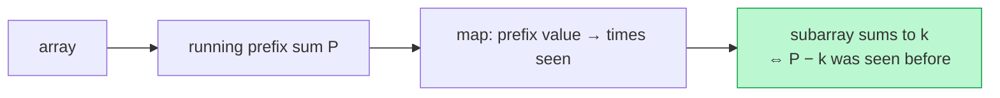

# Memorize: Prefix Sum

## In a Hurry?

- **One-Line Idea**: Sweep once keeping a running prefix value; at each index, ask a hash map of past prefix values whether an earlier index completes a target slice — turning an `O(N²)` subarray search into `O(N)`.
- **Complexities**: `O(N)` time, `O(N)` space — `N` is the sequence length; the map holds up to one entry per distinct prefix value.
- **When to Use**: The answer is a subarray sum (or a property that re-encodes to one) and the array holds **negatives or zeros**, which break sliding-window monotonicity.

---

## One-Line Mnemonic

**"Carry the running total; the map remembers where you've been — a repeat or a difference names the slice."**

The image is a hiker logging altitude at every milestone. Two milestones at the same altitude mean the leg between them had zero net climb; two milestones differing by `K` mean that leg climbed exactly `K`.

---

## Real-World Analogy

Picture a bank statement with a running balance printed after every transaction. To check whether some stretch of transactions nets to zero, you do not re-add that stretch — you look for two dates where the running balance is identical, because the balance only repeats when the transactions between those dates cancel out. To find a stretch that nets to exactly `K`, you look for two dates whose running balances differ by `K`. The running balance is the prefix sum, and scanning your eye down the statement for a matching or offset balance is the hash-map lookup. One pass down the page answers a question that would otherwise need comparing every pair of dates.

---

## Visual Summary



<p align="center"><strong>Keep a running prefix sum and a hash map of how often each sum has appeared. A subarray totals k exactly when current_sum − k was seen before — counting target subarrays in one O(n) pass.</strong></p>

---

## Pattern Recognition Triggers

- The problem asks for a **subarray sum** — "subarray summing to `K`", "count of zero-sum subarrays", "longest subarray with sum `K`".
- The problem re-encodes to a sum — "equal 0s and 1s" (`0 → −1`), "equal counts of two symbols", "net-zero balance".
- The array can contain **negatives or zeros**, so a sliding window cannot decide which end to shrink.
- The query asks for an **exact** target sum, not a "longest/shortest under a monotonic budget" — the hallmark that disqualifies a window.
- The answer needs **range sums at many positions** — a precomputed prefix array answers each in `O(1)`, no hash map required (the positional flavour).

Common surface signals: "subarray sum equals `k`", "count subarrays with sum `k`", "longest balanced binary subarray", "product of all elements except self", "equilibrium index". If the rule is *monotonic* and the values are all non-negative, prefer a sliding window instead — it uses `O(1)` space where prefix sums use `O(N)`.

---

## Don't Confuse With

| Aspect | **Prefix Sum + Hash Map** | **Sliding Window (fixed or variable)** |
|---|---|---|
| What it answers | Exact subarray sum, or a re-encoded net-zero property | Aggregate over a window whose rule is monotonic |
| Handles negatives/zeros | Yes — repeats and differences still hold | No — extending can lower the sum, contracting can raise it |
| State carried | Running prefix value + map of past prefix values | A live window summary (frequency map) over `[start..end]` |
| Space | `O(N)` — one map entry per distinct prefix value | `O(K)` — only the window's contents |
| **When this goes wrong** | You are paying `O(N)` space on an all-positive, monotonic "longest under a budget" problem — a window would do it in `O(1)` space | The sum overshoots `K` and there is no safe direction to shrink (negatives present) — you needed prefix sums, not a window |

Both walk a sequence once, but they differ on *what the state remembers*. A window remembers the current slice and shrinks it on a monotonic rule; prefix sums remember every past prefix value and query it for an exact match. The decisive question is whether the values are non-negative with a monotonic rule (window) or allow negatives / demand an exact sum (prefix sum).

---

## Template Code

The annotated Python skeleton below is the generic difference-search shape — count subarrays summing to `k`. Swap the map's payload (`count`, first-index, or index-list) to match whether you want how-many, longest, or all.

```python
def prefix_sum_difference_search(arr, k):
    seen = {0: 1}          # prefix value -> count (use {0: -1} for longest/first index)
    prefix = 0
    result = 0             # 0 for a count; -inf/0 for a max length; [] for all slices

    for i, x in enumerate(arr):
        # Accumulate — fold arr[i] into the running prefix value.
        prefix += x

        # Query — has an earlier prefix that completes a target slice been seen?
        # Difference search: prefix - k. Same-value search: prefix itself.
        if (prefix - k) in seen:
            result += seen[prefix - k]

        # Record — register the current prefix value for later queries.
        seen[prefix] = seen.get(prefix, 0) + 1

    return result
```

For *longest* or *all*, seed the map with `{0: -1}` (a notional index before the array) and store indices instead of counts — first-index for longest, a list of indices for all.

---

## Common Mistakes

- **Omitting the base case for the empty prefix**:
  - *What*: slices that start at index `0` are never counted, so the answer is short by exactly those cases.
  - *Why*: a slice anchored at index `0` needs the prefix value *before* it, which is the empty prefix `0` — absent from the map unless seeded.
  - *Fix*: seed `seen = {0: 1}` (for counts) or `seen = {0: -1}` (for longest/first index) before the loop.
- **Recording the prefix value before querying it**:
  - *What*: a single element equal to `k` (or a length-zero slice) gets miscounted because the current prefix matches itself.
  - *Why*: inserting `prefix` into the map before the `prefix - k` lookup lets the current index pair with itself.
  - *Fix*: always query first, then record — accumulate, look up, insert, in that fixed order.
- **Storing the wrong map payload for the question**:
  - *What*: a "longest" answer comes out as a count, or an "all slices" answer misses overlapping matches.
  - *Why*: counts, first-indices, and index-lists answer different questions; using one where another is needed silently drops information.
  - *Fix*: count → `{value: count}`; longest → `{value: first index}`; all → `{value: list of indices}`.
- **Reaching for prefix sums on a monotonic, all-positive problem**:
  - *What*: an `O(N)` solution that needlessly uses `O(N)` space where `O(1)` would do.
  - *Why*: when every value is non-negative and the rule is monotonic, a sliding window solves it with two pointers and no map.
  - *Fix*: check for negatives or an exact-sum requirement first; only then commit to prefix sums.
- **Forgetting to re-encode a counting property as a sum**:
  - *What*: trying to track "equal 0s and 1s" directly with two counters and getting tangled in off-by-one logic.
  - *Why*: the elegant reduction is invisible until you map `0 → −1`, after which "equal counts" becomes "sum is `0`".
  - *Fix*: re-encode first — `0 → −1, 1 → +1` — then apply the plain same-value search.

---

## Minimum Viable Example

The smallest end-to-end run of the pattern — count subarrays of `arr = [1, 2, -2, 3]` summing to `k = 3`. The map maps each prefix value to how many times it has been seen; the lookup happens before the current prefix is recorded:

```
arr = [1, 2, -2, 3]   k = 3   seed seen={0:1}

i=0  x=1   P=1   need P−k=−2  seen? 0   count=0   record → seen={0:1, 1:1}
i=1  x=2   P=3   need P−k=0   seen? 1   count=1   record → seen={0:1, 1:1, 3:1}
i=2  x=-2  P=1   need P−k=−2  seen? 0   count=1   record → seen={0:1, 1:2, 3:1}
i=3  x=3   P=4   need P−k=1   seen? 2   count=3   record → seen={0:1, 1:2, 3:1, 4:1}

Result: 3   →  subarrays [1,2], [2,-2,3], [3]
```

The negative element is why this needs prefix sums, not a window — and the two hits on prefix value `1` (at the start and after `-2`) are what a single hash-map lookup captures.

---

## Quick Recall

**Q: What is the core identity behind the prefix-sum pattern?**
A: The sum of `arr[l..r]` equals `P[r+1] − P[l]`, so a subarray sum is a difference of two prefix values.

**Q: When do you use difference search vs same-value search?**
A: Difference search (`look up prefix − K`) for an exact target sum `K`; same-value search (`look up prefix`) for a net-zero or balanced property.

**Q: Why must you seed the map with the empty prefix?**
A: Because a slice starting at index `0` pairs with the prefix value before it — the empty prefix `0` — which is absent unless you seed `{0: 1}` or `{0: -1}`.

**Q: Why query the map before recording the current prefix value?**
A: Recording first lets the current index match itself, miscounting a length-zero or single-element slice.

**Q: What is the time and space complexity, and why?**
A: `O(N)` time because each index does `O(1)` map work in one pass; `O(N)` space because the map holds up to one entry per distinct prefix value.

**Q: When does the prefix-sum pattern lose to a sliding window?**
A: On all-positive arrays with a monotonic rule ("longest under a budget"), where a window matches the `O(N)` time but uses only `O(1)` space.
