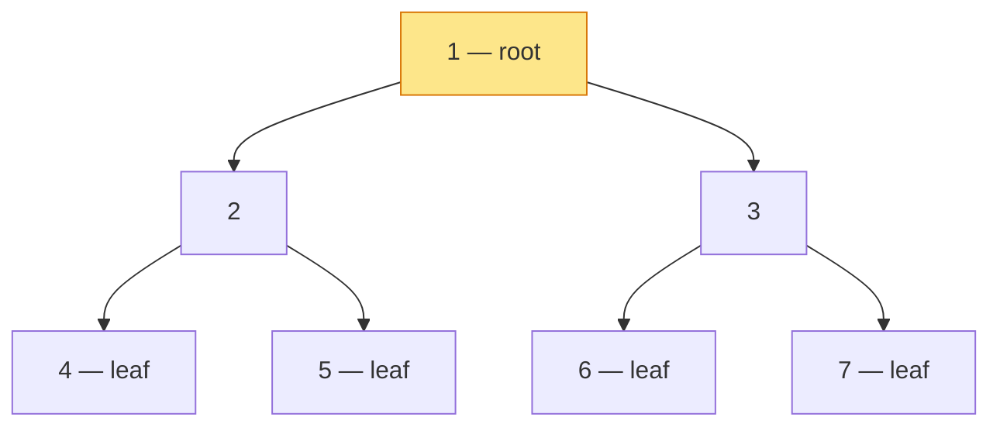

## Why It Exists

Every structure so far has been **linear** — array, [linked list](/cortex/data-structures-and-algorithms/linear-structures/singly-linked-list/what-is-a-linked-list), stack, queue — items along a single line, traversed forward or backward. But the most important data in computing is *hierarchical*: a filesystem's folders within folders, the HTML DOM, a program's syntax tree, an org chart, a tournament bracket. A line can't represent "this thing has several things *under* it," each of which has more under it. You need branching.

A **binary tree** is the simplest branching structure that's still powerful: each node holds a value and links to at most **two** children, a *left* and a *right* — and the order matters (left ≠ right). It's defined **recursively**: a binary tree is either empty, or a node whose left and right children are themselves binary trees. That self-similarity is the whole point — it's why almost every tree algorithm is a three-line recursion ("do something with the node, then recurse left, then recurse right"). The single "≤ 2 ordered children" restriction is what makes binary trees tractable enough to power binary search trees, heaps, expression parsers, Huffman coding, and the [Merkle trees](/cortex/data-structures-and-algorithms/dsa-in-real-systems/git-merkle-dag) behind Git. The one number that governs all their performance is **height** — the longest root-to-leaf path — because tree operations cost work proportional to it, which is why so much of this module is about keeping trees *short* ([Trace It](#trace-it)).

## See It Work

A binary tree is just nodes with `left`/`right` links, and its core measurements — size and height — fall straight out of the recursive definition. Pick a tree shape and **Run** it:

```python run viz=binary-tree viz-root=root
import json
from collections import deque

class Node:
    def __init__(self, val, left=None, right=None):
        self.val = val; self.left = left; self.right = right

def build_tree(values):              # [1, 2, 3, null, 4] level-order → root
    if not values:
        return None
    root = Node(values[0])
    queue = deque([root])
    i = 1
    while queue and i < len(values):
        node = queue.popleft()
        if i < len(values):
            v = values[i]; i += 1
            if v is not None:
                node.left = Node(v); queue.append(node.left)
        if i < len(values):
            v = values[i]; i += 1
            if v is not None:
                node.right = Node(v); queue.append(node.right)
    return root

def height(n): return -1 if n is None else 1 + max(height(n.left), height(n.right))  # edges on longest path
def count(n):  return 0 if n is None else 1 + count(n.left) + count(n.right)

root = build_tree(json.loads(input()))
print("node count:", count(root))
print("height:", height(root))
```

```java run viz=binary-tree viz-root=root
import java.util.*;

public class Main {
    static class Node {
        int val; Node left, right;
        Node(int v) { val = v; }
    }
    static int height(Node n) { return n == null ? -1 : 1 + Math.max(height(n.left), height(n.right)); }
    static int count(Node n)  { return n == null ?  0 : 1 + count(n.left) + count(n.right); }

    public static void main(String[] x) {
        Scanner sc = new Scanner(System.in);
        Node root = buildTree(parseIntegerArray(sc.nextLine()));
        System.out.println("node count: " + count(root));
        System.out.println("height: " + height(root));
    }

    static Node buildTree(Integer[] values) {
        if (values.length == 0 || values[0] == null) return null;
        Node root = new Node(values[0]);
        Deque<Node> queue = new ArrayDeque<>();
        queue.add(root);
        int i = 1;
        while (!queue.isEmpty() && i < values.length) {
            Node node = queue.poll();
            if (i < values.length) {
                Integer v = values[i++];
                if (v != null) { node.left = new Node(v); queue.add(node.left); }
            }
            if (i < values.length) {
                Integer v = values[i++];
                if (v != null) { node.right = new Node(v); queue.add(node.right); }
            }
        }
        return root;
    }

    static Integer[] parseIntegerArray(String line) {
        String inner = line.replaceAll("[\\[\\]\\s]", "");
        if (inner.isEmpty()) return new Integer[0];
        String[] parts = inner.split(",");
        Integer[] out = new Integer[parts.length];
        for (int i = 0; i < parts.length; i++)
            out[i] = parts[i].equals("null") ? null : Integer.parseInt(parts[i]);
        return out;
    }
}
```

```testcases
{
  "args": [
    { "id": "root", "label": "root", "type": "tree", "placeholder": "[1, 2, 3, 4, 5]" }
  ],
  "cases": [
    { "args": { "root": "[1, 2, 3, 4, 5]" }, "expected": "node count: 5\nheight: 2" },
    { "args": { "root": "[1, 2, 3, 4, 5, 6, 7]" }, "expected": "node count: 7\nheight: 2" },
    { "args": { "root": "[1]" }, "expected": "node count: 1\nheight: 0" },
    { "args": { "root": "[]" }, "expected": "node count: 0\nheight: -1" },
    { "args": { "root": "[1, 2, null, 3]" }, "expected": "node count: 3\nheight: 2" }
  ]
}
```

Look at the two functions: each is the recursive definition made literal — "the count of a tree is 1 (this node) plus the count of the left subtree plus the count of the right subtree," with the empty tree as the base case. `height` is the same shape, taking the *max* of the two sides plus one. The tree `[1, 2, 3, 4, 5]` has 5 nodes and a longest root-to-leaf path of 2 edges (`1 → 2 → 4`). This "recurse left, recurse right, combine" skeleton is the template for nearly every algorithm in the trees module.

## How It Works

The shape and vocabulary that the rest of the module assumes:



<p align="center"><strong>A <em>perfect</em> binary tree of 7 nodes. The <strong>root</strong> (1) has no parent; <strong>leaves</strong> (4–7) have no children; <strong>internal</strong> nodes (1, 2, 3) have at least one. Depth grows downward from the root; height is the longest root-to-leaf path (here, 2).</strong></p>

- **The definition is recursive, so the algorithms are too.** A binary tree is empty, or a node with a left subtree and a right subtree (each a binary tree). Every traversal, search, height, and count is therefore "handle the node, recurse on left, recurse on right" — the [See It](#see-it-work) functions are the canonical form. The vocabulary: **root** (top, no parent), **leaf** (no children), **internal** node (≥1 child), **depth** of a node (edges from the root down to it), and **height** of the tree (the deepest leaf's depth). Left and right are *ordered* — swapping them is a different tree.
- **The shape "types" classify how full the tree is.** **Full**: every node has 0 or 2 children (never just 1). **Complete**: every level filled except possibly the last, which fills left-to-right — the shape that lets a [heap](/cortex/data-structures-and-algorithms/trees/heap/what-is-a-heap) live in a flat array. **Perfect**: every internal node has 2 children and all leaves are at the same depth (so `n = 2^(h+1) − 1`). **Balanced**: height stays `O(log n)`. **Degenerate (skew)**: every node has one child — it's secretly a linked list.
- **Height is the cost knob, and balance controls it.** A binary tree of `n` nodes can have height anywhere from `⌊log₂ n⌋` (balanced) to `n − 1` (degenerate). Since search, insert, and delete walk a root-to-leaf path, their cost is `O(height)` — `O(log n)` when balanced, `O(n)` when degenerate ([Trace It](#trace-it)). That gap is the entire motivation for the self-balancing trees ([AVL](/cortex/data-structures-and-algorithms/trees/avl-tree/introduction-to-avl-trees), red-black) later in this module: same operations, but machinery to keep the height logarithmic.

> **Key takeaway.** A binary tree is a recursively-defined branching structure — each node has a value and ≤ 2 *ordered* children (left, right), and each subtree is itself a binary tree. That recursion makes tree algorithms three-line recursions ("node, then left, then right"). Learn the vocabulary (root / leaf / internal, depth / **height**) and the shape types (full, complete, perfect, balanced, degenerate). The one number that governs performance is **height**: operations cost `O(height)`, which ranges from `O(log n)` (balanced) to `O(n)` (degenerate) — which is why keeping trees balanced is the recurring theme of this module.

## Trace It

Two trees can hold the *same* values yet differ wildly in performance, and the difference is height. This is the most important fact about trees.

**Predict before you run:** take the seven values `1…7`. Build them two ways — (a) a *degenerate* tree where each value is the right child of the previous (so it's really a chain), and (b) a *balanced/perfect* tree. What height does each have, and what does that imply for searching them?

```python run viz=binary-tree viz-root=root
class Node:
    def __init__(self, val, left=None, right=None):
        self.val = val; self.left = left; self.right = right
def height(n): return -1 if n is None else 1 + max(height(n.left), height(n.right))

deg = Node(7)                                   # degenerate: each value the RIGHT child of the previous
for v in [6, 5, 4, 3, 2, 1]:
    deg = Node(v, None, deg)
bal = Node(1, Node(2, Node(4), Node(5)), Node(3, Node(6), Node(7)))   # perfect tree, 7 nodes

print("degenerate (right chain) height:", height(deg))
print("balanced (perfect)       height:", height(bal))
```

<details>
<summary><strong>Reveal</strong></summary>

The degenerate tree has height **6**; the balanced tree has height **2** — same seven nodes, a 3× difference in height. The degenerate "tree" is just a linked list wearing tree clothes: every node has only a right child, so the longest path runs through all 7 nodes (6 edges). Searching it means walking up to 7 nodes — `O(n)`. The balanced tree packs the same 7 values into height 2, so any search touches at most 3 nodes — `O(log n)`. As `n` grows, the gap explodes: a balanced tree of a *million* nodes has height ~20, while a degenerate one has height ~1,000,000. This is *the* reason binary search trees can degrade to linear time on sorted input (every insert goes the same direction, building a chain), and the entire reason [self-balancing trees](/cortex/data-structures-and-algorithms/trees/self-balancing-bst-overview/self-balancing-bst-overview) exist — they add rotations to *guarantee* `O(log n)` height no matter the insertion order. A binary tree's power isn't automatic; it's only realized when the tree stays short.

</details>

## Your Turn

The recursive "node, left, right" template answers most structural questions about a tree by changing only what you do at each node. Try counting two node categories at once.

**Predict:** in the *perfect* binary tree of 7 nodes (root 1; internal 2, 3; leaves 4, 5, 6, 7), how many nodes are **leaves** (no children) and how many are **internal** (at least one child)?

```python run viz=binary-tree viz-root=root
import json
from collections import deque

class Node:
    def __init__(self, val, left=None, right=None):
        self.val = val; self.left = left; self.right = right

def build_tree(values):              # [1, 2, 3, null, 4] level-order → root
    if not values:
        return None
    root = Node(values[0])
    queue = deque([root])
    i = 1
    while queue and i < len(values):
        node = queue.popleft()
        if i < len(values):
            v = values[i]; i += 1
            if v is not None:
                node.left = Node(v); queue.append(node.left)
        if i < len(values):
            v = values[i]; i += 1
            if v is not None:
                node.right = Node(v); queue.append(node.right)
    return root

def leaves(n):
    # Your code goes here — return 0 for None; 1 if it's a leaf; else recurse both sides.
    pass

def internal(n):
    # Your code goes here — return 0 for None or a leaf; else 1 + recurse both sides.
    pass

root = build_tree(json.loads(input()))
print("leaves:", leaves(root), "| internal:", internal(root))
```

```java run viz=binary-tree viz-root=root
import java.util.*;

public class Main {
    static class Node {
        int val; Node left, right;
        Node(int v) { val = v; }
    }
    static int leaves(Node n) {
        // Your code goes here — base: null→0, leaf→1; else recurse both sides.
        return 0;
    }
    static int internal(Node n) {
        // Your code goes here — base: null or leaf→0; else 1 + recurse both sides.
        return 0;
    }
    public static void main(String[] x) {
        Scanner sc = new Scanner(System.in);
        Node root = buildTree(parseIntegerArray(sc.nextLine()));
        System.out.println("leaves: " + leaves(root) + " | internal: " + internal(root));
    }

    static Node buildTree(Integer[] values) {
        if (values.length == 0 || values[0] == null) return null;
        Node root = new Node(values[0]);
        Deque<Node> queue = new ArrayDeque<>();
        queue.add(root);
        int i = 1;
        while (!queue.isEmpty() && i < values.length) {
            Node node = queue.poll();
            if (i < values.length) {
                Integer v = values[i++];
                if (v != null) { node.left = new Node(v); queue.add(node.left); }
            }
            if (i < values.length) {
                Integer v = values[i++];
                if (v != null) { node.right = new Node(v); queue.add(node.right); }
            }
        }
        return root;
    }

    static Integer[] parseIntegerArray(String line) {
        String inner = line.replaceAll("[\\[\\]\\s]", "");
        if (inner.isEmpty()) return new Integer[0];
        String[] parts = inner.split(",");
        Integer[] out = new Integer[parts.length];
        for (int i = 0; i < parts.length; i++)
            out[i] = parts[i].equals("null") ? null : Integer.parseInt(parts[i]);
        return out;
    }
}
```

```testcases
{
  "args": [
    { "id": "root", "label": "root", "type": "tree", "placeholder": "[1, 2, 3, 4, 5, 6, 7]" }
  ],
  "cases": [
    { "args": { "root": "[1, 2, 3, 4, 5, 6, 7]" }, "expected": "leaves: 4 | internal: 3" },
    { "args": { "root": "[1, 2, 3, 4, 5]" }, "expected": "leaves: 3 | internal: 2" },
    { "args": { "root": "[1]" }, "expected": "leaves: 1 | internal: 0" },
    { "args": { "root": "[]" }, "expected": "leaves: 0 | internal: 0" },
    { "args": { "root": "[1, 2, null, 3]" }, "expected": "leaves: 1 | internal: 2" }
  ]
}
```

<details>
<summary>Editorial</summary>

Both functions are the same "node, left, right" skeleton from See It Work; only the per-node decision changed. For `leaves`: a `None` child contributes 0; a node with both children `None` is a leaf and contributes 1; otherwise recurse both sides and add. For `internal`: `None` and leaf nodes both contribute 0; any node with at least one child contributes 1 plus the sum of both sides. Notice `leaves = internal + 1` — that's a general law of *full* binary trees (every node has 0 or 2 children), and it falls right out of the recursion.

```python solution time=O(n) space=O(h)
import json
from collections import deque

class Node:
    def __init__(self, val, left=None, right=None):
        self.val = val; self.left = left; self.right = right

def build_tree(values):              # [1, 2, 3, null, 4] level-order → root
    if not values:
        return None
    root = Node(values[0])
    queue = deque([root])
    i = 1
    while queue and i < len(values):
        node = queue.popleft()
        if i < len(values):
            v = values[i]; i += 1
            if v is not None:
                node.left = Node(v); queue.append(node.left)
        if i < len(values):
            v = values[i]; i += 1
            if v is not None:
                node.right = Node(v); queue.append(node.right)
    return root

def leaves(n):
    if n is None: return 0
    if n.left is None and n.right is None: return 1   # a leaf has no children
    return leaves(n.left) + leaves(n.right)

def internal(n):
    if n is None or (n.left is None and n.right is None): return 0
    return 1 + internal(n.left) + internal(n.right)

root = build_tree(json.loads(input()))
print("leaves:", leaves(root), "| internal:", internal(root))
```

```java solution
import java.util.*;

public class Main {
    static class Node {
        int val; Node left, right;
        Node(int v) { val = v; }
    }
    static int leaves(Node n) {
        if (n == null) return 0;
        if (n.left == null && n.right == null) return 1;     // a leaf has no children
        return leaves(n.left) + leaves(n.right);
    }
    static int internal(Node n) {
        if (n == null || (n.left == null && n.right == null)) return 0;
        return 1 + internal(n.left) + internal(n.right);
    }
    public static void main(String[] x) {
        Scanner sc = new Scanner(System.in);
        Node root = buildTree(parseIntegerArray(sc.nextLine()));
        System.out.println("leaves: " + leaves(root) + " | internal: " + internal(root));
    }

    static Node buildTree(Integer[] values) {
        if (values.length == 0 || values[0] == null) return null;
        Node root = new Node(values[0]);
        Deque<Node> queue = new ArrayDeque<>();
        queue.add(root);
        int i = 1;
        while (!queue.isEmpty() && i < values.length) {
            Node node = queue.poll();
            if (i < values.length) {
                Integer v = values[i++];
                if (v != null) { node.left = new Node(v); queue.add(node.left); }
            }
            if (i < values.length) {
                Integer v = values[i++];
                if (v != null) { node.right = new Node(v); queue.add(node.right); }
            }
        }
        return root;
    }

    static Integer[] parseIntegerArray(String line) {
        String inner = line.replaceAll("[\\[\\]\\s]", "");
        if (inner.isEmpty()) return new Integer[0];
        String[] parts = inner.split(",");
        Integer[] out = new Integer[parts.length];
        for (int i = 0; i < parts.length; i++)
            out[i] = parts[i].equals("null") ? null : Integer.parseInt(parts[i]);
        return out;
    }
}
```

</details>

## Reflect & Connect

- **Trees capture hierarchy that lines can't.** Filesystems, the DOM, syntax trees, org charts — anything where one item has several items beneath it needs branching, and the binary tree is the simplest powerful form (≤ 2 ordered children).
- **The recursive definition drives recursive algorithms.** A tree is a node plus a left and right subtree, so "handle node, recurse left, recurse right" computes height, count, leaves, sum, mirror, and most everything else — change only the combine step.
- **Height is the cost knob.** Operations walk a root-to-leaf path, so they cost `O(height)` — `O(log n)` balanced, `O(n)` degenerate. The same `n` values can be 3× or 50,000× apart in height depending on shape.
- **The shape types matter downstream.** *Complete* trees pack into an array (the basis of [array-backed heaps](/cortex/data-structures-and-algorithms/trees/heap/what-is-a-heap)); *balanced* is the property [self-balancing BSTs](/cortex/data-structures-and-algorithms/trees/self-balancing-bst-overview/self-balancing-bst-overview) enforce; *degenerate* is the failure mode they prevent.
- **It's the gateway to the rest of the module.** Next come the two representations ([array](/cortex/data-structures-and-algorithms/trees/binary-tree/array-implementation-of-binary-trees) and linked) and the [traversals](/cortex/data-structures-and-algorithms/trees/binary-tree/recursive-traversals-in-binary-trees) (pre/in/post-order — the very same orders that produce prefix/infix/postfix from an [expression tree](/cortex/data-structures-and-algorithms/linear-structures/stack/infix-postfix-and-prefix-notations)), then BSTs, heaps, and balanced trees.

## Recall

<details>
<summary><strong>Q:</strong> What is a binary tree, and what's its recursive definition?</summary>

**A:** A branching structure where each node has a value and at most two *ordered* children (left and right). Recursively: a binary tree is either empty, or a node whose left and right children are themselves binary trees. That self-similarity is why tree algorithms are naturally recursive.

</details>
<details>
<summary><strong>Q:</strong> Define root, leaf, internal node, depth, and height.</summary>

**A:** Root = the top node (no parent); leaf = a node with no children; internal node = a node with at least one child; depth of a node = edges from the root down to it; height of the tree = the depth of its deepest leaf (the longest root-to-leaf path).

</details>
<details>
<summary><strong>Q:</strong> Why is a binary tree's performance governed by its height?</summary>

**A:** Search, insert, and delete follow a single root-to-leaf path, so they cost `O(height)`. Height ranges from `⌊log₂ n⌋` (balanced) to `n − 1` (degenerate), so the same `n` nodes can give `O(log n)` or `O(n)` operations depending purely on shape.

</details>
<details>
<summary><strong>Q:</strong> What's the difference between a complete, perfect, and degenerate binary tree?</summary>

**A:** Complete: every level full except possibly the last, filled left-to-right (packs into an array — heaps). Perfect: all internal nodes have two children and all leaves are at the same depth (`n = 2^(h+1) − 1`). Degenerate/skew: every node has one child — effectively a linked list, height `n − 1`.

</details>
<details>
<summary><strong>Q:</strong> Why do self-balancing trees exist?</summary>

**A:** Because an unbalanced binary tree degrades to `O(n)` operations (e.g. inserting sorted keys builds a degenerate chain). Self-balancing trees (AVL, red-black) add rotations to guarantee `O(log n)` height regardless of insertion order, preserving fast operations.

</details>

## Sources & Verify

- **CLRS**, *Introduction to Algorithms*, ch. 10 (elementary data structures) and ch. 12 (binary search trees); **Sedgewick & Wayne**, *Algorithms* §3.2 — binary trees, terminology, and the recursive size/height functions.
- **Knuth**, *TAOCP* Vol. 1 §2.3 — the foundational treatment of trees, terminology, and properties (full/complete/perfect).
- The size and height of the 5-node tree (`5`, `2`), the degenerate-vs-balanced height gap (`6` vs `2` for 7 nodes), and the leaf/internal counts of the perfect tree (`4` / `3`) all come from the runnable blocks above (deterministic, built from explicit `Node` objects) — re-run to verify.
