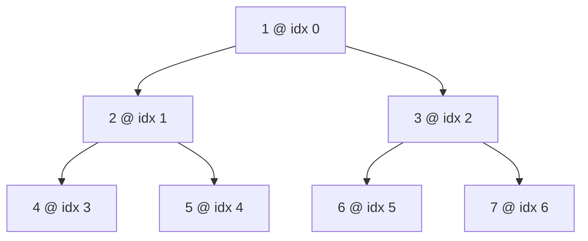

## Why It Exists

A [binary tree](/cortex/data-structures-and-algorithms/trees/binary-tree/introduction-to-binary-trees) feels inherently *pointer-y* — each node holds two child references, nodes scatter across the heap, you traverse by chasing pointers. So it's a genuine surprise the first time you see that **a complete binary tree can live entirely inside a flat array**, with no node objects, no pointers, no per-node allocations. The trick is a single piece of arithmetic.

Number the nodes in **level order** — root is index 0, then its children 1 and 2, then the next level 3, 4, 5, 6 — and a beautiful pattern appears: the children of index `i` are always at `2i+1` (left) and `2i+2` (right), and the parent of `i` is at `(i−1)//2`. Position *is* structure; navigation is `O(1)` arithmetic, not a pointer dereference. You save the two child pointers per node (huge for small payloads), and because the whole tree is one contiguous block, it's [cache-friendly](/cortex/data-structures-and-algorithms/foundations/memory-model-and-cache) in a way pointer-chained nodes never are. There's one catch: the array reserves a slot for *every possible* position down to the tree's depth, so a **complete** tree packs perfectly (no gaps) but a sparse or degenerate one pays an **exponential sentinel tax** in wasted slots ([Trace It](#trace-it)). That's exactly why this representation is the home of [heaps](/cortex/data-structures-and-algorithms/trees/heap/what-is-a-heap) — which are always complete — and rarely used for arbitrary trees.

## See It Work

No `Node` class, no `.left`/`.right` — just an array and three formulas. Here's a complete tree stored flat, navigated by arithmetic. Pick an array and an index, then **Run** it.

```python run
import ast
tree = ast.literal_eval(input())
i = int(input())

def left(i):   return 2 * i + 1
def right(i):  return 2 * i + 2
def parent(i): return (i - 1) // 2

print(f"node at index {i} = {tree[i]}")
print(f"  left  child: index {left(i)} = {tree[left(i)]}")
print(f"  right child: index {right(i)} = {tree[right(i)]}")
print(f"  parent:      index {parent(i)} = {tree[parent(i)]}")
```

```java run
import java.util.*;
public class Main {
    static int left(int i)   { return 2 * i + 1; }
    static int right(int i)  { return 2 * i + 2; }
    static int parent(int i) { return (i - 1) / 2; }
    public static void main(String[] x) {
        Scanner sc = new Scanner(System.in);
        int[] tree = parseIntArray(sc.nextLine());
        int i = Integer.parseInt(sc.nextLine().trim());
        System.out.println("node at index " + i + " = " + tree[i]);
        System.out.println("  left  child: index " + left(i) + " = " + tree[left(i)]);
        System.out.println("  right child: index " + right(i) + " = " + tree[right(i)]);
        System.out.println("  parent:      index " + parent(i) + " = " + tree[parent(i)]);
    }
    static int[] parseIntArray(String line) {
        String inner = line.replaceAll("[\\[\\]\\s]", "");
        if (inner.isEmpty()) return new int[0];
        String[] parts = inner.split(",");
        int[] out = new int[parts.length];
        for (int j = 0; j < parts.length; j++) out[j] = Integer.parseInt(parts[j]);
        return out;
    }
}
```

```testcases
{
  "args": [
    { "id": "tree", "label": "tree (level-order)", "type": "int[]", "placeholder": "[1, 2, 3, 4, 5, 6, 7]" },
    { "id": "i", "label": "index i", "type": "int", "placeholder": "1" }
  ],
  "cases": [
    { "args": { "tree": "[1, 2, 3, 4, 5, 6, 7]", "i": "1" }, "expected": "node at index 1 = 2\n  left  child: index 3 = 4\n  right child: index 4 = 5\n  parent:      index 0 = 1" },
    { "args": { "tree": "[1, 2, 3, 4, 5, 6, 7]", "i": "2" }, "expected": "node at index 2 = 3\n  left  child: index 5 = 6\n  right child: index 6 = 7\n  parent:      index 0 = 1" },
    { "args": { "tree": "[10, 20, 30, 40, 50, 60, 70]", "i": "1" }, "expected": "node at index 1 = 20\n  left  child: index 3 = 40\n  right child: index 4 = 50\n  parent:      index 0 = 10" },
    { "args": { "tree": "[10, 20, 30, 40, 50, 60, 70]", "i": "2" }, "expected": "node at index 2 = 30\n  left  child: index 5 = 60\n  right child: index 6 = 70\n  parent:      index 0 = 10" }
  ]
}
```

Both print that the node at index 1 (value `2`) has its left child at index 3 (`4`), right child at index 4 (`5`), and parent at index 0 (`1`). No traversal, no pointer following — every relationship is one multiply-and-add away. The tree's shape isn't stored anywhere; it's *implied* by each value's position in the array.

## How It Works

Level-order numbering is what makes the arithmetic work:



<p align="center"><strong>Nodes numbered in level order (root 0, then each level left-to-right). For any index <code>i</code>: left child = <code>2i+1</code>, right child = <code>2i+2</code>, parent = <code>(i−1)//2</code>. The array is just <code>[1,2,3,4,5,6,7]</code>.</strong></p>

- **Why the formula holds.** In level order, level `L` holds `2^L` nodes starting at index `2^L − 1`. A node at index `i` and its left child sit one level apart, and the doubling of nodes per level makes the offset work out to exactly `2i+1` (left) and `2i+2` (right); inverting gives parent `= (i−1)//2`. It's `O(1)` navigation with *zero* per-node overhead — no child pointers to store, which for small payloads (ints, chars) can halve or third the memory versus a pointer-linked node.
- **Contiguity is a cache win.** The whole tree is one flat block, so a level-order walk is a linear array scan — the [prefetcher](/cortex/data-structures-and-algorithms/foundations/memory-model-and-cache) streams it, unlike pointer-linked nodes scattered across the heap (one cache miss per node). This is a big reason array-backed [heaps](/cortex/data-structures-and-algorithms/trees/heap/what-is-a-heap) are fast in practice.
- **The sentinel tax: only complete trees are efficient.** The array must reserve a slot for *every position* a node *could* occupy down to the tree's depth, whether or not it's filled. A **complete** tree (every level full except maybe the last, filled left-to-right) has no gaps — `n` nodes, `n` slots. But a sparse or **degenerate** tree leaves most positions empty, and because positions grow as `2^depth`, the waste is **exponential**: a right-leaning chain of `n` nodes needs an array of `2^n − 1` slots ([Trace It](#trace-it)). So the array representation is the right call *only* when the tree is complete or nearly so — heaps, segment trees, tournament brackets — and the pointer representation wins for arbitrary shapes.

> **Key takeaway.** A complete binary tree stores in a **flat array** with no pointers: number nodes in level order and navigate by arithmetic — left `= 2i+1`, right `= 2i+2`, parent `= (i−1)//2` — all `O(1)`. It saves the per-node child pointers and is cache-friendly (one contiguous block). The cost: the array reserves a slot for every possible position to the tree's depth, so a **complete** tree packs perfectly but a degenerate one wastes `2^n` slots — an **exponential sentinel tax**. Use it for complete trees (heaps); use pointers for arbitrary shapes.

## Trace It

The "only complete trees" caveat sounds mild until you compute what an incomplete tree actually costs.

**Predict before you run:** a complete binary tree of `n` nodes needs an array of `n` slots. A *degenerate* tree — `n` nodes in a right-leaning chain — needs how many slots? Linear in `n`, double `n`, or something far worse?

```python run
def complete_slots(n):   return n           # complete tree: exactly n slots, no gaps
def degenerate_slots(n): return 2 ** n - 1  # right-chain: deepest node at index 2^n - 2 -> array size 2^n - 1
for n in [4, 10, 20]:
    print(f"n={n:>2}: complete needs {complete_slots(n):>8} slots | degenerate (right chain) needs {degenerate_slots(n):>10} slots")
```

<details>
<summary><strong>Reveal</strong></summary>

The degenerate chain needs `2^n − 1` slots — **exponential**. At `n = 10` that's already `1023` slots for ten values; at `n = 20`, over a *million* slots for twenty nodes. The reason: in a right-leaning chain, the `k`-th node is the right child of the previous, so its index follows `i → 2i+2`, growing as `0, 2, 6, 14, 30, …` — the deepest node lands at index `2^n − 2`, forcing an array of size `2^n − 1` even though all but `n` slots are empty sentinels. This is the exponential sentinel tax made concrete, and it's the whole reason the array representation is reserved for trees guaranteed to be complete (heaps, segment trees) where the count is exactly `n`. For an arbitrary or skewed tree, the pointer-linked representation uses `O(n)` memory regardless of shape — it only allocates nodes that exist. The choice between array and pointer layouts is really a bet on the tree's shape: complete → array (compact, cache-fast); arbitrary → pointers (shape-proof).

</details>

## Your Turn

The array layout makes one operation almost free that's awkward with pointers: **level-order (breadth-first) traversal**. With pointers it needs a queue; in an array it's already laid out in level order.

**Predict:** for a complete tree stored as the array `[10, 20, 30, 40, 50, 60, 70]`, how do you produce a level-order (BFS) traversal — and how do the levels map to index ranges?

```python run
import ast
tree = ast.literal_eval(input())
# level-order (BFS) of a complete tree stored in an array = just read left-to-right
print("level-order:", list(tree))
# levels fall on index ranges: level L occupies [2^L - 1 .. 2^(L+1) - 2]
levels, L, start = [], 0, 0
while start < len(tree):
    end = min(start + 2 ** L, len(tree))
    levels.append(tree[start:end])
    start, L = end, L + 1
print("by level:", levels)
```

```java run
import java.util.*;
public class Main {
    public static void main(String[] x) {
        Scanner sc = new Scanner(System.in);
        int[] tree = parseIntArray(sc.nextLine());
        System.out.println("level-order: " + Arrays.toString(tree));   // BFS = read left-to-right
        List<List<Integer>> levels = new ArrayList<>();
        int L = 0, start = 0;
        while (start < tree.length) {
            int end = Math.min(start + (1 << L), tree.length);          // level L spans [2^L-1 .. 2^(L+1)-2]
            List<Integer> level = new ArrayList<>();
            for (int k = start; k < end; k++) level.add(tree[k]);
            levels.add(level);
            start = end; L++;
        }
        System.out.println("by level: " + levels);
    }
    static int[] parseIntArray(String line) {
        String inner = line.replaceAll("[\\[\\]\\s]", "");
        if (inner.isEmpty()) return new int[0];
        String[] parts = inner.split(",");
        int[] out = new int[parts.length];
        for (int j = 0; j < parts.length; j++) out[j] = Integer.parseInt(parts[j]);
        return out;
    }
}
```

```testcases
{
  "args": [
    { "id": "tree", "label": "tree (level-order)", "type": "int[]", "placeholder": "[10, 20, 30, 40, 50, 60, 70]" }
  ],
  "cases": [
    { "args": { "tree": "[10, 20, 30, 40, 50, 60, 70]" }, "expected": "level-order: [10, 20, 30, 40, 50, 60, 70]\nby level: [[10], [20, 30], [40, 50, 60, 70]]" },
    { "args": { "tree": "[1, 2, 3]" }, "expected": "level-order: [1, 2, 3]\nby level: [[1], [2, 3]]" },
    { "args": { "tree": "[5]" }, "expected": "level-order: [5]\nby level: [[5]]" },
    { "args": { "tree": "[1, 2, 3, 4, 5, 6, 7, 8, 9, 10, 11, 12, 13, 14, 15]" }, "expected": "level-order: [1, 2, 3, 4, 5, 6, 7, 8, 9, 10, 11, 12, 13, 14, 15]\nby level: [[1], [2, 3], [4, 5, 6, 7], [8, 9, 10, 11, 12, 13, 14, 15]]" }
  ]
}
```

Both print `level-order: [10, 20, 30, 40, 50, 60, 70]` and `by level: [[10], [20, 30], [40, 50, 60, 70]]`. The level-order traversal is *just the array itself* — no queue, no traversal logic, because level-order numbering is exactly the array's index order. And the levels fall on clean index ranges: level `L` occupies indices `2^L − 1` through `2^(L+1) − 2` (so 1, 2, 4, … nodes per level). This is why heap operations like "the root is the min/max" (index 0) and "sift down to a child" (`2i+1`/`2i+2`) are trivial array index math, and why a heap never needs an explicit tree structure at all — the array *is* the tree.

## Reflect & Connect

- **Position encodes structure.** Number nodes in level order and the parent/child links become arithmetic — `2i+1`, `2i+2`, `(i−1)//2` — `O(1)` and pointer-free. The shape lives in the indices, not in stored references.
- **Compact and cache-friendly.** No child pointers (big saving for small payloads) and one contiguous block (the prefetcher streams a level-order walk). Pointer-linked nodes scatter across the heap and miss cache per node.
- **The sentinel tax limits it to complete trees.** The array reserves every position to the tree's depth, so an incomplete tree wastes slots — exponentially for a degenerate chain (`2^n − 1`). Complete → array; arbitrary → pointers.
- **It's the heap's native form.** [Binary heaps](/cortex/data-structures-and-algorithms/trees/heap/what-is-a-heap) are always complete, so they live in an array: root at index 0, sift-down to `2i+1`/`2i+2`, no node objects. Segment trees and tournament brackets use the same trick.
- **The alternative is pointers.** The [linked representation](/cortex/data-structures-and-algorithms/trees/binary-tree/linked-list-implementation-of-binary-trees) (next lesson) stores explicit `Node` objects with `left`/`right` references — `O(n)` memory for *any* shape, at the cost of a pointer dereference per step and worse cache behavior. The two representations are the recurring [array-vs-linked tradeoff](/cortex/data-structures-and-algorithms/foundations/memory-model-and-cache), now for trees.

## Recall

<details>
<summary><strong>Q:</strong> How do you find a node's children and parent in the array representation?</summary>

**A:** With nodes numbered in level order (0-indexed), the node at index `i` has left child at `2i+1`, right child at `2i+2`, and parent at `(i−1)//2`. All `O(1)` arithmetic — no pointers stored.

</details>
<details>
<summary><strong>Q:</strong> What are the advantages of the array representation over pointers?</summary>

**A:** No per-node child pointers (less memory, especially for small payloads), `O(1)` navigation by arithmetic, and one contiguous block that's cache-friendly — a level-order walk is a linear scan the prefetcher streams, versus a cache miss per scattered node with pointers.

</details>
<details>
<summary><strong>Q:</strong> What is the "sentinel tax," and which trees suffer from it?</summary>

**A:** The array must reserve a slot for every position down to the tree's depth, whether filled or not. A complete tree has no gaps (`n` nodes, `n` slots), but a sparse or degenerate tree wastes the empty positions — exponentially: a right-leaning chain of `n` nodes needs `2^n − 1` slots.

</details>
<details>
<summary><strong>Q:</strong> Why is the array representation the natural home for heaps?</summary>

**A:** Heaps are always complete binary trees, so they pack into an array with no wasted slots. Heap operations are then pure index math: the root is index 0, and sift-up/sift-down move via `(i−1)//2` and `2i+1`/`2i+2` — no node objects or pointers needed.

</details>
<details>
<summary><strong>Q:</strong> How do you do a level-order traversal of an array-stored complete tree?</summary>

**A:** Just read the array left-to-right — level-order numbering *is* the array's index order, so no queue is needed. Level `L` occupies indices `2^L − 1` through `2^(L+1) − 2`.

</details>

## Sources & Verify

- **CLRS**, *Introduction to Algorithms*, ch. 6 (Heapsort) — the `PARENT`/`LEFT`/`RIGHT` index arithmetic and the array representation of a binary heap; **Sedgewick & Wayne**, *Algorithms* §2.4 — heap-ordered complete trees in arrays.
- The [memory-model lesson](/cortex/data-structures-and-algorithms/foundations/memory-model-and-cache) for why contiguous arrays beat pointer-chained nodes in cache, and the [heap lesson](/cortex/data-structures-and-algorithms/trees/heap/what-is-a-heap) for this representation in action.
- The index navigation (index 1 → children 3/4, parent 0), the sentinel-tax blowup (complete `n` vs degenerate `2^n − 1`: 4/15, 10/1023, 20/1048575), and the level-order read (`[[10],[20,30],[40,50,60,70]]`) all come from the runnable blocks above (deterministic) — re-run to verify.
