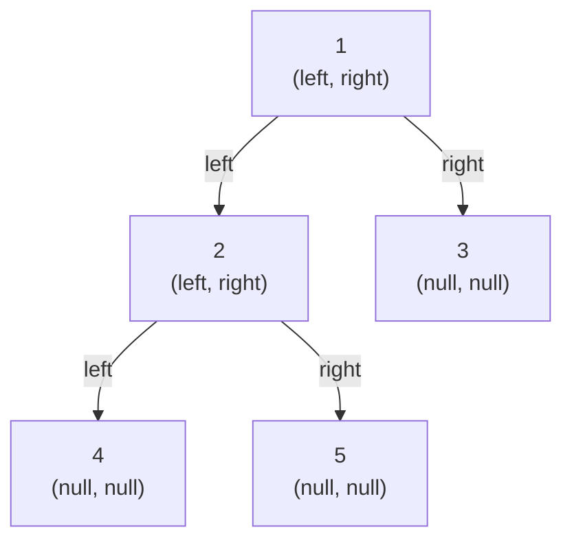

## Why It Exists

Take a [singly linked list](/cortex/data-structures-and-algorithms/linear-structures/singly-linked-list/what-is-a-linked-list): each node holds a value and one `next` pointer, so the data is a one-dimensional chain. Give that node a *second* outgoing pointer — call them `left` and `right` — and following one or the other *branches* the path. Recurse that branching and the flat chain becomes a two-dimensional hierarchy. That single change is the whole idea: **a binary tree is a doubly-branching linked list.**

The [array representation](/cortex/data-structures-and-algorithms/trees/binary-tree/array-implementation-of-binary-trees) from the previous lesson makes the opposite bet — it packs a *complete* tree perfectly but pays an exponential **sentinel tax** on a sparse or degenerate one. The pointer representation flips that: each node gets its own heap allocation carrying `val`, `left`, `right`, and the tree is connected by *assigning* those references. It never reserves a slot for a node that doesn't exist, so a million-node skew costs the same per-node memory as a million-node perfect tree — `O(N)` either way, no waste. The price is paid in [cache locality](/cortex/data-structures-and-algorithms/foundations/memory-model-and-cache) (each node is a separate allocation scattered across RAM, so a parent→child step can't be prefetched) and upward navigation (no `parent` pointer means child→root is `O(height)`). In return you get total shape freedom — insert, remove, and restructure nodes anywhere, with no index arithmetic. That's why this layout, not the array, backs every general-purpose tree whose shape is unknown ahead of time or mutates at runtime: a browser's DOM, a compiler's AST, `std::map`/`TreeMap`, the filesystem directory tree.

## See It Work

A node type with three fields, and a tree built by wiring nodes together. You hold only the `root` — every other node is reachable from it by following references. Pick a tree and **Run** it — `size` and `height` fall straight out of the recursive definition, and reading any node (e.g. `root.left.right.val` for the 5-node tree `[1, 2, 3, 4, 5]`) is just three reference-follows from the root.

```python run viz=binary-tree viz-root=root
import json
from collections import deque

class TreeNode:
    def __init__(self, val=0, left=None, right=None):
        self.val, self.left, self.right = val, left, right

def build_tree(values):              # [1, 2, 3, null, 4] level-order → root
    if not values:
        return None
    root = TreeNode(values[0])
    queue = deque([root])
    i = 1
    while queue and i < len(values):
        node = queue.popleft()
        if i < len(values):
            v = values[i]; i += 1
            if v is not None:
                node.left = TreeNode(v); queue.append(node.left)
        if i < len(values):
            v = values[i]; i += 1
            if v is not None:
                node.right = TreeNode(v); queue.append(node.right)
    return root

def size(n):   return 0 if n is None else 1 + size(n.left) + size(n.right)
def height(n): return -1 if n is None else 1 + max(height(n.left), height(n.right))

root = build_tree(json.loads(input()))
print("size:", size(root))
print("height:", height(root))
```

```java run viz=binary-tree viz-root=root
import java.util.*;

public class Main {
    static class TreeNode {
        int val; TreeNode left, right;
        TreeNode(int val) { this.val = val; }
        TreeNode(int val, TreeNode left, TreeNode right) { this.val = val; this.left = left; this.right = right; }
    }
    static int size(TreeNode n)   { return n == null ? 0 : 1 + size(n.left) + size(n.right); }
    static int height(TreeNode n) { return n == null ? -1 : 1 + Math.max(height(n.left), height(n.right)); }

    public static void main(String[] a) {
        Scanner sc = new Scanner(System.in);
        TreeNode root = buildTree(parseIntegerArray(sc.nextLine()));
        System.out.println("size: " + size(root));
        System.out.println("height: " + height(root));
    }

    static TreeNode buildTree(Integer[] values) {
        if (values.length == 0 || values[0] == null) return null;
        TreeNode root = new TreeNode(values[0]);
        Deque<TreeNode> queue = new ArrayDeque<>();
        queue.add(root);
        int i = 1;
        while (!queue.isEmpty() && i < values.length) {
            TreeNode node = queue.poll();
            if (i < values.length) {
                Integer v = values[i++];
                if (v != null) { node.left = new TreeNode(v); queue.add(node.left); }
            }
            if (i < values.length) {
                Integer v = values[i++];
                if (v != null) { node.right = new TreeNode(v); queue.add(node.right); }
            }
        }
        return root;
    }

    static Integer[] parseIntegerArray(String line) {
        String inner = line.replaceAll("[\\[\\]\\s]", "");
        if (inner.isEmpty()) return new Integer[0];
        String[] parts = inner.split(",");
        Integer[] out = new Integer[parts.length];
        for (int i = 0; i < parts.length; i++)
            out[i] = parts[i].equals("null") ? null : Integer.parseInt(parts[i]);
        return out;
    }
}
```

```testcases
{
  "args": [
    { "id": "root", "label": "root", "type": "tree", "placeholder": "[1, 2, 3, 4, 5]" }
  ],
  "cases": [
    { "args": { "root": "[1, 2, 3, 4, 5]" }, "expected": "size: 5\nheight: 2" },
    { "args": { "root": "[1, 2, 3, 4, 5, 6, 7]" }, "expected": "size: 7\nheight: 2" },
    { "args": { "root": "[1]" }, "expected": "size: 1\nheight: 0" },
    { "args": { "root": "[]" }, "expected": "size: 0\nheight: -1" },
    { "args": { "root": "[1, 2, null, 3]" }, "expected": "size: 3\nheight: 2" }
  ]
}
```

There's no backing array and no index math — just `TreeNode` objects and the `left`/`right` references between them. `size` and `height` recurse *down* from the root, bottoming out on `null`.

## How It Works

A `TreeNode` is three fields — `val`, `left`, `right` — and a tree is what you get when those references point at other nodes:



<p align="center"><strong>Five <code>TreeNode</code> boxes wired by <code>left</code>/<code>right</code> references (contrast the array lesson's single index map). Nodes 3, 4, 5 carry <code>(null, null)</code> — they're leaves. The tree's identity is the linkage, not the values.</strong></p>

- **The shape lives in the references, not the addresses.** In RAM those five nodes sit at unrelated heap addresses; what makes them a *tree* is the disciplined `left`/`right` linkage. Swap two nodes' addresses without touching a reference and the tree is unchanged; change one reference without moving a node and the shape changes. This is exactly why each parent→child step risks a [cache miss](/cortex/data-structures-and-algorithms/foundations/memory-model-and-cache) — the next node could be anywhere, and the prefetcher can't guess.
- **Two `null`s, two meanings.** A `null` *child* means "no child on this side" — the base case that stops recursion at a leaf. A `null` *root* means "no tree at all" — the empty-input boundary every operation must short-circuit (return `0` for a count, `[]` for a traversal, `-1` for a height). Both are `null`; conflating them is the number-one linked-tree bug.
- **Reachability hangs off the root.** Every non-root node is reachable only through some parent's `left`/`right`. The root has no parent, so its reference must be held in a variable — lose it and the whole tree becomes unreachable garbage. That's why every algorithm takes the root and recurses downward.
- **Up is expensive.** A standard node has no `parent` pointer, so walking from a node back to the root is `O(height)`, not `O(1)`. Treating "go up one level" as if it were free is the classic source of accidental-quadratic tree code; add a `parent` field only when an algorithm truly needs it.

> **Key takeaway.** A linked binary tree is a doubly-branching linked list: each node holds `val` + `left` + `right`, the tree hangs off one `root` reference, and `null` marks both an absent child and the empty tree. The topology lives in the pointers, so the layout is **shape-agnostic** — `O(N)` space for any shape, no sentinel tax — but each node is a separate heap allocation, so navigation costs a cache miss per step and child→root is `O(height)` without a parent pointer.

## Trace It

The [array lesson](/cortex/data-structures-and-algorithms/trees/binary-tree/array-implementation-of-binary-trees) showed a degenerate right-chain exploding the array to `2ⁿ − 1` slots. The pointer layout faces the same skew — how much memory does *it* use?

**Predict before you run:** a right-leaning chain of `n` nodes. The array representation needs `2ⁿ − 1` slots. The linked representation needs how many node allocations — `2ⁿ`, `n²`, or `n`?

```python run viz=binary-tree viz-root=root
def linked_nodes(n): return n            # one allocation per REAL node, any shape
def array_slots(n):  return 2 ** n - 1   # array reserves every slot down to depth n
for n in [4, 10, 20]:
    print(f"n={n:>2}: linked uses {linked_nodes(n):>3} nodes | array needs {array_slots(n):>10} slots")
```

<details>
<summary><strong>Reveal</strong></summary>

The linked layout uses exactly `n` allocations — `O(N)`, no matter the shape. At `n = 20` that's 20 nodes versus the array's 1,048,575 slots. This is node 02's bet reversed: the array wins on a *complete* tree (contiguous, cache-friendly, zero per-node pointers) and loses catastrophically on a skew, because it must reserve a slot for every position down to the deepest node even when almost all are empty. The linked layout is shape-agnostic — it pays a flat per-node pointer cost, so a degenerate chain and a perfect tree cost the same *per node*. The rule of thumb: shape known and (near-)complete → array; shape unknown, sparse, or mutated at runtime → pointers. (And `linked_nodes`/`array_slots` print the same `4`/`15`, `10`/`1023`, `20`/`1048575` pairs from the array lesson — re-run both to watch the two layouts diverge.)

</details>

## Your Turn

The single most-used tree primitive is "recurse on `left` and `right`, stop at `null`." Here it is collecting the **leaves** — the nodes whose *both* child slots are `null`.

**Predict:** for the tree `[1, 2, 3, 4, 5]`, which values are leaves, and in what order does a left-before-right recursion emit them?

```python run viz=binary-tree viz-root=root
import json
from collections import deque

class TreeNode:
    def __init__(self, val=0, left=None, right=None):
        self.val, self.left, self.right = val, left, right

def build_tree(values):              # [1, 2, 3, null, 4] level-order → root
    if not values:
        return None
    root = TreeNode(values[0])
    queue = deque([root])
    i = 1
    while queue and i < len(values):
        node = queue.popleft()
        if i < len(values):
            v = values[i]; i += 1
            if v is not None:
                node.left = TreeNode(v); queue.append(node.left)
        if i < len(values):
            v = values[i]; i += 1
            if v is not None:
                node.right = TreeNode(v); queue.append(node.right)
    return root

def leaves(n):
    # Your code goes here — return [] for None; [n.val] if both children are None;
    # else recurse left then right and concatenate.
    pass

root = build_tree(json.loads(input()))
print("leaves:", leaves(root))
```

```java run viz=binary-tree viz-root=root
import java.util.*;

public class Main {
    static class TreeNode {
        int val; TreeNode left, right;
        TreeNode(int val) { this.val = val; }
        TreeNode(int val, TreeNode left, TreeNode right) { this.val = val; this.left = left; this.right = right; }
    }
    static List<Integer> leaves(TreeNode n) {
        // Your code goes here — return empty list for null; singleton [n.val] at a leaf;
        // else recurse left then right, addAll both.
        return new ArrayList<>();
    }
    public static void main(String[] a) {
        Scanner sc = new Scanner(System.in);
        TreeNode root = buildTree(parseIntegerArray(sc.nextLine()));
        System.out.println("leaves: " + leaves(root));
    }

    static TreeNode buildTree(Integer[] values) {
        if (values.length == 0 || values[0] == null) return null;
        TreeNode root = new TreeNode(values[0]);
        Deque<TreeNode> queue = new ArrayDeque<>();
        queue.add(root);
        int i = 1;
        while (!queue.isEmpty() && i < values.length) {
            TreeNode node = queue.poll();
            if (i < values.length) {
                Integer v = values[i++];
                if (v != null) { node.left = new TreeNode(v); queue.add(node.left); }
            }
            if (i < values.length) {
                Integer v = values[i++];
                if (v != null) { node.right = new TreeNode(v); queue.add(node.right); }
            }
        }
        return root;
    }

    static Integer[] parseIntegerArray(String line) {
        String inner = line.replaceAll("[\\[\\]\\s]", "");
        if (inner.isEmpty()) return new Integer[0];
        String[] parts = inner.split(",");
        Integer[] out = new Integer[parts.length];
        for (int i = 0; i < parts.length; i++)
            out[i] = parts[i].equals("null") ? null : Integer.parseInt(parts[i]);
        return out;
    }
}
```

```testcases
{
  "args": [
    { "id": "root", "label": "root", "type": "tree", "placeholder": "[1, 2, 3, 4, 5]" }
  ],
  "cases": [
    { "args": { "root": "[1, 2, 3, 4, 5]" }, "expected": "leaves: [4, 5, 3]" },
    { "args": { "root": "[1, 2, 3, 4, 5, 6, 7]" }, "expected": "leaves: [4, 5, 6, 7]" },
    { "args": { "root": "[1]" }, "expected": "leaves: [1]" },
    { "args": { "root": "[]" }, "expected": "leaves: []" },
    { "args": { "root": "[1, 2, null, 3]" }, "expected": "leaves: [3]" }
  ]
}
```

<details>
<summary>Editorial</summary>

The two `null` checks *are* the algorithm: the first handles a `null` child slot (an absent child), the second is the leaf base case that stops the recursion. Every traversal in the next lessons is this same shape — follow `left`/`right` down from the root, bottom out on `null`.

```python solution time=O(n) space=O(h)
import json
from collections import deque

class TreeNode:
    def __init__(self, val=0, left=None, right=None):
        self.val, self.left, self.right = val, left, right

def build_tree(values):              # [1, 2, 3, null, 4] level-order → root
    if not values:
        return None
    root = TreeNode(values[0])
    queue = deque([root])
    i = 1
    while queue and i < len(values):
        node = queue.popleft()
        if i < len(values):
            v = values[i]; i += 1
            if v is not None:
                node.left = TreeNode(v); queue.append(node.left)
        if i < len(values):
            v = values[i]; i += 1
            if v is not None:
                node.right = TreeNode(v); queue.append(node.right)
    return root

def leaves(n):
    if n is None:                          return []        # null child slot: nothing here
    if n.left is None and n.right is None: return [n.val]   # null on BOTH sides: a leaf
    return leaves(n.left) + leaves(n.right)                 # else recurse, left first

root = build_tree(json.loads(input()))
print("leaves:", leaves(root))
```

```java solution
import java.util.*;

public class Main {
    static class TreeNode {
        int val; TreeNode left, right;
        TreeNode(int val) { this.val = val; }
        TreeNode(int val, TreeNode left, TreeNode right) { this.val = val; this.left = left; this.right = right; }
    }
    static List<Integer> leaves(TreeNode n) {
        List<Integer> out = new ArrayList<>();
        if (n == null) return out;                                  // null child slot: nothing here
        if (n.left == null && n.right == null) { out.add(n.val); return out; }  // a leaf
        out.addAll(leaves(n.left)); out.addAll(leaves(n.right));    // else recurse, left first
        return out;
    }
    public static void main(String[] a) {
        Scanner sc = new Scanner(System.in);
        TreeNode root = buildTree(parseIntegerArray(sc.nextLine()));
        System.out.println("leaves: " + leaves(root));
    }

    static TreeNode buildTree(Integer[] values) {
        if (values.length == 0 || values[0] == null) return null;
        TreeNode root = new TreeNode(values[0]);
        Deque<TreeNode> queue = new ArrayDeque<>();
        queue.add(root);
        int i = 1;
        while (!queue.isEmpty() && i < values.length) {
            TreeNode node = queue.poll();
            if (i < values.length) {
                Integer v = values[i++];
                if (v != null) { node.left = new TreeNode(v); queue.add(node.left); }
            }
            if (i < values.length) {
                Integer v = values[i++];
                if (v != null) { node.right = new TreeNode(v); queue.add(node.right); }
            }
        }
        return root;
    }

    static Integer[] parseIntegerArray(String line) {
        String inner = line.replaceAll("[\\[\\]\\s]", "");
        if (inner.isEmpty()) return new Integer[0];
        String[] parts = inner.split(",");
        Integer[] out = new Integer[parts.length];
        for (int i = 0; i < parts.length; i++)
            out[i] = parts[i].equals("null") ? null : Integer.parseInt(parts[i]);
        return out;
    }
}
```

</details>

## Reflect & Connect

- **A binary tree is a linked list with two `next` pointers.** One outgoing reference makes a chain; a `left` and a `right` make a branching hierarchy. Everything else — traversal, search, balancing — is built on this three-field node.
- **Shape-agnostic by design.** One allocation per real node and nothing for absent children means `O(N)` space for *any* shape — a skew and a perfect tree cost the same per node. No sentinel tax.
- **The opposite bet from the array layout.** [Node 02](/cortex/data-structures-and-algorithms/trees/binary-tree/array-implementation-of-binary-trees) is contiguous, cache-friendly, and pointer-free via index math — but exponential on a skew. Pointers are scattered with a dereference per step — but flat `O(N)` on any shape. The right choice is a bet on the tree's shape.
- **The default for runtime-shaped trees.** The DOM, a compiler's AST, ordered maps (`std::map`/`TreeMap`, usually *with* a `parent` pointer so insert/delete rewire in `O(log N)`), filesystem directories, and ML/networking decision trees all use linked nodes — because their depth and branching are data-dependent and edited live.
- **Next: doing things to trees.** With a node type defined, the coming lessons turn it into the three [recursive traversals](/cortex/data-structures-and-algorithms/trees/binary-tree/recursive-traversals-in-binary-trees), then iterative traversals, construction, and insertion — each a choreography of the `O(1)` reference-follows you just used.

## Recall

<details>
<summary><strong>Q:</strong> What three fields make up a <code>TreeNode</code>, and what does each hold?</summary>

**A:** `val` holds the node's data; `left` holds a reference to the left child (or `null`); `right` holds a reference to the right child (or `null`). The unused child slot is `null` rather than omitted, so its *position* records which side an existing child is on.

</details>
<details>
<summary><strong>Q:</strong> A <code>null</code> child and a <code>null</code> root are both <code>null</code> — how do they differ?</summary>

**A:** A `null` *child* means "no child on this side" and stops recursion at a leaf — a normal interior signal. A `null` *root* means "no tree at all" and must short-circuit the whole operation — the empty-input boundary. Code that handles only one crashes on the other.

</details>
<details>
<summary><strong>Q:</strong> Why does the linked layout use the same <code>O(N)</code> space for a balanced tree and a one-sided skew of the same node count?</summary>

**A:** It allocates one node per existing node and nothing for absent children, so only the node count matters — `N` nodes cost `O(N)` regardless of shape. The array layout, by contrast, reserves slots for the gaps a skew creates, blowing up to `2ⁿ − 1`.

</details>
<details>
<summary><strong>Q:</strong> Why is walking from a node back to the root <code>O(height)</code> on a standard <code>TreeNode</code>?</summary>

**A:** A standard node stores only `left` and `right`, never a `parent`, so reaching an ancestor means re-traversing from the root down — `O(height)` work. Adding a `parent` pointer makes the upward step `O(1)`, at the cost of an extra field to keep consistent.

</details>
<details>
<summary><strong>Q:</strong> When would you choose the linked representation over the array representation?</summary>

**A:** When the tree's shape is unknown, sparse, or mutated at runtime — accept worse cache locality and per-node pointer overhead in exchange for `O(N)` space on any shape. Choose the array layout when the tree stays near-complete and you want contiguous, cache-friendly storage (heaps).

</details>

## Sources & Verify

- **CLRS**, *Introduction to Algorithms*, §10.4 (Representing Rooted Trees) — the canonical treatment of pointer-based tree representations (including the left-child/right-sibling encoding for unbounded children); **Sedgewick & Wayne**, *Algorithms* §3.2 — linked BST nodes.
- The [array implementation](/cortex/data-structures-and-algorithms/trees/binary-tree/array-implementation-of-binary-trees) for the other side of the bet, and the [memory-model lesson](/cortex/data-structures-and-algorithms/foundations/memory-model-and-cache) for why scattered allocations miss cache where a contiguous array streams.
- `size: 5`, `height: 2`, `leaves: [4, 5, 3]`, and the linked-vs-array slot counts (`4`/`15`, `10`/`1023`, `20`/`1048575`) all come from the runnable blocks above (deterministic) — re-run to verify.
