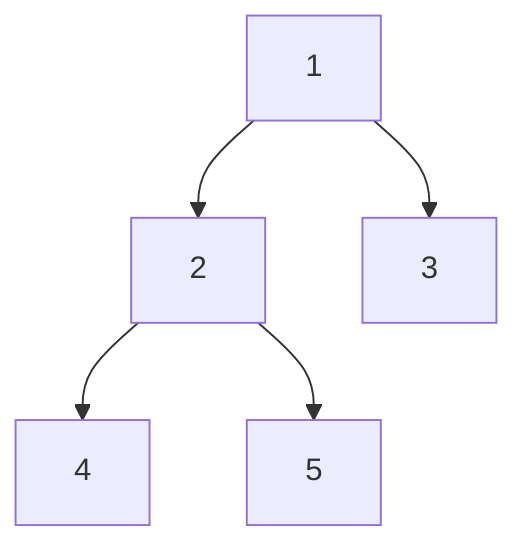

## Why It Exists

A list has an obvious order — front to back. A [binary tree](/cortex/data-structures-and-algorithms/trees/binary-tree/linked-list-implementation-of-binary-trees) has none: from a node you can go *left* or *right*, and there's no single "next." A **traversal** is the rule that imposes a linear order on the tree — the recipe for visiting every node exactly once. The surprise is how little code it takes, and how much the *order of three lines* changes the result.

Every recursive traversal does the same three things at each node: **visit** this node, recurse **left**, recurse **right**. The only choice is *when* you visit relative to the two recursive calls — and that single choice gives three classical orders. Visit first → **preorder**. Visit between → **inorder**. Visit last → **postorder**. Each is `O(N)` time (every node touched once) and `O(h)` space (the recursion stack goes as deep as the tree's height). And each one is the natural tool for a different job: preorder hands you the root before its subtrees, which is how you *copy or serialize* a tree; inorder, run over a [binary search tree](/cortex/data-structures-and-algorithms/trees/binary-search-tree/introduction-to-binary-search-trees), emits the values in *sorted* order; postorder visits both children before their parent, which is how you *free* a tree or *evaluate an expression tree*. One function, one moved line, three superpowers.

## See It Work

Three traversals over the same tree. Watch how only the placement of `[n.val]` differs between the three functions:

```python run viz=binary-tree viz-root=root
import json
from collections import deque

class TreeNode:
    def __init__(self, val=0, left=None, right=None):
        self.val, self.left, self.right = val, left, right

def preorder(n):  return [] if n is None else [n.val] + preorder(n.left) + preorder(n.right)  # visit, L, R
def inorder(n):   return [] if n is None else inorder(n.left) + [n.val] + inorder(n.right)     # L, visit, R
def postorder(n): return [] if n is None else postorder(n.left) + postorder(n.right) + [n.val] # L, R, visit

def build_tree(values):              # [1, 2, 3, null, 4] level-order → root
    if not values:
        return None
    root = TreeNode(values[0])
    queue = deque([root])
    i = 1
    while queue and i < len(values):
        node = queue.popleft()
        if i < len(values):
            v = values[i]; i += 1
            if v is not None:
                node.left = TreeNode(v); queue.append(node.left)
        if i < len(values):
            v = values[i]; i += 1
            if v is not None:
                node.right = TreeNode(v); queue.append(node.right)
    return root

root = build_tree(json.loads(input()))

print("preorder :", preorder(root))
print("inorder  :", inorder(root))
print("postorder:", postorder(root))
```

```java run viz=binary-tree viz-root=root
import java.util.*;
public class Main {
    static class TreeNode {
        int val; TreeNode left, right;
        TreeNode(int val) { this.val = val; }
        TreeNode(int val, TreeNode left, TreeNode right) { this.val = val; this.left = left; this.right = right; }
    }
    static List<Integer> preorder(TreeNode n)  { List<Integer> o=new ArrayList<>(); if(n==null) return o; o.add(n.val); o.addAll(preorder(n.left)); o.addAll(preorder(n.right)); return o; }
    static List<Integer> inorder(TreeNode n)   { List<Integer> o=new ArrayList<>(); if(n==null) return o; o.addAll(inorder(n.left)); o.add(n.val); o.addAll(inorder(n.right)); return o; }
    static List<Integer> postorder(TreeNode n) { List<Integer> o=new ArrayList<>(); if(n==null) return o; o.addAll(postorder(n.left)); o.addAll(postorder(n.right)); o.add(n.val); return o; }

    static TreeNode buildTree(Integer[] values) {
        if (values.length == 0 || values[0] == null) return null;
        TreeNode root = new TreeNode(values[0]);
        Deque<TreeNode> queue = new ArrayDeque<>();
        queue.add(root);
        int i = 1;
        while (!queue.isEmpty() && i < values.length) {
            TreeNode node = queue.poll();
            if (i < values.length) { Integer v = values[i++]; if (v != null) { node.left = new TreeNode(v); queue.add(node.left); } }
            if (i < values.length) { Integer v = values[i++]; if (v != null) { node.right = new TreeNode(v); queue.add(node.right); } }
        }
        return root;
    }

    static Integer[] parseIntegerArray(String line) {
        String inner = line.replaceAll("[\\[\\]\\s]", "");
        if (inner.isEmpty()) return new Integer[0];
        String[] parts = inner.split(",");
        Integer[] out = new Integer[parts.length];
        for (int i = 0; i < parts.length; i++)
            out[i] = parts[i].equals("null") ? null : Integer.parseInt(parts[i]);
        return out;
    }

    public static void main(String[] a) {
        Scanner sc = new Scanner(System.in);
        TreeNode root = buildTree(parseIntegerArray(sc.nextLine()));
        System.out.println("preorder : " + preorder(root));
        System.out.println("inorder  : " + inorder(root));
        System.out.println("postorder: " + postorder(root));
    }
}
```

```testcases
{
  "args": [
    { "id": "root", "label": "root", "type": "tree", "placeholder": "[1, 2, 3, 4, 5]" }
  ],
  "cases": [
    { "args": { "root": "[1, 2, 3, 4, 5]" }, "expected": "preorder : [1, 2, 4, 5, 3]\ninorder  : [4, 2, 5, 1, 3]\npostorder: [4, 5, 2, 3, 1]" },
    { "args": { "root": "[1, 2, 3]" }, "expected": "preorder : [1, 2, 3]\ninorder  : [2, 1, 3]\npostorder: [2, 3, 1]" },
    { "args": { "root": "[1]" }, "expected": "preorder : [1]\ninorder  : [1]\npostorder: [1]" },
    { "args": { "root": "[1, null, 2, null, 3]" }, "expected": "preorder : [1, 2, 3]\ninorder  : [1, 2, 3]\npostorder: [3, 2, 1]" }
  ]
}
```

Both print `preorder : [1, 2, 4, 5, 3]`, `inorder : [4, 2, 5, 1, 3]`, `postorder: [4, 5, 2, 3, 1]`. Three different orderings of the same five nodes — and the *only* difference between the three functions is whether `[n.val]` sits before, between, or after the two recursive calls.

## How It Works

Trace the three orders against the tree and the pattern is visible: the node `1` comes *first* in preorder, *last* in postorder, and *in the middle* in inorder — exactly tracking where its visit line sits.



<p align="center"><strong>The tree from See It. preorder <code>[1,2,4,5,3]</code> (root before subtrees) · inorder <code>[4,2,5,1,3]</code> (left subtree, root, right subtree) · postorder <code>[4,5,2,3,1]</code> (subtrees before root). Same five nodes, three orders, one moved line.</strong></p>

| Order | Recursion shape | The root is… | The job it's built for |
|---|---|---|---|
| **Preorder** | `visit, L, R` | **first** | Copy / serialize a tree — you need the root before you can attach its rebuilt subtrees. (= **prefix** notation.) |
| **Inorder** | `L, visit, R` | in the middle | A **BST** emits values in **sorted** order. (= **infix** notation.) |
| **Postorder** | `L, R, visit` | **last** | Free/delete a tree, or **evaluate an expression tree** — you must finish both children before the parent. (= **postfix** notation.) |

- **Cost is the same for all three.** Each visits every node exactly once → `O(N)` time. The only memory is the recursion stack, which is as deep as the tree is tall → `O(h)` space: `O(log N)` for a balanced tree, `O(N)` for a degenerate skew.
- **The base case is the `null` child.** All three functions return the empty list for `None` — the same null-child boundary the [linked representation](/cortex/data-structures-and-algorithms/trees/binary-tree/linked-list-implementation-of-binary-trees) is built on. No `null` check, and the first leaf's child dereference crashes.
- **All three are depth-first.** They dive to a leaf before backtracking. The breadth-first cousin — level-order — needs a queue instead of the call stack, and gets its own lesson.

> **Key takeaway.** A recursive traversal visits every node once via `visit` + recurse-`left` + recurse-`right`; *where* the `visit` sits among the two recursive calls picks the order. Visit-first = **preorder** (root first → serialize). Visit-between = **inorder** (sorted, on a BST). Visit-last = **postorder** (children before parent → free/evaluate). All three are `O(N)` time and `O(h)` space, bottoming out on the `null` child.

## Trace It

Here's where the three orders stop being abstract. Take the **expression tree** for `(2 + 3) * 4` — operators at internal nodes, operands at leaves:

```
       *
      / \
     +   4
    / \
   2   3
```

**Predict before you run:** what do preorder, inorder, and postorder produce on this tree — and have you seen those three strings before?

```python run viz=binary-tree viz-root=root
class N:
    def __init__(self, v, l=None, r=None):
        self.v, self.l, self.r = v, l, r
expr = N('*', N('+', N('2'), N('3')), N('4'))   # (2 + 3) * 4

def walk(n, order):
    if n is None: return []
    if order == 'pre': return [n.v] + walk(n.l, order) + walk(n.r, order)   # visit, L, R
    if order == 'in':  return walk(n.l, order) + [n.v] + walk(n.r, order)   # L, visit, R
    return walk(n.l, order) + walk(n.r, order) + [n.v]                      # L, R, visit (post)

print("preorder  ->", ' '.join(walk(expr, 'pre')))   # prefix
print("inorder   ->", ' '.join(walk(expr, 'in')))    # infix
print("postorder ->", ' '.join(walk(expr, 'post')))  # postfix
```

<details>
<summary><strong>Reveal</strong></summary>

```
preorder  -> * + 2 3 4
inorder   -> 2 + 3 * 4
postorder -> 2 3 + 4 *
```

These are exactly the three notations from the [stack expression lessons](/cortex/data-structures-and-algorithms/linear-structures/stack/infix-postfix-and-prefix-notations): **preorder is prefix**, **inorder is infix**, **postorder is postfix**. A traversal order *is* a notation — that's not a coincidence, it's the same structure read two ways. Notice the catch: the inorder string `2 + 3 * 4` has lost the parentheses, so read with normal precedence it means `2 + (3 * 4)`, not `(2 + 3) * 4`. That's *why* infix needs parentheses and precedence rules while prefix and postfix don't — the tree shape carries the grouping, and only inorder throws it away. Postorder (`2 3 + 4 *`) is exactly what a stack evaluator consumes left-to-right, which is why postorder is the traversal that *evaluates* an expression tree.

</details>

## Your Turn

The one order with a near-magical property is **inorder on a binary search tree** — a tree where every node's left subtree holds smaller values and its right subtree larger. Inorder reads them out *sorted*, for free.

**Predict:** for a BST, what does inorder (`left, visit, right`) print?

```python run viz=binary-tree viz-root=root
import json
from collections import deque

class TreeNode:
    def __init__(self, val=0, left=None, right=None):
        self.val, self.left, self.right = val, left, right

def inorder(n):
    if n is None: return []
    return inorder(n.left) + [n.val] + inorder(n.right)   # left, visit, right

def build_tree(values):              # [1, 2, 3, null, 4] level-order → root
    if not values:
        return None
    root = TreeNode(values[0])
    queue = deque([root])
    i = 1
    while queue and i < len(values):
        node = queue.popleft()
        if i < len(values):
            v = values[i]; i += 1
            if v is not None:
                node.left = TreeNode(v); queue.append(node.left)
        if i < len(values):
            v = values[i]; i += 1
            if v is not None:
                node.right = TreeNode(v); queue.append(node.right)
    return root

root = build_tree(json.loads(input()))
print("inorder:", inorder(root))
```

```java run viz=binary-tree viz-root=root
import java.util.*;
public class Main {
    static class TreeNode {
        int val; TreeNode left, right;
        TreeNode(int val) { this.val = val; }
        TreeNode(int val, TreeNode left, TreeNode right) { this.val = val; this.left = left; this.right = right; }
    }
    static List<Integer> inorder(TreeNode n) {
        List<Integer> out = new ArrayList<>();
        if (n == null) return out;
        out.addAll(inorder(n.left)); out.add(n.val); out.addAll(inorder(n.right));   // left, visit, right
        return out;
    }

    static TreeNode buildTree(Integer[] values) {
        if (values.length == 0 || values[0] == null) return null;
        TreeNode root = new TreeNode(values[0]);
        Deque<TreeNode> queue = new ArrayDeque<>();
        queue.add(root);
        int i = 1;
        while (!queue.isEmpty() && i < values.length) {
            TreeNode node = queue.poll();
            if (i < values.length) { Integer v = values[i++]; if (v != null) { node.left = new TreeNode(v); queue.add(node.left); } }
            if (i < values.length) { Integer v = values[i++]; if (v != null) { node.right = new TreeNode(v); queue.add(node.right); } }
        }
        return root;
    }

    static Integer[] parseIntegerArray(String line) {
        String inner = line.replaceAll("[\\[\\]\\s]", "");
        if (inner.isEmpty()) return new Integer[0];
        String[] parts = inner.split(",");
        Integer[] out = new Integer[parts.length];
        for (int i = 0; i < parts.length; i++)
            out[i] = parts[i].equals("null") ? null : Integer.parseInt(parts[i]);
        return out;
    }

    public static void main(String[] a) {
        Scanner sc = new Scanner(System.in);
        TreeNode root = buildTree(parseIntegerArray(sc.nextLine()));
        System.out.println("inorder: " + inorder(root));
    }
}
```

```testcases
{
  "args": [
    { "id": "root", "label": "root (BST)", "type": "tree", "placeholder": "[5, 3, 8, 1, 4, null, 9]" }
  ],
  "cases": [
    { "args": { "root": "[5, 3, 8, 1, 4, null, 9]" }, "expected": "inorder: [1, 3, 4, 5, 8, 9]" },
    { "args": { "root": "[3, 1, 5]" }, "expected": "inorder: [1, 3, 5]" },
    { "args": { "root": "[1]" }, "expected": "inorder: [1]" },
    { "args": { "root": "[4, 2, 6, 1, 3, 5, 7]" }, "expected": "inorder: [1, 2, 3, 4, 5, 6, 7]" }
  ]
}
```

Both print `inorder: [1, 3, 4, 5, 8, 9]` — perfectly sorted. The BST's ordering invariant (left < node < right) plus inorder's `left, visit, right` shape means every node is emitted *after* everything smaller and *before* everything larger. This is the single most-used fact about BSTs, and it falls straight out of the traversal you just wrote.

## Reflect & Connect

- **One function, three orders.** `visit` + recurse-`left` + recurse-`right`; move the `visit` line and you move between preorder, inorder, and postorder. Nothing else changes.
- **Order follows the job.** Root-first preorder serializes; sorted inorder reads a BST; children-first postorder frees a tree and evaluates an expression tree. Pick the order by what has to happen first.
- **A traversal order is a notation.** Preorder/inorder/postorder of an [expression tree](/cortex/data-structures-and-algorithms/linear-structures/stack/infix-postfix-and-prefix-notations) are prefix/infix/postfix — and only infix needs parentheses, because inorder is the one that drops the tree's grouping.
- **Cost is structural.** `O(N)` time always; `O(h)` space because the recursion stack tracks the current root-to-node path — the same `O(h)` that becomes `O(N)` on a skew and `O(log N)` when balanced.
- **Next: making the stack explicit.** The recursion *is* a stack. The [iterative traversals](/cortex/data-structures-and-algorithms/trees/binary-tree/iterative-traversals-in-binary-trees) lesson replaces the call stack with an explicit one — same orders, no recursion — which is how you traverse a tree too deep to recurse safely.

## Recall

<details>
<summary><strong>Q:</strong> What is the only difference between the preorder, inorder, and postorder functions?</summary>

**A:** Where the "visit this node" step sits relative to the two recursive calls: before both (preorder, `visit-L-R`), between them (inorder, `L-visit-R`), or after both (postorder, `L-R-visit`). The recursion is otherwise identical.

</details>
<details>
<summary><strong>Q:</strong> What are the time and space costs of a recursive traversal, and why?</summary>

**A:** `O(N)` time — every node is visited exactly once. `O(h)` space — the only memory is the recursion stack, whose depth equals the tree's height `h` (`O(log N)` balanced, `O(N)` for a degenerate skew).

</details>
<details>
<summary><strong>Q:</strong> Which traversal reads a binary search tree in sorted order, and why?</summary>

**A:** Inorder (`left, visit, right`). A BST keeps smaller values left and larger right, so visiting the left subtree, then the node, then the right subtree emits every value after everything smaller and before everything larger — i.e. ascending.

</details>
<details>
<summary><strong>Q:</strong> Why is postorder the right traversal to free a tree or evaluate an expression tree?</summary>

**A:** Postorder visits both children before their parent. You must free a node's children before the node itself (or you'd lose the pointers to them), and you must evaluate both operand subtrees before applying the operator at the parent.

</details>
<details>
<summary><strong>Q:</strong> How do the three traversal orders relate to prefix, infix, and postfix notation?</summary>

**A:** On an expression tree they're identical: preorder = prefix, inorder = infix, postorder = postfix. Infix (inorder) is the only one needing parentheses, because it drops the grouping the tree shape encodes.

</details>

## Sources & Verify

- **CLRS**, *Introduction to Algorithms*, §12.1 (Binary search trees — inorder tree walk) — the `O(N)` inorder traversal and the sorted-order property; **Sedgewick & Wayne**, *Algorithms* §3.2 — pre/in/post order on linked tree nodes.
- The [stack expression-notation lessons](/cortex/data-structures-and-algorithms/linear-structures/stack/infix-postfix-and-prefix-notations) for prefix/infix/postfix, and the [iterative-traversals lesson](/cortex/data-structures-and-algorithms/trees/binary-tree/iterative-traversals-in-binary-trees) for the same three orders without recursion.
- `preorder [1,2,4,5,3]`, `inorder [4,2,5,1,3]`, `postorder [4,5,2,3,1]`; the expression-tree `* + 2 3 4` / `2 + 3 * 4` / `2 3 + 4 *`; and the sorted BST inorder `[1,3,4,5,8,9]` all come from the runnable blocks above (deterministic) — re-run to verify.
